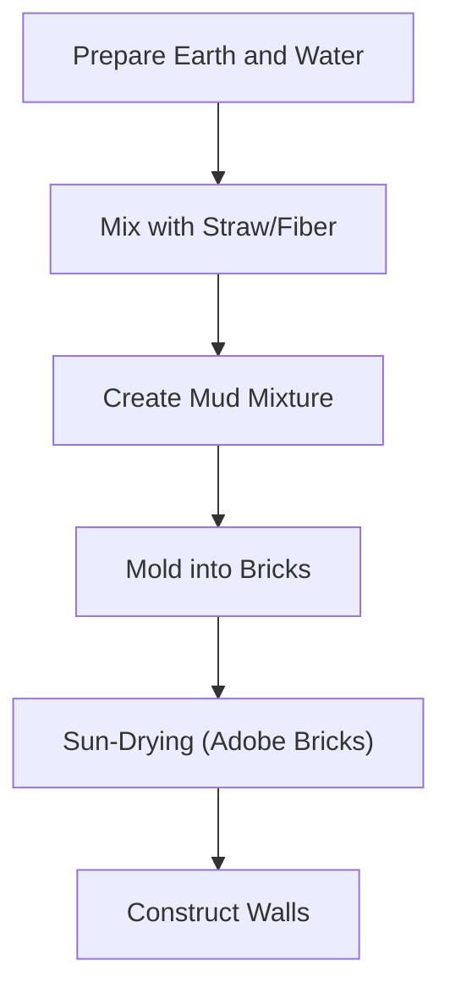

## What is Adobe Architecture?

At its core, Adobe architecture is the practice of building structures using sun-dried mud bricks. The process involves mixing earth with water and organic fibers like straw, placing the mixture into molds, and allowing it to dry under the sun. It is crucial to note that these bricks are not fired in a kiln. If adobe bricks were fired, the clay particles would vitrify, causing the material to lose its ability to "breathe." This would destroy the natural humidity-regulating and thermal properties of the earth, while also making the bricks brittle and prone to cracking under structural stress or seismic activity.

This method is an ancient, sustainable practice that allows structures to exist in harmony with their environment, eventually returning to the earth from which they came.

## The Unique Appeal and Modern Evolution of Adobe ✨

Adobe architecture is not merely a collection of mud; it is a sophisticated system of environmental engineering.

### 1. Thermal Mass and Heat Regulation 🌬️🔥

One of the primary advantages of adobe is its exceptional thermal mass. The thick earthen walls absorb the sun's heat slowly during the day. At night, they release this stored heat into the interior. The reason this heat does not simply dissipate outward is due to the high density and low thermal conductivity of the thick walls. The wall acts as a thermal battery; because of the wall's thickness, the heat remains trapped within the material, slowly migrating toward the interior as the outside temperature drops, rather than escaping into the external environment.

### 2. Traditional vs. Modern Adobe Construction 🏗️

Traditional adobe construction relied solely on earth, water, and straw, often built directly on the ground without formal foundations. In contrast, modern adobe architecture incorporates structural engineering to meet contemporary safety standards. For instance, a recent construction project in New Mexico utilized traditional adobe bricks but integrated a reinforced concrete foundation and internal steel rebar to ensure seismic resilience. Furthermore, modern builders often incorporate high-performance insulation layers within the wall assembly and apply breathable, weather-resistant sealants to the exterior, significantly increasing the lifespan and durability of the structure while maintaining the traditional aesthetic.

### 3. Natural Beauty and Sustainability 🌱

Adobe architecture is characterized by its soft, rounded corners, organic textures, and warm, earthy tones. Because it relies on locally sourced materials, it minimizes the energy required for transportation and manufacturing, significantly reducing the project's carbon footprint. This focus on local resources and natural forms makes it a highly sustainable choice in modern green building.

## Conclusion 😊

Adobe architecture is a testament to human ingenuity, blending ancient wisdom with modern necessity. It is not a static relic of the past but a living tradition that continues to evolve through the integration of modern technology. The next time you encounter an adobe structure, take a moment to appreciate the texture of the walls and consider how this ancient building method is being adapted to create comfortable, sustainable, and beautiful spaces for the future.
