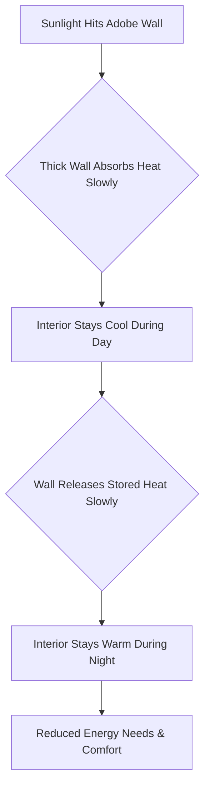

---
Hey folks! Guess what? I recently took a fantastic trip out to New Mexico, and let me tell you, it was absolutely stunning. The landscapes, the sky, the food… amazing! But something else really caught my eye and got me thinking. Everywhere I went, people were talking about "Adobe" – and no, I'm not talking about the software company that makes Photoshop! 😉

It turns out, Adobe is a super cool, ancient architectural style that's deeply woven into the fabric of the American Southwest. I heard so much about it that I just had to dig in and learn more. And now, I'm ready to spill the beans (or should I say, *mud*?) on what makes this building style so special. So, grab a coffee, and let's chat about Adobe!

## What in the World is Adobe Architecture?

At its heart, **Adobe architecture** is all about getting back to basics. Imagine building a house using the very earth beneath your feet. That's essentially what Adobe is! It's a traditional building method where the main material is **sun-dried mud bricks**, often mixed with straw for extra strength. Think of it like making a giant, super sturdy sandcastle, but with mud that gets baked rock-hard by the sun.

> "Adobe architecture is a beautiful testament to building in harmony with nature, using the earth itself as the primary material."

This isn't some high-tech, fancy construction. It's a method that's been perfected over thousands of years, emphasizing sustainability and a deep connection to the natural environment. It's about using what's available locally and creating structures that are not only durable but also incredibly comfortable to live in. 🎯

## Why is It So Clever? The Magic of Mud Walls

You might be thinking, "Mud bricks? Won't they just melt in the rain?" Good question! But Adobe homes are surprisingly robust and incredibly smart in how they work. Here are a few reasons why this ancient technique is still so relevant today:

### Nature's Air Conditioner (and Heater!)

This is where Adobe really shines, especially in places with hot days and cool nights like New Mexico. Those thick, earthy walls act like a giant, natural battery for temperature regulation.

*   **During the day:** The sun beats down, but the thick Adobe walls absorb that heat *very slowly*. This means the inside of the house stays wonderfully cool and comfortable, even when it's scorching outside. It's like having a giant, slow-acting thermos for your home!
*   **During the night:** As the outside temperature drops, those same thick walls slowly start to release the heat they've stored up during the day. This keeps the interior warm and cozy, reducing the need for heating.

This phenomenon is called **thermal mass**, and it's brilliant for reducing energy consumption for heating and cooling. Less energy means less impact on the planet, which is a big win in my book! 💡

Here’s a simple way to visualize how those thick walls work their magic:

### A Beauty That Blends In

Take a look at an Adobe house, and you'll immediately notice its unique charm. They often feature soft, rounded corners and a warm, earthy color palette that comes directly from the soil itself. This natural aesthetic helps them blend seamlessly into the surrounding landscape, almost as if they grew right out of the ground.

There's a natural, organic feel to them – no sharp, jarring angles. It’s like a comfortable, worn-in sweater that just feels right. This focus on natural forms and textures creates a peaceful, inviting atmosphere that many modern buildings just can't replicate.

### Built from the Land (Literally!)

One of the most sustainable aspects of Adobe architecture is its reliance on **local materials**. We're talking about dirt, water, and straw – things you can often find right on site or very nearby! This dramatically reduces the energy needed for transportation and manufacturing, which is a huge environmental benefit.

Think about it like cooking: instead of importing exotic ingredients from far away, you're using fresh produce from your own garden. It's efficient, it's resourceful, and it minimizes waste. 🔧 This makes Adobe a truly circular and eco-friendly building method.

## Where Can You See It, and Why Does It Matter Now?

You'll find Adobe architecture most prominently in the **American Southwest** (think New Mexico, Arizona, parts of California) and throughout **Mexico**. These regions have the perfect climate for drying those mud bricks and a rich cultural history that has embraced this building style for centuries. Places like Santa Fe are famous for their beautiful, historic Adobe buildings.

Today, with growing concerns about climate change and the need for more sustainable living, Adobe architecture is experiencing a fascinating resurgence. Architects and builders are looking back at these traditional methods and finding ways to integrate them into modern designs. They're exploring how the incredible insulation properties and natural aesthetics of Adobe can create comfortable, energy-efficient homes that are gentle on the planet.

It's a wonderful example of how ancient wisdom can provide elegant solutions to contemporary challenges.

## Wrapping It Up

So, the next time you hear "Adobe," I hope you'll think beyond the software and picture those beautiful, sun-baked mud homes nestled in the stunning landscapes of New Mexico. It's more than just a building style; it's a philosophy of living in harmony with our environment, proving that sometimes, the simplest solutions are the most profound.

It was truly inspiring to see how these homes stand as a testament to human ingenuity and our ability to build beautifully and sustainably with what nature provides. Who knew mud could be so magnificent?

***