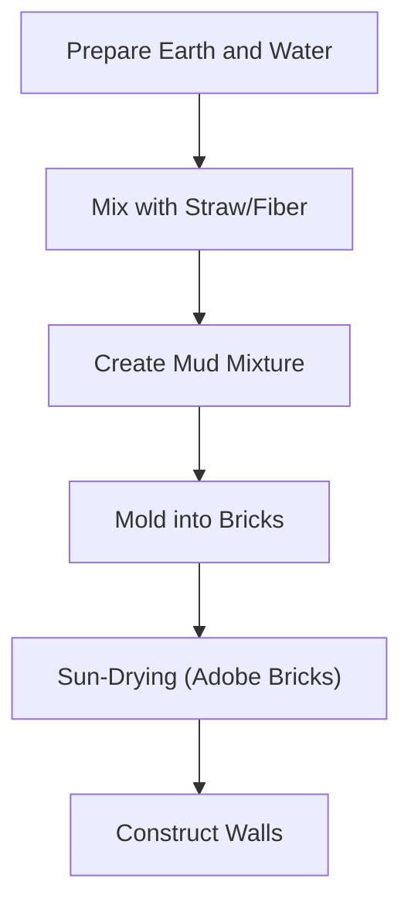

## What is Adobe Architecture?

At its core, Adobe architecture is the practice of building structures using sun-dried mud bricks. The process involves mixing earth with water and organic fibers like straw, placing the mixture into molds, and allowing it to dry under the sun. It is crucial to note that these bricks are not fired in a kiln. If adobe bricks were fired, the clay particles would vitrify, causing the material to lose its ability to "breathe." This would destroy the natural humidity-regulating and thermal properties of the earth, while also making the bricks brittle and prone to cracking under structural stress or seismic activity.

While Korean traditional earth houses (Hwangto-jip) often utilize a timber frame with mud infill, Adobe architecture relies on the bricks themselves as the primary structural load-bearing element. This distinction highlights different regional approaches to using earth as a building material.

## The Unique Appeal and Modern Evolution of Adobe ✨

Adobe architecture is not merely a collection of mud; it is a sophisticated system of environmental engineering.

### 1. Thermal Mass and Heat Regulation 🌬️🔥

One of the primary advantages of adobe is its exceptional 'thermal mass.' Think of thermal mass as a battery for heat. Because adobe walls are very thick and dense, they act like a sponge for energy. During the day, the walls slowly absorb the sun's heat, preventing it from entering the interior. At night, when the temperature drops, the walls release that stored heat back into the living space.

Why doesn't the heat escape outward? Earth is a material with low thermal conductivity, meaning it moves heat very slowly. Because the walls are so thick, the heat absorbed during the day takes a long time to travel through the material. By the time the heat reaches the inner surface of the wall, the outside temperature has dropped, and the wall begins to release that warmth inward. It is a natural, scientific process of time-delayed insulation that keeps the interior comfortable without mechanical heating or cooling.

### 2. Why Adobe Walls Look Seamless 🏗️

If you have traveled through New Mexico, you may have noticed that the individual bricks are often invisible. This is because builders apply a layer of 'adobe plaster'—a mixture of the same earth and fibers—over the entire wall surface. This finishing layer creates a monolithic, seamless appearance that protects the bricks from erosion while providing the smooth, organic aesthetic characteristic of the region. 

While traditional adobe construction relied solely on earth, water, and straw, modern adobe architecture incorporates structural engineering to meet contemporary safety standards. Modern builders often use reinforced concrete foundations and internal steel rebar to ensure seismic resilience, while the exterior is finished with breathable, weather-resistant sealants to increase durability while maintaining the traditional aesthetic.

### 3. Natural Beauty and Sustainability 🌱

Adobe architecture is characterized by its soft, rounded corners, organic textures, and warm, earthy tones. Because it relies on locally sourced materials, it minimizes the energy required for transportation and manufacturing, significantly reducing the project's carbon footprint. This focus on local resources and natural forms makes it a highly sustainable choice in modern green building.

## Conclusion 😊

Adobe architecture is a testament to human ingenuity, blending ancient wisdom with modern necessity. It is not a static relic of the past but a living tradition that continues to evolve through the integration of modern technology. The next time you encounter an adobe structure, take a moment to appreciate the texture of the walls and consider how this ancient building method is being adapted to create comfortable, sustainable, and beautiful spaces for the future.
