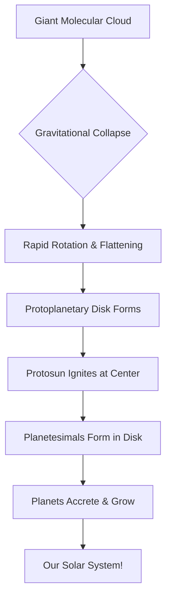

Hey there, curious minds! 👋 Ever looked up at the night sky, spotted the moon, or perhaps even a glimmering planet, and wondered, "How did all this get here?" It's a question as old as humanity, and thankfully, scientists have pieced together an incredible story that's both mind-boggling and surprisingly elegant.

So, grab a comfy chair, maybe a cup of coffee, because today, we're going on a journey back in time – about **4.6 billion years ago**, to be precise – to uncover the cosmic origin story of our very own solar system. Think of it like a grand construction project, but instead of bricks and mortar, we're talking about gas, dust, and a whole lot of gravity! 🎯

> The formation of our solar system began roughly 4.6 billion years ago with the gravitational collapse of a colossal cloud of gas and dust. It's the ultimate cosmic DIY project!

## From Fluffy Cloud to Flat Disk: The Beginning

Imagine, if you will, a truly enormous, diffuse cloud floating in space. Not a cloud like the ones in our sky, but one made of incredibly tiny particles of cosmic dust and various gases, mostly hydrogen and helium. Scientists call this a **giant molecular cloud** ☁️. For billions of years, it just drifted.

Then, something happened. Maybe a nearby supernova (a massive star exploding!) sent a shockwave through it, or perhaps another gravitational pull gave it a little nudge. Whatever the trigger, a small region within this cloud started to get a bit denser. And here's where gravity, the universe's ultimate architect, stepped in.

Gravity loves company. The slightly denser patch started pulling in more and more material, like a giant snowball rolling downhill and gathering more snow. As it pulled inward, this massive cloud began to **collapse** under its own weight.

Now, here's a cool trick: as things collapse and get smaller, if they have any initial spin (and everything in space usually does, even if tiny!), they start to spin faster. Think of an ice skater pulling their arms in during a spin – they speed up dramatically! This rapidly spinning, collapsing cloud didn't just shrink; it also flattened out, like pizza dough being tossed and spun into a flat circle.

This flattened, spinning structure is called a **protoplanetary disk** ✨. At its very center, where most of the material had gathered, the pressure and temperature became so immense that something truly spectacular began to happen: our Sun, a baby star (or **protosun**), ignited!

This whole process is what scientists call the **Nebular Hypothesis** 💡. It's the most widely accepted theory for how star and planet systems form, and it's quite elegant in its simplicity.

Let's visualize this cosmic dance:

## Building Planets: The Cosmic Kitchen's Secret Recipe

So, we have a blazing hot protosun at the center and a massive, flat disk of gas and dust swirling around it. What happens next? This is where our planets, including our lovely Earth, start to take shape.

Within that protoplanetary disk, all those tiny dust and gas particles weren't just passively swirling. They were constantly bumping into each other. And here's another neat trick: sometimes, when they bumped, they stuck together! This process is called **accretion** 🧱. Imagine dust bunnies forming under your bed, but on a cosmic scale, or tiny snowflakes clinging to each other to form bigger flakes.

Over millions of years, these tiny clumps grew larger and larger. From microscopic dust grains, they became pebbles, then rocks, then boulders, and eventually, mini-planets called **planetesimals**. These planetesimals were like the LEGO bricks of our solar system, colliding and merging to build bigger and bigger structures. The more they grew, the stronger their own gravity became, allowing them to pull in even more material. It's a classic snowball effect!

Now, why do we have rocky planets like Earth and Mars close to the Sun, and gas giants like Jupiter and Saturn further out? This brings us to the "cosmic kitchen" principle: the **temperature gradient** 🌡️.

*   **Close to the protosun (the oven!):** It was incredibly hot 🔥. In this scorching inner region, only materials with high melting points, like metals and silicates (rocky stuff), could condense and solidify. Lighter gases and ice simply evaporated away. This is why our inner planets – Mercury, Venus, Earth, and Mars – are relatively small, dense, and made of rock and metal. They're the well-baked cookies of our solar system!

*   **Further away from the protosun (the freezer!):** Out in the colder reaches of the disk ❄️, beyond what's called the "frost line," it was chilly enough for volatile compounds like water, methane, and ammonia to freeze into ice. This meant there was a *lot* more solid material available for accretion. These icy cores grew massive very quickly, and once they reached a certain size, their immense gravity allowed them to capture vast amounts of the abundant hydrogen and helium gas swirling around. This is how the gas giants – Jupiter, Saturn, Uranus, and Neptune – became so enormous. They're like giant cosmic ice cream sundaes with a sprinkle of gas!

## The Universe's Classroom: Learning from Other Worlds

So, how do we know all this? Did someone have a time machine? Not quite! 🔭 Our understanding of solar system formation isn't just based on looking at our own neighborhood. It's constantly being tested and refined by observing other star systems in the galaxy.

Thanks to powerful telescopes like the Hubble Space Telescope and the James Webb Space Telescope, we've discovered thousands of **exoplanets** – planets orbiting stars other than our Sun. And guess what? Many of these distant star systems show exactly the kind of protoplanetary disks and planet configurations that our theories predict!

By studying these diverse exoplanetary systems, we can see the principles of nebular collapse, accretion, and temperature gradients playing out in real-time (or at least, in different stages of development). It helps us understand the **universality** of these processes – that planet formation might be a common occurrence throughout the cosmos – but also the **diversity** of outcomes. Some systems have giant planets incredibly close to their stars, others have multiple rocky worlds, and some are just plain weird! It’s like having a whole universe full of different construction sites to learn from. 🧐

## A Cosmic Legacy

From a vast, unassuming cloud of gas and dust, to a fiery young sun, to a swirling disk of building blocks, and finally, to the magnificent collection of planets, moons, and asteroids we call home – the story of our solar system's creation is truly awe-inspiring. It's a testament to the fundamental forces of physics, especially gravity, and the incredible dance of matter and energy.

Next time you look up, remember that every star you see could be the center of its own amazing story of creation, much like our own. We're all part of this grand, ongoing cosmic narrative. Keep looking up, keep wondering, and keep exploring! 🌟
---
