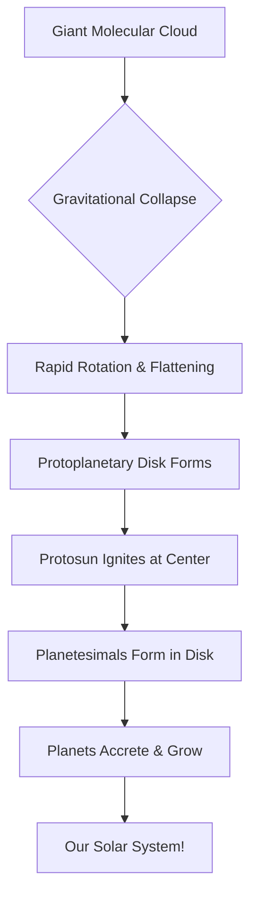

## From Fluffy Cloud to Flat Disk: The Beginning

The formation of the solar system began with a vast, diffuse molecular cloud composed primarily of hydrogen and helium, interspersed with cosmic dust. This structure, known as a giant molecular cloud, remained in a state of relative equilibrium for an extended period.

External disturbances, such as the shockwave from a nearby supernova or gravitational interactions with passing celestial bodies, likely initiated the collapse of a localized region within the cloud. This perturbation disrupted the cloud's stability, allowing gravity to dominate.

As the density of the region increased, gravitational attraction accelerated the accumulation of surrounding material. This process of gravitational collapse caused the cloud to contract significantly, increasing the density and temperature of the core.

Conservation of angular momentum dictated the evolution of the collapsing cloud. As the radius of the cloud decreased, its rotational velocity increased. This rotation caused the cloud to flatten into a disk-like geometry, perpendicular to the axis of rotation.

This flattened, spinning structure is known as a **protoplanetary disk**. At its center, gravitational collapse concentrated the majority of the nebula's mass. As matter fell inward, it gained kinetic energy and increased in density, leading to a dramatic rise in temperature and pressure. This core region eventually reached the conditions necessary for nuclear fusion, marking the birth of the protosun.

This sequence of events is described by the **Nebular Hypothesis**. It remains the primary scientific model explaining the formation of stars and planetary systems.

Let's visualize this cosmic dance:

## Building Planets: The Cosmic Kitchen's Secret Recipe

Following the formation of the protosun and the surrounding protoplanetary disk, the process of planetary accretion commenced.

Within the disk, dust and gas particles underwent collisions, leading to the accumulation of matter through electrostatic and gravitational forces, a process termed **accretion**.

Over millions of years, these collisions resulted in the growth of microscopic grains into pebbles, rocks, and eventually planetesimals. These bodies served as the building blocks for planets, with their increasing mass enhancing their gravitational influence and further accelerating the accretion process.

The distribution of planetary types—rocky inner planets and gaseous outer giants—is explained by the **temperature gradient** within the disk.

* **Inner Region:** High temperatures near the protosun prevented the condensation of volatile compounds. Only materials with high melting points, such as metals and silicates, could solidify, resulting in the formation of dense, terrestrial planets.

* **Outer Region:** Beyond the frost line, lower temperatures allowed volatile compounds like water, methane, and ammonia to condense into ice. This abundance of solid material facilitated the rapid growth of massive cores, which subsequently captured large quantities of hydrogen and helium gas to form gas giants.

## The Universe's Classroom: Learning from Other Worlds

Scientific understanding of solar system formation is derived from observational data and theoretical modeling. This knowledge is continuously refined through the study of other star systems.

Observations from instruments such as the Hubble and James Webb Space Telescopes have identified thousands of **exoplanets**. These discoveries provide empirical evidence that supports the mechanisms of nebular collapse and accretion observed in our own system.

By studying these diverse exoplanetary systems, we can see the principles of nebular collapse, accretion, and temperature gradients playing out in real-time (or at least, in different stages of development). It helps us understand the **universality** of these processes – that planet formation might be a common occurrence throughout the cosmos – but also the **diversity** of outcomes. Some systems have giant planets incredibly close to their stars, others have multiple rocky worlds, and some are just plain weird! It’s like having a whole universe full of different construction sites to learn from. 🧐

## A Cosmic Legacy

The evolution of the solar system from a molecular cloud to a complex planetary arrangement illustrates the fundamental role of gravity and thermodynamics in cosmic development.

The study of stellar evolution indicates that the processes observed in our solar system are representative of broader cosmic phenomena. Ongoing research continues to clarify the mechanisms governing the formation and diversity of planetary systems.

## References

- [Formation and evolution of the Solar System](https://en.wikipedia.org/wiki/Formation_and_evolution_of_the_Solar_System)
- [History of Solar System formation and evolution hypotheses](https://en.wikipedia.org/wiki/History_of_Solar_System_formation_and_evolution_hypotheses)
- [Accretion (astrophysics)](https://en.wikipedia.org/wiki/Accretion_%28astrophysics%29)
- [Accretion disk](https://en.wikipedia.org/wiki/Accretion_disk)
- [Solar apex motion relative to near stars.](https://duckduckgo.com/Solar_apex)
- [Cosmogony](https://duckduckgo.com/c/Cosmogony)
- [Solar System dynamic theories](https://duckduckgo.com/c/Solar_System_dynamic_theories)
- [Stellar evolution](https://duckduckgo.com/c/Stellar_evolution)
