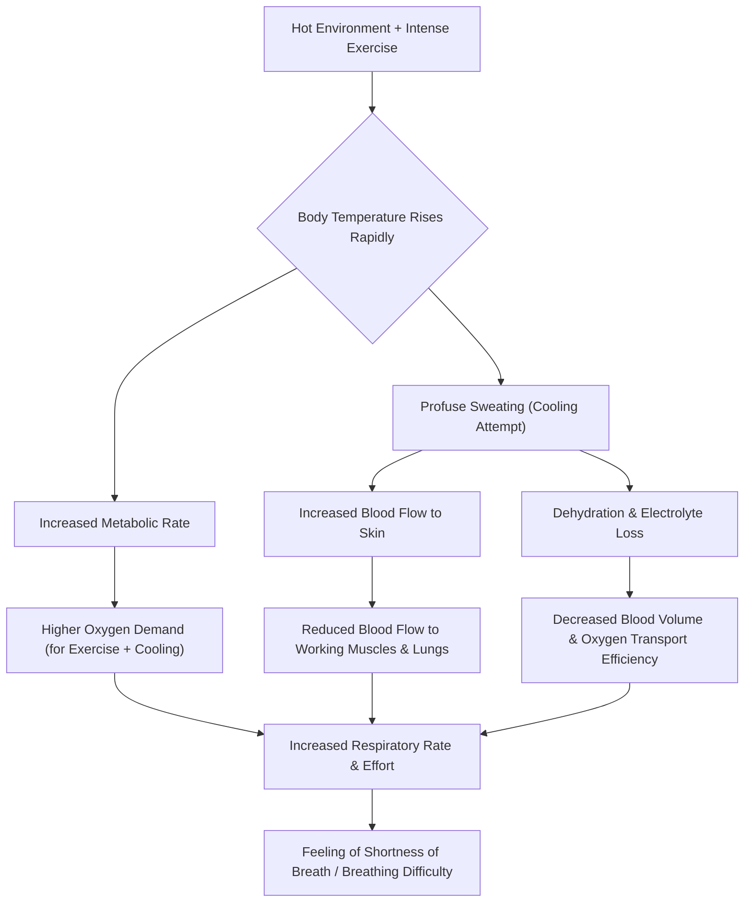

---
You're in the zone. The music's pumping, the weights are flying, and you're absolutely crushing that CrossFit WOD. Then, halfway through, it hits you: a wall of humid, heavy air. Suddenly, every breath feels like you're trying to suck air through a tiny straw, and your lungs are screaming for relief. You're not alone, champ. That feeling isn't just you being "out of shape" or "soft." There's some real science happening behind the scenes.

Let's pull back the curtain and understand why exercising in a hot CrossFit gym makes breathing feel like an Olympic sport in itself.

### The Core Concept: Your Body's Overtime Shift 🥵

What we're talking about here is essentially **"Breathing difficulty in hot exercise."** Sounds fancy, right? But it just means your body is working extra, extra hard when you're pushing yourself in a high-temperature environment. Think of it like this: your body has two big jobs when you're working out – powering your muscles and keeping your internal temperature just right. When it's hot, it suddenly gets a third, massive job: cooling you down *fast*.

> When your body is trying to cool down, power your muscles, AND maintain balance all at once, your breathing system feels the squeeze. It's like trying to run a marathon while simultaneously juggling three flaming torches! 🔥🏃‍♂️

This triple-duty means your respiratory system (that's your lungs and everything that helps you breathe) and your cardiovascular system (your heart and blood vessels) are under immense pressure. They're struggling to deliver enough oxygen to all the parts that need it and get rid of all the carbon dioxide your hard-working body is producing.

### The Triple Whammy: Why It Gets So Tough 🔬

There are three main reasons why that hot gym air feels so suffocating. Let's break them down:

#### 1. Your Internal Thermostat Goes Haywire 🌡️

Imagine your body has a super-smart internal thermostat. When you start exercising, your muscles generate heat. When you add a hot, humid gym on top of that, your body's temperature starts to climb even faster. To prevent overheating (which is really dangerous!), your thermostat kicks into overdrive.

*   **Heart Rate & Blood Flow:** Your heart starts pumping blood like crazy, not just to your working muscles, but also to your skin. Why the skin? Because that's where your body tries to dump heat into the environment. This means less blood is available for your muscles and, crucially, for efficient oxygen exchange in your lungs.
*   **Breathing Rate:** You'll notice yourself breathing faster and shallower. Your body is trying to get rid of heat through your breath, almost like a panting dog! This increased breathing effort, combined with less efficient blood flow, makes each breath feel less effective.

It's like your body is trying to run the air conditioner and the heater at full blast simultaneously – a huge energy drain!

#### 2. The Dehydration Drain 💧

You're sweating buckets, right? That's your body's primary cooling mechanism. But all that sweat comes from somewhere: your blood plasma.

*   **Blood Volume:** As you sweat more, your blood volume decreases. Think of your blood as a river carrying oxygen and nutrients. If the river's water level drops, it can't carry as much cargo (oxygen) as efficiently.
*   **Electrolyte Imbalance:** Sweating also means you're losing important electrolytes (like sodium and potassium), which are crucial for nerve and muscle function, and for maintaining fluid balance.
*   **Oxygen Transport:** With less blood volume and imbalanced electrolytes, your heart has to work even harder to circulate the remaining blood, and that blood is less efficient at picking up oxygen from your lungs and delivering it to your muscles. This directly impacts your ability to sustain effort and, you guessed it, makes you feel out of breath.

Imagine your car trying to run on half a tank of oil – things just don't flow as smoothly, and the engine has to work harder.

#### 3. Oxygen Demands Go Through the Roof 📈

Finally, let's talk about oxygen. When you exercise, your muscles need more oxygen to produce energy. When you exercise in the heat, your body's overall metabolic rate (how fast your body is burning energy) increases even further. This is because your body needs extra energy to fuel all those cooling mechanisms we just talked about!

*   **Double Demand:** So, you're not just needing oxygen for your squats and burpees; you're also needing extra oxygen just to keep your core temperature from skyrocketing. It's a double whammy!
*   **Respiratory Effort:** This increased demand for oxygen means your lungs and diaphragm have to work harder and faster to try and suck in enough air. But with all the other factors (reduced blood flow, dehydration), it feels like you're fighting an uphill battle.

Here's a little diagram to help visualize the whole messy process:

### So, What Can We Do About It, Champ? 💪

Understanding the "why" is the first step. The next is knowing how to manage it so you can still get a great workout without risking your health.

*   **Hydrate, Hydrate, Hydrate!** 🥤 This is non-negotiable. Start hydrating well before your workout, drink sips throughout, and replenish afterward. Don't just drink water; consider electrolyte drinks if you're sweating a lot during long or intense sessions. Think of it like watering a plant *before* it starts to wilt.
*   **Acclimatize Gradually.** If you're new to hot workouts, don't jump straight into a max-effort WOD. Gradually increase your exposure to the heat and the intensity of your workouts. Your body is amazing at adapting, but it needs time – usually 10-14 days – to get used to the new conditions. This is called **heat acclimatization** (fancy word for "getting used to it").
*   **Listen to Your Body.** This is the most important advice a dad can give you. If you're feeling overly lightheaded, dizzy, nauseous, or your breathing is truly uncontrollable, *stop*. Reduce the intensity, take a break, or call it a day. There's no shame in it. Pushing too hard in the heat can lead to serious conditions like heat exhaustion or even heatstroke.
*   **Adjust Your Workout.** On super hot days, maybe scale back the intensity or duration. Focus on technique over speed, or choose exercises that are less metabolically demanding. It's okay to dial it back; consistency beats intensity every time.

> Your body is a finely tuned machine, but even the best machines have limits. Especially when the environment isn't cooperating! 🔧

### The Takeaway

That feeling of gasping for air in a hot CrossFit gym isn't just in your head. It's a complex physiological response to your body working incredibly hard to cool itself down while simultaneously powering its muscles. By understanding these scientific principles, you can make smarter choices about your training, stay safer, and keep crushing those WODs for years to come.

Stay cool, stay hydrated, and keep moving! 🎯