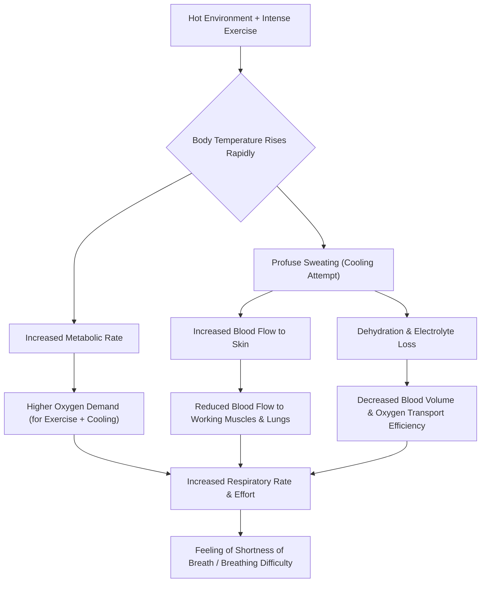

---
You're in the zone. The music's pumping, the weights are flying, and you're absolutely crushing that CrossFit WOD. Then, halfway through, it hits you: a wall of humid, heavy air. Suddenly, every breath feels like you're trying to suck air through a tiny straw, and your lungs are screaming for relief. You're not alone, champ. That feeling isn't just you being "out of shape" or "soft." There's some real science happening behind the scenes.

Let's pull back the curtain and understand why exercising in a hot CrossFit gym makes breathing feel like an Olympic sport in itself.

## The Core Concept: Your Body's Overtime Shift 🥵

## The Core Concept: Your Body's Overtime Shift

본질적으로 이는 **'고온 환경에서의 운동 시 호흡 곤란'** 현상이다. 이는 고온 환경에서 신체가 근육 활동을 위한 에너지 공급과 체온 조절이라는 두 가지 과제를 동시에 수행해야 함을 의미한다. 체온이 상승하면 신체는 항상성을 유지하기 위해 심박출량을 증가시키고 피부 혈류를 확장하여 열 발산을 시도하는데, 이 과정에서 심혈관계의 부담이 가중된다.

> 신체가 체온 조절과 근육 에너지 공급을 동시에 수행할 때, 심혈관계와 호흡계는 산소 운반 효율 저하와 대사 요구량 증가로 인해 상당한 스트레스를 받게 된다. 이는 운동 중 호흡 빈도를 높이고 심박수를 급격히 상승시키는 원인이 된다.

This triple-duty means your respiratory system (that's your lungs and everything that helps you breathe) and your cardiovascular system (your heart and blood vessels) are under immense pressure. They're struggling to deliver enough oxygen to all the parts that need it and get rid of all the carbon dioxide your hard-working body is producing.

## The Triple Whammy: Why It Gets So Tough 🔬

There are three main reasons why that hot gym air feels so suffocating. Let's break them down:

Imagine your body has a super-smart internal thermostat. When you start exercising, your muscles generate heat. When you add a hot, humid gym on top of that, your body's temperature starts to climb even faster. To prevent overheating (which is really dangerous!), your thermostat kicks into overdrive.

*   **Heart Rate & Blood Flow:** Your heart starts pumping blood like crazy, not just to your working muscles, but also to your skin. Why the skin? Because that's where your body tries to dump heat into the environment. This means less blood is available for your muscles and, crucially, for efficient oxygen exchange in your lungs.
*   **Breathing Rate:** You'll notice yourself breathing faster and shallower. Your body is trying to get rid of heat through your breath, almost like a panting dog! This increased breathing effort, combined with less efficient blood flow, makes each breath feel less effective.

It's like your body is trying to run the air conditioner and the heater at full blast simultaneously – a huge energy drain!

You're sweating buckets, right? That's your body's primary cooling mechanism. But all that sweat comes from somewhere: your blood plasma.

*   **Blood Volume:** As you sweat more, your blood volume decreases. Think of your blood as a river carrying oxygen and nutrients. If the river's water level drops, it can't carry as much cargo (oxygen) as efficiently.
*   **Electrolyte Imbalance:** Sweating also means you're losing important electrolytes (like sodium and potassium), which are crucial for nerve and muscle function, and for maintaining fluid balance.
*   **Oxygen Transport:** With less blood volume and imbalanced electrolytes, your heart has to work even harder to circulate the remaining blood, and that blood is less efficient at picking up oxygen from your lungs and delivering it to your muscles. This directly impacts your ability to sustain effort and, you guessed it, makes you feel out of breath.

Imagine your car trying to run on half a tank of oil – things just don't flow as smoothly, and the engine has to work harder.

Finally, let's talk about oxygen. When you exercise, your muscles need more oxygen to produce energy. When you exercise in the heat, your body's overall metabolic rate (how fast your body is burning energy) increases even further. This is because your body needs extra energy to fuel all those cooling mechanisms we just talked about!

*   **Double Demand:** So, you're not just needing oxygen for your squats and burpees; you're also needing extra oxygen just to keep your core temperature from skyrocketing. It's a double whammy!
*   **Respiratory Effort:** This increased demand for oxygen means your lungs and diaphragm have to work harder and faster to try and suck in enough air. But with all the other factors (reduced blood flow, dehydration), it feels like you're fighting an uphill battle.

Here's a little diagram to help visualize the whole messy process:

```mermaid
graph TD
    A[Hot Environment + Intense Exercise] --> B{Body Temperature Rises Rapidly}
    B --> C[Increased Metabolic Rate]
    B --> D["Profuse Sweating (Cooling Attempt)"]
    C --> E["Higher Oxygen Demand (for Exercise + Cooling)"]
    D --> F[Dehydration & Electrolyte Loss]
    D --> G[Increased Blood Flow to Skin]
    G --> H[Reduced Blood Flow to Working Muscles & Lungs]
    F --> I[Decreased Blood Volume & Oxygen Transport Efficiency]
    E & H & I --> J[Increased Respiratory Rate & Effort]
    J --> K[Feeling of Shortness of Breath / Breathing Difficulty]
```

## So, What Can We Do About It, Champ? 💪

Understanding the "why" is the first step. The next is knowing how to manage it so you can still get a great workout without risking your health.

> 신체는 정교한 생리적 기전을 갖춘 시스템이지만, 고온 환경과 같은 외부 스트레스 요인이 가해질 경우 심혈관계의 보상 기전은 한계에 도달하게 된다. 이러한 생리적 한계를 이해하고 적절히 대응하는 것이 중요하다.

## The Takeaway

That feeling of gasping for air in a hot CrossFit gym isn't just in your head. It's a complex physiological response to your body working incredibly hard to cool itself down while simultaneously powering its muscles. By understanding these scientific principles, you can make smarter choices about your training, stay safer, and keep crushing those WODs for years to come.

## References

- [Exercise physiology](https://en.wikipedia.org/wiki/Exercise_physiology)
- [Heat exhaustion](https://en.wikipedia.org/wiki/Heat_exhaustion)
- [Effect of spaceflight on the human body](https://en.wikipedia.org/wiki/Effect_of_spaceflight_on_the_human_body)
- [Physical fitness](https://en.wikipedia.org/wiki/Physical_fitness)
