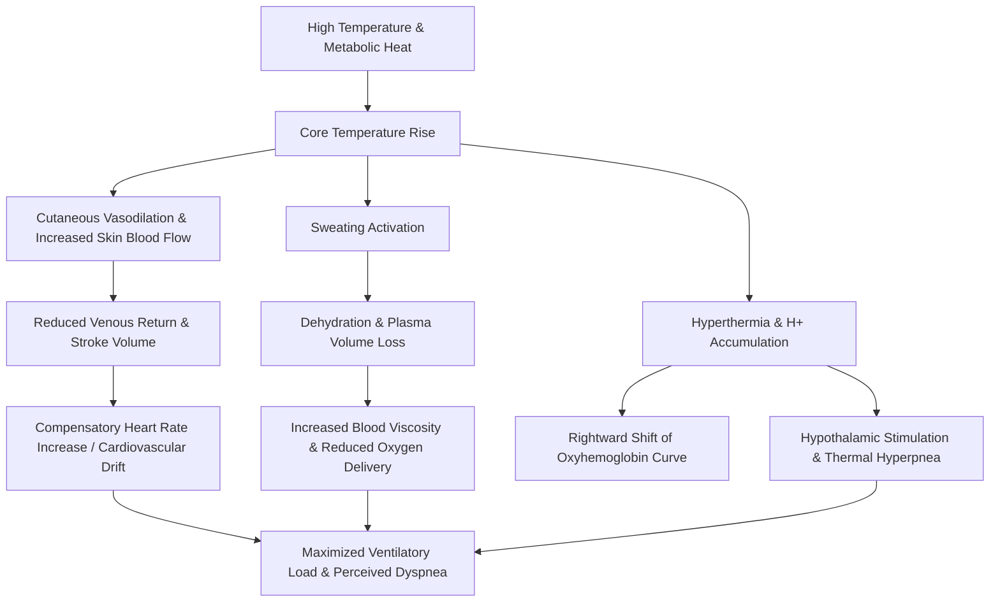

# Physiological Mechanisms of Dyspnea During High-Intensity Exercise in Hot Environments

When performing physically demanding exercises like CrossFit or High-Intensity Interval Training (HIIT), you may experience severe shortness of breath or dyspnea, especially in hot environments or poorly ventilated indoor spaces. This is not merely a result of poor physical conditioning; it is the physiological consequence of complex interactions between thermoregulation, the cardiovascular system, and the respiratory system.

The following are the physiological causes and organic changes that occur within the body during exercise in high-temperature environments.

## 1. Cardiovascular Overload and Thermoregulation

To maintain a core body temperature within a stable range (approximately 37°C), the human body activates heat dissipation mechanisms in response to metabolic heat generated during exercise and external heat stress.

### Increased Skin Blood Flow and Cardiovascular Drift

A significant portion of the blood intended for working muscles is diverted to the skin via cutaneous vasodilation to facilitate heat release. This reduces venous return to the heart, which in turn decreases stroke volume.

To maintain cardiac output (Q), the heart rate increases compensatorily—a phenomenon known as **cardiovascular drift**. The heart faces a dual challenge: supplying oxygen to muscles while simultaneously managing thermoregulation, which maximizes cardiovascular strain.

### Dehydration, Plasma Volume Reduction, and Blood Viscosity

Sweating, activated to suppress rising body temperature, leads to rapid loss of body water. Sustained sweating reduces plasma volume, thereby increasing blood viscosity. 

Increased blood viscosity raises peripheral resistance, which increases the heart's afterload and reduces the efficiency of oxygen delivery to tissues. This is a primary cause of insufficient oxygen supply to both working muscles and respiratory muscles.

## 2. Respiratory Regulation and the Oxygen-Hemoglobin Dissociation Curve

Exercise in hot environments directly impacts the respiratory system responsible for gas exchange.

### Rightward Shift of the Oxygen-Hemoglobin Dissociation Curve

Rising body temperature, increased metabolic byproducts (H+, CO2), and elevated 2,3-BPG levels shift the oxyhemoglobin dissociation curve to the right.

- **Peripheral Tissues:** The rightward shift helps dissociate (release) oxygen more easily to working muscles.
- **Alveolar Level:** In states of extreme hyperthermia, the hemoglobin's affinity for oxygen at the pulmonary capillary level may decrease, potentially reducing binding efficiency before the blood enters the arterial circulation.

### Respiratory Compensation for Metabolic Acidosis and Thermal Hyperpnea

High-intensity exercise leads to metabolic acidosis due to lactic acid accumulation and hydrogen ion (H+) buildup. Central and peripheral chemoreceptors detect this and trigger a compensatory surge in ventilation to expel hydrogen ions as CO2.

Furthermore, heat stimulation directly excites the respiratory center in the hypothalamus, inducing **thermal hyperpnea**. This leads to hyperventilation, where breathing frequency increases rapidly regardless of gas exchange efficiency, causing the athlete to perceive severe dyspnea.

## 3. Physiological Response Process in Hot Environments

```mermaid
graph TD
    A[High Temperature & Metabolic Heat] --> B[Core Temperature Rise]
    B --> C[Cutaneous Vasodilation & Increased Skin Blood Flow]
    C --> D[Reduced Venous Return & Stroke Volume]
    D --> E[Compensatory Heart Rate Increase / Cardiovascular Drift]

    B --> F[Sweating Activation]
    F --> G[Dehydration & Plasma Volume Loss]
    G --> H[Increased Blood Viscosity & Reduced Oxygen Delivery]

    B --> I[Hyperthermia & H+ Accumulation]
    I --> J[Rightward Shift of Oxyhemoglobin Curve]
    I --> K[Hypothalamic Stimulation & Thermal Hyperpnea]

    E & H & K --> L[Maximized Ventilatory Load & Perceived Dyspnea]
```

## 4. Safety Management and Physiological Adaptation

Dyspnea in hot environments is a warning signal of thermal stress and physiological limits. Scientific approaches to mitigate this include:

### 1) Hydration and Electrolyte Strategy

- **Pre-hydration:** Consume 5–7 mL of water per kg of body weight 2–4 hours before exercise to ensure euhydration.
- **Electrolyte Replacement:** For high-intensity exercise lasting over an hour, consume electrolyte drinks containing sodium to prevent plasma volume depletion and hyponatremia.
- **Weight Monitoring:** Monitor body weight before and after exercise to ensure fluid loss does not exceed 2% of body weight. (Replace approximately 1.2–1.5L of fluid per 1kg of weight lost).

### 2) Gradual Heat Acclimatization

Gradual exposure to heat over 10–14 days induces the following adaptations:

- **Plasma Volume Expansion:** Plasma volume increases by 10–15% within the first 3–5 days, helping maintain venous return and stroke volume.
- **Improved Sweating Mechanism:** Sweating begins at a lower temperature threshold, and the sodium concentration in sweat decreases, reducing electrolyte loss.
- **Reduced Resting Heart Rate and Core Temperature:** Cardiovascular and respiratory strain significantly decrease at the same exercise intensity.

### 3) Environmental and Intensity Control (WBGT)

- Use the **Wet Bulb Globe Temperature (WBGT)**, which accounts for humidity, radiant heat, and wind speed, to assess environmental risk.
- In high WBGT environments, reduce exercise intensity (RPE) and ensure sufficient rest between sets to prevent excessive core temperature rise.

## References

- [Exercise physiology](https://en.wikipedia.org/wiki/Exercise_physiology)
- [Heat exhaustion](https://en.wikipedia.org/wiki/Heat_exhaustion)
- [Effect of spaceflight on the human body](https://en.wikipedia.org/wiki/Effect_of_spaceflight_on_the_human_body)
- [Physical fitness](https://en.wikipedia.org/wiki/Physical_fitness)
