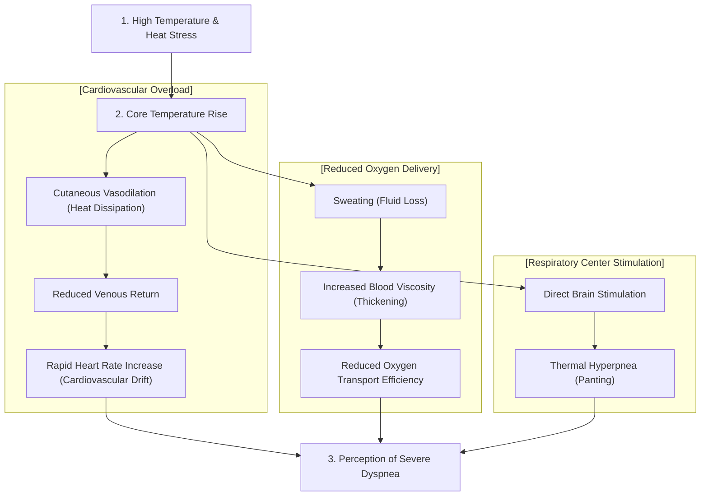

# Physiological Mechanisms of Dyspnea During High-Intensity Exercise in Hot Environments

When performing physically demanding exercises like CrossFit or High-Intensity Interval Training (HIIT), you may experience severe shortness of breath or dyspnea, especially in hot environments or poorly ventilated indoor spaces. This is not merely a result of poor physical conditioning; it is the physiological consequence of complex interactions between thermoregulation, the cardiovascular system, and the respiratory system.

The following are the physiological causes and organic changes that occur within the body during exercise in high-temperature environments.

## 1. Cardiovascular Overload and Thermoregulation

To maintain a core body temperature within a stable range (approximately 37°C), the human body activates heat dissipation mechanisms in response to metabolic heat generated during exercise and external heat stress.

### (1) Increased Skin Blood Flow and Cardiovascular Drift
* **Cutaneous Vasodilation:** To dissipate heat, blood vessels near the skin dilate, drawing a large volume of blood to the surface.
* **Reduced Muscle Perfusion and Venous Return:** As more blood is diverted to the skin, the volume of blood returning to the heart (**venous return**) and reaching the working muscles decreases.
* **Decreased Stroke Volume:** With less blood returning to the heart, the volume of blood pumped per beat (**stroke volume**) also decreases.
* **Cardiovascular Drift:** To maintain the required cardiac output, the heart must compensate by rapidly increasing its rate. This phenomenon is known as **Cardiovascular Drift**, where the heart becomes overloaded by simultaneously managing thermoregulation and oxygen delivery to muscles.

### (2) Dehydration and Increased Blood Viscosity
* **Plasma Volume Reduction:** Profuse sweating to cool the body leads to a rapid decrease in **plasma volume**, the liquid component of blood.
* **Increased Viscosity and Afterload:** As water is lost, blood becomes more viscous (thicker). The heart must exert greater force to pump this thicker blood through the body, increasing the resistance or **afterload** on the heart.
* **Result:** The slower flow of viscous blood hinders the rapid delivery of oxygen to muscles and respiratory muscles (intercostal/diaphragm), ultimately triggering dyspnea.

## 2. Respiratory Regulation and Direct Stimulation of the Respiratory Center

Hot environments directly impact the lungs and the respiratory control system responsible for gas exchange.

### (1) Altered Oxygen-Hemoglobin Affinity
* **Peripheral Tissues (Muscles):** As body temperature rises and metabolic byproducts (lactic acid, hydrogen ions) accumulate, hemoglobin in red blood cells releases oxygen more easily to supply the muscles.
* **Alveolar Level (Lungs):** However, if body temperature rises excessively, hemoglobin may struggle to bind effectively with oxygen in the lungs, potentially leading to blood being circulated with suboptimal oxygen saturation.

### (2) Respiratory Compensation and Thermal Hyperpnea
* **Respiratory Compensation for Metabolic Acidosis:** During high-intensity exercise, the accumulation of acidic substances like lactic acid causes blood pH to drop (**metabolic acidosis**). Chemical sensors (chemoreceptors) detect this and trigger a rapid increase in breathing to expel acidic byproducts in the form of carbon dioxide.
* **Thermal Hyperpnea:** Furthermore, elevated body temperature directly stimulates the respiratory center in the brain (hypothalamus), causing excessive panting. This is known as **thermal hyperpnea**, where the athlete experiences severe dyspnea due to rapid, shallow breathing that does not necessarily improve gas exchange efficiency.

## 3. Physiological Response Process in Hot Environments

```mermaid
flowchart TD
    A["1. High Temperature & Heat Stress"] --> B["2. Core Temperature Rise"]
    
    subgraph C["[Cardiovascular Overload]"]
        B --> C1["Cutaneous Vasodilation (Heat Dissipation)"]
        C1 --> C2["Reduced Venous Return"]
        C2 --> C3["Rapid Heart Rate Increase (Cardiovascular Drift)"]
    end

    subgraph D["[Reduced Oxygen Delivery]"]
        B --> D1["Sweating (Fluid Loss)"]
        D1 --> D2["Increased Blood Viscosity (Thickening)"]
        D2 --> D3["Reduced Oxygen Transport Efficiency"]
    end

    subgraph E["[Respiratory Center Stimulation]"]
        B --> E1["Direct Brain Stimulation"]
        E1 --> E2["Thermal Hyperpnea (Panting)"]
    end

    C3 & D3 & E2 --> F["3. Perception of Severe Dyspnea"]
```

## 4. Safety Management and Physiological Adaptation

Dyspnea in hot environments is a warning signal of thermal stress. Practical guidelines to mitigate this include:

### (1) Hydration and Electrolyte Strategy
* **Pre-hydration:** Consume 5–7 mL of water per kg of body weight 2–4 hours before exercise to ensure proper hydration.
* **Electrolyte Replacement:** For exercise lasting over an hour, use electrolyte drinks containing sodium to prevent plasma volume depletion. Note: Simply drinking water without electrolytes can lower blood osmotic pressure, causing fluid to shift out of the bloodstream into surrounding tissues.
* **Weight Monitoring:** Ensure body weight does not fluctuate by more than 2% before and after exercise. (Replace approximately 1.2–1.5L of fluid per 1kg of weight lost).

### (2) Physiological Principles of Heat Acclimatization

Gradual adaptation over 10–14 days induces the following:

#### 1. Earlier Sweating and 'Dilute' Sweat
* **Sodium Reabsorption:** The body learns to activate sweat glands at lower temperatures. Sweat glands consist of a 'coil' (secretion) and a 'duct' (reabsorption). Increased **aldosterone** levels enhance the efficiency of ion pumps in the duct, which reabsorb sodium and chloride back into the blood.
* **Result:** While sweating begins sooner, the sweat becomes more dilute (lower salt concentration), preserving essential electrolytes.

#### 2. Stabilization of Heart Rate
* **Plasma Volume Expansion:** Heat acclimatization increases plasma volume by 10–15%, which increases stroke volume. Because the heart pumps more blood per beat, it does not need to beat as rapidly to maintain the same cardiac output (Q = HR × SV).

### (3) Environmental Control (WBGT)
* Use the **Wet Bulb Globe Temperature (WBGT)**, which accounts for humidity, radiant heat, and wind speed. High humidity prevents sweat evaporation, causing rapid core temperature spikes. Adjust intensity accordingly.

## References

- [Exercise physiology](https://en.wikipedia.org/wiki/Exercise_physiology)
- [Heat exhaustion](https://en.wikipedia.org/wiki/Heat_exhaustion)
- [Effect of spaceflight on the human body](https://en.wikipedia.org/wiki/Effect_of_spaceflight_on_the_human_body)
- [Physical fitness](https://en.wikipedia.org/wiki/Physical_fitness)
