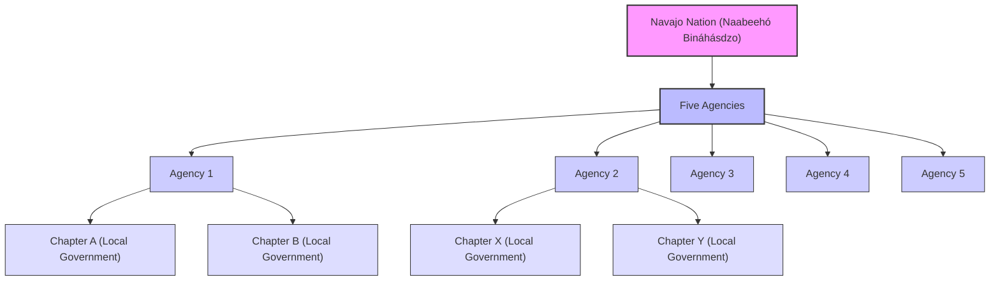

---
Hey there, tech explorers and curious minds! 🌍 Today, we're taking a little detour from our usual gadgets and algorithms to explore something equally fascinating: a real-world community with a rich history, unique governance, and a story that's as compelling as any blockchain or AI breakthrough. Ever heard of the **Navajo Nation**? If not, you're in for a treat!

For many, the term "Native American reservation" might conjure up vague images, but the Navajo Nation, or `Naabeehó Bináhásdzo` in their own language, is far more than just a geographic area. It's a vibrant, living nation within the United States, a testament to resilience, culture, and self-governance. Think of it less like a state park and more like a country operating within another country – with its own laws, government, and deep-rooted traditions. Pretty neat, right? ✨

## Where Exactly Is This "Navajoland"?

Imagine a vast, stunning landscape stretching across three U.S. states: northeastern Arizona, northwestern New Mexico, and southeastern Utah. That's the footprint of Navajoland! It's an expansive territory, larger than many U.S. states and several European countries. When you drive through it, you're not just passing through a region; you're entering a distinct cultural and political entity.

> 💡 **Key Insight:** The Navajo Nation isn't just a place; it's a sovereign government and a cultural homeland for the Navajo people, also known as the Diné.

This vastness means incredible diversity in landscape, from deserts and mesas to mountains, and a wealth of natural resources. But more importantly, it means a large, active community of Navajo people who continue to uphold their language, ceremonies, and way of life.

## How Does a Nation Within a Nation Operate?

Now, this is where it gets really interesting, especially for those of us fascinated by systems and organization! How does a government manage such a large and diverse population across such a vast territory? The Navajo Nation has a unique and highly structured governmental system.

At its core, the Nation is divided into what are called **"agencies"** – five of them, to be exact. You can think of these agencies a bit like administrative regions or large counties. But the real heartbeat of local governance lies in something called **"chapters."**

A chapter is the most local form of government on the Navajo Nation. Imagine your local city council or a very active neighborhood association, but with deeper historical roots and direct ties to traditional community decision-making. These chapters are crucial for local services, community planning, and direct representation. They're where the rubber meets the road, connecting individual Navajo citizens with their broader national government.

To help visualize this structure, here's a simple diagram:

This structure allows for both centralized leadership and strong, community-level participation, a balance many modern governments strive for. It's a fascinating model of distributed governance, wouldn't you agree? 🎯

## A Glimpse into History: The Uranium Story

The Navajo Nation's history is rich and complex, interwoven with both ancient traditions and significant modern challenges. One particularly impactful chapter involves **uranium mining**. Starting in 1944, during the height of the Cold War and the atomic age, uranium mining became a major industry in the region. The Navajo Nation was strategically situated over vast uranium deposits across parts of Arizona, New Mexico, and Utah.

While it brought jobs and economic activity at the time, the long-term environmental and health impacts on the Navajo people and their land have been profound and continue to be addressed today. This period highlights the intricate relationship between resource extraction, national needs, and the well-being of local communities. It's a powerful reminder of how technological advancements (like atomic energy) often have hidden human and environmental costs.

## More Than Just a Reservation

The Navajo Nation is a vibrant, evolving society that cherishes its heritage while navigating the complexities of the modern world. From its unique governmental structure to its stunning landscapes and profound history, it offers a powerful example of cultural resilience and self-determination.

So, the next time you hear "Navajo Nation," I hope you'll think of it as more than just a name on a map. Think of it as `Naabeehó Bináhásdzo` – a living, breathing nation with a story worth knowing. It's a truly remarkable part of the human story, right here in the U.S.! 💡

---

---

## References

- [Navajo Nation](https://en.wikipedia.org/wiki/Navajo%20Nation)
- [Chapter (Navajo Nation)](https://en.wikipedia.org/wiki/Chapter%20%28Navajo%20Nation%29)
- [Uranium mining and the Navajo people](https://en.wikipedia.org/wiki/Uranium%20mining%20and%20the%20Navajo%20people)