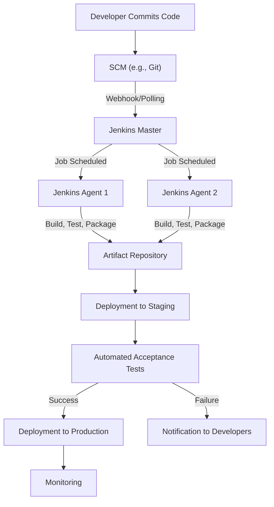

In the dynamic world of technology, names often carry multiple connotations. When you hear "Jenkins," a seasoned developer or IT professional will almost instinctively think of an open-source automation server that has become a key automation server for many software development teams. However, the name also refers to a family of non-cryptographic hash functions, and even appears as an author in academic research. This article aims to clarify what "Jenkins" truly means in a technical context, with a primary focus on the widely used automation server that helps power Continuous Integration and Continuous Delivery workflows.

---

## Jenkins: A Key Player in Software Automation

At its core, **Jenkins (software)** is an **open-source automation server** that helps orchestrate aspects of the software development lifecycle, from code commit to deployment. It's a key tool in many DevOps practices, enabling teams to build, test, and deploy their applications rapidly and reliably.

### A Brief History and Evolution

Jenkins' journey began as a project called **Hudson** at Sun Microsystems in 2004. Created by Kohsuke Kawaguchi, it gained popularity for its ability to automate build processes. Following Oracle's acquisition of Sun, a change in project stewardship led to the community forking Hudson in 2011, giving birth to Jenkins. This fork not only preserved the open-source spirit but also fostered its development as a community-driven project.

### Jenkins' Role in CI/CD

Jenkins is frequently used in **Continuous Integration (CI)** and **Continuous Delivery/Deployment (CD)** practices.

*   Jenkins detects changes in version control systems (like Git, SVN), automatically triggering builds, running unit and integration tests, and providing feedback on the build's health. This early detection of issues can save significant time and effort.
*   For Continuous Delivery, Jenkins can automate the release pipeline, including testing, packaging, and deploying applications to various environments (development, staging, production).
*   In Continuous Deployment, Jenkins can be configured to automatically deploy every change that passes automated tests to production without human intervention.

Jenkins can serve as a central component for these processes, connecting various tools and orchestrating the flow of work.

### Jenkins Architecture: Master-Agent Paradigm

Jenkins operates on a **master-agent architecture** to distribute workloads and scale effectively.

*   **Jenkins Master:** The master server is the central control plane. It manages the user interface, schedules jobs, monitors agents, and stores configuration data (job definitions, plugin configurations, etc.). It doesn't typically execute builds itself, especially for intensive tasks.
*   **Jenkins Agents (or Slaves/Nodes):** These are separate machines (physical, virtual, or containerized) that the master delegates build execution to. Agents can be configured with specific tools, operating systems, and environments required for different types of projects. This distributed approach allows for parallel execution of builds, isolation of build environments, and efficient resource utilization.

The communication between the master and agents usually happens over TCP/IP, allowing agents to be located anywhere on the network or even in the cloud.


*Figure 1: Simplified Jenkins CI/CD Pipeline Flow*

### Key Features and Capabilities

Jenkins' strength lies in its flexibility and extensibility.

*   **Extensive Plugin Ecosystem:** With a vast plugin ecosystem, Jenkins can integrate with many tools in the software development ecosystem. This includes version control systems (Git, SVN, Mercurial), build tools (Maven, Gradle, npm), testing frameworks (JUnit, Selenium, Jest), artifact repositories (Nexus, Artifactory), cloud providers (AWS, Azure, GCP), and notification services (Slack, Email).
*   **Pipeline-as-Code (Jenkinsfile):** A notable advancement for Jenkins is the adoption of Pipeline-as-Code. A `Jenkinsfile` is a text file that defines the entire CI/CD pipeline in a Groovy-based Domain Specific Language (DSL). This file is stored in the project's source code repository, alongside the application code.
    *   **Benefits of Pipeline-as-Code:**
        *   **Version Control:** The pipeline definition is versioned with the code, allowing for auditing and rollbacks.
        *   **Self-Documenting:** The pipeline steps are clear and readable.
        *   **Collaboration:** Developers can contribute to and review pipeline changes.
        *   **Consistency:** Ensures consistent pipeline execution across environments.
        *   **Reproducibility:** Easy to recreate or migrate pipelines.
*   **Distributed Builds:** As mentioned with the master-agent architecture, Jenkins can distribute builds across multiple machines, helping to reduce build times for large projects.
*   **Rich UI and Reporting:** Jenkins provides a web-based user interface to configure jobs, monitor build status, view logs, and manage plugins. It also offers various reporting capabilities through plugins.
*   **Security:** Jenkins offers security features, including user authentication, authorization, role-based access control, and integration with external identity providers.

### A Glimpse into a Jenkinsfile

Here’s a basic `Jenkinsfile` example demonstrating a declarative pipeline for a simple Java application:

```groovy
// Jenkinsfile (Declarative Pipeline)
pipeline {
    agent any // Execute the pipeline on any available agent

    stages {
        stage('Checkout Source') {
            steps {
                git 'https://github.com/your-org/your-repo.git' // Replace with your repository
            }
        }
        stage('Build') {
            steps {
                sh 'mvn clean install -DskipTests' // Build the Java application using Maven
            }
        }
        stage('Test') {
            steps {
                // Assuming tests are run by Maven and reports are generated
                sh 'mvn test'
            }
            post {
                always {
                    junit '**/target/surefire-reports/*.xml' // Publish JUnit test results
                }
            }
        }
        stage('Package') {
            steps {
                sh 'mvn package' // Create the JAR/WAR file
            }
            post {
                success {
                    archiveArtifacts artifacts: 'target/*.jar', fingerprint: true // Archive built artifact
                }
            }
        }
        stage('Deploy to Staging') {
            steps {
                echo 'Deploying application to staging environment...'
                // Placeholder for actual deployment commands (e.g., Ansible, Kubernetes kubectl)
                sh 'echo "Deployment successful to staging!"'
            }
        }
    }

    post {
        always {
            echo 'Pipeline finished.'
        }
        success {
            echo 'Pipeline succeeded!'
            // Add notification for success
        }
        failure {
            echo 'Pipeline failed!'
            // Add notification for failure
        }
    }
}
```
This `Jenkinsfile` defines a series of stages: checking out code, building, testing, packaging, and deploying. Each stage contains `steps` that execute shell commands or Jenkins-specific functions. The `post` section defines actions to take after a stage or the entire pipeline completes, regardless of success or failure.

### Trade-offs and Real-World Implications

While Jenkins is a powerful tool, it comes with its own set of considerations:

*   **Pros:**
    *   **Flexible & Customizable:** Extensive customizability through plugins.
    *   **Mature & Battle-Tested:** A long history of active development and widespread adoption.
    *   **Open Source & Free:** No licensing costs, backed by a massive community.
    *   **Self-Hosted:** Control over your CI/CD infrastructure and data.
    *   **Scalable:** Master-agent architecture supports large, complex organizations.
*   **Cons:**
    *   **Configuration and Maintenance Effort:** Configuration and maintenance can require significant effort, especially for large instances.
    *   **Maintenance Overhead:** Can require resources for setup, upgrades, and plugin management.
    *   **Resource Intensive:** Can consume significant CPU and memory, particularly the master node.
    *   **"Legacy" Perception:** Newer SaaS CI/CD solutions (GitHub Actions, GitLab CI, CircleCI) offer easier setup and managed services, leading some to view self-hosted Jenkins as less modern.
    *   **Plugin Dependencies:** Over-reliance on plugins can lead to compatibility issues or security vulnerabilities if not managed well.

Despite some of these challenges, Jenkins remains a significant choice, particularly in enterprises requiring extensive customization, on-premise solutions, or integrating with a diverse set of legacy and modern tools.

---

## Jenkins Hash Functions: Beyond the Automation Server

While the automation server holds the spotlight, the name "Jenkins" also refers to a family of **non-cryptographic hash functions** designed by **Bob Jenkins**. These functions, such as `lookup2`, `lookup3`, and `one_at_a_time`, are distinct from cryptographic hash functions (like SHA-256 or MD5) in their primary goals.

### Purpose and Characteristics

Jenkins hash functions are optimized for:

*   **Speed:** They are designed to compute hash values very quickly.
*   **Good Distribution:** They aim to produce a uniform distribution of hash values across the output range for various inputs, minimizing collisions.
*   **Multi-byte Keys:** They are specifically designed to handle input keys of arbitrary length (multiple bytes).

> "Jenkins hash functions prioritize speed and even distribution for general data processing, not cryptographic security."

Unlike cryptographic hashes, they are **not** designed to be collision-resistant, pre-image resistant, or second pre-image resistant. This means it's relatively easy to find two different inputs that produce the same hash output, or to reverse-engineer an input from a given hash.

### Common Use Cases

Due to their characteristics, Jenkins hash functions are commonly used in scenarios where:

*   **Hash Tables:** For efficient data storage and retrieval in hash maps or dictionaries.
*   **Checksums:** For detecting accidental data corruption (though not malicious tampering).
*   **Unique Identifiers:** Generating short, unique identifiers for data blocks where cryptographic security is not a concern.
*   **Load Balancing:** Distributing requests across servers based on a hash of the request data.

### Conceptual Usage Example

In C, for instance, you might use a Jenkins hash function to quickly map a string key to an index in a hash table:

```c
// Pseudocode for using a Jenkins hash function
unsigned int jenkins_hash(const char *key, size_t len) {
    unsigned int hash = 0;
    size_t i;
    for (i = 0; i < len; i++) {
        hash += key[i];
        hash += (hash << 10);
        hash ^= (hash >> 6);
    }
    hash += (hash << 3);
    hash ^= (hash >> 11);
    hash += (hash << 15);
    return hash;
}

int main() {
    const char *my_key = "example_string";
    size_t key_len = strlen(my_key);
    unsigned int hashed_value = jenkins_hash(my_key, key_len);
    // Use hashed_value % table_size to get an index for a hash table
    printf("Hash for '%s': %u\n", my_key, hashed_value);
    return 0;
}
```
*Note: This is a simplified example, a full implementation of `lookup3` would be more complex.*

---

## Other Mentions of "Jenkins"

It's worth noting that the name "Jenkins" also appears in other contexts:

*   **Academic Research:** "Jenkins, et al." were cited in a 2008 arXiv paper regarding nuclear decay rates and solar activity, indicating an individual or research group named Jenkins contributing to scientific literature. This is entirely separate from the software or hash functions.
*   **Public Figures:** As seen in Wikipedia, there are various notable individuals named Jenkins, such as Roy Jenkins (British statesman), Dallas Jenkins (filmmaker), and Katherine Jenkins (singer). These are, of course, unrelated to the technical concepts discussed here.

For the purposes of this technical deep dive, these other mentions serve only to highlight the ambiguity of a common name and should not be confused with the core technical topics.

---

## Jenkins (Software) vs. Jenkins Hash Function: A Quick Comparison

| Feature             | Jenkins (Automation Server)                               | Jenkins Hash Function                                     |
| :------------------ | :-------------------------------------------------------- | :-------------------------------------------------------- |
| **Primary Purpose** | Automate software development (CI/CD)                     | Generate fast, uniformly distributed hash values          |
| **Category**        | Automation server, DevOps tool                            | Non-cryptographic hash algorithm                          |
| **Creator/Origin**  | Kohsuke Kawaguchi (originally Hudson), open-source community | Bob Jenkins (designed)                                    |
| **Key Characteristics** | Open-source, plugin-based, master-agent architecture, Pipeline-as-Code | Fast, good distribution, non-cryptographic, multi-byte keys |
| **Main Use Cases**  | Automated builds, tests, deployments, release orchestration | Hash tables, checksums, data indexing, unique IDs         |
| **Security Focus**  | User authentication, authorization, access control        | None (not designed for cryptographic security)            |

---

## Conclusion

The name "Jenkins" in the technical sphere predominantly refers to the open-source automation server that has significantly impacted how software is built and delivered. Its role as a backbone of CI/CD pipelines cannot be overstated, offering flexibility and a vast ecosystem of plugins that enable teams to tailor their automation workflows precisely. Despite the rise of managed CI/CD services, Jenkins remains a strong choice, especially for organizations demanding granular control, extensive customization, or on-premise solutions.

Alongside this prominent tool, we also find the **Jenkins hash functions**, a family of efficient, non-cryptographic algorithms important for tasks requiring fast data indexing and integrity checks, where cryptographic strength is not a concern.

Understanding these two distinct technical entities is key to navigating the modern development landscape. Whether you're orchestrating complex deployments or optimizing data structures, Jenkins, in its respective forms, offers solutions that contribute to innovation in software engineering.