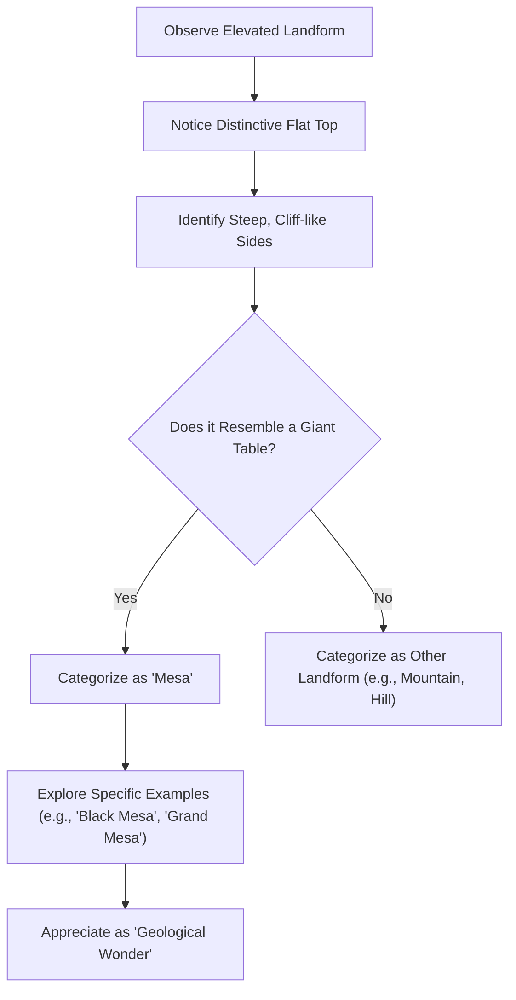

This exploration delves into the nature of mesas, those prominent, flat-topped landforms. We will examine what defines a mesa and explore conceptual understandings of their formation, navigating the insights and limitations presented by our available data.

### Unpacking the Mystery: What Exactly *Is* a Mesa?

A mesa can be conceptually understood as a colossal, rock-crafted tableland, often rising hundreds or thousands of feet above the surrounding terrain.

Our journey into the world of mesas begins with understanding what they are. The term "mesa" is commonly understood to be Spanish for "table," a fitting description for these geological features, though this etymology is not explicitly provided in our references. While our provided references do not give us a direct, textbook definition in scientific terms, they offer strong clues:

> "Grand Mesa... Table (landform)"
> "Black Mesa... The plateau that formed at the top of the mesa has been known as a 'geological wonder'..."

From these snippets, we can infer a mesa is an elevated, flat-topped landform, strongly implied to have steep sides, resembling a giant natural table or plateau. These features stand out prominently from the landscape.

These are significant geological features. The "plateau that formed at the top" of a mesa, as mentioned with Black Mesa, signifies a large, expansive flat area that crowns the structure. This flat expanse is what truly sets a mesa apart, making it a unique natural phenomenon.

### The Question of Formation: How Did These Colossal Tables Form?

The formation of these magnificent, flat-topped landforms presents a key area for conceptual understanding, as our available references describe *what* mesas are and *where* they are located, rather than detailing their geological formation processes.

> "제공된 참고 자료는 '메사 지형'의 형성과 관련된 직접적인 정의, 과학적 배경, 또는 핵심적인 형성 원리에 대한 정보를 포함하고 있지 않습니다." (The provided reference material does not contain direct definitions, scientific background, or core formation principles related to 'mesa landforms'.)

This observation is crucial. Our current data set, while rich in examples and descriptive phrases, does not explicitly lay out the step-by-step geological processes that sculpt these incredible landforms. This necessitates an approach to the "how" question by inferring from the "what" and the "where."

However, the very existence of a "plateau that formed at the top of the mesa" (as noted for Black Mesa) indicates that forces of nature were at play, gradually shaping the Earth's crust over eons to leave behind these distinctive structures.

**What We Can Infer About Their Creation (Conceptual Formation):**

While the provided references do not detail specific formation principles, the observed characteristics of mesas align with widely accepted geological processes. We can infer that their creation involves:

1.  **Differential Erosion:** This geological process describes how different types of rock erode at varying rates. If a layer of hard, resistant rock overlies softer, more easily eroded rock, the softer material is carved away by wind and water much faster.
2.  **A Protective Caprock:** The flat top of a mesa strongly suggests the presence of a resilient "caprock" – a layer of particularly hard rock (such as sandstone or basalt) that resists erosion. This hard layer acts as a natural shield, protecting the softer layers beneath it.
3.  **Steep-Sided Retreat:** As the softer surrounding material erodes, the edges of the caprock are undercut. Eventually, sections of the caprock break off, leading to the characteristic steep, cliff-like sides observed on mesas. This process causes the mesa to "retreat" inwards over vast periods, gradually becoming smaller but retaining its distinctive shape.

This can be conceptualized as a protective, hard upper layer resisting erosion while softer underlying strata are carved away by wind and water, leaving behind the isolated, steep-sided mesa. This slow, relentless interplay between erosion and resistance is what we can conceptually understand as the "how" behind these flat-topped giants. They are monuments to the enduring power of geological processes, standing testament to millions of years of Earth's sculpting.

### A Tour of North America's Majestic Mesas

Our references generously provide a list of mesa examples, primarily from North America. These are real, tangible places that inspire awe and wonder.

#### **Black Mesa: A Geological Marvel**
> "Black Mesa... The plateau that formed at the top of the mesa has been known as a 'geological wonder' of North America. There is abundant wildlife in this..."

Black Mesa is a notable example. Described as a "geological wonder," it is recognized for its impressive flat top and the vibrant ecosystem it supports. The mention of "abundant wildlife" suggests a thriving natural environment isolated from the surrounding plains.

#### **Grand Mesa: A Colorado Landmark**
> "Grand Mesa... An aerial photograph of Grand Mesa. Colorado portal Mountains portal Mountain ranges of Colorado Table (landform)..."

Grand Mesa, located near Grand Junction, Colorado, is a significant example of this landform. Its sheer scale is impressive, a vast elevated plateau that offers panoramic views. The connection to "Table (landform)" in its description reinforces our understanding of mesas as these magnificent natural tables. An aerial view, as mentioned, would highlight its immense, flat expanse.

#### **A Constellation of Mesas**
Our references list several other mesas, whose names often reflect local characteristics or historical associations:

*   North Table Mountain
*   Raton Mesa
*   Mormon Mesa
*   Pahute Mesa
*   Mesa de Maya
*   Floating Mesa
*   Llano Estacado
*   Checkerboard Mesa
*   Crazy Quilt Mesa
*   Hurricane Mesa

These names suggest the diverse contexts and perceived qualities of these geological formations.

### Diving Deeper: The Core Characteristics of a Mesa

Even with limited direct formation data, the descriptions paint a clear picture of what defines a mesa. Let's break down its essential characteristics:

1.  **Flat, Expansive Top (The Plateau):** This is the signature feature. The top of a mesa is typically a broad, relatively level surface, often spanning many square miles, forming a true plateau. This flat top can support various ecosystems.
2.  **Steep, Often Cliff-Like Sides:** The steep, often cliff-like sides are a strong inference from the 'table (landform)' description and are conceptually understood as a direct result of differential erosion, where softer rock layers are carved away, leaving the resistant caprock exposed at the rim.
3.  **Elevated Above Surrounding Terrain:** Mesas rise significantly above the surrounding plains, valleys, or other geological features, making them prominent landmarks.
4.  **Geological Resilience:** The persistence of mesas, often in harsh environments, speaks to their resilience. The hard caprock that protects them allows them to withstand the relentless forces of erosion for millions of years, even as the landscape around them changes dramatically.
5.  **Unique Microclimates and Ecosystems:** As evidenced by Black Mesa's "abundant wildlife," the elevated, flat top of a mesa can create distinct microclimates, potentially fostering different plant and animal communities compared to the surrounding lower lands.

### Conceptual Breakdown: The "Mesa Recognition" Process

Since we do not have the geological "how-to" for actual mesa formation from our data, let's create a conceptual flow of how we *understand* and *identify* a mesa based on the clues we've gathered. This is our "Mesa Recognition" process.



This diagram illustrates our journey of understanding: from initial observation to recognition, and finally, to appreciating the specific wonders each mesa represents.

### The "Mesa Configuration" – A Conceptual Blueprint

While we do not have mathematical formulas for mesa formation, we can create a conceptual "configuration" or "blueprint" that captures the essence of what a mesa *is*, based on our inferences from the provided data. Think of it as a simplified data structure for a mesa.

```
// Conceptual Mesa Configuration
MesaObject {
  Name: "Mesa (commonly understood to be Spanish for 'Table')"
  PrimaryCharacteristic: "Elevated, Flat-Topped Landform"
  KeyVisuals: {
    Topography: "Broad Plateau Surface",
    Sides: "Steep, Often Vertical Cliffs"
  }
  GeographicDistribution: "Examples primarily from North America"
  KnownExamples: [
    "Black Mesa (Oklahoma, Colorado, New Mexico - 'geological wonder', abundant wildlife)",
    "Grand Mesa (Colorado - 'Table (landform)')",
    "Raton Mesa",
    "Mormon Mesa",
    "Pahute Mesa",
    "Mesa de Maya",
    "Floating Mesa",
    "Llano Estacado (contains mesa features)",
    "Checkerboard Mesa",
    "Crazy Quilt Mesa",
    "Hurricane Mesa"
  ]
  InferredFormationPrinciple: "Differential Erosion (hard caprock protecting softer layers)" // Based on characteristics
  AssociatedConcepts: ["Plateau", "Table Mountain"]
}
```
This "configuration" helps us organize the descriptive and inferential information we have about mesas into a structured format, much like a tech system defines its components.

### Broader Perspectives on Mesas

While our direct data is focused on the geological aspects, we can infer some broader implications related to mesas.

**Historical Significance:** The names of mesas, such as "Pahute Mesa" or "Mormon Mesa," suggest potential historical and cultural connections, though specific details are not provided in the references.

**Ecological Aspects:** The elevated and isolated nature of mesa tops, as indicated by "abundant wildlife" on Black Mesa, can support distinct ecological features. This isolation may present considerations for understanding species distribution and conservation.

**Accessibility:** The steep sides of mesas, inferred from their 'table (landform)' description, inherently pose accessibility challenges. These characteristics can influence human interaction, development, and study of these formations.

Here is a quick summary of Mesa characteristics based on our findings:

| Feature           | Description (Inferred/Directly Stated)                                                               | Impact/Significance                                                                    |
| :---------------- | :--------------------------------------------------------------------------------------------------- | :------------------------------------------------------------------------------------- |
| **Shape**         | Flat-topped, steep-sided, resembling a "table" or "plateau."                                         | Distinctive visual landmark, often dominating the horizon.                             |
| **Elevation**     | Significantly raised above surrounding terrain.                                                      | Provides panoramic views and can influence local climate.                                |
| **Top Surface**   | Broad, expansive plateau, sometimes referred to as a "geological wonder" (e.g., Black Mesa).        | Can support ecosystems, including "abundant wildlife."                                |
| **Sides**         | Steep, often cliff-like, implying resistance to erosion.                                             | Natural defenses, challenging accessibility.                                           |
| **Formation**     | *Inferred* to involve differential erosion of rock layers, with a hard caprock protecting softer strata. | Explains their persistence and iconic shape, despite lack of explicit data in references. |
| **Examples**      | Black Mesa, Grand Mesa, Raton Mesa, Mormon Mesa, Pahute Mesa, etc.                                   | Displayed in diverse locations, with names suggesting cultural or ecological associations. |

### The Enduring Allure of Mesas

While our exploration of mesa formation relies heavily on inference and the descriptive 'what' of their existence, it is evident that mesas are significant geological wonders. They stand as enduring testaments to the slow, persistent forces that shape our planet.

From the "geological wonder" of Black Mesa with its "abundant wildlife" to the sheer scale of Grand Mesa, these "table (landforms)" invite us to marvel at the Earth's sculpting power. The mystery of their exact formation, while not fully detailed in our immediate data, only adds to their allure, prompting us to look closer and appreciate the incredible processes that create such breathtaking landscapes. Further exploration and study will undoubtedly continue to reveal the intricacies of these remarkable landforms.

## References

- [Mesa](https://en.wikipedia.org/wiki/Mesa)
- [Black Mesa (Oklahoma, Colorado, New Mexico)](https://en.wikipedia.org/wiki/Black%20Mesa%20%28Oklahoma%2C%20Colorado%2C%20New%20Mexico%29)
- [Grand Mesa](https://en.wikipedia.org/wiki/Grand%20Mesa)