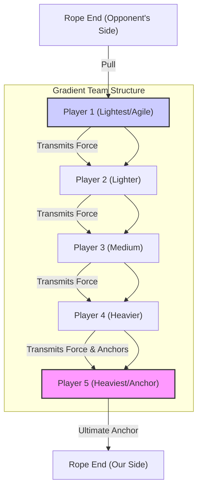

Hey there, fellow curious minds and aspiring champions! 🎯 Ever found yourself watching a fierce tug-of-war match, maybe at a school sports day or a company picnic, and wondered about the strategy behind it? It looks simple enough: grab a rope, pull hard, right? But beneath that raw display of strength often lies a fascinating interplay of physics, teamwork, and subtle strategy.

Today, we’re delving into one of the most frequently discussed tactical questions in tug-of-war: **Where should the heaviest people on your team stand? Should they be at the front, anchoring the initial pull, or tucked away at the back, providing a solid foundation?** It’s a question that often pits intuition against theoretical principles, and the common understanding might offer intriguing insights. 💡

We're going to unpack the forces at play, explore the science of stability, and even whip up a little conceptual "code" to visualize the impact of player placement. Get ready to consider how to level up your tug-of-war game from backyard brawler to strategic mastermind!

### The Physics Playground: Understanding Force and Friction

To consider strategic player placement, it is helpful to understand the fundamental forces often discussed in the context of tug-of-war. It is often suggested that success in tug-of-war involves effectively applying, maintaining, and counteracting forces.

#### Force: The Push and Pull of Victory

At its heart, tug-of-war is a battle of **net force**. Each team applies a pulling force on the rope, and the team that generates a greater sustained force in their direction wins. This force originates from the players pushing their feet against the ground.

#### Friction: The Unsung Hero of the Ground Game

The ability to push against the ground and translate that into pulling force on the rope is entirely dependent on **friction**. Think of friction as the grip you have on the ground. Without it, players would likely slip and slide, regardless of their strength.

There are two main types of friction relevant here:
*   **Static Friction:** This is the friction that prevents an object from moving when a force is applied. In tug-of-war, this is what is believed to keep feet from slipping when digging in and pulling. It is generally considered stronger than kinetic friction.
*   **Kinetic Friction:** This is the friction that acts on an object *in motion*. If feet start to slide, players are dealing with kinetic friction, which is often harder to use for generating effective pulling force.

The maximum static friction a player can generate is generally understood to be directly proportional to two things:
1.  **The Coefficient of Static Friction (μ_s):** This term refers to how "grippy" the surface is (e.g., grass, dirt, concrete) and how grippy the shoes are.
2.  **The Normal Force (N):** This is the force perpendicular to the surface, essentially how hard players are pushing *down* into the ground. In many scenarios, an individual's **weight** is a significant contributor to normal force.

Here's the key formula:
`F_friction_max = μ_s * N`

Given that `N` is often influenced by `mass * gravity`, a heavier person is theorized to have the potential to generate more normal force and thus, more maximum static friction. This principle suggests why weight is often considered a critical factor in tug-of-war, as it can enable players to "dig in" with greater resistance against slipping. Imagine trying to push a heavy box versus a light box across a floor – the heavy box requires more force to get moving because it has more friction.

> It is often remarked that in tug-of-war, friction is a crucial ally. The ability to succeed is often considered to depend not just on pulling strength, but on effectively maximizing grip on the ground through friction to resist being pulled.

### The Team as a System: Center of Mass and Stability

While individual strength and friction are considered vital, a tug-of-war team can be viewed as a single, interconnected system. The overall stability and effectiveness of this system are often theorized to be heavily influenced by its **Center of Mass (CoM)**.

#### What is the Center of Mass?

Imagine a point where all the mass of an object (or in our case, a team of people) appears to be concentrated. That's the center of mass. For a stable structure, a lower CoM is generally desired. Think of a racing car – it's built low to the ground for stability at high speeds.

In tug-of-war, a lower and more rearward CoM for a team is often theorized to provide greater stability against being pulled forward. When a team is pulling, players are effectively leaning back, trying to shift their CoM away from the opponent. This configuration is believed to create a larger "base" of support, potentially making it harder for an opposing team to overcome inertia and pull the CoM over the central line.

#### How Body Posture Affects CoM

Individual players contribute to the team's CoM through their stance. Leaning back, bending the knees, and keeping hips low are all techniques that are thought to help lower an individual's CoM and shift it rearward, potentially maximizing their effective pulling angle and resistance to being pulled forward. When a whole team adopts this posture, their collective CoM is often considered a powerful asset for stability.

### The Great Debate: Heavyweights – Front, Middle, or Back?

Now, let's tackle the frequently discussed question: Where do the heavyweights go?

#### Option A: Heavy at the Front (The "Spearhead" Strategy)

Some might argue that putting the heaviest, strongest players at the very front makes sense. They might initiate a powerful pull, potentially creating an immediate advantage and catching the opponent off guard.

*   **Pros:**
    *   **Potential for Immediate Force Application:** The strongest pullers are directly engaging the opponent.
    *   **Perceived Psychological Impact:** A strong, early pull might demoralize the other team.
    *   **Direct "Feel" of the Opponent:** Front players might react quickly to the opponent's movements.
*   **Cons:**
    *   **Higher Team CoM:** If the heavy players are at the front and leaning back, the overall team's center of mass is theorized to be higher and more forward than ideal, potentially making the entire team less stable.
    *   **Increased Risk of Slippage:** If a front player loses footing, the sudden break in tension could ripple through the team, potentially causing a cascade of slips.
    *   **Less Anchoring Effect:** A single heavy person at the front, even if strong, might not provide the overall *team* stability of an anchor at the back.

#### Option B: Heavy at the Back (The "Anchor" Strategy)

This is frequently adopted as a strategy in competitive tug-of-war, often based on specific theoretical advantages. Placing the heaviest and often strongest person at the very end of the rope, known as the "anchor," is believed to provide a stable foundation for the entire team.

*   **Pros:**
    *   **Maximized Team Stability:** The anchor's weight is considered to contribute significantly to lowering the overall team's CoM, theoretically making it much harder for the opposing team to pull the entire system forward.
    *   **Consistent Force Generation:** The anchor is believed to be able to dig in and maintain a powerful, steady pull without being easily dislodged. Their mass is thought to increase the *effective* mass of the entire system resisting movement.
    *   **Ripple Effect of Strength:** The anchor's pull is theorized to be transmitted through the entire team, potentially pulling everyone *into* their stance, rather than pulling them *out* of it.
    *   **Safety Net:** If a player in the middle or front starts to slip, the anchor is considered to provide a strong, stable base for recovery.
*   **Cons:**
    *   **Less Direct Initial Pull:** The anchor's force is not immediately "at the front line" of the tug.
    *   **Reliance on Others:** The anchor relies on the players in front of them to effectively transmit their force to the rope and hold their ground.

#### Option C: The "Pyramid" or "Gradient" (A Frequently Proposed Strategy)

In many competitive tug-of-war contexts, a nuanced combination, often referred to as a "pyramid" or "gradient" approach, is frequently proposed as a highly effective strategy.

This approach suggests placing the **heaviest and strongest player at the very back (the anchor position)**. Then, the **next heaviest players are placed directly in front of the anchor**, and so on, with the **lightest (but often most agile and reactive) players at the front** of the rope.

**Why this approach is theorized to be effective:**
*   **Combines Stability and Power:** The anchor is believed to provide the crucial low CoM and maximum friction for the entire team.
*   **Distributed Strength:** The heavier players further up the chain are still considered to contribute significant pulling power and friction, reinforcing the line.
*   **Front-Line Agility:** Lighter players at the front can be more responsive to the opponent's movements, adjusting their stance and pull, and quickly communicating changes to the team. They are often viewed as the "eyes and ears" and initial point of contact.
*   **Consistent Force Transmission:** This arrangement is theorized to ensure that the force generated by the anchor and subsequent heavy players is efficiently transmitted along the rope, creating a unified, powerful pull.

Here's a visual representation of this proposed team structure:



### Unpacking the Mechanics: Leverage and Body Posture

Beyond just weight and position, individual technique is often considered to play a significant role in maximizing the team's effectiveness. It's not just about being heavy; it's about using that weight intelligently.

*   **Low Hips and Leaning Back:** Every player is often advised to aim to keep their hips as low as possible and lean back significantly. This configuration is thought to shift their individual CoM backward and downward, potentially increasing stability and allowing them to use their body weight more effectively against the pull. It's akin to bracing oneself against a wall – leaning into it to use body weight.
*   **Leg Drive:** The pulling force is understood to originate not just from arms and back, but primarily from legs driving into the ground, pushing *away* from the opponent. Strong leg drive is believed to maximize the normal force and thus the friction that can be generated.
*   **Rope Angle:** The rope should ideally be low, close to the ground, and pulled in a relatively straight line. A high rope angle is theorized to lift players, potentially reducing their effective normal force and making them more prone to slipping.

### Simulating the Strategy: A Pythonic Tug-of-War Model

To explore the theoretical impact of weight distribution, let's consider a simplified conceptual model using Python. We can simulate a team's collective center of mass and total potential friction.

Imagine a team of 5 players. For simplicity, we'll assume they are equally spaced along the rope, and their individual CoM is at their feet when leaning back. We'll assign a weight to each player and calculate the team's overall CoM and maximum potential friction.

```python
import numpy as np

# --- Configuration for our Tug-of-War Team ---
# Assume each player occupies 1 meter of rope length for position calculation
# Position 0 is the front (closest to opponent), increasing towards the back.
# We'll use metric for weights (kg) and positions (meters)

def calculate_team_metrics(player_weights_kg):
    """
    Calculates the team's collective center of mass (CoM) and total maximum friction.
    Assumes players are equally spaced 1 meter apart, with the first player at position 0.
    """
    num_players = len(player_weights_kg)
    player_positions_m = np.arange(num_players)  # 0, 1, 2, ... (front to back)

    # Calculate total team mass
    total_mass_kg = sum(player_weights_kg)

    # Calculate collective Center of Mass (CoM)
    # CoM = (sum of (mass * position)) / total_mass
    com_numerator = sum(w * p for w, p in zip(player_weights_kg, player_positions_m))
    team_com_m = com_numerator / total_mass_kg if total_mass_kg > 0 else 0

    # Calculate total maximum friction
    # F_friction_max = mu_s * N = mu_s * (total_mass * g)
    # Let's assume a coefficient of static friction (mu_s) of 0.8 for good shoes on grass
    # And gravity (g) of 9.81 m/s^2
    mu_s = 0.8
    g = 9.81 # m/s^2
    total_max_friction_N = mu_s * (total_mass_kg * g)

    return total_mass_kg, team_com_m, total_max_friction_N

print("--- Tug-of-War Team Strategy Simulator (Conceptual Model) ---")
print("\nScenario 1: Heavy at the Front")
# Example: 5 players, weights (kg) - Heaviest at front
# Player 1 (front): 90kg, Player 2: 80kg, Player 3: 75kg, Player 4: 70kg, Player 5 (back): 65kg
team_weights_front_heavy = [90, 80, 75, 70, 65]
total_mass_1, com_1, friction_1 = calculate_team_metrics(team_weights_front_heavy)
print(f"  Team Weights (front to back): {team_weights_front_heavy} kg")
print(f"  Total Team Mass: {total_mass_1:.2f} kg")
print(f"  Collective Center of Mass (from front): {com_1:.2f} meters")
print(f"  Total Max Static Friction: {friction_1:.2f} Newtons")

print("\nScenario 2: Heavy at the Back (Anchor Strategy)")
# Example: 5 players, weights (kg) - Heaviest at back
# Player 1 (front): 65kg, Player 2: 70kg, Player 3: 75kg, Player 4: 80kg, Player 5 (back/anchor): 90kg
team_weights_back_heavy = [65, 70, 75, 80, 90]
total_mass_2, com_2, friction_2 = calculate_team_metrics(team_weights_back_heavy)
print(f"  Team Weights (front to back): {team_weights_back_heavy} kg")
print(f"  Total Team Mass: {total_mass_2:.2f} kg")
print(f"  Collective Center of Mass (from front): {com_2:.2f} meters")
print(f"  Total Max Static Friction: {friction_2:.2f} Newtons")

print("\n--- Analysis ---")
print(f"Both scenarios have the same total mass ({total_mass_1} kg), so their total maximum friction is identical ({friction_1:.2f} N).")
print(f"However, notice the Center of Mass (CoM):")
print(f"  - Heavy at Front CoM: {com_1:.2f} meters from the front.")
print(f"  - Heavy at Back CoM: {com_2:.2f} meters from the front.")
print(f"A higher CoM value (further back from the front) indicates a more rearward-shifted collective mass, which is generally theorized to provide better stability against being pulled forward.")
print(f"In this simulation, the 'Heavy at the Back' strategy results in a CoM {com_2 - com_1:.2f} meters further back, suggesting the team could be inherently more stable and harder to dislodge.")
```

This simple simulation highlights a conceptual point: while the *total* maximum friction for the team remains the same if the total mass is constant, the **distribution of that mass is shown to significantly impact the team's collective center of mass within this model.** A CoM further back from the 'front line' (i.e., a higher numerical value in our simulation) is theorized to make the team more effectively anchored and stable. This configuration is often considered to make it harder for an opposing team to overcome the inertia and pull the entire system across the line.

### Historical Context and Modern Approaches

Tug-of-war is widely understood to be an ancient sport. In many competitive settings, rules are in place that suggest the importance of strategy and technique. Teams often compete in various weight categories, where weight distribution *within* the team is considered particularly critical when all teams have similar total mass. Rules often dictate rope diameter, length, and even player grip techniques.

The development of the sport has often involved an exploration of effective strategies, balancing individual strength, collective stability, and synchronized effort. A common discussion point is the trade-off between maximizing immediate pulling power (which a front-heavy strategy might be proposed to offer) and maximizing sustained resistance and stability (which a back-heavy or pyramid strategy is theorized to provide). Theoretical considerations often suggest the latter as a highly effective approach.

### Strategic Blueprint: Comparing Weight Distribution

Let's summarize the proposed pros and cons of different weight distribution strategies in a handy table:

| Strategy                 | Key Characteristics                                 | Pros                                                                    | Cons                                                                                                | Theoretical Application                                                   |
| :----------------------- | :-------------------------------------------------- | :---------------------------------------------------------------------- | :-------------------------------------------------------------------------------------------------- | :---------------------------------------------------------------------------- |
| **Heavy at the Front**   | Strongest/heaviest players first.                   | Potential for strong initial pull; perceived psychological advantage.   | Theorized higher collective CoM; potentially less stable; higher risk if front player slips.        | Quick, short pulls; less emphasis on sustained resistance.                    |
| **Heavy at the Back**    | Strongest/heaviest player (anchor) at the very end. | Theorized low collective CoM; maximum stability; strong anchor for the whole team. | Less direct initial "punch" from the strongest players; reliance on front players holding.             | Maximizing defensive stability and sustained pulling power.                   |
| **Pyramid/Gradient**     | Heaviest at back, gradually lighter towards front.  | Optimal balance of stability (CoM) and distributed pulling power is theorized.       | Requires good communication and synchronized effort across all players.                             | Most competitive scenarios; balancing offense and defense.                    |
| **Even Distribution**    | Weights spread out somewhat evenly.                 | Balanced strength throughout the rope is expected.                                  | No distinct anchor advantage; CoM might be too central, potentially reducing stability.                         | Casual games where specific strategy isn't prioritized.                       |

### The Final Pull: Key Insights and Takeaways

To address the initial question based on theoretical considerations: **In tug-of-war, it is often proposed that the heaviest people should generally go at the back of the rope, forming what is considered a strong anchor, with a gradient of lighter players towards the front.** This "pyramid" or "gradient" approach is theorized to leverage physics principles to enhance stability and sustained pulling power.

> It is often suggested that success in tug-of-war involves not just raw pulling strength, but also an understanding of the physics of friction and stability, and the strategic use of a team's mass to create a resistant anchor.

It serves as an intriguing example of how even seemingly simple physical contests can be analyzed through scientific principles. From the coefficient of friction under your shoes to the collective center of mass of your team, every detail is often considered to matter. Applying these concepts is often considered to allow for a more strategic approach than brute force alone.

Next time you're on a tug-of-war team, remember this deep dive into physics. Organize your team, communicate your strategy, and dig in with confidence. You'll not only pull harder, but you'll pull smarter! 💪 Let the games begin!