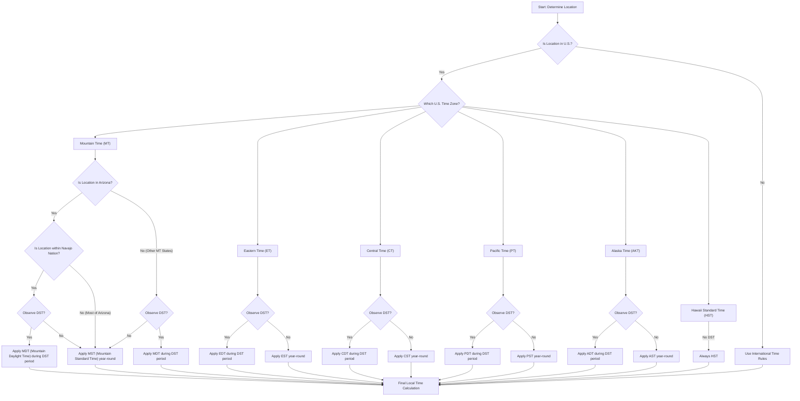

## Mastering Time Zones: A Deep Dive into the U.S. System

Ever found yourself scratching your head trying to figure out the local time in a different part of the United States? You're not alone! The U.S. time zone system, especially with the added layer of Daylight Saving Time (DST), can feel like a labyrinth. It’s not just a matter of "go west, lose an hour"; there are fascinating historical reasons, practical considerations, and even unique local exceptions that make it a truly complex, yet intriguing, topic.

As a professional tech blogger, I often delve into the complexities of systems and their interactions. The U.S. time zone system is a prime example of a distributed system with fascinating edge cases!

### I. The Foundation: Understanding U.S. Time Zones

The contiguous United States is divided into four primary time zones:
*   **Eastern Time (ET)**
*   **Central Time (CT)**
*   **Mountain Time (MT)**
*   **Pacific Time (PT)**

Beyond these, Alaska has its own **Alaska Time (AKT)**, and Hawaii observes **Hawaii Standard Time (HST)**. Each time zone generally represents a one-hour difference from its neighbor, with ET being the earliest and PT the latest. This system was largely established to standardize railroad schedules in the late 19th century, replacing a chaotic patchwork of local solar times.

> "Standardized time zones were a revolutionary step, transforming travel, commerce, and communication across vast distances in the United States."

These zones are typically defined by meridians of longitude, ensuring that noon generally aligns with the sun being at its highest point in the sky within that region. This is where Daylight Saving Time enters the picture.

### II. Diving into Daylight Saving Time (DST): Why We "Spring Forward"

Daylight Saving Time, often referred to as "Daylight Time" in the U.S. and Canada, or "Summer Time" in the UK and Europe, is the practice of advancing clocks by one hour during warmer months so that evening daylight lasts an hour longer, while sacrificing an hour of morning daylight.

#### A. The Historical Roots and Rationale

The concept isn't new. While Benjamin Franklin famously mused about it in a satirical essay in 1784 (suggesting Parisians could save candles by waking earlier), the modern push for DST truly began in the early 20th century.

*   **World War I & Energy Conservation:** Germany was the first country to widely implement DST in 1916 as a wartime measure to conserve coal and electricity. The idea was simple: if daylight extends further into the evening, people would use less artificial lighting, thus saving energy resources for the war effort. Other European nations and the United States soon followed suit.
*   **Post-War Adoption & Standardization:** While the U.S. experimented with DST during both World Wars, it wasn't uniformly adopted nationwide until the **Uniform Time Act of 1966**. This act standardized the start and end dates for DST across the country, aiming to avoid the confusing mishmash of local observances that had cropped up.
*   **Beyond Energy:** Over time, other perceived benefits emerged:
    *   **Extended Evening Recreation:** More daylight in the evenings means more time for outdoor activities, sports, and leisure after work or school.
    *   **Economic Boost:** Retailers and service industries often report increased sales when people have more daylight hours to shop or engage in recreational spending.
    *   **Reduced Crime:** Some studies suggest a slight decrease in crime rates during DST evenings due to increased visibility.

#### B. The Mechanics of DST

The process is straightforward:
*   **"Spring Forward":** On the second Sunday in March, clocks are moved forward by one hour. This effectively shifts an hour of morning daylight to the evening. For example, 2:00 AM becomes 3:00 AM.
*   **"Fall Back":** On the first Sunday in November, clocks are moved back by one hour, returning to standard time. 2:00 AM becomes 1:00 AM, giving many people an extra hour of sleep (or an extra hour of Saturday night fun!).

This annual ritual means that for most of the year, the U.S. observes **Daylight Time** (e.g., Eastern Daylight Time, EDT), and for a shorter period in winter, it reverts to **Standard Time** (e.g., Eastern Standard Time, EST).

### III. The U.S. Time Landscape: Exceptions to the Rule

While most of the U.S. observes DST, there are notable exceptions that add layers of complexity. The most prominent are Hawaii and, famously, most of Arizona.

#### A. The Arizona Anomaly: A State Apart

Arizona presents one of the most unique time zone situations in the continental U.S.

*   **General Rule:** The entire state of Arizona officially observes **Mountain Standard Time (MST)** year-round. This means that, unlike its neighbors in the Mountain Time Zone, it *does not* observe Daylight Saving Time.
*   **The "Why" Behind No DST in Arizona:** The primary reason is the intense summer heat. Arizona summers are notoriously scorching. Applying DST would mean that the sun would set an hour *later*, pushing the hottest part of the day even further into the evening. This would increase air conditioning usage, directly counteracting DST's original energy-saving purpose. Imagine the sun beating down at 8 or 9 PM in July! By sticking to standard time, Arizona ensures that the sun sets earlier, allowing temperatures to drop sooner in the evening. This decision was made in 1968 and has remained in place since.

> "For most of Arizona, the choice to forgo DST is a practical adaptation to its extreme climate, prioritizing comfort and potentially reducing energy strain during peak heat."

#### B. The Navajo Nation: An Exception Within the Exception

Now, here's where it gets truly fascinating. Within the boundaries of Arizona lies a significant portion of the **Navajo Nation**, the largest Native American reservation in the United States. And the Navajo Nation *does* observe Daylight Saving Time!

*   **Why the Navajo Nation Observes DST:** The Navajo Nation spans across Arizona, New Mexico, and Utah. New Mexico and Utah both observe DST. To maintain consistent timekeeping for tribal administration, commerce, and communication across its vast territory, the Navajo Nation opted to observe DST along with its surrounding states. This simplifies coordination for a government and community whose operations frequently cross state lines.
*   **The Practical Impact:** This creates a peculiar situation. For roughly half the year (during DST), if you drive from a non-Navajo part of Arizona into the Navajo Nation, you effectively "spring forward" an hour. Then, when you leave the Navajo Nation back into Arizona, you "fall back" an hour. During the winter months, when DST is not observed anywhere, the time is consistent across Arizona and the Navajo Nation.

To illustrate, consider this during the summer months (March to November):
*   **Phoenix (Arizona):** 3:00 PM MST
*   **Flagstaff (Arizona):** 3:00 PM MST
*   **Window Rock (Navajo Nation, Arizona):** 4:00 PM MDT (Mountain Daylight Time)

This unique arrangement means that time can literally change as you cross an invisible line within the same geographical state, making travel and scheduling a fun challenge!

#### C. Other Exceptions: Hawaii

Hawaii also does not observe Daylight Saving Time. Its proximity to the equator means that the length of daylight hours doesn't vary significantly between summer and winter, negating the primary benefit of DST. As such, Hawaii observes Hawaii Standard Time (HST) year-round.

### IV. Conceptual Breakdown: Navigating U.S. Time Zones and DST

To understand the logic, let's break down the decision process a system (or a person!) might use to determine the correct local time.

### V. DST: The Ongoing Debate and Trade-offs

Despite its long history, Daylight Saving Time remains a subject of considerable debate. While proponents cite energy savings (though modern studies are mixed on this), increased safety, and economic benefits, critics point to various downsides.

| Feature / Aspect | Arguments for DST | Arguments Against DST |
| :---------------- | :----------------------------------------------------------------------------------------------------------------------------------------------------------------------------------------------------------------------------------------------------------------------------------------------------------------------------------------------------------------------------------------------------------------------------------------------------------------------------------------------------------------------------------------------------------------------------------------------------------------------------------------------------------------------------------------------------------------------------------------------------------------------------------------------------------------------------------------------------------------------------------------------------------------------------------------------------------------------------------------------------------------------------------------------------------------------------------------------------------------------------------------------------------------------------------------------------------------------------------------------------------------------------------------------------------------------------------------------------------------------------------------------------------------------------------------------------------------------------------------------------------------------------------------------------------------------------------------------------------------------------------------------------------------------------------------------------------------------------------------------------------------------------------------------------------------------------------------------------------------------------------------------------------------------------------------------------------------------------------------------------------------------------------------------------------------------------------------------------------------------------------------------------------------------------------------------------------------------------------------------------------------------------------------------------------------------------------------------------------------------------------------------------------------------------------------------------------------------------------------------------------------------------------------------------------------------------------------------------------------------------------------------------------------------------------------------------------------------------------------------------------------------------------------------------------------------------------------------------------------------------------------------------------------------------------------------------------------------------------------------------------------------------------------------------------------------------------------------------------------------------------------------------------------------------------------------------------------------------------------------------------------------------------------------------------------------------------------------------------------------------------------------------------------------------------------------------------------------------------------------------------------------------------------------------------------------------------------------------------------------------------------------------------------------------------------------------------------------------------------------------------------------------------------------------------------------------------------------------------------------------------------------------------------------------------------------------------------------------------------------------------------------------------------------------------------------------------------------------------------------------------------------------------------------------------------------------------------------------------------------------------------------------------------------------------------------------------------------------------------------------------------------------------------------------------------------------------------------------------------------------------------------------------------------------------------------------------------------------------------------------------------------------------------------------------------------------------------------------------------------------------------------------------------------------------------------------------------------------------------------------------------------------------------------------------------------------------------------------------------------------------------