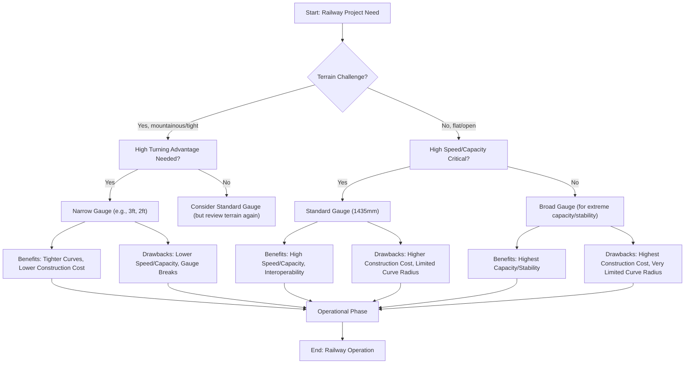

Hey there, fellow tech enthusiasts and curious minds! 👋 Have you ever stood by a railway track, watching a massive train thunder by, and wondered about the magic that keeps it on those two seemingly simple steel lines? Or perhaps you've seen old photos of quaint, tiny trains winding through impossibly steep mountains? Today, we're diving deep into a fascinating corner of railway engineering: **narrow gauge railways** and their surprising superpower – their incredible turning advantages! 🎯

You might think "a train is a train," but the distance between those rails, known as the `track gauge`, makes a world of difference. Most of the world's mainlines run on `standard gauge`, which is 1,435 mm (or 4 ft 8+1⁄2 in). But what happens when you make that distance *narrower*? That, my friends, is where the narrow gauge comes in, and trust me, it's a story packed with clever engineering and historical grit.

## What in the World is "Narrow Gauge"?

Let's start with the basics. A `narrow-gauge railway` is simply a railway where the distance between the two rails is **less than** the standard 1,435 mm (4 ft 8+1⁄2 in). Think of it like a compact car compared to a full-sized sedan – same purpose, different dimensions.

> "A narrow-gauge railway (narrow-gauge railroad in the US) is a railway with a track gauge (distance between the rails) narrower than 1,435 mm (4 ft 8+1⁄2 in)" — Wikipedia

These railways come in all sorts of "narrow" sizes. For instance, the historic **Uintah Railway** in Utah and Colorado, built to haul Gilsonite (a natural asphalt-like substance), used a 3 ft (914 mm) gauge. The **Cincinnati, Lebanon and Northern Railway** also started as a 3 ft narrow gauge line (originally the Miami Valley Narrow Gauge Railway). Even more extreme, the **Chicago Tunnel Company** operated a 2 ft (610 mm) narrow-gauge freight tunnel network right under downtown Chicago! Imagine trains zipping through tiny tunnels beneath a bustling city – talk about a hidden world! 💡

So, why would anyone choose a narrower gauge? That brings us to their prime advantage, especially when the going gets tough.

## The Turning Triumph: How Narrow Gauge Bends the Rules

This is where the rubber (or rather, the steel wheel) meets the road – or the rail, in this case! The most significant, often game-changing, advantage of narrow gauge railways is their ability to **navigate much tighter curves** than their standard or broad gauge counterparts. Why is this such a big deal, and how does it work? Let's break it down.

### Analogy Time: The Skateboard vs. The Limousine

Imagine trying to make a sharp U-turn in a long limousine. It's tough, right? You need a huge amount of space. Now, try the same U-turn on a skateboard. Much easier, much tighter!

The principle is similar for trains. A standard or broad gauge train, with its wider stance and often longer rolling stock (locomotives and wagons), is like that limousine. It needs a much larger radius to turn safely and efficiently. A narrow gauge train, being "skinnier" and often having shorter wagons, is more like the skateboard.

### The Engineering Deep Dive: Why Tighter Curves are Possible

Let's get a little more technical, but don't worry, we'll keep it friendly! 🔧

1.  **Reduced Gauge and Wheelbase Rigidity:**
    *   **Gauge:** The fixed distance between the wheels on an axle.
    *   **Wheelbase:** The distance between the front and rear axles of a single piece of rolling stock (like a wagon or locomotive).
    On a curve, the outer wheel travels a slightly longer path than the inner wheel. On a standard gauge, this difference is quite significant. Train wheels aren't like car wheels that can spin independently; they're usually fixed to an axle. To handle curves, train wheels have `flanges` (the inner lip that keeps the wheel on the track) and a `conical tread` (the slight taper on the wheel surface).
    With a narrower gauge, the difference in the path length for the inner and outer wheels on a curve is *smaller*. This means less stress, less friction, and less slippage between the wheels and the rails. This inherent flexibility allows the train to "bend" around sharper corners without the wheels binding up or risking derailment.

2.  **Smaller Minimum Curve Radius:**
    Every railway track has a `minimum curve radius` (the smallest curve it can safely handle). This radius is fundamentally limited by the track gauge and the design of the rolling stock.
    Think of it this way: a wider gauge means the train occupies more lateral space. To turn, this wider "footprint" needs more room to swing around. A narrower gauge naturally has a smaller footprint, allowing it to pivot around a much tighter central point.
    Mathematically, while complex formulas exist, a simplified way to understand it is that the minimum curve radius (R) is directly proportional to the track gauge (G) and the wheelbase (L) of the rolling stock. When G is smaller, R can also be significantly smaller.

    > **Conceptual Breakdown of Curve Mechanics:**
    > When a train enters a curve, several forces come into play:
    > 1.  **Centrifugal Force:** Tries to push the train outwards, away from the center of the curve.
    > 2.  **Lateral Force:** The wheels' flanges press against the outer rail to guide the train.
    > 3.  **Friction:** Between the wheels and the rails, especially due to the difference in path length mentioned above.
    >
    > On a narrow gauge, because the `gauge` (G) is smaller, and often the `wheelbase` (L) of individual cars is also designed to be shorter, the overall **moment of inertia** (resistance to turning) for the rolling stock is reduced. This allows the train to overcome the lateral forces and friction more easily, enabling it to maintain stability on a much tighter curve.

3.  **Easier `Super-elevation` (Banking):**
    On curves, railway tracks are often `super-elevated` or `banked` – meaning the outer rail is slightly higher than the inner rail. This helps counteract the centrifugal force, much like a banked turn on a race track.
    Narrow gauge trains, being lighter and often having a lower center of gravity, can often handle steeper super-elevation more easily. This extra banking further enhances their ability to take sharp turns smoothly and safely at appropriate speeds.

## Where Narrow Gauge Shines: Historical Context and Use Cases

These turning advantages aren't just theoretical; they have profound practical implications that shaped history and continue to serve specific niches today.

### Conquering Challenging Terrain

This is arguably the biggest reason narrow gauge lines were built in the first place. Imagine trying to lay straight or gently curving track through rugged mountains, dense forests, or deep valleys. It's incredibly expensive and often impossible with standard gauge.

*   **Mountainous Regions:** The **Rocky Mountains** in the United States saw a significant narrow-gauge system develop precisely because of this. Building standard gauge lines would have required massive tunnels, huge bridges, and extensive earthworks, making projects prohibitively expensive or technically impossible. Narrow gauge allowed engineers to follow the contours of the land, winding around hillsides and through narrow passes with much less infrastructure. The **Uintah Railway**, mentioned earlier, is a perfect example, traversing difficult terrain to reach valuable Gilsonite deposits.

*   **Industrial and Plantation Railways:** Many industrial operations, like `mine railways` or lines serving `sugar cane` and `banana plantations`, adopted narrow gauge. These areas often require tracks to be laid quickly, cheaply, and through difficult or confined spaces.
    > "Sugar cane and banana plantations are mostly served by narrow-gauge." — Wikipedia
    The ability to lay tracks with tight curves, often temporary ones, made narrow gauge the ideal choice. It was often a decision "not between a narrow-gauge railway and a standard-gauge railway, but between a narrow-gauge railway and none at all."

*   **Urban Logistics:** The **Chicago Tunnel Company** is a brilliant example of narrow gauge innovation in an urban setting. Their 2 ft (610 mm) gauge railway network allowed them to build tunnels deep underground, navigating the complex foundations of city buildings and utilities, delivering coal, parcels, and removing ash without disrupting street traffic. This simply wouldn't have been feasible with standard gauge.

### Cost-Effectiveness and Construction Advantages

Beyond just turning, narrow gauge offers significant economic benefits:

*   **Reduced Construction Costs:**
    *   **Less Earthwork:** As they can follow terrain more closely, less cutting through hills and less building up embankments is required.
    *   **Lighter Materials:** Rails can be lighter, sleepers (ties) shorter, and bridges less robust, all contributing to lower material costs.
    *   **Smaller Tunnels and Bridges:** Tighter curves mean shorter tunnels and smaller bridge spans if they need to navigate obstacles.
*   **Easier Maintenance:** Lighter rolling stock and track components can sometimes mean simpler maintenance procedures and equipment.

### Historical Footprint

The **British narrow-gauge railways** are another testament to their versatility, ranging from large common carriers to small, short-lived industrial lines. They were instrumental in developing industries and connecting communities in areas where standard gauge was impractical.

## The Trade-Offs: It's Not Always a Smooth Ride

While narrow gauge offers fantastic turning advantages and cost benefits in specific scenarios, it's essential to understand its limitations. No engineering solution is perfect for every situation!

Here's a quick look at the trade-offs:

*   **Lower Speeds:** Generally, narrow gauge trains are slower than standard gauge. The lighter track, smaller rolling stock, and often sharper curves limit the maximum safe operating speed.
*   **Reduced Capacity:** Narrower wagons mean less space for cargo or passengers. This translates to lower tonnage per train or fewer people per carriage. For high-volume, long-distance transport, this can be a significant drawback.
*   **Stability Concerns:** While fine at lower speeds, narrow gauge trains can be less stable at higher speeds, especially if carrying tall or top-heavy loads. The narrower base makes them more susceptible to overturning if the center of gravity is too high.
*   **Interoperability Issues (`Gauge Breaks`):** This is a big one. If a narrow gauge line meets a standard gauge line, cargo often has to be physically transferred from one train to another (`transshipment`). This `gauge break` is time-consuming, labor-intensive, and adds to transportation costs, which is why standard gauge became dominant for interconnected national networks.

## Visualizing the Decision: When to Go Narrow

To summarize, here's a conceptual flow of how one might decide on a track gauge, especially considering the turning advantages of narrow gauge.

*   *Note: While broad gauge (wider than standard) offers benefits like higher capacity and stability, it sacrifices turning ability even more than standard gauge, making it unsuitable for challenging terrain.*

## Narrow Gauge vs. Standard Gauge: A Quick Comparison

Let's put it all into a neat table for easy reference!

| Feature                  | Narrow Gauge (e.g., 2ft, 3ft)                                 | Standard Gauge (1435 mm)                                              |
| :----------------------- | :------------------------------------------------------------ | :-------------------------------------------------------------------- |
| **Track Gauge**          | < 1435 mm (e.g., 610 mm, 914 mm)                             | 1435 mm (4 ft 8+1⁄2 in)                                               |
| **Turning Radius**       | **Significantly tighter curves possible**                     | Requires larger curve radii                                           |
| **Terrain Suitability**  | Excellent for mountainous, rugged, or confined areas          | Best for flat to moderately challenging terrain                       |
| **Construction Cost**    | Generally lower (less earthwork, lighter materials)           | Generally higher (more earthwork, heavier materials)                  |
| **Speed**                | Lower max speeds                                              | Higher max speeds (suitable for high-speed rail)                      |
| **Capacity**             | Lower (smaller rolling stock, less tonnage)                   | Higher (larger rolling stock, more tonnage)                           |
| **Stability**            | Potentially less stable at high speeds or with tall loads     | More stable at higher speeds                                          |
| **Interoperability**     | Poor (requires transshipment at gauge breaks)                 | Excellent (dominant global standard)                                  |
| **Typical Applications** | Mining, logging, plantations, industrial, mountain lines, urban tunnels | Mainline passenger & freight, national networks, high-speed rail |

## The Enduring Legacy

So, the next time you hear about a charming little railway winding its way through a picturesque landscape, or stumble upon the history of an old industrial line, you'll know the secret behind its existence. Narrow gauge railways, with their remarkable turning advantages, weren't just a quirky choice; they were often the only practical, affordable, or even possible solution for connecting people and resources in challenging environments.

They remind us that sometimes, being a little "smaller" can give you a powerful edge, allowing you to navigate the world with a flexibility that bigger, broader systems simply can't match. It's a testament to human ingenuity and the enduring power of specialized engineering solutions! 🚂💨

---

## References

- [Track gauge](https://en.wikipedia.org/wiki/Track%20gauge)
- [Uintah Railway](https://en.wikipedia.org/wiki/Uintah%20Railway)
- [Cincinnati, Lebanon and Northern Railway](https://en.wikipedia.org/wiki/Cincinnati%2C%20Lebanon%20and%20Northern%20Railway)
- [Railway coupling](https://en.wikipedia.org/wiki/Railway%20coupling)
- [Narrow-gauge railway](https://en.wikipedia.org/wiki/Narrow-gauge%20railway)
- [British narrow-gauge railways](https://en.wikipedia.org/wiki/British%20narrow-gauge%20railways)
- [Narrow-gauge railroads in the United States](https://en.wikipedia.org/wiki/Narrow-gauge%20railroads%20in%20the%20United%20States)
- [First-mover advantage](https://en.wikipedia.org/wiki/First-mover%20advantage)
- [Charlie Kirk](https://en.wikipedia.org/wiki/Charlie%20Kirk)
- [Cognitive effects of bilingualism](https://en.wikipedia.org/wiki/Cognitive%20effects%20of%20bilingualism)
- [List of track gauges](https://en.wikipedia.org/wiki/List%20of%20track%20gauges)
- [5 ft and 1520 mm gauge railways](https://en.wikipedia.org/wiki/5%20ft%20and%201520%20mm%20gauge%20railways)