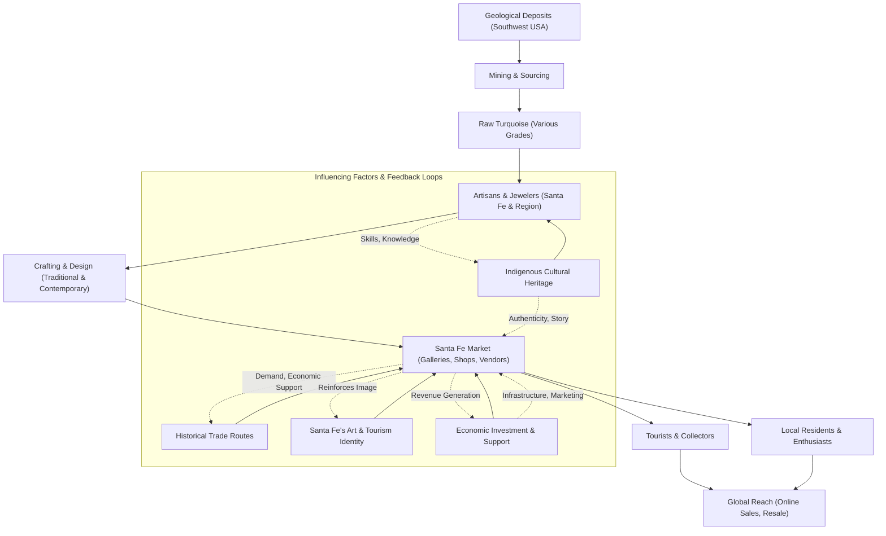

Santa Fe. Just the name conjures images of adobe architecture, vibrant sunsets, and, for many, the distinct sky-blue and blue-green hues of turquoise jewelry. If you've ever wandered through the historic Plaza or browsed the galleries on Canyon Road, you've undoubtedly noticed the sheer abundance of this captivating gemstone. It's everywhere – in necklaces, rings, bracelets, and earrings, adorning locals and tourists alike.

But why Santa Fe? Why does this specific city in the high desert of New Mexico seem to be a renowned center for turquoise, particularly Native American jewelry? Is it just a coincidence, or is there a deeper story behind this unique phenomenon? As a tech blogger, I usually dive into the latest gadgets and digital trends, but today, we're taking a detour into something equally fascinating: the intricate, multi-layered "algorithm" that makes Santa Fe such a prominent hub for turquoise. 🎯

It's not just one factor, but a beautiful, complex interplay of history, geology, culture, and economics, all converging in this enchanting city. Let's unpack it, piece by gleaming piece.

## The Gemstone with a Story: What Exactly is Turquoise?

Before we delve into Santa Fe's special relationship with turquoise, let's get acquainted with the star of our show. Turquoise, or `터키석` (turkiseok) as it's known in Korean, is a mineral that has captivated humanity for millennia.

Its signature colors range from a bright sky blue to a greenish-blue, often with veins or patches of its host rock, known as a "matrix." These matrices, especially the intricate "spiderweb" patterns, can add unique character and value to the stone. As a fun fact, it's also the birthstone for December!

Unlike diamonds or sapphires, turquoise is typically opaque or semi-translucent. This characteristic means it's rarely faceted (cut with many flat surfaces to maximize sparkle). Instead, turquoise is usually cut into a smooth, rounded, polished shape called a **cabochon**. Think of it like a perfectly smooth, often domed, pebble that brings out the stone's natural color and luster without relying on internal reflections. This `cabochon` style is perfect for showcasing the rich, earthy beauty of turquoise.

Historically, turquoise has been mined in various parts of the world, most famously in the Khorasan province of Iran, which supplied much of the ancient world. But crucially for our story, significant deposits are also found right here in North America, particularly in the American Southwest – a geographical clue we'll circle back to! 💡

## Santa Fe's Deep Roots: A City Forged in History

To understand Santa Fe's turquoise prominence, we first need to appreciate the city itself. Santa Fe isn't just any state capital; it's steeped in history, a true living museum.

*   **Founded in 1610:** Santa Fe holds the distinction of being the **oldest state capital in the United States**. That's over 400 years of continuous history! It was established by the Spanish as the capital of "Nuevo México," a province of New Spain. The name itself, "Santa Fe," is Spanish for 'Holy Faith,' a testament to its colonial origins.
*   **A Crossroads of Cultures:** For centuries, Santa Fe has been a vibrant melting pot. It's where Spanish colonial influence met the ancient traditions of Indigenous peoples, and later, the American frontier spirit. This rich historical tapestry fostered an environment of trade, cultural exchange, and artistic expression, laying the groundwork for its future as a turquoise hub.
*   **Geographical Sweet Spot:** Santa Fe sits majestically at an elevation of about 7,000 feet (2,133 meters) in the high desert. This location isn't just beautiful; it's strategically important. New Mexico, and the broader American Southwest, is home to some of the world's most significant turquoise deposits. Being centrally located within this mineral-rich region gave Santa Fe a natural advantage, making it a gateway for raw turquoise to flow into markets and workshops.

## The Heartbeat of Native American Culture

Perhaps the most profound reason for Santa Fe's turquoise prominence lies in the deep, enduring connection between the gemstone and the Indigenous peoples of the American Southwest. This relationship spans thousands of years, predating any European arrival.

*   **Ancient Adornment and Spiritual Significance:** Long before Santa Fe was a Spanish capital, Native American tribes, including the Navajo (who call Santa Fe "Yootó"), Zuni, and Hopi, revered turquoise. It wasn't just for decoration; it was woven into their spiritual beliefs, used in ceremonies, and believed to offer protection, bring good fortune, and connect the wearer to the sky and water spirits. The "Jewelry" Wikipedia snippet explicitly mentions that "North America (region)에서는 아메리카 원주민들이 외골격, 목재, 터키석, 동석을 사용했다. 터키석은 목걸이에 사용되거나 귀걸이에 장식되었다." (In North America, Native Americans used exoskeletons, wood, turquoise, and soapstone. Turquoise was used in necklaces and decorated earrings.)
*   **Artisanal Heritage:** Over generations, these tribes developed unparalleled skills in crafting turquoise jewelry. They combined the vibrant stone with intricate silversmithing techniques, creating distinctive styles that are instantly recognizable and deeply meaningful. The artistry is passed down, often from elder to apprentice, ensuring the continuity of these treasured traditions.
*   **Cultural Authenticity:** When you buy turquoise jewelry in Santa Fe, especially from Native American vendors at the Plaza, you're not just purchasing a piece of adornment; you're acquiring a piece of living history, a tangible link to a rich cultural heritage. Many pieces are still handcrafted using traditional methods, making them highly sought after by collectors and enthusiasts worldwide.

> "For many Indigenous peoples of the Southwest, turquoise is more than just a stone; it's a living part of their heritage, imbued with spiritual power and cultural memory. This deep connection is the authentic core of Santa Fe's turquoise market."

## Santa Fe: An Artistic and Tourist Mecca

Beyond its historical and cultural foundations, Santa Fe has cultivated a reputation as a world-class arts destination and a vibrant tourist hub. This modern identity perfectly complements its turquoise legacy.

*   **Galleries Galore:** Santa Fe boasts an incredible density of art galleries, particularly along Canyon Road, where historic adobe homes have been transformed into showcases for Southwestern art. Turquoise jewelry, from traditional to contemporary, is a staple in many of these galleries.
*   **The Plaza and Native American Vendors:** The historic Santa Fe Plaza is a focal point for both locals and visitors. Here, under the portal of the Palace of the Governors, Native American artisans sell their handcrafted jewelry directly to the public. This direct-to-consumer model ensures authenticity and fair trade, drawing in countless buyers.
*   **"Santa Fe Style":** The city has a distinct aesthetic that blends Spanish colonial, Pueblo, and contemporary influences. "Santa Fe Style" is an architectural and interior design movement that prominently features natural materials, warm colors, and, you guessed it, turquoise. This pervasive style creates a constant demand for the gemstone, reinforcing its presence in every aspect of the city's commerce and culture.
*   **Tourism Driver:** Millions of tourists flock to Santa Fe each year, drawn by its unique charm, art scene, culinary delights, and spiritual atmosphere. For many, a piece of authentic turquoise jewelry is the quintessential souvenir, a tangible memory of their visit to the Land of Enchantment. This constant influx of visitors creates a robust and reliable market for turquoise.

## The Economic Engine: From Mine to Market

The flow of turquoise in Santa Fe isn't just about cultural preservation; it's a dynamic economic ecosystem.

*   **Supply Chain Resilience:** Santa Fe's proximity to turquoise mines in New Mexico, Arizona, and Nevada ensures a relatively stable supply of raw material. This allows local lapidaries (gem cutters) and jewelers to source stones directly, often knowing the mine of origin, which adds to the stone's provenance and value.
*   **Local Artisan Economy:** The city actively supports its artisan community. Many jewelry pieces sold in Santa Fe are designed and created by local artists, providing livelihoods and sustaining traditional crafts. This local production ensures a diverse range of styles, from classic Native American designs to contemporary interpretations.
*   **Historical Trade Hub:** Santa Fe's role as a commercial center dates back centuries. It was the terminus of the famous Santa Fe Trail, a vital trade route connecting the American frontier to the West. Before that, the Camino Real linked it to Mexico City. This established infrastructure for moving goods, including precious materials and finished jewelry, laid the groundwork for its modern commercial success.
*   **Modern Commerce:** Today, Santa Fe's turquoise market operates on multiple levels – from individual street vendors and small boutiques to high-end galleries and online retailers. This diverse ecosystem caters to every budget and taste, making turquoise accessible to a wide audience.

### Deeper Dive: The Anatomy of Turquoise Value in Santa Fe

To truly understand *why* Santa Fe sells so much turquoise, we can conceptualize the contributing factors as a kind of "Turquoise Nexus Algorithm." It's not code you'd run on a computer, but a way to logically break down the forces at play. 🔧

**Conceptual Breakdown: The "Turquoise Nexus" Algorithm**

```
FUNCTION CalculateSantaFeTurquoisePrevalence()
  INPUT: GeographicLocation = "SantaFe, NewMexico"

  // Initialize contributing factors, weighted by their influence
  SET HistoricalSignificance_Weight = 0.20
  SET CulturalIntegration_Weight = 0.30
  SET GeologicalProximity_Weight = 0.15
  SET ArtisticHubStatus_Weight = 0.15
  SET TouristDemand_Weight = 0.10
  SET EconomicInfrastructure_Weight = 0.10

  // Assign scores (e.g., on a scale of 1-5, or qualitative like HIGH/VERY_HIGH)
  SET HistoricalSignificance_Score = 5  // Oldest capital, deep roots
  SET CulturalIntegration_Score = 5     // Native American heritage
  SET GeologicalProximity_Score = 4     // Near major mines
  SET ArtisticHubStatus_Score = 4       // Renowned art scene
  SET TouristDemand_Score = 4           // Millions of visitors annually
  SET EconomicInfrastructure_Score = 4  // Established trade, diverse retail

  // Evaluate interdependencies and amplification (pseudo-logic)
  IF GeologicalProximity_Score >= 3 AND CulturalIntegration_Score >= 3 THEN
    SET IndigenousCraftsmanship_Effect = "Flourish" // Artisans have access to raw material and cultural drive
  END IF

  IF HistoricalSignificance_Score >= 3 AND EconomicInfrastructure_Score >= 3 THEN
    SET TradeRoutesEstablished_Effect = "Strong" // Facilitates movement of goods and ideas
  END IF

  IF ArtisticHubStatus_Score >= 3 AND TouristDemand_Score >= 3 THEN
    SET MarketVolume_Effect = "Expand" // High demand meets high supply of unique products
  END IF

  // Calculate the weighted sum to represent overall prevalence
  TotalPrevalenceScore = (HistoricalSignificance_Weight * HistoricalSignificance_Score) +
                         (CulturalIntegration_Weight * CulturalIntegration_Score) +
                         (GeologicalProximity_Weight * GeologicalProximity_Score) +
                         (ArtisticHubStatus_Weight * ArtisticHubStatus_Score) +
                         (TouristDemand_Weight * TouristDemand_Score) +
                         (EconomicInfrastructure_Weight * EconomicInfrastructure_Score)

  // Return the calculated score and derived effects
  RETURN {
    Score: TotalPrevalenceScore,
    Craftsmanship: IndigenousCraftsmanship_Effect,
    Trade: TradeRoutesEstablished_Effect,
    Market: MarketVolume_Effect
  }
END FUNCTION

// Example Call (conceptual):
// Result = CalculateSantaFeTurquoisePrevalence()
// Expected Result.Score for Santa Fe would be very high, indicating strong prevalence.
// Expected Result.Craftsmanship, Result.Trade, Result.Market would all be positive indicators.
```
This conceptual "algorithm" helps visualize how each factor contributes to the overall phenomenon, and how they interact to amplify Santa Fe's status as a turquoise hub.

### Understanding Turquoise Quality: A Quick Guide 🔧
When buying turquoise, especially in a place like Santa Fe, it's good to know a few things about quality:

*   **Color:** The most prized turquoise often has a deep, vivid "robin's egg" blue. Greenish hues are also valued, but generally, the richer the blue, the higher the value.
*   **Hardness:** Denser, less porous stones are more durable and less likely to change color over time. Natural, untreated turquoise can be quite porous, which is why some stones are stabilized.
*   **Matrix:** The presence of the host rock, or matrix, can significantly impact a stone's appearance. A fine "spiderweb" matrix, where thin lines of dark matrix create a web-like pattern, is highly sought after.
*   **Stabilization/Treatment:** Many turquoise stones are stabilized with a clear resin to enhance their hardness, durability, and color consistency. While natural, untreated turquoise is generally the most valuable, stabilized turquoise is also widely accepted and more affordable. Always ask if a stone has been treated!

**Key Factors Driving Santa Fe's Turquoise Market**

To consolidate our findings, here's a summary of the critical elements that make Santa Fe the go-to destination for turquoise:

| Factor                     | Description                                                                                                                              | Impact on Market                                                                                                   |
| :------------------------- | :--------------------------------------------------------------------------------------------------------------------------------------- | :----------------------------------------------------------------------------------------------------------------- |
| **Historical Legacy**      | Oldest state capital (1610), rich Spanish colonial history, long-standing Native American presence.                                      | Created established trade routes, cultural exchange, and a foundation for enduring craft traditions.                |
| **Geological Proximity**   | Situated in the American Southwest, near significant turquoise mining regions in New Mexico, Arizona, and Nevada.                          | Ensures easy access to raw materials, lower sourcing costs, and a consistent supply of fresh stones.                |
| **Native American Culture**| Deep spiritual and aesthetic connection to turquoise, with ancient traditions of crafting and wearing the gemstone.                        | Drives demand for authentic, culturally significant pieces; fosters unique, recognizable designs and artistry.      |
| **Art & Tourism Hub**      | Renowned for its vibrant art scene, numerous galleries, and as a major tourist destination attracting millions annually.                   | Generates a constant stream of buyers, supports a large community of local artists, and offers diverse retail options.|
| **"Santa Fe Style"**       | A recognizable regional aesthetic that prominently incorporates turquoise, silver, and Southwestern motifs in architecture and design.     | Creates a strong brand identity, attracts specific clientele seeking this style, and reinforces regional appeal.    |
| **Economic Infrastructure**| A historical role as a trade center (Santa Fe Trail, Camino Real), complemented by modern retail and wholesale networks.                  | Facilitates efficient distribution, offers varied price points, and supports a high volume of sales.                |

### The Santa Fe Turquoise Ecosystem

Let's visualize this complex interplay of factors with a Mermaid diagram, showcasing the flow and influences that define Santa Fe's turquoise market.



This diagram illustrates how raw turquoise moves through the production chain to the Santa Fe market, influenced by and reinforcing the city's unique cultural, historical, and economic characteristics.

## Conclusion: A Gemstone Embedded in the Soul of a City

Santa Fe's unparalleled status as a turquoise jewelry hub is no accident. It's a testament to a powerful synergy – where geological fortune meets a rich tapestry of human history, where ancient cultural reverence intertwines with a thriving modern art scene, and where established trade routes pave the way for a bustling tourist economy.

Every piece of turquoise jewelry you find in Santa Fe tells a story – of the earth it came from, the hands that shaped it, and the millennia of cultural significance it carries. It's a tangible connection to the Land of Enchantment, a vibrant blue-green thread woven into the very soul of this remarkable city. So, the next time you see that distinctive gleam, remember the intricate "algorithm" that makes Santa Fe truly unique. It's a beautiful example of how deep roots can create a flourishing, vibrant present.

## References

- [산타페 (뉴멕시코주)](https://ko.wikipedia.org/wiki/%EC%82%B0%ED%83%80%ED%8E%98%20%28%EB%89%B4%EB%A9%95%EC%8B%9C%EC%BD%94%EC%A3%BC%29)
- [산타페](https://ko.wikipedia.org/wiki/%EC%82%B0%ED%83%80%ED%8E%98)
- [세인트존스 칼리지 (아나폴리스/산타페)](https://ko.wikipedia.org/wiki/%EC%84%B8%EC%9D%B8%ED%8A%B8%EC%A1%B4%EC%8A%A4%20%EC%B9%BC%EB%A6%AC%EC%A7%80%20%28%EC%95%84%EB%82%98%ED%8F%B4%EB%A6%AC%EC%8A%A4/%EC%82%B0%ED%83%80%ED%8E%98%29)
- [터키석](https://ko.wikipedia.org/wiki/%ED%84%B0%ED%82%A4%EC%84%9D)
- [보석](https://ko.wikipedia.org/wiki/%EB%B3%B4%EC%84%9D)
- [주얼리](https://ko.wikipedia.org/wiki/%EC%A3%BC%EC%96%BC%EB%A6%AC)
- [List of Pawn Stars episodes](https://en.wikipedia.org/wiki/List%20of%20Pawn%20Stars%20episodes)
- [Santa Fe, New Mexico](https://en.wikipedia.org/wiki/Santa%20Fe%2C%20New%20Mexico)
- [Santa Fe, Mexico City](https://en.wikipedia.org/wiki/Santa%20Fe%2C%20Mexico%20City)
- [The Santa Fe New Mexican](https://en.wikipedia.org/wiki/The%20Santa%20Fe%20New%20Mexican)
- [Hyundai Santa Fe](https://en.wikipedia.org/wiki/Hyundai%20Santa%20Fe)
- [Santa Fe](https://en.wikipedia.org/wiki/Santa%20Fe)