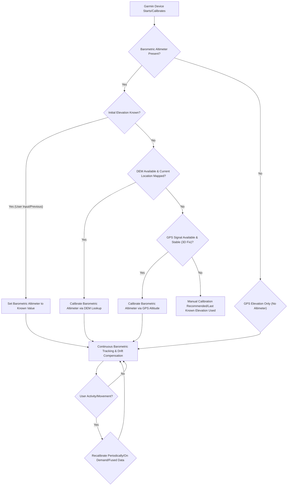

# Decoding Elevation: DEM vs. GPS Calibration on Garmin Devices

Accurate elevation data is more than just a number on your wrist or bike computer; it's a critical component for navigation, performance tracking, safety, and even environmental monitoring. For outdoor enthusiasts, athletes, and professionals relying on Garmin devices, understanding how their gadgets determine and calibrate elevation can significantly impact the reliability of their data. While many Garmin devices feature a barometric altimeter for precise relative elevation changes, this sensor requires periodic calibration to provide accurate absolute altitude readings. This is where Digital Elevation Models (DEM) and GPS-based calibration methods come into play, each offering distinct advantages and limitations.

At its core, the user's question delves into the fundamental differences between these two primary approaches Garmin employs for elevation calibration. While both aim to provide a correct starting point for the barometric altimeter, or in some cases, directly provide elevation, their underlying mechanisms, data sources, and performance characteristics vary significantly. This article will dissect these methods, explore their historical context, provide practical insights, and help you understand when and why your Garmin device might choose one over the other.

## The Quest for Vertical Accuracy: Understanding Elevation Calibration

Imagine you're embarking on a challenging mountain trek. Knowing your current altitude isn't just a curiosity; it's vital for assessing your progress, understanding the remaining climb, and identifying potential hazards like altitude sickness. Similarly, cyclists track elevation gain to measure effort, and pilots rely on precise altitude for safe flight.

Most advanced Garmin devices incorporate a **barometric altimeter**. This sensor measures atmospheric pressure, which decreases predictably with increasing altitude. It's incredibly accurate for measuring *relative* changes in elevation (e.g., how much you've climbed since your last reading) because local weather changes affect the pressure readings uniformly. However, the absolute pressure at a given altitude varies with weather conditions (e.g., a high-pressure system makes you appear lower, a low-pressure system makes you appear higher). Therefore, a barometric altimeter needs to be "calibrated" to a known, true elevation periodically to correct for these atmospheric fluctuations and provide an accurate *absolute* altitude reading. This calibration process essentially tells the device: "At this pressure, the true elevation is X meters."

Without proper calibration, your device might report you're at 500 meters when you're actually at 700 meters, simply because a weather front has moved in. This is where DEM and GPS-based calibration step in, offering automated ways to establish that crucial baseline.

### DEM-Based Elevation Calibration: The Map's Wisdom

**Digital Elevation Model (DEM)**-based calibration relies on pre-existing topographic data stored within the device's maps. A DEM is essentially a 3D representation of terrain's surface, containing elevation values for a series of regularly spaced points. When your Garmin device uses DEM calibration, it leverages its current GPS-derived horizontal position (latitude and longitude) to look up the corresponding elevation from its internal DEM database.

**Mechanism:**
1.  **GPS Fix:** The device first obtains a standard 2D (latitude, longitude) GPS fix to determine its horizontal location.
2.  **DEM Lookup:** Using these coordinates, the device queries its internal DEM map data. It identifies the elevation value associated with that specific location or interpolates an elevation from surrounding data points if the exact coordinate isn't in the dataset.
3.  **Barometric Altimeter Calibration:** This looked-up elevation value is then used to calibrate the barometric altimeter. The device records the current atmospheric pressure and associates it with the DEM-derived elevation. From that point, the barometric altimeter tracks changes in pressure, translating them into relative elevation changes, until the next calibration or significant pressure change.

**Conceptual Configuration/Pseudo-code:**
While Garmin's internal algorithms are proprietary, a simplified conceptual representation of a DEM lookup might look something like this:

```
FUNCTION CalibrateElevation_DEM(current_latitude, current_longitude):
    // Requires pre-loaded topographic maps with DEM data
    IF device_has_DEM_data_for_current_location THEN
        // Interpolate elevation from the DEM grid based on current GPS coordinates
        dem_elevation = INTERPOLATE_ELEVATION_FROM_DEM(current_latitude, current_longitude)
        
        IF dem_elevation IS NOT NULL THEN
            // Get current barometric pressure reading
            current_barometric_pressure = READ_BAROMETRIC_SENSOR()
            
            // Store this pressure-elevation relationship for future calculations
            SET_ALTIMETER_BASELINE(current_barometric_pressure, dem_elevation)
            
            LOG_MESSAGE("Altimeter calibrated using DEM to: " + dem_elevation + " meters.")
            RETURN TRUE
        ELSE
            LOG_WARNING("DEM data available but interpolation failed for current location.")
            RETURN FALSE
        END IF
    ELSE
        LOG_WARNING("No DEM data available for current location. Cannot use DEM calibration.")
        RETURN FALSE
    END IF
END FUNCTION
```

**Pros of DEM Calibration:**
*   **High Accuracy in Mapped Areas:** If the DEM data is precise and up-to-date, this method can provide a very accurate initial elevation, often superior to raw GPS elevation.
*   **Faster Initial Calibration:** Once a horizontal GPS fix is obtained, the lookup is almost instantaneous.
*   **Less Power Intensive (for lookup):** The primary power drain is for the initial GPS fix; the DEM lookup itself is computationally light.
*   **Independent of Satellite Vertical Accuracy:** It doesn't rely on the vertical accuracy of the GPS signal, only its horizontal position.

**Cons of DEM Calibration:**
*   **Requires Up-to-Date Maps:** The accuracy is entirely dependent on the quality, resolution, and currency of the pre-loaded DEM maps. Outdated or low-resolution maps can lead to significant errors.
*   **Limited Coverage:** DEM data might not be available for all regions, especially very remote or rapidly changing landscapes.
*   **Doesn't Account for Local Pressure:** It only provides an initial calibration point. The barometric altimeter still needs to track changes, and if the weather changes significantly without recalibration, the absolute elevation will drift.
*   **Potential for Errors in Steep Terrain:** If the DEM resolution is coarse, a device might look up an elevation for a point on a valley floor when the user is actually on a ridge, or vice-versa, especially if the horizontal GPS accuracy is slightly off.

**Practical Examples:**
*   **Hiking on well-mapped trails:** A Garmin Fenix or Edge device, pre-loaded with detailed topographic maps, can quickly calibrate its altimeter to a highly accurate elevation at the trailhead.
*   **Initial setup in a known location:** When you first turn on your device in your hometown, if it has local DEM data, it can use this to establish a baseline.

### GPS-Based Elevation Calibration: The Satellite's Perspective

**GPS-based elevation calibration** directly uses the altitude data derived from the Global Positioning System (GPS) satellites. While GPS is renowned for its horizontal accuracy, its vertical accuracy is inherently less precise.

**Mechanism:**
1.  **3D GPS Fix:** The device needs to acquire signals from a sufficient number of satellites (typically four or more) to calculate a 3D position, which includes latitude, longitude, and altitude.
2.  **Trilateration (or Multilateration):** The device measures the time it takes for signals from multiple satellites to reach it. Knowing the exact position of each satellite and the signal's speed, it can calculate its distance from each satellite. By combining these distances, it can pinpoint its location in three-dimensional space.
3.  **Vertical Dilution of Precision (VDOP):** The geometry of the satellites relative to the receiver significantly impacts accuracy. Satellites spread across the sky provide better accuracy than those clustered together. VDOP specifically measures the effect of satellite geometry on vertical accuracy. A lower VDOP indicates better vertical accuracy.
4.  **Barometric Altimeter Calibration:** The GPS-derived altitude is then used to calibrate the barometric altimeter, similar to the DEM method.

**Pros of GPS Calibration:**
*   **Global Coverage:** Works anywhere on Earth where a clear view of the sky and sufficient satellite signals are available.
*   **Independent of Maps:** Does not require any pre-loaded map data, making it ideal for remote or unmapped areas.
*   **Real-time Data:** Provides an elevation based on the current satellite constellation and atmospheric conditions affecting the signal.
*   **Accounts for Geoid-Ellipsoid Separation:** Modern GPS receivers typically convert the WGS84 ellipsoid height (what GPS directly calculates) to orthometric height (mean sea level, which is what maps and barometric altimeters typically use) using an internal geoid model.

**Cons of GPS Calibration:**
*   **Lower Vertical Accuracy:** GPS vertical accuracy is typically 2-3 times worse than horizontal accuracy. While horizontal accuracy might be 3-5 meters, vertical accuracy can be 5-15 meters or more, even with good signal. This is due to satellite geometry and signal propagation issues.
*   **Susceptible to Signal Quality:** Factors like satellite availability, signal strength, multipath (signals bouncing off objects), and atmospheric conditions (ionospheric/tropospheric delays) can degrade accuracy.
*   **Slower to Acquire Stable Fix:** Achieving a stable 3D fix with good vertical accuracy can take longer than a 2D fix.
*   **Higher Power Consumption:** Continuously tracking multiple satellites for a stable 3D fix can consume more battery power than a simple 2D fix for DEM lookup.
*   **Doesn't Account for Local Pressure (directly):** Like DEM, it provides a calibration point for the barometric altimeter, but the altimeter still drifts with weather changes.

**Practical Examples:**
*   **Backpacking in a wilderness area with no detailed maps:** A Garmin inReach or GPSMAP device can use its GPS altitude to calibrate.
*   **Initial setup in a new, unmapped region:** When you first power on a device far from any known DEM data, GPS is the only automatic calibration option.
*   **Pilots:** Aviation GPS units use GPS altitude extensively, though they also rely on barometric altimeters for flight levels.

## Historical Context of Elevation Measurement in Consumer GPS

The journey to accurate elevation on consumer GPS devices has been one of continuous improvement.
*   **Early GPS (Pre-2000s):** Early civilian GPS receivers were severely hampered by Selective Availability (SA), a deliberate degradation of signal accuracy by the U.S. military. This made both horizontal and vertical accuracy poor (often 100+ meters). Even without SA, achieving a stable 3D fix was challenging, and vertical accuracy was notoriously unreliable. Many early devices only displayed 2D position or a very rough altitude.
*   **Introduction of Barometric Altimeters (Late 1990s/Early 2000s):** Recognizing the limitations of GPS altitude, manufacturers like Garmin began integrating barometric altimeters into higher-end outdoor devices. This provided excellent *relative* elevation changes, crucial for tracking climbs and descents, but still required manual calibration for absolute altitude.
*   **Post-SA Era (2000 onwards):** The disabling of SA in May 2000 dramatically improved GPS accuracy for civilians. This made GPS altitude more viable for calibration, though still less accurate than barometric altimeters for relative changes.
*   **DEM Integration (Mid-2000s onwards):** As device memory increased and digital mapping became more prevalent, Garmin started embedding DEM data into their topographic maps. This offered a more reliable and often more accurate automated calibration method than raw GPS altitude, especially in areas with good map coverage.
*   **SBAS (WAAS/EGNOS) and Multi-GNSS (2000s-Present):** Satellite-Based Augmentation Systems (SBAS) like WAAS (North America) and EGNOS (Europe) further improved GPS accuracy, including vertical accuracy, by providing differential corrections. More recently, devices supporting multiple Global Navigation Satellite Systems (GNSS) like GLONASS, Galileo, and BeiDou, along with multi-band (L1+L5) receivers, have significantly enhanced both horizontal and vertical precision and reliability, even in challenging environments.
*   **Auto-Calibration and Fused Data:** Modern Garmin devices often employ sophisticated algorithms that combine data from GPS, DEM, and the barometric altimeter. They might use DEM for an initial calibration, then GPS for periodic recalibration if the DEM is unavailable or outdated, all while continuously monitoring the barometric altimeter for precise relative changes and using internal temperature sensors to compensate for thermal drift. Some devices even learn your home elevation.

## Comparing DEM and GPS-Based Elevation Calibration

| Feature | DEM-Based Calibration | GPS-Based Calibration |
| :------------------ | :----------------------------------------------------- | :--------------------------------------------------- |
| **Mechanism** | Looks up elevation from pre-loaded map data using GPS horizontal position. | Directly calculates 3D position (including altitude) from satellite signals. |
| **Data Source** | Internal Digital Elevation Model (DEM) maps. | GPS (or other GNSS) satellite signals. |
| **Primary Input** | Horizontal GPS coordinates (latitude, longitude). | Satellite pseudoranges and ephemeris data. |
| **Accuracy (Vertical)** | High, if DEM data is high-resolution and current. Can be very precise. | Moderate to Low. Typically 2-3x worse than horizontal GPS accuracy (5-15m+). Improved by SBAS/Multi-GNSS. |
| **Dependency** | Requires detailed, up-to-date DEM maps for the current location. | Requires clear view of sky and sufficient satellite signals for a 3D fix. |
| **Coverage** | Limited to areas with pre-loaded DEM data. | Global, wherever satellite signals are available. |
| **Speed of Fix** | Fast, once horizontal GPS fix is acquired. | Slower, requires stable 3D fix with good satellite geometry. |
| **Power Consumption** | Lower (for lookup after initial 2D GPS fix). | Higher (for continuous 3D satellite tracking). |
| **Environmental Factors** | Not directly affected by atmospheric conditions (beyond initial GPS fix). | Heavily affected by satellite geometry (VDOP), atmospheric conditions, multipath, signal obstructions. |
| **Use Cases** | Well-mapped areas, known trails, initial setup where map data is reliable. | Remote areas, unmapped regions, situations where map data is absent or outdated. |
| **Garmin Implementation** | Often used as a primary auto-calibration method in devices with detailed topo maps (e.g., Fenix, Edge, GPSMAP series). | Used as a fallback or primary method in devices without detailed DEM maps, or as part of a fused auto-calibration system. |

## Practical Scenarios and Choosing the Right Method

Modern Garmin devices often don't force you to choose explicitly between DEM and GPS for *calibration*. Instead, they employ sophisticated "auto-calibration" algorithms that intelligently combine these methods with the barometric altimeter. However, understanding their strengths helps you interpret your data and troubleshoot.

Here's a conceptual flowchart of how a Garmin device might manage elevation calibration:



**Understanding the Flow:**
*   The barometric altimeter is always preferred for *relative* changes due to its precision.
*   DEM is often the first choice for *absolute* calibration if available and reliable, as it can be more accurate than raw GPS altitude.
*   GPS altitude serves as a crucial fallback or primary method when DEM data isn't available or when the device needs an independent check.
*   "Fused Data" (M) represents advanced algorithms that might combine all available sources, potentially using GPS altitude to correct for long-term barometric drift, or using DEM at known points.

**When to Manually Calibrate:**
Even with auto-calibration, there are times when a manual calibration is beneficial:
*   **Before an important activity:** If you know the precise elevation of your starting point (e.g., a trailhead sign, a known benchmark), manually setting it ensures the most accurate start.
*   **After significant weather changes:** A major pressure system moving through can cause your barometric altimeter to drift.
*   **When you suspect inaccuracies:** If your elevation readings seem off compared to known landmarks.

**Best Practices:**
*   **Keep your maps updated:** Ensure your Garmin device has the latest topographic maps with DEM data for your region.
*   **Allow time for GPS fix:** Before starting an activity, give your device a few minutes outdoors to acquire a stable GPS fix, especially if you've moved a long distance since its last use.
*   **Understand your device settings:** Familiarize yourself with your specific Garmin model's altimeter settings. Many allow you to prioritize calibration methods or choose auto-calibration modes.

In conclusion, both DEM and GPS-based elevation calibration play vital roles in ensuring your Garmin device provides accurate altitude data. DEM offers precision in well-mapped areas by leveraging pre-existing terrain models, while GPS provides universal coverage, albeit with generally lower vertical accuracy. Modern Garmin devices intelligently combine these methods with the highly precise barometric altimeter, striving for the best possible balance of accuracy, reliability, and coverage, allowing you to focus on your adventure rather than worrying about your altitude.

## References

- [Garmin Fenix](https://en.wikipedia.org/wiki/Garmin%20Fenix)
- [Garmin Forerunner](https://en.wikipedia.org/wiki/Garmin%20Forerunner)
- [GPS Exchange Format](https://en.wikipedia.org/wiki/GPS%20Exchange%20Format)
- [Liberal Democrats (UK)](https://en.wikipedia.org/wiki/Liberal%20Democrats%20%28UK%29)
- [Kenji Mboma Dem](https://en.wikipedia.org/wiki/Kenji%20Mboma%20Dem)
- [Catholic Church and politics in the United States](https://en.wikipedia.org/wiki/Catholic%20Church%20and%20politics%20in%20the%20United%20States)
- [Geocaching](https://en.wikipedia.org/wiki/Geocaching)
- [Adobe Inc.](https://en.wikipedia.org/wiki/Adobe%20Inc)
- [Palantir](https://en.wikipedia.org/wiki/Palantir)
- [Salar de Uyuni](https://en.wikipedia.org/wiki/Salar%20de%20Uyuni)
- [Prism sight](https://en.wikipedia.org/wiki/Prism%20sight)
- [Pipette](https://en.wikipedia.org/wiki/Pipette)