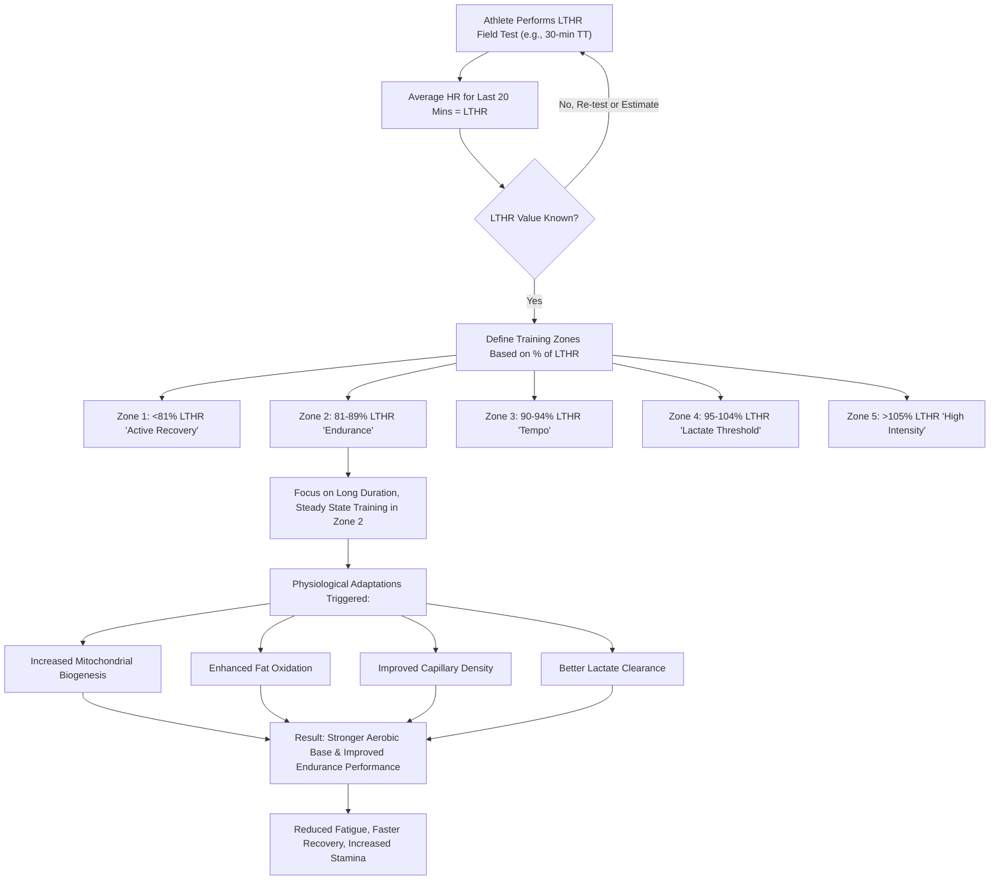

The pursuit of optimal athletic performance and sustained health has led to increasingly sophisticated training methodologies. Among these, Zone 2 training, particularly when calibrated using an individual's Lactate Threshold Heart Rate (LTHR), has emerged as a cornerstone for endurance athletes and fitness enthusiasts alike. This article delves into the profound physiological advantages and practical application of this precise training approach, explaining why it is considered a superior method for building a robust aerobic foundation.

At its core, Zone 2 training refers to exercise performed at a moderate intensity, where the body primarily utilizes fat as fuel and lactate production remains low and stable. The critical nuance, however, lies in *how* this "moderate intensity" is defined. While traditional methods often rely on a percentage of maximal heart rate (HRmax), calibrating Zone 2 based on LTHR offers a more personalized and physiologically accurate approach, unlocking a cascade of benefits that are less accessible through less precise methods.

## Understanding the Physiology: Why Zone 2 Matters

The human body possesses a remarkable capacity for adaptation, and Zone 2 training specifically targets the aerobic energy system, prompting a range of profound physiological changes that bolster endurance, improve metabolic health, and enhance overall resilience.

**1. Mitochondrial Biogenesis and Efficiency:** Mitochondria are often dubbed the "powerhouses of the cell," responsible for generating adenosine triphosphate (ATP), the body's primary energy currency, particularly through aerobic respiration. Consistent aerobic training, such as Zone 2 work, acts as a powerful stimulus for mitochondrial biogenesis – the creation of new mitochondria – and enhances the efficiency of existing ones.
*   **Increased Density:** Regular Zone 2 work leads to a greater number of mitochondria within muscle cells, increasing the capacity to produce energy aerobically.
*   **Improved Function:** Beyond sheer numbers, these mitochondria become more adept at utilizing oxygen and converting fuel (especially fat) into ATP, contributing to overall metabolic improvement.
*   **Enhanced Fat Oxidation:** A key benefit of mitochondrial adaptation is a significantly improved ability to burn fat for fuel. At lower intensities, the body prefers fat because it's an abundant energy source that yields a high amount of ATP per molecule, sparing limited glycogen stores. Training in Zone 2 teaches the body to become highly efficient at oxidizing fat, pushing the "fat-burning threshold" to higher intensities. This is crucial for endurance events, where glycogen depletion (hitting "the wall") is a major limiting factor.

**2. Capillary Density and Oxygen Delivery:** The cardiovascular system plays a vital role in delivering oxygen and nutrients to working muscles and removing waste products. Zone 2 training enhances several aspects of this system:
*   **Increased Capillarization:** It stimulates the growth of new capillaries, the tiny blood vessels that surround muscle fibers. A denser capillary network means a greater surface area for oxygen and nutrient exchange between blood and muscle, and more efficient removal of metabolic byproducts like carbon dioxide.
*   **Improved Blood Flow:** Regular aerobic training strengthens the heart muscle, leading to an increased stroke volume (the amount of blood pumped with each beat). This results in a lower resting heart rate and more efficient blood delivery to muscles during exercise.

**3. Lactate Clearance and Shuttle Mechanisms:** While Zone 2 is characterized by low lactate accumulation, it paradoxically improves the body's ability to *handle* lactate.
*   **Lactate Clearance:** When exercising at or below the lactate threshold, any lactate produced by the muscles is removed by the body without it building up. Zone 2 training enhances the body's capacity to clear lactate.
*   **Lactate Shuttle:** Lactate, often misunderstood as a purely detrimental waste product, is actually a valuable fuel source. The "lactate shuttle" mechanism, whose mechanistic predictions translate into measurable performance and health benefits, involves lactate produced in some muscle fibers or tissues being transported and utilized as fuel by other, more aerobic fibers or even the heart and brain.
*   **Buffering Capacity:** By improving lactate clearance and utilization, the body becomes more resilient to acidosis, allowing it to sustain higher intensities for longer before lactate begins to accumulate rapidly and impair performance.

**4. Enhanced Aerobic Base and Endurance:** All these physiological adaptations culminate in a stronger aerobic base. A robust aerobic base is the foundation upon which all other training intensities are built. It means:
*   **Reduced Perceived Exertion:** The same pace feels easier, or you can sustain a faster pace at the same perceived effort.
*   **Faster Recovery:** A well-trained aerobic system allows for quicker recovery between high-intensity intervals or demanding training sessions.
*   **Increased Stamina:** The ability to perform physical activity for extended periods without fatigue is significantly enhanced.
*   **Improved Overall Health Markers:** Beyond performance, Zone 2 training contributes to better cardiovascular health, improved insulin sensitivity, and reduced risk of chronic diseases.

## The Precision of Lactate Threshold Heart Rate (LTHR)

While the benefits of Zone 2 are clear, its effectiveness hinges on accurate intensity prescription. This is where Lactate Threshold Heart Rate (LTHR) provides a significant advantage over other methods.

**What is Lactate Threshold (LT)?**
The Lactate Threshold refers to the exercise intensity at which lactate begins to accumulate in the blood at a faster rate than it can be cleared. Below this threshold, any lactate produced by the muscles is removed by the body without it building up, and lactate levels remain relatively stable. Above it, lactate production outstrips clearance, leading to a rapid rise in blood lactate, perceived exertion, and eventual fatigue. LTHR is simply the heart rate at which this threshold occurs. It's a highly individualized physiological marker that reflects an athlete's aerobic fitness. The lactate threshold can be expressed as approximately 85% of maximum heart rate or 75% of maximum oxygen intake.

**Historical Context: The Evolution of Training Zones**
Early exercise physiology often relied on simple percentage-based calculations of maximal heart rate (HRmax) to define training zones. The concept of HRmax, while easy to measure or estimate (e.g., 220 minus age), has significant limitations:
*   **Variability:** HRmax varies widely among individuals of the same age and fitness level. It's largely genetically determined and doesn't necessarily correlate with endurance performance.
*   **Lack of Physiological Relevance:** A percentage of HRmax doesn't directly correspond to an individual's metabolic thresholds. For example, 70% of HRmax might be Zone 2 for one person but Zone 3 for another, depending on their fitness and lactate threshold.

The mid-to-late 20th century saw a paradigm shift with the emergence of the lactate threshold concept. Lab-based testing, involving incremental exercise with blood lactate measurements, allowed for precise identification of the lactate threshold. As technology advanced, field tests were developed to estimate LTHR without the need for expensive lab equipment, making this valuable metric accessible to a broader audience. This evolution marked a move from generalized, population-based training prescriptions to individualized, physiology-driven approaches.

**Why LTHR is Superior for Zone Setting:**
LTHR is a more accurate and dynamic indicator of an individual's current aerobic capacity and metabolic state compared to HRmax.
*   **Directly Reflects Metabolic State:** LTHR directly corresponds to the point where the body transitions from primarily aerobic metabolism to an increasing reliance on anaerobic pathways. This makes it a far more precise anchor for defining zones that target specific physiological adaptations.
*   **Individualized:** LTHR is unique to each individual and changes with fitness. As you get fitter, your LTHR typically increases, meaning you can sustain a higher intensity before lactate accumulates. Training zones based on LTHR automatically adjust to your improving fitness.
*   **Predictive of Performance:** LTHR is a strong predictor of endurance performance. Athletes with a higher LTHR can sustain faster paces for longer.
*   **Consistency:** While HRmax can fluctuate slightly, LTHR is generally more stable day-to-day, making it a reliable benchmark for training.

**Comparison Table: LTHR vs. Max HR for Zone Setting**

| Feature            | Max HR (HRmax) Method                                | LTHR Method                                             |
| :----------------- | :--------------------------------------------------- | :------------------------------------------------------ |
| **Basis**          | Maximal effort, often estimated (e.g., 220-age) or tested once. | Sustainable highest aerobic effort without rapid lactate accumulation. |
| **Definition**     | % of HRmax (e.g., Zone 2 = 60-70% HRmax).            | % of LTHR (e.g., Zone 2 = 81-89% LTHR).                 |
| **Accuracy**       | Less precise for individual metabolic thresholds; influenced by age, genetics, fatigue. | More precise for defining aerobic/anaerobic transition; reflects current fitness. |
| **Individualization** | General, population-based estimates.                 | Highly individualized and adapts with fitness changes.  |
| **Physiological Relevance** | Indirectly related to metabolic thresholds.          | Directly corresponds to metabolic thresholds and energy system utilization. |
| **Endurance Pacing** | Less effective for precise pacing and specific training adaptations. | Excellent for precise pacing, endurance development, and targeted physiological gains. |
| **Variability**    | Can be variable day-to-day due to external factors.  | More stable and reflective of current fitness level and aerobic capacity. |
| **Ease of Testing** | Easier to estimate, harder to test truly maximally.  | Requires a specific field test, but highly repeatable and practical. |

## Practical Application: Implementing LTHR-Based Zone 2 Training

To harness the power of LTHR-based Zone 2 training, you first need to determine your LTHR and then set your zones accordingly.

**1. Determining Your LTHR (Field Test):**
A common and reliable field test to estimate LTHR is a 30-minute time trial.
*   **Warm-up:** 10-15 minutes of easy cycling, running, or rowing.
*   **Main Set:** Perform a 30-minute maximal effort. This means going as hard as you can sustain for the entire 30 minutes, without fading too much at the end. It should feel challenging but not an all-out sprint.
*   **Measurement:** Record your average heart rate for the *last 20 minutes* of the 30-minute effort. This average heart rate is your estimated LTHR. (The first 10 minutes allow your heart rate to stabilize at a sustainable threshold effort).
*   **Cool-down:** 10 minutes easy.
*   **Repeat:** It's advisable to repeat this test every 4-8 weeks, or whenever you feel your fitness has significantly changed, to keep your LTHR and zones current.

**2. Calculating Training Zones Based on LTHR:**
Once you have your LTHR, you can define your heart rate zones. While various models exist, a common 5-zone or 6-zone model based on LTHR is often used by coaches (e.g., Joe Friel's model) and is highly effective. Here's a common interpretation:

*   **Zone 1 (Active Recovery):** <81% of LTHR
*   **Zone 2 (Endurance):** 81-89% of LTHR
*   **Zone 3 (Tempo):** 90-94% of LTHR
*   **Zone 4 (Lactate Threshold):** 95-104% of LTHR
*   **Zone 5a (VO2 Max):** 105-110% of LTHR
*   **Zone 5b (Anaerobic Capacity):** >110% of LTHR

**Example Code for Zone Calculation (Python):**

```python
def calculate_hr_zones_lthr(lthr, zone_definitions):
    """
    Calculates heart rate zones based on a given Lactate Threshold Heart Rate (LTHR)
    and a dictionary of zone percentage definitions.

    Args:
        lthr (int): The athlete's Lactate Threshold Heart Rate in bpm.
        zone_definitions (dict): A dictionary where keys are zone names (str)
                                 and values are tuples (lower_percent, upper_percent)
                                 representing the percentage range of LTHR for that zone.

    Returns:
        dict: A dictionary of calculated heart rate zones, with zone names as keys
              and tuples (lower_hr, upper_hr) as values.
    """
    zones = {}
    for zone_name, (lower_percent, upper_percent) in zone_definitions.items():
        lower_hr = int(lthr * lower_percent / 100)
        upper_hr = int(lthr * upper_percent / 100)
        zones[zone_name] = (lower_hr, upper_hr)
    return zones

# Example LTHR (Lactate Threshold Heart Rate) determined from a field test
my_lthr = 165 # bpm

# Common LTHR-based heart rate zone definitions (e.g., Friel's or similar)
# Note: Zone definitions can vary slightly between coaches/systems.
zone_defs_lthr_based = {
    "Zone 1 (Active Recovery)": (65, 80), # % of LTHR
    "Zone 2 (Endurance)": (81, 89),
    "Zone 3 (Tempo)": (90, 94),
    "Zone 4 (Lactate Threshold)": (95, 104),
    "Zone 5a (VO2 Max)": (105, 110),
    "Zone 5b (Anaerobic Capacity)": (111, 120)
}

# Calculate the heart rate zones
my_zones = calculate_hr_zones_lthr(my_lthr, zone_defs_lthr_based)

print(f"My LTHR: {my_lthr} bpm\n")
print("Calculated Heart Rate Zones (based on LTHR):")
for zone_name, (lower, upper) in my_zones.items():
    print(f"  {zone_name}: {lower}-{upper} bpm")

# Example for a specific Zone 2 session:
zone2_lower, zone2_upper = my_zones["Zone 2 (Endurance)"]
print(f"\nFor Zone 2 training, aim for a heart rate between {zone2_lower}-{zone2_upper} bpm.")
```

**Output for `my_lthr = 165`:**
```
My LTHR: 165 bpm

Calculated Heart Rate Zones (based on LTHR):
  Zone 1 (Active Recovery): 107-132 bpm
  Zone 2 (Endurance): 133-146 bpm
  Zone 3 (Tempo): 148-155 bpm
  Zone 4 (Lactate Threshold): 156-171 bpm
  Zone 5a (VO2 Max): 173-181 bpm
  Zone 5b (Anaerobic Capacity): 183-198 bpm

For Zone 2 training, aim for a heart rate between 133-146 bpm.
```

**3. Visualizing the LTHR-Based Training Process:**



**4. Practical Examples of Zone 2 Training:**
*   **Duration:** Zone 2 sessions are typically longer, ranging from 45 minutes to several hours, depending on the sport and individual goals.
*   **Perceived Exertion:** You should be able to hold a conversation comfortably, but not sing. It should feel easy to moderate, sustainable for extended periods. This is often referred to as "conversational pace."
*   **Breathing:** Breathing should be rhythmic and controlled, not labored. You should be able to breathe primarily through your nose.
*   **Typical Session:**
    *   **Running:** A 60-90 minute steady run on relatively flat terrain, maintaining your heart rate within your calculated Zone 2.
    *   **Cycling:** A 2-3 hour ride, focusing on a consistent effort level, avoiding surges or high-intensity bursts.
    *   **Rowing/Swimming:** Longer, steady-state pieces, focusing on technique and maintaining a consistent heart rate.

**Caveats and Considerations:**
*   **Individual Variability:** While LTHR is more precise, individual responses to training can still vary. Some athletes might respond better to slightly different zone percentages.
*   **External Factors:** Heart rate can be influenced by factors like hydration, caffeine, stress, sleep, temperature, and altitude. Always consider these when interpreting your heart rate data.
*   **Multi-Modal Training:** While LTHR is excellent for endurance, a well-rounded training program will also incorporate higher intensity work (Zone 3, 4, 5) to develop other energy systems and improve speed and power. Zone 2 provides the foundation, but it's not the only piece of the puzzle.
*   **Listen to Your Body:** Heart rate monitors are tools, not dictators. Pay attention to your perceived exertion and adjust if your body feels unusually fatigued or strong.

In conclusion, training within Zone 2, precisely defined by your Lactate Threshold Heart Rate, offers a scientifically sound and highly effective pathway to enhancing endurance, metabolic health, and overall athletic performance. By fostering mitochondrial growth, improving fat oxidation, boosting capillary density, and refining lactate dynamics, this approach builds a robust aerobic engine that forms the bedrock of sustainable fitness. Embracing LTHR-based Zone 2 training is not just about logging miles or hours; it's about intelligently optimizing your body's physiological machinery for long-term health and peak performance.

## References

- [Strength training](https://en.wikipedia.org/wiki/Strength%20training)
- [Long-distance running](https://en.wikipedia.org/wiki/Long-distance%20running)
- [Exercise physiology](https://en.wikipedia.org/wiki/Exercise%20physiology)
- [Lactate threshold](https://en.wikipedia.org/wiki/Lactate%20threshold)
- [Cycling power meter](https://en.wikipedia.org/wiki/Cycling%20power%20meter)
- [Exogenous lactate](https://en.wikipedia.org/wiki/Exogenous%20lactate)
- [Ventilatory threshold](https://en.wikipedia.org/wiki/Ventilatory%20threshold)
- [Region-based memory management](https://en.wikipedia.org/wiki/Region-based%20memory%20management)
- [Sonic the Hedgehog 3](https://en.wikipedia.org/wiki/Sonic%20the%20Hedgehog%203)
- [Time zone](https://en.wikipedia.org/wiki/Time%20zone)
- [Sepsis](https://en.wikipedia.org/wiki/Sepsis)
- [Anaerobic exercise](https://en.wikipedia.org/wiki/Anaerobic%20exercise)