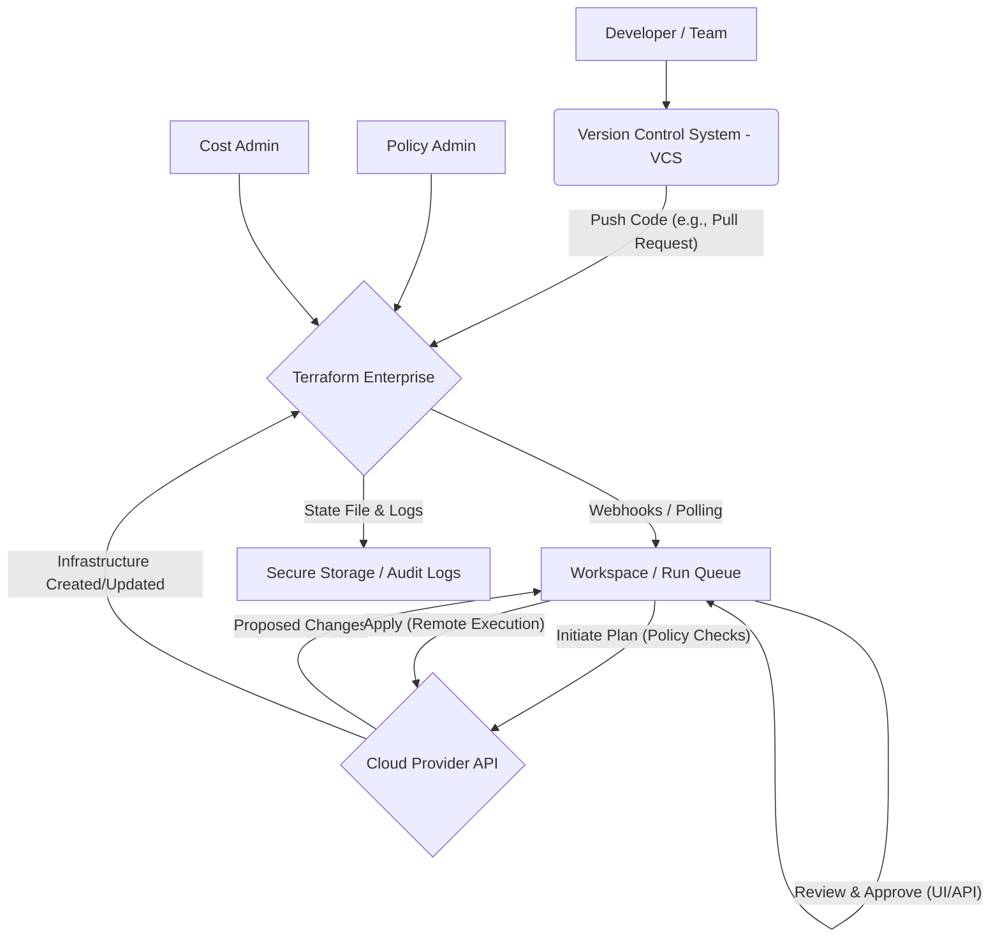

The landscape of Infrastructure as Code (IaC) is dominated by powerful tools, and HashiCorp's Terraform stands out as a leading solution. However, for those new to the ecosystem or considering scaling their IaC efforts, a common point of confusion arises: the distinction between "Terraform" and "Terraform Enterprise." While they share a core engine, they cater to very different needs and operational scales.

This article aims to disambiguate these two entities, providing a comprehensive comparison that delves into their mechanisms, features, historical context, and practical applications. We will explore how the open-source Terraform CLI serves as the foundational tool and how Terraform Enterprise builds upon it to offer advanced capabilities essential for large organizations and complex, collaborative environments.

## The Foundation: Open-Source Terraform

At its heart, "Terraform" typically refers to the open-source command-line interface (CLI) and its associated ecosystem. Launched by HashiCorp in 2014, it quickly revolutionized how developers and operations teams provision and manage infrastructure. Its core philosophy is Infrastructure as Code (IaC), allowing users to define infrastructure resources in human-readable configuration files using HashiCorp Configuration Language (HCL).

**Core Concepts and Mechanisms:**

1.  **Declarative Configuration:** Instead of writing scripts that dictate *how* to achieve a state, Terraform users declare the *desired state* of their infrastructure. Terraform then figures out the necessary actions to reach that state.
2.  **Providers:** Terraform interacts with various cloud providers (AWS, Azure, GCP, etc.), SaaS providers (GitHub, DataDog), and on-premise solutions through "providers." These plugins translate Terraform's generic resource definitions into specific API calls for each service.
3.  **Resources and Data Sources:**
    *   **Resources:** Represent infrastructure components (e.g., an AWS EC2 instance, an Azure Virtual Network, a Kubernetes deployment). They are created, updated, or destroyed by Terraform.
    *   **Data Sources:** Allow Terraform to fetch information about existing infrastructure or external data (e.g., querying an existing AWS VPC ID, getting the latest AMI ID).
4.  **Modules:** Terraform configurations can be organized into reusable modules. This promotes DRY (Don't Repeat Yourself) principles, allowing teams to encapsulate common infrastructure patterns and share them across projects. HashiCorp launched the Terraform Module Registry in 2017.
5.  **State Management:** Terraform maintains a "state file" (typically `terraform.tfstate`) that maps the real-world infrastructure to the configuration. This file is crucial for Terraform to understand what resources it manages, track dependencies, and plan changes efficiently.
    *   **Local Backend:** By default, the state file is stored locally on the machine where Terraform is run.
    *   **Remote Backends:** For team collaboration and production environments, remote backends (e.g., AWS S3, Azure Blob Storage, HashiCorp Consul, HashiCorp Cloud Platform (HCP) Terraform) are used to store the state file securely, enable state locking (to prevent concurrent modifications), and provide versioning.

**Typical Workflow with Open-Source Terraform:**

The standard workflow involves a few key CLI commands:

*   `terraform init`: Initializes a working directory, downloading necessary providers and modules.
*   `terraform plan`: Generates an execution plan, showing what actions Terraform will take to achieve the desired state without actually making changes. This is a crucial step for review.
*   `terraform apply`: Executes the actions outlined in the plan, provisioning or modifying infrastructure.
*   `terraform destroy`: Tears down all resources managed by the configuration.

**Example: Provisioning an AWS S3 Bucket with Open-Source Terraform**

```hcl
# Configure the AWS provider
provider "aws" {
  region = "us-east-1"
}

# Define an S3 bucket resource
resource "aws_s3_bucket" "my_example_bucket" {
  bucket = "my-unique-example-bucket-12345" # Bucket names must be globally unique
  acl    = "private"

  tags = {
    Environment = "Dev"
    Project     = "TerraformDemo"
  }
}

# Output the bucket name
output "bucket_name" {
  value = aws_s3_bucket.my_example_bucket.bucket
}
```

To deploy this, a user would:
1.  Save the code as `main.tf`.
2.  Run `terraform init`.
3.  Run `terraform plan`.
4.  Run `terraform apply`.

**Strengths:**

*   **Free and Open-Source:** Accessible to everyone, fostering a massive community and extensive ecosystem of providers and modules.
*   **Flexibility:** Can manage infrastructure across virtually any cloud or service with an API.
*   **Powerful:** Provides granular control over infrastructure resources.
*   **Community Support:** A vast array of tutorials, forums, and community-contributed solutions.

**Limitations (Paving the Way for Enterprise Solutions):**

While incredibly powerful for individuals and small teams, open-source Terraform begins to show limitations when scaling to large organizations:

*   **State Management at Scale:** Manually managing remote state backends, ensuring locking, and handling concurrent access across many teams and projects can become complex and error-prone.
*   **Collaboration Challenges:** Without a centralized platform, coordinating `terraform apply` operations, reviewing changes, and ensuring consistent environments across multiple teams is difficult.
*   **Governance and Policy Enforcement:** Open-source Terraform has no built-in mechanisms for enforcing organizational policies (e.g., "all S3 buckets must be encrypted," "no public IPs on production servers") before infrastructure is provisioned.
*   **Security and Auditability:** Centralized logging, audit trails, and secrets management are not inherent to the CLI.
*   **Cost Management:** No native cost estimation or enforcement of spending limits.
*   **Private Module Sharing:** Sharing internal, proprietary modules requires manual distribution or setting up a private registry.

These limitations are precisely what commercial offerings like HashiCorp Terraform Enterprise are designed to address.

## Scaling IaC: HashiCorp Terraform Enterprise

HashiCorp, Inc. is an American software company and subsidiary of IBM. HashiCorp Terraform Enterprise (TFE) is a commercial, self-hosted platform built on top of the open-source Terraform engine. It provides a centralized, collaborative, and policy-driven workflow for managing infrastructure at scale. While open-source Terraform provides the "engine" for IaC, Terraform Enterprise provides the "platform" to run that engine securely, efficiently, and collaboratively across an organization. For this comparison, we'll focus on the self-hosted TFE as the direct "Enterprise" product.

**Key Features and Mechanisms:**

1.  **Remote Operations:**
    *   **Centralized Execution:** Instead of running `terraform apply` on local machines, TFE executes Terraform runs in a controlled, remote environment. This ensures consistency, eliminates local dependency issues (e.g., different Terraform versions, missing plugins), and provides a single source of truth for all infrastructure changes.
    *   **VCS-Driven Workflow (GitOps):** TFE integrates deeply with Version Control Systems (VCS) like GitHub, GitLab, Bitbucket, and Azure DevOps. Changes pushed to a configured repository trigger Terraform runs (plans and applies) within TFE, often via webhooks. This enables a GitOps model where infrastructure is managed through pull requests and code reviews.

2.  **Advanced State Management:**
    *   **Secure, Centralized State:** TFE automatically manages and secures Terraform state files for all workspaces. State files are encrypted at rest and in transit, versioned, and stored reliably.
    *   **State Locking:** Prevents concurrent Terraform runs from modifying the same state, ensuring data integrity.
    *   **Remote State Access:** Facilitates secure sharing of state outputs between different workspaces.

3.  **Collaboration and Team Management:**
    *   **Workspaces:** Logical groupings of infrastructure configurations, often mapped to environments (dev, staging, prod) or applications.
    *   **Teams and Permissions:** Granular role-based access control (RBAC) allows administrators to define who can view, plan, apply, or manage infrastructure within specific workspaces.
    *   **Run History and Audit Trails:** Every Terraform run is logged with details about who initiated it, the plan, the applied changes, and the output, providing a comprehensive audit trail for compliance.

4.  **Policy as Code:**
    *   **Pre-Plan/Pre-Apply Checks:** TFE includes capabilities for policy enforcement, allowing organizations to define and automatically apply governance rules *before* infrastructure changes are applied. This helps ensure enterprise-level security and compliance. Examples include:
        *   "All S3 buckets must have server-side encryption enabled."
        *   "No EC2 instances larger than t3.medium in the development environment."
        *   "Tags 'Owner' and 'CostCenter' are mandatory for all resources."
    *   **Automated Enforcement:** Policies can be configured to warn, soft-fail, or hard-fail a Terraform run, preventing non-compliant infrastructure from being provisioned.

5.  **Private Module Registry:**
    *   TFE provides a built-in private registry for sharing and versioning internal Terraform modules. This allows teams to discover, reuse, and contribute to a curated collection of approved infrastructure patterns, accelerating development and ensuring consistency.

6.  **Cost Estimation and Management:**
    *   **Run-Time Cost Estimates:** During the `terraform plan` phase, TFE can provide an estimated cost of the infrastructure changes, helping teams understand the financial impact before applying.
    *   **Spend Limits:** Policies can be set to prevent infrastructure changes that exceed predefined cost thresholds.

7.  **Security and Integrations:**
    *   **Secrets Management:** Integrates with external secrets management solutions (e.g., HashiCorp Vault, AWS Secrets Manager) to securely inject sensitive data into Terraform runs.
    *   **Single Sign-On (SSO):** Supports integration with identity providers for streamlined user authentication.

**Terraform Enterprise Workflow Diagram:**

The following Mermaid diagram illustrates a typical TFE workflow, emphasizing its centralized and automated nature:


*   **Developer/Team:** Writes Terraform configurations and pushes them to a VCS.
*   **VCS:** Stores the infrastructure code. A push (especially a pull request) triggers an action.
*   **Terraform Enterprise:** Receives the trigger, pulls the code, and initiates a run in a dedicated workspace.
*   **Workspace/Run Queue:** TFE's execution environment where `terraform plan` is run. This is where policies are applied.
*   **Cloud Provider API:** Terraform interacts with the cloud provider to fetch current state and propose changes.
*   **Review & Approve:** The plan, including policy check results and cost estimates, is presented for review. An authorized user approves the `apply`.
*   **Apply (Remote Execution):** TFE executes `terraform apply` in its secure environment.
*   **Infrastructure Created/Updated:** The cloud provider provisions or modifies resources.
*   **Secure Storage / Audit Logs:** TFE centrally stores the updated state file and maintains a detailed audit trail of all actions.
*   **Policy/Cost Admin:** Configures and monitors policies and cost settings within TFE.

**Practical Example: Collaborative Multi-Environment Deployment with TFE**

Imagine a large organization managing development, staging, and production environments for an application.

1.  **Code in VCS:** Terraform configurations for each environment are stored in a Git repository, possibly with separate branches or directories.
2.  **TFE Workspaces:** Three TFE workspaces are configured, one for each environment, each linked to the relevant VCS path/branch.
3.  **Developer Action:** A developer creates a new feature branch, adds a new resource (e.g., a new database instance) to the `dev` configuration, and opens a pull request.
4.  **Automated Plan & Policy Check:** TFE automatically detects the PR, performs a `terraform plan` for the `dev` workspace, and runs policies.
    *   *Policy Example:* Policies might check if the database instance type is allowed for `dev` and if it has mandatory tags.
    *   *Cost Estimate:* TFE provides an estimated cost increase for the new database.
5.  **Review and Approval:** Team leads review the plan, policy results, and cost estimate directly in the TFE UI or via PR comments.
6.  **Apply to Dev:** Upon approval, the `terraform apply` is executed remotely by TFE, provisioning the database in the development environment.
7.  **Promotion to Staging/Prod:** Once thoroughly tested in `dev`, the changes are merged into `staging` and then `production` branches. Each merge triggers a similar TFE workflow, potentially with stricter policies (e.g., requiring two approvals for `prod` changes, disallowing certain resource types).
8.  **Audit Trail:** Every step, every plan, every apply, and every policy check is recorded in TFE for compliance and troubleshooting.

## Comparison: Open-Source Terraform vs. Terraform Enterprise

The following table summarizes the key differences:

| Feature                   | Open-Source Terraform                               | HashiCorp Terraform Enterprise                          |
| :------------------------ | :-------------------------------------------------- | :------------------------------------------------------ |
| **Core Engine**           | Yes (CLI, HCL, Providers)                           | Yes (embeds open-source Terraform)                      |
| **Execution Environment** | Local machine (CLI)                                 | Centralized, remote execution platform                  |
| **State Management**      | Local file or configured remote backends (e.g., S3) | Centralized, secure, versioned, locked, API-driven      |
| **Collaboration**         | Manual coordination, shared remote backends         | Workspaces, Teams, RBAC, VCS-driven workflows           |
| **Policy Enforcement**    | External tools (e.g., OPA, custom scripts)          | Built-in Policy as Code capabilities                    |
| **Private Module Registry** | Manual distribution or custom solutions             | Built-in private registry for internal modules          |
| **Cost Estimation**       | External tools or manual calculations               | Built-in cost estimation during `plan`, spend limits    |
| **Audit Trails**          | Manual log collection, VCS history                  | Comprehensive, centralized run history and audit logs   |
| **Secrets Management**    | CLI variables, environment variables                | Integrates with external secrets managers (e.g., Vault) |
| **User Interface**        | None (CLI only)                                     | Web-based UI for management, runs, and policy control   |
| **Support**               | Community forums, documentation                     | HashiCorp enterprise support (SLAs)                     |
| **Deployment**            | Install CLI on any machine                          | Self-hosted (VMs, Kubernetes)                           |
| **Cost**                  | Free                                                | Commercial license (subscription-based)                 |

## Historical Context

Terraform's journey began with the launch of its open-source CLI by HashiCorp in 2014. Its rapid adoption highlighted the immense value of IaC. As organizations started adopting Terraform for more critical and complex infrastructure, the limitations of managing it purely with the CLI became apparent. Challenges around team collaboration, consistent state management, security, and governance emerged.

In 2019, the paid version Terraform Enterprise was introduced. This commercial product was designed to elevate Terraform from a powerful individual tool to a robust, scalable platform for organizations. It provided the missing layers for collaboration, policy, security, and operational efficiency that large enterprises require to safely and effectively manage their cloud infrastructure. Over time, features like the private module registry and cost estimation were integrated, evolving TFE into a comprehensive IaC management solution.

## When to Choose Which

The decision between open-source Terraform and Terraform Enterprise largely depends on the scale, complexity, and compliance requirements of your organization:

**Choose Open-Source Terraform if:**

*   You are an individual developer or a very small team.
*   You are learning Terraform or experimenting with IaC.
*   Your infrastructure is relatively simple and doesn't require complex collaboration or strict governance.
*   You are comfortable managing state files, access control, and policy enforcement through manual processes or integrating with other open-source tools.
*   Cost is a primary concern, and you have the expertise to build out supporting infrastructure (e.g., remote state backend, CI/CD pipelines for automation).

**Choose HashiCorp Terraform Enterprise if:**

*   You are a large organization, enterprise, or have multiple teams managing infrastructure.
*   You require centralized governance, compliance, and policy enforcement (e.g., HIPAA, PCI DSS, SOC 2).
*   Collaboration is critical, with multiple engineers needing to safely contribute to and deploy infrastructure changes.
*   You need robust security features, including centralized secrets management, audit trails, and granular RBAC.
*   You want to enforce cost controls and gain visibility into infrastructure spending.
*   You need a private registry for sharing and standardizing internal modules.
*   You prefer a managed, consistent execution environment for Terraform runs.
*   You require dedicated support with SLAs from HashiCorp.
*   You are looking to automate and streamline your IaC workflow with deep VCS integration.

## Conclusion

In essence, open-source Terraform is the powerful engine that drives Infrastructure as Code, providing the core language, providers, and execution capabilities. It's an indispensable tool for anyone looking to manage infrastructure programmatically. HashiCorp Terraform Enterprise, on the other hand, is the sophisticated platform that wraps this engine, providing the necessary layers of collaboration, governance, security, and automation for organizations to operationalize IaC at scale.

They are not competing products but rather complementary solutions. Many organizations start with open-source Terraform, and as their IaC adoption matures, their teams grow, and their compliance needs become more stringent, they naturally evolve towards adopting Terraform Enterprise to meet those advanced requirements. Understanding this distinction is key to choosing the right tool for your specific IaC journey.

## References

- [Infrastructure as code](https://en.wikipedia.org/wiki/Infrastructure%20as%20code)
- [American and British English spelling differences](https://en.wikipedia.org/wiki/American%20and%20British%20English%20spelling%20differences)
- [Comparison of Portuguese and Spanish](https://en.wikipedia.org/wiki/Comparison%20of%20Portuguese%20and%20Spanish)
- [Alligator](https://en.wikipedia.org/wiki/Alligator)
- [HashiCorp](https://en.wikipedia.org/wiki/HashiCorp)
- [Terraform (software)](https://en.wikipedia.org/wiki/Terraform%20%28software%29)
- [Open-core model](https://en.wikipedia.org/wiki/Open-core%20model)
- [Comparison of open-source configuration management software](https://en.wikipedia.org/wiki/Comparison%20of%20open-source%20configuration%20management%20software)
- [List of fictional spacecraft](https://en.wikipedia.org/wiki/List%20of%20fictional%20spacecraft)
- [List of datasets for machine-learning research](https://en.wikipedia.org/wiki/List%20of%20datasets%20for%20machine-learning%20research)
- [Jane Street Capital](https://en.wikipedia.org/wiki/Jane%20Street%20Capital)
- [Batman v Superman: Dawn of Justice](https://en.wikipedia.org/wiki/Batman%20v%20Superman%3A%20Dawn%20of%20Justice)