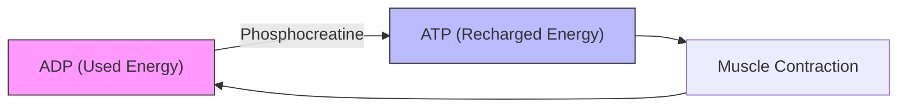

# The Science of Creatine: Unlocking Performance and Longevity

Creatine is arguably the most researched and effective nutritional supplement in the history of sports science. Often shrouded in myths—ranging from "it causes kidney damage" to "it’s a steroid"—creatine remains a misunderstood powerhouse for both athletes and the general population. This article explores the physiological mechanisms of creatine, its safety profile, and how to integrate it into your daily regimen.

## The Physiological Mechanism: How Creatine Fuels the Body

At the cellular level, your body operates on Adenosine Triphosphate (ATP). When you perform high-intensity, short-duration movements—like lifting a heavy weight or sprinting—your body consumes ATP rapidly. ATP loses a phosphate molecule, becoming Adenosine Diphosphate (ADP). To continue the effort, your body must convert ADP back into ATP.

Creatine acts as a "phosphate donor." It exists in your muscles as phosphocreatine. When ATP is depleted, phosphocreatine donates its phosphate group to ADP, effectively "recharging" your cellular battery. By increasing your intramuscular stores of phosphocreatine, you allow your muscles to maintain high-intensity output for a few seconds longer, which translates to more reps, more volume, and ultimately, greater strength gains. Scientific studies have shown that creatine supplementation can increase the consumer's performance in lifting weights via this creatine phosphate replenishment of ATP.

### Historical Context and Evolution
Creatine was discovered in 1832 by French chemist Michel Eugène Chevreul, who isolated it from meat extract. It wasn't until the 1990s, however, that it entered the mainstream sports world. Since then, the International Society of Sports Nutrition has published position stands regarding the safety and efficacy of creatine supplementation in exercise, sport, and medicine, cementing its status as a staple for both professional athletes and the general public.

## Comparison: Creatine Monohydrate vs. Other Forms

While the market is flooded with "advanced" versions of creatine (e.g., HCL, Ethyl Ester, Buffered), research consistently indicates that Creatine Monohydrate is the gold standard in terms of bioavailability and cost-effectiveness.

| Feature | Creatine Monohydrate | Creatine HCL | Creatine Ethyl Ester |
| :--- | :--- | :--- | :--- |
| **Bioavailability** | High (~99%) | High | Low |
| **Research Support** | Extensive | Limited | Negligible |
| **Cost** | Low | High | High |
| **Water Solubility** | Moderate | High | Low |

## Implementation and Practical Examples

To maximize the benefits of creatine, consistency is far more important than timing. Whether you take it with your morning coffee or a post-workout shake, the goal is to maintain muscle saturation.

### Practical Dosage Strategy
1. **Loading Phase (Optional):** 20g per day (split into 4 doses) for 5–7 days. This saturates muscle stores quickly but may cause digestive discomfort in some individuals.
2. **Maintenance Phase:** 3–5g per day. This is the recommended long-term approach for most individuals.

**Example Routine:**
*   **Morning:** 5g of Creatine Monohydrate mixed into a protein shake or water.
*   **Rationale:** Maintaining a consistent daily intake ensures that intramuscular phosphocreatine stores remain elevated.

### Technical Configuration: Tracking Your Progress
For those who enjoy data-driven fitness, you can use a simple Python script to track your creatine intake and strength progression.

```python
# Creatine Intake and Strength Tracker
class FitnessTracker:
    def __init__(self, name):
        self.name = name
        self.creatine_daily_grams = 5
        self.history = []

    def log_workout(self, lift_name, weight_kg):
        self.history.append({"lift": lift_name, "weight": weight_kg})
        print(f"Logged {lift_name} at {weight_kg}kg.")

# Usage
user = FitnessTracker("Athlete")
user.log_workout("Bench Press", 100)
```

### The Mechanism Diagram
The following diagram illustrates the ATP-PCr energy system:



## Safety and Addressing Uncertainties

*Disclaimer: While scientific literature generally supports the safety of creatine for healthy individuals, those with pre-existing renal conditions should consult a physician before supplementation.*

Is it safe to take every day? Yes. In fact, daily consumption is required to keep muscle phosphocreatine levels elevated. While in general, creatine supplementation results in slightly elevated creatinine levels, these remain within normal limits in healthy individuals, and supplementation does not induce kidney damage. If you stop taking it, your levels will return to baseline within 4–6 weeks.

**Common Myths:**
*   **Kidney Damage:** Extensive research has shown no adverse effects on kidney function in healthy individuals at standard doses.
*   **Bloating:** Creatine draws water into the muscle cells (intracellular). This is a sign of saturation and is a standard physiological response to supplementation.

In conclusion, creatine is a safe, effective, and cost-efficient tool for improving physical performance. By focusing on simple Creatine Monohydrate and maintaining a consistent daily dose, you can optimize your cellular energy production and support your long-term fitness goals.

## References

- [Creatine](https://en.wikipedia.org/wiki/Creatine)
- [Dietary supplement](https://en.wikipedia.org/wiki/Dietary%20supplement)
- [Pre-workout](https://en.wikipedia.org/wiki/Pre-workout)
- [Cerebral creatine deficiency](https://en.wikipedia.org/wiki/Cerebral%20creatine%20deficiency)
- [Bodybuilding supplement](https://en.wikipedia.org/wiki/Bodybuilding%20supplement)
- [Efficacy](https://en.wikipedia.org/wiki/Efficacy)
- [Flock Safety](https://en.wikipedia.org/wiki/Flock%20Safety)
- [Luminous efficacy](https://en.wikipedia.org/wiki/Luminous%20efficacy)
- [Cysteine](https://en.wikipedia.org/wiki/Cysteine)
- [Β-Hydroxy β-methylbutyric acid](https://en.wikipedia.org/wiki/%CE%92-Hydroxy%20%CE%B2-methylbutyric%20acid)
- [Caffeine use for sport](https://en.wikipedia.org/wiki/Caffeine%20use%20for%20sport)
- [Creatine transporter defect](https://en.wikipedia.org/wiki/Creatine%20transporter%20defect)