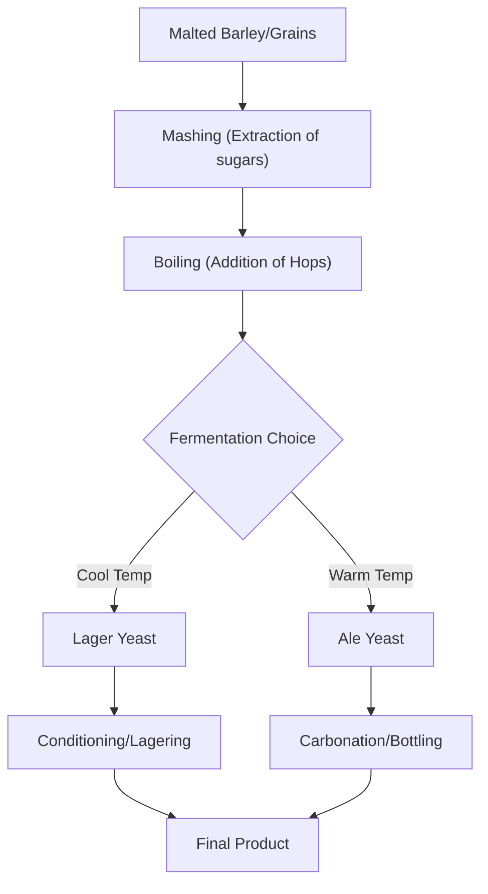

# The Spectrum of Brews: Decoding the World of Beer Styles

Beer is one of the most widely consumed alcoholic beverages in human history. To the uninitiated, the wall of taps at a craft brewery can look like an indecipherable code. Why is one beer golden and crisp while another is pitch-black and creamy? Why does an IPA hit the palate like a citrus explosion, while a Stout feels like a liquid dessert? Understanding beer comes down to foundational pillars: the fermentation process, the ingredients, and the specific production methods used by the brewer.

## The Great Divide: Lager vs. Ale

At the highest level of classification, most beers fall into two primary categories based on the yeast strain used and the temperature at which they ferment.

### 1. Lagers (The "Cool" Fermenters)
Lagers are defined by a process of cool fermentation followed by maturation in cold storage, a phase known as "lagering." The German word "Lager" literally means storeroom or warehouse. These beers typically use yeast strains that thrive in cooler temperatures. Because the yeast is less active at these temperatures, the fermentation is slower, resulting in a clean, refined character.
*   **Characteristics:** Generally crisp, clean, and refreshing. The lower fermentation temperature results in fewer esters, allowing the malt and hops to shine without interference.
*   **Examples:** Pilsner, Helles, Bock.

### 2. Ales (The "Warm" Fermenters)
Ales are typically made with yeast strains that prefer warmer temperatures. This environment encourages the yeast to produce more esters and phenols, leading to complex flavor profiles that can range from fruity and spicy to earthy and floral.
*   **Characteristics:** The warmer fermentation environment creates a broader spectrum of aromatic compounds.
*   **Examples:** IPA, Stout, Porter, Wheat Beer.

## Decoding Popular Styles

### IPA (India Pale Ale)
The IPA is a cornerstone of the modern craft beer movement. While often associated with the British colonial trade, the style is characterized by a higher hop content. It is important to note that the correct term is **India Pale Ale**. Some modern variations are even fermented with traditional lager yeast at colder temperatures, demonstrating how styles can evolve and overlap.
*   **Flavor Profile:** Dominantly bitter, citrusy, piney, or tropical, depending on the hop variety.

### Stout
Stouts are dark, opaque ales known for their roasted malt character. They are historically linked to the "Porter" style.
*   **Flavor Profile:** Notes of coffee, chocolate, and roasted grain.

### Comparison Table: A Quick Reference

| Style | Fermentation | Primary Flavor Notes | Color |
| :--- | :--- | :--- | :--- |
| **Lager** | Cool (Bottom) | Clean, crisp, bready | Light Straw to Gold |
| **IPA** | Warm (Top) | Hoppy, bitter, citrus | Gold to Copper |
| **Stout** | Warm (Top) | Coffee, chocolate, roasted | Deep Brown to Black |
| **Wheat** | Warm (Top) | Banana, clove, bready | Pale to Cloudy |

## The Technical Lifecycle of a Brew

To understand how these beers differ, we look at the brewing configuration. While methods vary, the logic remains consistent across the industry.



For those interested in the technical side of brewing, here is a simplified pseudocode representing the fermentation logic:

```python
class BeerBatch:
    def __init__(self, style, yeast_type, temp):
        self.style = style
        self.yeast = yeast_type
        self.temp = temp

    def ferment(self):
        # Lager yeast typically requires cooler temperatures
        if self.yeast == "S. pastorianus" and 7 <= self.temp <= 13:
            return "Lager: Clean, Crisp, Refined"
        # Ale yeast typically prefers warmer temperatures
        elif self.yeast == "S. cerevisiae" and 18 <= self.temp <= 24:
            return "Ale: Complex, Aromatic, Bold"
        else:
            return "Error: Yeast stress detected."
```

## Beyond the Basics

If you want to expand your palate, consider these categories:

1.  **Wheat Beers:** These use a high proportion of malted wheat. They are often unfiltered, appearing cloudy, and carry distinct notes of banana and clove or citrus.
2.  **Specialty Styles:** Many breweries experiment with ingredients like maize, rice, or oats to alter the body and flavor of the beer.
3.  **Regional Variations:** Beer styles are often categorized by their origin. For instance, the Canadian Prairies are known for a wide range of styles including lagers, blondes, pale ales, and malt-forward beers.

When exploring these beers, remember that freshness is a key variable. An IPA that sits on a shelf for an extended period will lose its vibrant hop aroma, regardless of how perfectly it was brewed. Always check the packaging date if available.

## References

- [Beer style](https://en.wikipedia.org/wiki/Beer%20style)
- [Beer](https://en.wikipedia.org/wiki/Beer)
- [Beer in Canada](https://en.wikipedia.org/wiki/Beer%20in%20Canada)
- [Taxonomy](https://en.wikipedia.org/wiki/Taxonomy)
- [Classification](https://en.wikipedia.org/wiki/Classification)
- [Euler characteristic](https://en.wikipedia.org/wiki/Euler%20characteristic)
- [List of beer styles](https://en.wikipedia.org/wiki/List%20of%20beer%20styles)
- [Beer in the United States](https://en.wikipedia.org/wiki/Beer%20in%20the%20United%20States)
- [Brewing](https://en.wikipedia.org/wiki/Brewing)
- [Genesee Brewing Company](https://en.wikipedia.org/wiki/Genesee%20Brewing%20Company)
- [Difference in differences](https://en.wikipedia.org/wiki/Difference%20in%20differences)
- [Symmetric difference](https://en.wikipedia.org/wiki/Symmetric%20difference)