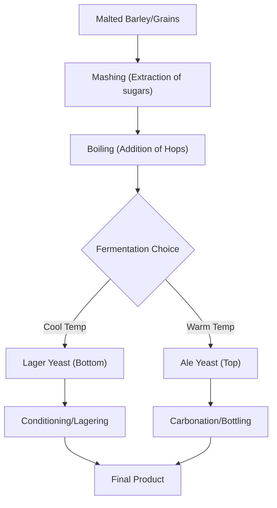

# The Spectrum of Brews: Decoding the World of Beer Styles

Beer is one of the most widely consumed alcoholic beverages in human history. To the uninitiated, the wall of taps at a craft brewery can look like an indecipherable code. Why is one beer golden and crisp while another is pitch-black and creamy? Why does an IPA hit the palate like a citrus explosion, while a Stout feels like a liquid dessert? Understanding beer comes down to foundational pillars: the fermentation process, the ingredients, and the specific production methods used by the brewer.

## The Great Divide: Lager vs. Ale

At the highest level of classification, most beers fall into two primary categories based on the yeast strain used and the temperature at which they ferment. Top-fermentation refers to ale yeast that works at the top of the tank, while bottom-fermentation refers to lager yeast that settles at the bottom during the process.

### 1. Lagers (The "Cool" Fermenters)
Lagers are defined by a process of cool fermentation followed by maturation in cold storage, a phase known as "lagering." The German word "Lager" literally means storeroom or warehouse. Lagering is not just about storing beer in a barrel; it is a precise maturation process where the beer is kept at cold temperatures for an extended period to allow yeast and impurities to settle, resulting in a clean, refined character. These beers typically use yeast strains that thrive in cooler temperatures.
*   **Characteristics:** Generally crisp, clean, and refreshing. The lower fermentation temperature results in fewer esters, allowing the malt and hops to shine without interference.
*   **Examples:** Pilsner, Helles, Bock. "Bock" is a traditional strong German lager style, and Shiner Bock is a well-known example that brings this style to a wider audience.

### 2. Ales (The "Warm" Fermenters)
Ales are typically made with yeast strains that prefer warmer temperatures. This environment encourages the yeast to produce more esters and phenols, leading to complex flavor profiles that can range from fruity and spicy to earthy and floral.
*   **Characteristics:** The warmer fermentation environment creates a broader spectrum of aromatic compounds.
*   **Examples:** IPA, Stout, Porter, Wheat Beer.

## Decoding Popular Styles

### IPA (India Pale Ale)
The IPA is a cornerstone of the modern craft beer movement. While often associated with the British colonial trade, the term "India" does not necessarily mean the beer originated in India; rather, it refers to the historical practice of adding extra hops to beers destined for the long sea voyage to India to prevent spoilage. It is important to note that the correct term is **India Pale Ale**.
*   **Flavor Profile:** Dominantly bitter, citrusy, piney, or tropical, depending on the hop variety.

### Stout and Dunkel
Stouts are dark, opaque ales known for their roasted malt character. They are historically linked to the "Porter" style. In contrast, "Dunkel" is a German term meaning "dark," referring to a specific lager style. While a Stout offers intense coffee and chocolate notes from roasted barley, a Dunkel uses dark malts to provide a smoother, bready, and nutty profile characteristic of a clean-finishing lager.
*   **Flavor Profile:** Stouts feature coffee and roasted grain notes, while Dunkels are known for their smooth, toasted malt character.

### Hefeweizen
Hefeweizen is the quintessential German wheat beer. "Hefe" means yeast, and "Weizen" means wheat. Because it is unfiltered, the yeast remains in the beer, giving it a cloudy appearance and a signature flavor profile defined by notes of banana and clove.

### Light Lager and Michelob Ultra
Beers like Michelob Ultra are marketed as "Light Lagers." In this context, "light" refers not just to a lower alcohol content, but specifically to reduced calories and carbohydrates. While a standard beer might contain around 150 calories per 12 oz serving, Michelob Ultra is produced by ensuring the yeast consumes almost all available sugars during fermentation, resulting in a significantly lower calorie count.

### Comparison Table: A Quick Reference

| Style | Fermentation | Primary Flavor Notes | Color |
| :--- | :--- | :--- | :--- |
| **Lager** | Bottom | Clean, crisp, bready | Light Straw to Gold |
| **IPA** | Top | Hoppy, bitter, citrus | Gold to Copper |
| **Stout** | Top | Coffee, chocolate, roasted | Deep Brown to Black |
| **Hefeweizen** | Top | Banana, clove, bready | Pale to Cloudy |

## The Technical Lifecycle of a Brew

To understand how these beers differ, we look at the brewing configuration. While methods vary, the logic remains consistent across the industry.

## Beyond the Basics

If you want to expand your palate, consider these categories:

1.  **Wheat Beers:** These use a high proportion of malted wheat. They are often unfiltered, appearing cloudy, and carry distinct notes of banana and clove or citrus.
2.  **Specialty Styles:** Many breweries experiment with ingredients like maize, rice, or oats to alter the body and flavor of the beer.
3.  **Regional Variations:** Beer styles are often categorized by their origin. For instance, the Canadian Prairies are known for a wide range of styles including lagers, blondes, pale ales, and malt-forward beers.

When exploring these beers, remember that freshness is a key variable. An IPA that sits on a shelf for an extended period will lose its vibrant hop aroma, regardless of how perfectly it was brewed. Always check the packaging date if available.

## References

- [Beer style](https://en.wikipedia.org/wiki/Beer%20style)
- [Beer](https://en.wikipedia.org/wiki/Beer)
- [Beer in Canada](https://en.wikipedia.org/wiki/Beer%20in%20Canada)
- [Taxonomy](https://en.wikipedia.org/wiki/Taxonomy)
- [Classification](https://en.wikipedia.org/wiki/Classification)
- [Euler characteristic](https://en.wikipedia.org/wiki/Euler%20characteristic)
- [List of beer styles](https://en.wikipedia.org/wiki/List%20of%20beer%20styles)
- [Beer in the United States](https://en.wikipedia.org/wiki/Beer%20in%20the%20United%20States)
- [Brewing](https://en.wikipedia.org/wiki/Brewing)
- [Genesee Brewing Company](https://en.wikipedia.org/wiki/Genesee%20Brewing%20Company)
- [Difference in differences](https://en.wikipedia.org/wiki/Difference%20in%20differences)
- [Symmetric difference](https://en.wikipedia.org/wiki/Symmetric%20difference)
