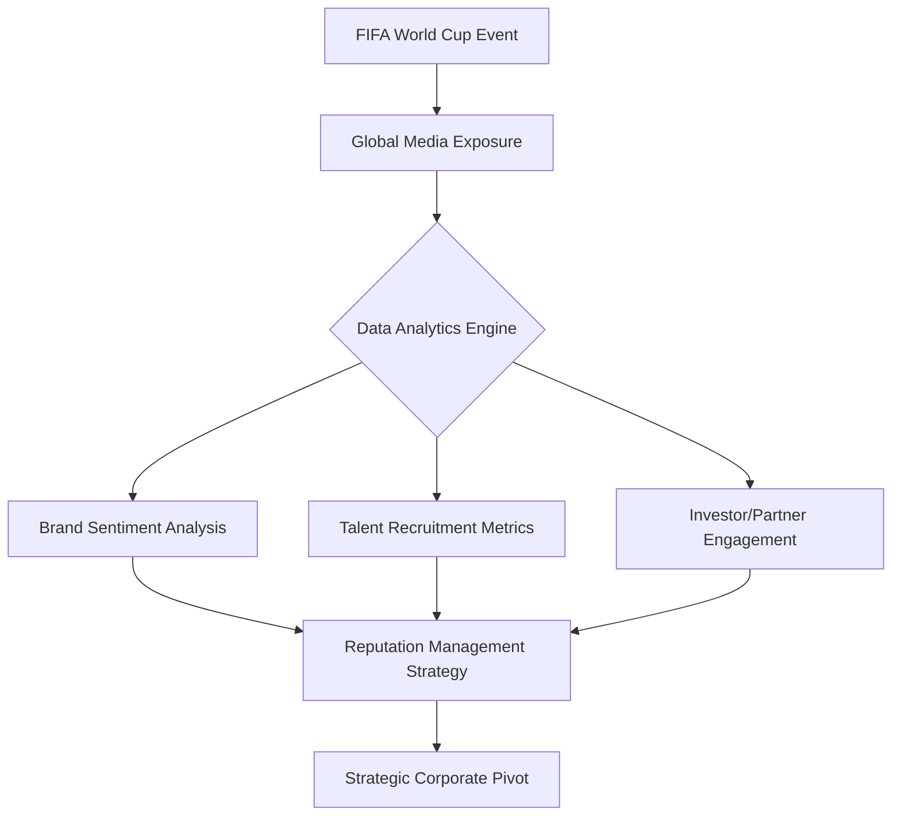

# Beyond the Pump: Why B2B Giants Like Aramco Sponsor the FIFA World Cup

In the high-stakes world of global marketing, the FIFA World Cup stands as the ultimate stage. With billions of eyes glued to screens for a month, it is the natural habitat for consumer-facing brands like Hyundai or Coca-Cola. These companies rely on "Top of Mind" awareness to drive daily transactions. However, when a company like Saudi Aramco—the world’s largest oil producer—takes a prominent spot on the stadium perimeter boards, observers often scratch their heads. Why would a B2B (Business-to-Business) energy giant spend hundreds of millions of dollars to advertise to the general public?

The answer lies in a sophisticated shift in corporate strategy that moves beyond simple product sales. It is about reputation management, geopolitical signaling, and the transition toward a new energy future.

## The Mechanism of B2B Brand Equity

While Aramco does not sell gasoline to the average driver in a retail sense, it is deeply embedded in the global supply chain. B2B refers to trade and commercial activity where a business sees other businesses as its customer base. Its sponsorship strategy is not designed to make an individual buy a gallon of fuel; it is designed to influence the B2B ecosystem and stakeholders who hold power over the company's future.

### 1. The "License to Operate" and Reputation
For massive energy conglomerates, public perception is a form of currency. By associating with the prestige and global unity of the World Cup, Aramco aims to humanize its brand. It moves the narrative away from "faceless oil giant" toward "global partner in progress." This is crucial when dealing with international governments, NGOs, and environmental regulators who may be skeptical of fossil fuel extraction.

### 2. Talent Acquisition and Retention
Aramco is not just an oil company; it is a massive engineering and technology firm. To maintain its dominance, it must compete with global tech giants for the world’s best engineers, data scientists, and project managers. A high-profile presence in global sports signals that the company is modern, ambitious, and part of the global cultural zeitgeist, making it an attractive employer for top-tier global talent.

### 3. Signaling the Energy Transition
Perhaps most importantly, Aramco uses these platforms to communicate its pivot. As the world moves toward decarbonization, Aramco is investing in hydrogen, carbon capture, and renewable technologies. Sponsoring the world's most-watched event allows them to broadcast their long-term goals to a global audience, effectively framing the company as a leader in the energy transition rather than a relic of the fossil fuel age.

## Comparison: B2B vs. B2C Sponsorship Objectives

| Feature | B2C (e.g., Retail Brands) | B2B (e.g., Aramco) |
| :--- | :--- | :--- |
| **Primary Goal** | Immediate sales/market share | Brand legitimacy/Partnerships |
| **Target Audience** | General consumers | Investors, Governments, Talent |
| **Success Metric** | Conversion rates, Retail traffic | Stakeholder sentiment, ESG ratings |
| **Time Horizon** | Short-term (Quarterly) | Long-term (Decadal) |

## The Digital and Technical Infrastructure of Sponsorship

Modern sports sponsorship is a data-driven operation. Aramco utilizes digital integration to track the "halo effect" of its sponsorship. Below is a simplified conceptual model of how a B2B firm tracks the impact of a global sports event.



To optimize these campaigns, firms often deploy configuration scripts to manage real-time ad serving and sentiment tracking. A basic configuration for a sentiment-tracking dashboard might look like this:

```yaml
# Conceptual Configuration for Sponsorship Impact Monitoring
monitoring_system:
  target_event: "FIFA_World_Cup_2026"
  metrics:
    - social_sentiment_index
    - recruitment_portal_traffic
    - b2b_partner_inquiries
  data_sources:
    - twitter_api
    - linkedin_talent_analytics
    - internal_crm_leads
  thresholds:
    alert_sentiment_drop: -0.15
    conversion_goal: "increase_b2b_leads_by_15%"
```

## Historical Context: From Industry to Identity
Historically, B2B companies stayed in the shadows, preferring private meetings and industry trade shows. However, the 21st century has changed the rules. As global markets become more interconnected, the line between "corporate identity" and "national identity" has blurred. 

Saudi Aramco’s sponsorship is also an extension of Saudi Arabia’s "Vision 2030." By sponsoring global events, the company promotes the Kingdom as a modern, open, and investment-ready nation. In this context, the sponsorship is not just about oil; it is about national branding.

## Uncertain Claims and Future Outlook
It is important to note that the direct Return on Investment (ROI) of such massive sponsorships remains a subject of intense debate among financial analysts. While the "branding halo" is theoretically sound, it is difficult to quantify exactly how much a World Cup ad contributes to a multi-billion dollar project contract. Furthermore, some critics argue that "Sportswashing"—the use of sports to improve a reputation tarnished by human rights or environmental concerns—is the true, albeit unspoken, objective. These claims remain speculative and are often contested by the corporations involved.

Ultimately, Aramco’s presence at the World Cup is a testament to the fact that in the modern economy, even the largest industrial giants must act like consumer brands. Whether to attract the next generation of engineers, satisfy global investors, or signal a transition to clean energy, the "B2B" label is no longer an excuse to stay off the global stage.

## References

- [Brazilian submarine Álvaro Alberto](https://en.wikipedia.org/wiki/Brazilian%20submarine%20%C3%81lvaro%20Alberto)
- [Acquisition of 21st Century Fox by Disney](https://en.wikipedia.org/wiki/Acquisition%20of%2021st%20Century%20Fox%20by%20Disney)
- [U.S. Strategic Bitcoin Reserve](https://en.wikipedia.org/wiki/U.S.%20Strategic%20Bitcoin%20Reserve)
- [Sponsor (commercial)](https://en.wikipedia.org/wiki/Sponsor%20%28commercial%29)
- [Fiscal sponsorship](https://en.wikipedia.org/wiki/Fiscal%20sponsorship)
- [Child sponsorship](https://en.wikipedia.org/wiki/Child%20sponsorship)
- [Yahoo](https://en.wikipedia.org/wiki/Yahoo)
- [Alibaba Group](https://en.wikipedia.org/wiki/Alibaba%20Group)
- [Peter Thiel](https://en.wikipedia.org/wiki/Peter%20Thiel)
- [DHL](https://en.wikipedia.org/wiki/DHL)
- [Sports marketing](https://en.wikipedia.org/wiki/Sports%20marketing)
- [Business-to-business](https://en.wikipedia.org/wiki/Business-to-business)