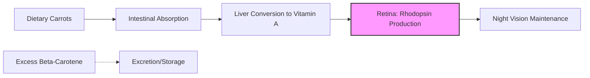

# Myth or Visionary Truth: Do Carrots Actually Improve Your Eyesight?

For generations, parents have coaxed children into finishing their vegetables with the promise that "carrots will help you see in the dark." This piece of dietary folklore is so deeply embedded in global culture that it has become a shorthand for healthy living. But is there genuine scientific merit to the claim, or is it merely a remnant of clever wartime propaganda? To understand the relationship between carrots and ocular health, we must peel back the layers of biology, history, and nutritional science.

## The Biological Mechanism: Beta-Carotene and Rhodopsin

The core of the "carrots improve vision" argument lies in the vegetable’s high concentration of beta-carotene. When we consume carrots, our bodies convert this pigment into Vitamin A (retinol). Vitamin A is a critical component of rhodopsin, a light-absorbing molecule found in the retina that is necessary for both low-light (scotopic) vision and color vision.

Without sufficient Vitamin A, the body cannot produce enough rhodopsin, leading to a condition known as night blindness. In severe cases of deficiency, this can progress to conditions that threaten overall ocular health. However, it is vital to distinguish between *maintaining* vision and *improving* vision. If your Vitamin A levels are already adequate, consuming extra beta-carotene will not grant you "super vision." The body regulates the conversion of beta-carotene into Vitamin A; once physiological needs are met, excess intake is largely stored or excreted. Notably, only about 3 percent of the beta-carotene in raw carrots is released during digestion, though this can be improved through preparation.

### Comparison: Nutritional Impact on Ocular Health

| Nutrient | Primary Source | Mechanism | Impact on Vision |
| :--- | :--- | :--- | :--- |
| **Beta-Carotene** | Carrots, Sweet Potatoes | Precursor to Vitamin A | Prevents night blindness |
| **Lutein** | Spinach, Kale | Filters blue light | Supports macular health |
| **Omega-3** | Salmon, Flaxseed | Anti-inflammatory | Alleviates dry eye symptoms |
| **Vitamin C** | Citrus, Bell Peppers | Antioxidant | Protects against oxidative stress |

## Historical Context: The WWII Propaganda Machine

The widespread belief that carrots are the ultimate "vision food" is, in part, a successful military disinformation campaign. During the Second World War, the British developed new airborne interception radar technology, which allowed pilots to shoot down enemy aircraft with accuracy at night.

To keep this technology a secret from the Germans, the British Air Ministry released a press statement claiming that their pilots’ success was due to a strict diet of carrots. The campaign was so effective that the British public began consuming vast quantities of carrots to improve their own night vision during mandatory blackouts. This myth persisted long after the war, solidified by government-sponsored propaganda that encouraged a vegetable-heavy diet to support the national war effort.

## Practical Implementation: Optimizing Your Intake

While carrots won't give you night vision, they remain a vital part of a balanced diet. Because Vitamin A is fat-soluble, the bioavailability of beta-carotene is significantly increased when carrots are consumed with a source of healthy fat.

If you are interested in tracking your nutritional intake to ensure your eyes receive the necessary precursors for health, you might use a simple Python script to calculate your beta-carotene intake based on your diet.

```python
def calculate_beta_carotene(carrot_grams):
    """
    Estimates beta-carotene content in mg based on weight.
    """
    # Average beta-carotene content varies; 0.08mg/g is a common estimate.
    BETA_CAROTENE_PER_GRAM = 0.08
    total_mg = carrot_grams * BETA_CAROTENE_PER_GRAM
    return round(total_mg, 2)

# Example: Daily intake calculation
daily_intake = calculate_beta_carotene(150)
print(f"Estimated beta-carotene intake: {daily_intake}mg")
```

### The Visual Pathway: A Simplified Flow

The following diagram illustrates how the body processes carotenoids to support the retinal cycle:



## Qualifying the Claims

It is important to note that while Vitamin A is essential for eye health, it is not a cure-all for refractive errors. If you suffer from myopia (nearsightedness), hyperopia (farsightedness), or astigmatism, eating carrots will not change the shape of your eyeball or the focus of your lens. These conditions are structural and require corrective measures.

Furthermore, excessive consumption of beta-carotene can lead to harmless skin discoloration. In some cases, dietary habits can even affect other bodily functions; for instance, excess beta-carotene intake can cause human feces to appear orange. 

In conclusion, while the idea that carrots grant superhuman vision is a myth rooted in wartime deception, the vegetable remains a nutritional powerhouse. It is essential for preventing deficiency-related blindness and maintaining the health of your retinal proteins, but it should be viewed as one component of a holistic approach to eye care that includes regular check-ups and a varied diet.

## References

- [Wagon-wheel effect](https://en.wikipedia.org/wiki/Wagon-wheel%20effect)
- [Object permanence](https://en.wikipedia.org/wiki/Object%20permanence)
- [Human feces](https://en.wikipedia.org/wiki/Human%20feces)
- [Effect](https://en.wikipedia.org/wiki/Effect)
- [Streisand effect](https://en.wikipedia.org/wiki/Streisand%20effect)
- [Armstrong effect](https://en.wikipedia.org/wiki/Armstrong%20effect)
- [Visual perception](https://en.wikipedia.org/wiki/Visual%20perception)
- [Visual acuity](https://en.wikipedia.org/wiki/Visual%20acuity)
- [Night vision](https://en.wikipedia.org/wiki/Night%20vision)
- [Carrot](https://en.wikipedia.org/wiki/Carrot)
- [List of common misconceptions about science, technology, and mathematics](https://en.wikipedia.org/wiki/List%20of%20common%20misconceptions%20about%20science%2C%20technology%2C%20and%20mathematics)
- [Alternative versions of Superman](https://en.wikipedia.org/wiki/Alternative%20versions%20of%20Superman)