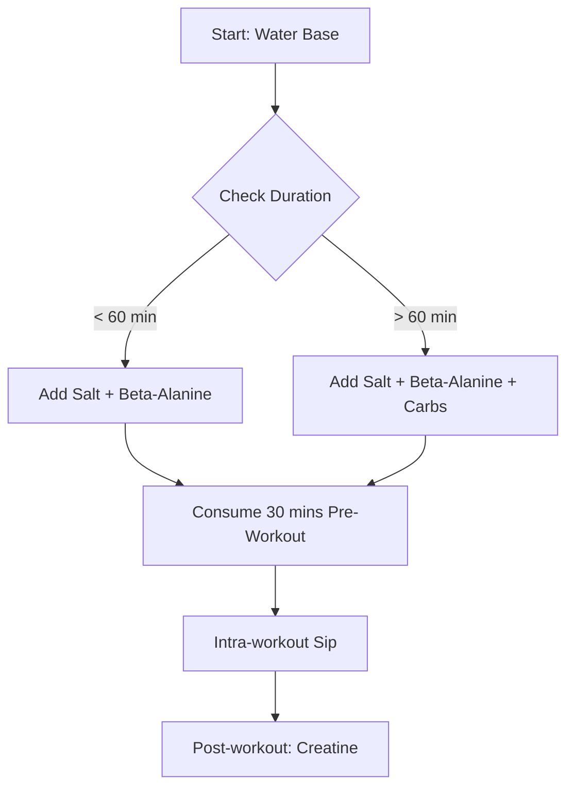

# The DIY Pre-Workout Concoction: Analyzing Your Electrolyte and Ergogenic Blend

In the pursuit of peak athletic performance, many fitness enthusiasts have moved away from commercial pre-workout supplements—often laden with artificial sweeteners, proprietary blends, and excessive caffeine—in favor of "homemade" alternatives. Your specific blend of organic lime juice, pink salt, water, beta-alanine, and creatine represents a minimalist, evidence-based approach to metabolic support. 

This article deconstructs the physiological mechanisms of your drink, evaluates its efficacy, and proposes refinements to optimize your performance.

## The Physiological Mechanisms of Your Ingredients

To understand why this mixture works, we must analyze the role of each component within the context of cellular bioenergetics and fluid homeostasis.

### 1. Hydration and Electrolytes: Pink Salt and Water
Pink Himalayan salt is primarily sodium chloride with trace minerals. Sodium is the primary extracellular electrolyte, essential for maintaining blood volume and facilitating the sodium-potassium pump, which is critical for nerve impulse transmission and muscle contraction. During exercise, sodium loss through sweat can lead to cramping and fatigue.

### 2. Ergogenic Aids: Beta-Alanine and Creatine
*   **Beta-Alanine:** This non-proteinogenic amino acid is often studied alongside creatine for its role in exercise performance. It is a precursor to carnosine, which acts as an intracellular pH buffer in skeletal muscle. During high-intensity exercise, hydrogen ions ($H^+$) accumulate, lowering muscle pH and contributing to fatigue. Beta-alanine supplementation helps increase muscle carnosine levels.
*   **Creatine Monohydrate:** Creatine is a well-established ergogenic aid that appears to improve anaerobic capacity and muscle mass. It increases phosphocreatine (PCr) stores in the muscle, allowing for the rapid resynthesis of ATP during short, explosive bursts of energy.

### 3. Metabolic Support: Organic Lime Juice
Beyond flavor, lime juice provides a small dose of Vitamin C and citric acid. While its direct ergogenic effect is minimal, the acidity may assist in digestion. However, users should be aware that high-dose antioxidant intake around training sessions is a subject of ongoing research regarding its potential impact on muscle adaptation.

## Comparative Analysis of Supplement Profiles

| Ingredient | Primary Function | Mechanism of Action | Optimal Timing |
| :--- | :--- | :--- | :--- |
| **Creatine** | ATP Resynthesis | Increases PCr stores | Daily (Consistency > Timing) |
| **Beta-Alanine** | pH Buffering | Increases muscle carnosine | Daily (Split doses to avoid paresthesia) |
| **Sodium (Salt)** | Hydration | Fluid balance/Nerve signaling | Pre/Intra-workout |
| **Lime Juice** | Flavor | Digestive aid | Pre-workout |

## Practical Implementation and Refinement

While your mixture is effective, there are areas for improvement based on current sports science.

### The "Paresthesia" Factor
Beta-alanine is known for causing *paresthesia*—a tingling sensation on the skin. If your dosage exceeds 1.5g to 2g per serving, this can be distracting. Furthermore, beta-alanine is a saturation-based supplement; it does not need to be consumed immediately before a workout to be effective, though many prefer the sensation as a psychological cue.

### Proposed Refinements
1.  **Add Carbohydrates:** If your workout exceeds 60 minutes, adding a fast-digesting carbohydrate will help fuel glycogen stores.
2.  **Timing Adjustment:** Consider taking your creatine consistently throughout the day, perhaps post-workout with a meal, as this supports long-term muscle saturation.
3.  **Potassium Inclusion:** If you are sweating heavily, consider adding a source of potassium to support the sodium-potassium balance required for proper muscle function.

## Technical Workflow: Supplement Mixing Logic

To ensure the efficacy of your blend, the following logic ensures optimal saturation and absorption.



```python
def calculate_preworkout_mix(duration_minutes, salt_grams, beta_alanine_grams):
    """
    Basic logic for adjusting electrolyte needs based on workout duration.
    """
    base_water_ml = 500
    if duration_minutes > 90:
        salt_grams += 0.5  # Increase sodium for longer endurance
    
    return {
        "water_ml": base_water_ml,
        "sodium_g": salt_grams,
        "beta_alanine_g": beta_alanine_grams
    }
```

## Historical Context
The use of salts for performance dates back to ancient practices where athletes consumed salted water to prevent exhaustion. The scientific formalization of creatine began in the 1990s, revolutionizing powerlifting and bodybuilding. Your blend is a modern synthesis: combining traditional electrolyte wisdom with 20th-century sports science.

*Disclaimer: These suggestions are for informational purposes. Consult a medical professional before altering your supplement regimen, especially regarding high sodium intake if you have pre-existing blood pressure conditions.*

## References

- [Self-efficacy](https://en.wikipedia.org/wiki/Self-efficacy)
- [Particle swarm optimization](https://en.wikipedia.org/wiki/Particle%20swarm%20optimization)
- [Hit to lead](https://en.wikipedia.org/wiki/Hit%20to%20lead)
- [Pre-workout](https://en.wikipedia.org/wiki/Pre-workout)
- [Comparing the Short-Term Effect of Creatine, Beta-Alanine, Combine Creatine*Beta-Alanine on Torque of Knee Extensor Muscles](https://doi.org/10.15373/2249555x/feb2014/103)
- [Zone Electrophoresis of Muscle Extracts : Separation of Phosphocreatine, Creatine, Beta-Alanine Peptides, and Nucleotides](https://doi.org/10.1038/173205a0)
- [The Effect Of Beta-alanine And Creatine Monohydrate Supplementation On Muscle Composition And Exercise Performance](https://doi.org/10.1249/00005768-200505001-01832)