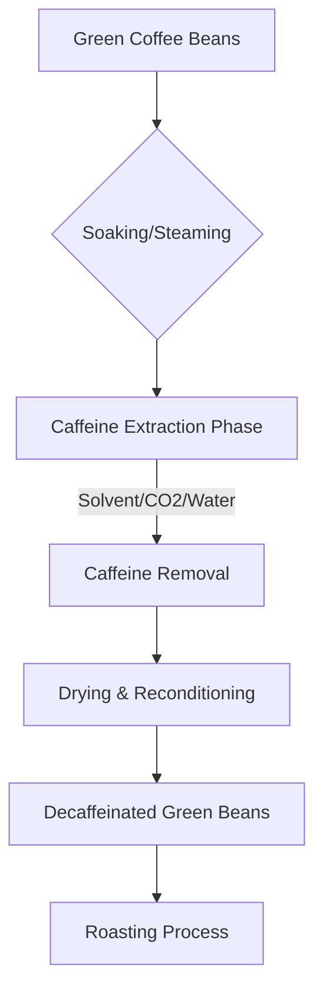

# The Science of Decaf: Unveiling the Truth Behind Caffeine Removal

For many coffee enthusiasts, the ritual of brewing a cup is about the aroma, the flavor profile, and the warmth—not necessarily the stimulating effect of caffeine. Decaffeinated coffee, or "decaf," has long been a staple for those sensitive to stimulants or those who enjoy a late-night brew. However, there is a persistent myth circulating in coffee culture: the idea that roasting coffee beans for a longer period (a "darker roast") effectively burns off the caffeine, resulting in a naturally decaffeinated product. 

In this article, we will dissect the truth behind this misconception, explore the sophisticated chemical processes used to extract caffeine, and provide a comprehensive comparison between regular and decaf coffees.

## The Roasting Myth: Does Dark Roast Mean Less Caffeine?

The short answer is **no**. Caffeine is a remarkably stable alkaloid molecule. It does not simply evaporate or "burn off" during the roasting process, even at the high temperatures required for a dark French or Italian roast.

While it is true that caffeine is slightly volatile, the temperatures required to degrade caffeine significantly would essentially turn the coffee bean into charcoal. By the time you reached a temperature high enough to remove a meaningful amount of caffeine, the bean would be completely incinerated and unusable for brewing.

However, there is a nuance regarding volume versus weight. Because dark roast beans are roasted longer, they lose more moisture and become less dense. If you measure your coffee by the "scoop" (volume), a dark roast might contain slightly less caffeine than a light roast simply because there is less physical mass in that scoop. But if you measure by weight, which is the professional standard, the caffeine content remains virtually identical between a light and dark roast of the same origin. In general, dark-roast coffee has very slightly less caffeine than light-roast coffee, but the difference is negligible for the consumer.

## How Decaffeination Actually Works

Since roasting is not the answer, how do we get the caffeine out? The challenge is to remove the caffeine while leaving behind the hundreds of compounds responsible for the coffee’s flavor and aroma. Most decaffeination methods occur while the beans are still "green" (raw and unroasted).

### Common Decaffeination Methods

1.  **The Solvent Process (Direct/Indirect):** Uses chemical solvents like Methylene Chloride or Ethyl Acetate to bond with caffeine molecules.
2.  **The Swiss Water Process:** A method that uses osmosis and a "Green Coffee Extract" (GCE) to pull caffeine out of the beans through a carbon filter.
3.  **Supercritical Carbon Dioxide (CO2) Process:** Uses pressurized CO2 to act as a selective solvent, targeting caffeine while leaving flavor oils intact.

Below is a conceptual representation of the caffeine extraction workflow:



### Comparative Analysis: Regular vs. Decaf

| Feature | Regular Coffee | Decaffeinated Coffee |
| :--- | :--- | :--- |
| **Caffeine Content** | High (varies by bean/brew) | Reduced (typically 97% removed) |
| **Flavor Profile** | Full range of origin notes | Milder; depends on process |
| **Chemical Stability** | Highly stable | Stable, but porous due to processing |
| **Roasting Time** | Standard | Often requires careful monitoring |
| **Processing** | None (Post-harvest) | Required (Pre-roast) |

*Note: Decaffeination is the process of extracting caffeine from green coffee beans prior to roasting. Decaffeinated products are commonly available to those who wish to avoid the stimulating effects of caffeine.*

## Technical Consideration: Monitoring Extraction

For those interested in the chemistry of coffee, we can model the caffeine extraction rate using a simplified Python function. This is a hypothetical representation of how a lab might track caffeine concentration during a solvent-based extraction process over time ($t$).

```python
def calculate_caffeine_removal(initial_caffeine, time_minutes, efficiency_constant):
    """
    Simulates the concentration of caffeine in green beans
    based on a first-order decay model.
    """
    import math
    
    # Final caffeine = Initial * e^(-kt)
    final_caffeine = initial_caffeine * math.exp(-efficiency_constant * time_minutes)
    return round(final_caffeine, 2)

# Example: 100mg caffeine, 120 minutes process, 0.03 constant
result = calculate_caffeine_removal(100, 120, 0.03)
print(f"Remaining caffeine: {result}mg")
```

## Practical Examples and Considerations

When purchasing decaf, look for labels that specify the process. The Swiss Water Process is highly regarded by specialty coffee roasters because it avoids synthetic solvents, relying instead on water and carbon filters. 

If you are a home roaster, do not attempt to "decaffeinate" your beans by over-roasting them. You will only produce a bitter, acrid cup of coffee. If you prefer the flavor of dark roasts but want less caffeine, the best approach is to purchase high-quality decaffeinated beans that have been processed using the CO2 or water methods, which preserve the bean's structure and flavor profile effectively.

*Disclaimer: While the information regarding caffeine stability during roasting is widely accepted in food science, individual biological responses to trace caffeine in decaf can vary. Always consult a medical professional if you have strict caffeine restrictions due to health conditions.*

## References

- [Coffee roasting](https://en.wikipedia.org/wiki/Coffee%20roasting)
- [Coffee](https://en.wikipedia.org/wiki/Coffee)
- [Espresso machine](https://en.wikipedia.org/wiki/Espresso%20machine)
- [Decaffeination](https://en.wikipedia.org/wiki/Decaffeination)
- [List of coffee drinks](https://en.wikipedia.org/wiki/List%20of%20coffee%20drinks)
- [Coffee production](https://en.wikipedia.org/wiki/Coffee%20production)
- [History of coffee](https://en.wikipedia.org/wiki/History%20of%20coffee)
- [Luckin Coffee](https://en.wikipedia.org/wiki/Luckin%20Coffee)
- [Caffeinated drink](https://en.wikipedia.org/wiki/Caffeinated%20drink)
- [Caffeine](https://en.wikipedia.org/wiki/Caffeine)
- [Vietnamese iced coffee](https://en.wikipedia.org/wiki/Vietnamese%20iced%20coffee)
- [Caffeine toxicity](https://en.wikipedia.org/wiki/Caffeine%20toxicity)