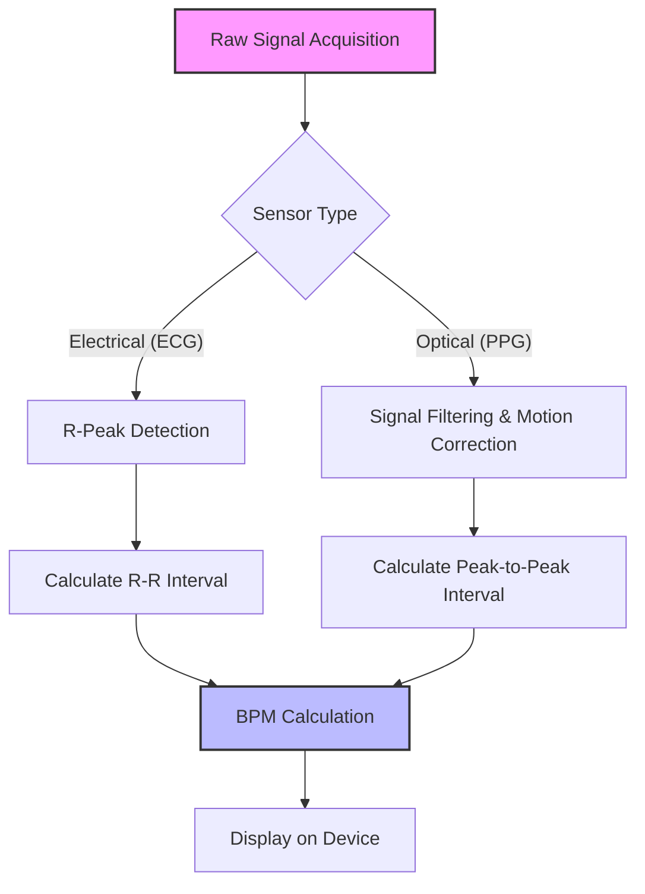

# Decoding the Pulse: A Comparative Analysis of Garmin HRM-Pro and Apple Watch Heart Rate Sensing

In the world of wearable technology, few metrics are as scrutinized as the heart rate. Whether you are an elite athlete pushing your anaerobic threshold or a casual walker tracking daily activity, understanding how your device captures your pulse is essential. The Garmin HRM-Pro and the Apple Watch represent two distinct philosophies in biometric monitoring: the dedicated chest-worn electrocardiogram (ECG) sensor versus the wrist-based photoplethysmography (PPG) array.

While both devices aim to provide an accurate representation of your cardiovascular performance, the physical mechanisms behind their data acquisition are fundamentally different.

## The Mechanism of Measurement: Electrical vs. Optical

### Garmin HRM-Pro: The Gold Standard of Electrical Sensing
The Garmin HRM-Pro utilizes electrocardiography (ECG). When your heart beats, it generates an electrical impulse that triggers the contraction of the cardiac muscle. The HRM-Pro features conductive electrodes integrated into the fabric strap. When worn snugly against the skin—typically moistened by sweat or conductive gel—these electrodes detect the electrical activity of the heart. Because this method measures electrical impulses directly, it is widely considered a highly accurate method for heart rate monitoring, particularly during high-intensity interval training (HIIT) or rapid changes in heart rate.

### Apple Watch: The Versatility of Photoplethysmography (PPG)
The Apple Watch primarily relies on photoplethysmography (PPG). This optical technique utilizes LED lights paired with light-sensitive photodiodes. When your heart beats, blood flow in your wrist increases, causing more light to be absorbed by the tissue. Between beats, blood volume decreases, and more light is reflected back to the sensor. By sampling this light absorption, the Apple Watch calculates the heart rate. While the Apple Watch also features an electrical sensor in the Digital Crown for single-lead ECG snapshots, its continuous background heart rate monitoring during workouts remains an optical process.

## Comparative Overview

| Feature | Garmin HRM-Pro | Apple Watch (PPG-based) |
| :--- | :--- | :--- |
| **Primary Method** | Electrical (ECG) | Optical (PPG) |
| **Placement** | Chest (Sternum) | Wrist |
| **Best For** | HIIT, Sprints, Heavy Lifting | Daily Tracking, Running, Cycling |
| **Signal Integrity** | High (Direct contact) | Variable (Motion artifacts) |

## Technical Logic and Data Flow

To understand how these devices process data, we can look at a simplified logic flow of how a wearable converts raw signals into a heart rate (BPM) value.



In a software environment, developers often handle PPG data with filtering to remove "noise" caused by wrist movement. A pseudo-code representation of this filtering might look like:

```python
def calculate_bpm(raw_signal, sampling_rate=100):
    # Apply bandpass filter to remove motion noise
    filtered_signal = bandpass_filter(raw_signal, low=0.5, high=4.0)
    
    # Identify peaks in the signal
    peaks = find_peaks(filtered_signal)
    
    # Calculate average time between peaks
    intervals = np.diff(peaks)
    bpm = 60 / (np.mean(intervals) / sampling_rate)
    
    return bpm
```

## Practical Implications and Accuracy

Historically, chest straps were the primary method for reliable heart rate data during exercise. Optical sensors were once reserved for clinical equipment, but the "wearable revolution" brought PPG technology to consumer fitness devices. However, optical sensors can be susceptible to "motion artifacts." When you swing your arms during a sprint, the watch may shift, potentially creating gaps in data. The Garmin HRM-Pro circumvents this by being placed on the torso, which remains relatively stable regardless of arm movement.

It is important to note that validation studies for consumer devices like the Apple Watch are ongoing. While some studies have explored the accuracy of these devices for heart rate and energy expenditure, performance can vary based on the user's activity, such as wheelchair propulsion or specific cardiovascular conditions. Users should be aware that skin conditions, including tattoos, have been reported to impact the performance of the Apple Watch's optical sensors.

## Conclusion
If your priority is precision for performance metrics, the Garmin HRM-Pro remains a robust choice due to its electrical sensing mechanism. If your priority is the seamless integration of health data into a lifestyle ecosystem, the Apple Watch’s PPG system offers a level of convenience and multi-functional utility that is highly effective for general fitness tracking.

## References

- [Heart rate monitor](https://en.wikipedia.org/wiki/Heart%20rate%20monitor)
- [Comparison](https://en.wikipedia.org/wiki/Comparison)
- [Comparison of ICBMs](https://en.wikipedia.org/wiki/Comparison%20of%20ICBMs)
- [File comparison](https://en.wikipedia.org/wiki/File%20comparison)
- [Estimation of Heart Rate Variability Measures Using Apple Watch and Evaluating Their Accuracy](https://doi.org/10.1145/3453892.3462647)
- [Accuracy of Apple Watch Measurements for Heart Rate and Energy Expenditure in Patients With Cardiovascular Disease: Cross-Sectional Study (Preprint)](https://doi.org/10.2196/preprints.11889)
- [Accuracy of the Apple Watch Series 4 and Fitbit Versa for Assessing Energy Expenditure and Heart Rate of Wheelchair Users During Treadmill Wheelchair Propulsion: Cross-sectional Study (Preprint)](https://doi.org/10.2196/preprints.52312)