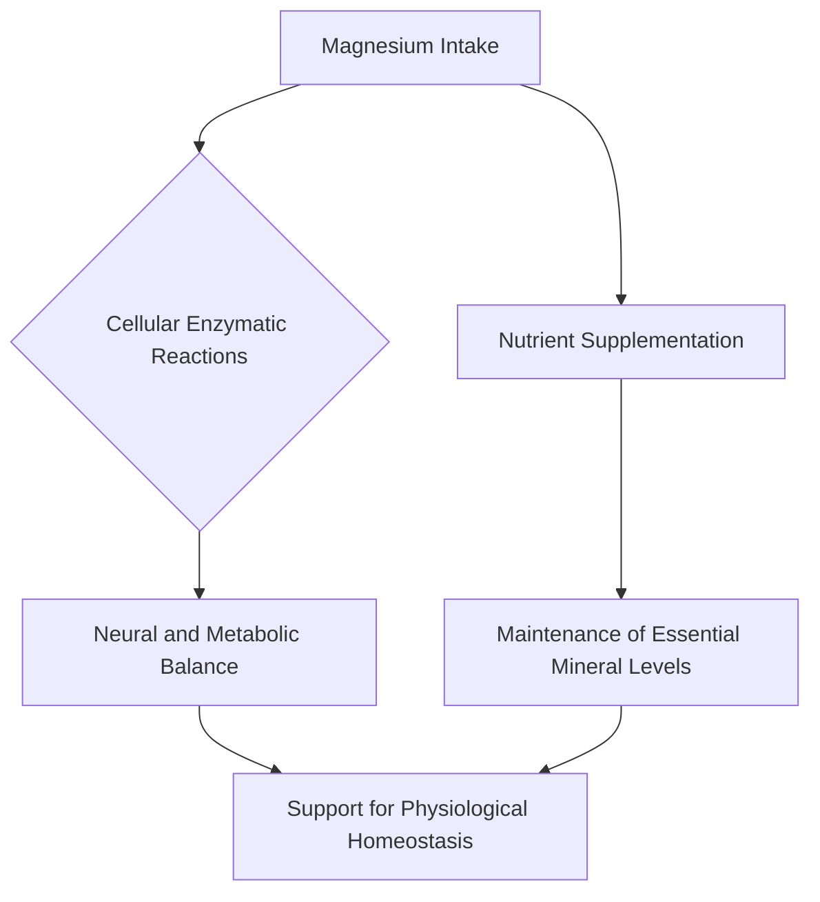

# The Science of Nocturnal Magnesium: Unlocking Restorative Sleep

For years, magnesium has been discussed in wellness circles as a mineral that may support relaxation. As an essential mineral involved in over 300 enzymatic reactions within the human body, its role in maintaining metabolic and neural balance is well-documented. In recent years, the trend of supplementing with magnesium before bedtime has moved from holistic wellness circles into mainstream sleep hygiene discussions. But what does the science actually say about taking magnesium before sleep, and how does it interact with our internal biological processes?

## The Biochemical Mechanisms: How Magnesium Interacts with the Body

At the center of interest regarding magnesium’s potential role in sleep is its interaction with the neurotransmitter gamma-aminobutyric acid (GABA). GABA is the primary inhibitory neurotransmitter in the central nervous system; it acts as a "brake" for the brain, slowing down neural activity.

While magnesium is known to be a cofactor for many enzymatic reactions, research into its specific impact on sleep is ongoing. Magnesium is an essential mineral required for neural and metabolic balance. Some researchers investigate whether magnesium modulates receptors that influence neural excitability. By supporting the body's baseline physiological functions, magnesium helps create an environment that may be conducive to rest.

Beyond neurotransmitters, magnesium is essential for the body's overall homeostasis. Chronic stress can lead to physiological strain, and maintaining adequate levels of essential minerals is a standard recommendation for general health.

### Comparison of Magnesium Forms

Not all magnesium supplements are created equal. The bioavailability and characteristics vary significantly depending on the chemical compound.

| Magnesium Form | Bioavailability | Primary Characteristic |
| :--- | :--- | :--- |
| **Magnesium Glycinate** | High | Highly bioavailable form of magnesium |
| **Magnesium Citrate** | Moderate | Often used in dietary supplements |
| **Magnesium Oxide** | Low | Lower absorption rate |
| **Magnesium Gluconate** | Moderate | A common magnesium salt |

*Note: The effectiveness of these specific forms for sleep is still being studied, and individual tolerance varies significantly.*

## Historical Context and Modern Application

Magnesium was first isolated by Sir Humphry Davy in 1808, but its use in traditional contexts dates back much further. Today, we understand that magnesium is a cofactor for the production of adenosine triphosphate (ATP), the energy currency of cells. While it may seem counterintuitive that a mineral involved in energy production supports sleep, it is this role in cellular efficiency that allows the body to maintain the physiological balance necessary for restorative states.

### Practical Implementation: The "Sleep Hygiene" Configuration

To integrate magnesium into a routine, one must consider dosage and individual health needs. Most general recommendations suggest consulting a professional to determine appropriate intake.

```python
# A simple configuration script for tracking supplement intake
class SleepProtocol:
    def __init__(self, supplement_name, dosage_mg):
        self.supplement = supplement_name
        self.dosage = dosage_mg

    def display_routine(self):
        print(f"Consult a professional regarding the intake of {self.dosage}mg of {self.supplement}.")

# Example usage
magnesium_routine = SleepProtocol("Magnesium Glycinate", 300)
magnesium_routine.display_routine()
```

The following diagram illustrates the relationship between magnesium and physiological balance:



## Potential Uncertainties and Future Research

While anecdotal interest is high, the scientific community remains cautious. Much of the current data on magnesium comes from studies on its role as an essential mineral rather than as a direct sleep medication. It is not yet fully clear whether healthy individuals with adequate dietary magnesium intake will see significant improvements in sleep quality from supplementation. 

Furthermore, "quality of sleep" is a complex metric. While magnesium is a vital nutrient, more rigorous, large-scale, double-blind, placebo-controlled trials are required to determine its specific impact on sleep architecture. Always consult with a healthcare professional before beginning a new supplement regimen, as magnesium can interact with certain medications, including antibiotics and blood pressure drugs.

In conclusion, magnesium serves as a foundational mineral for physiological health. By supporting essential enzymatic functions, it remains a subject of interest for those looking to maintain their overall well-being.

## References

- [Sleep deprivation](https://en.wikipedia.org/wiki/Sleep%20deprivation)
- [Bedtime procrastination](https://en.wikipedia.org/wiki/Bedtime%20procrastination)
- [Sleepy girl mocktail](https://en.wikipedia.org/wiki/Sleepy%20girl%20mocktail)
- [Benefit](https://en.wikipedia.org/wiki/Benefit)
- [Magnesium Glycinate](https://doi.org/10.22541/au.175494709.93626317/v1)
- [Magnesium Glycinate](https://doi.org/10.32388/0ja21q)
- [Structural characterization of calcium glycinate, magnesium glycinate and zinc glycinate](https://doi.org/10.1142/s1793545816500528)