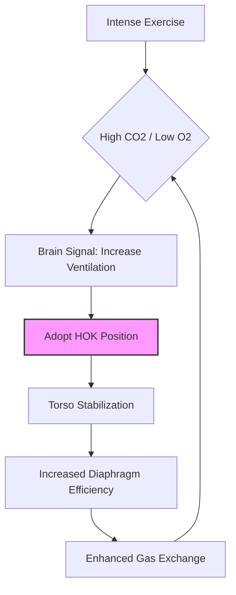

# The Science of the "Hands-on-Knees" Recovery Position: Why We Bend Over After Intense Exercise

Have you ever finished a grueling set of high-intensity intervals or a demanding sprint, only to find yourself instinctively doubling over, hands pressed firmly against your knees? It is a universal human reflex. Whether you are a professional athlete or a weekend warrior, the moment the heart rate spikes and the lungs burn, the body seems to demand this specific posture. But why do we do it? Is it merely a sign of defeat, or is there a sophisticated physiological mechanism at play that helps us recover faster?

## The Mechanics of Respiratory Efficiency

When we exercise intensely, our muscles demand significantly more oxygen, and our bodies must work overtime to expel the resulting carbon dioxide. This creates a state of respiratory distress. The instinct to bend over—often called the "hands-on-knees" (HOK) position—is not just an attempt to catch our breath; it is a mechanical optimization of our respiratory system.

### The Diaphragm and Thoracic Cavity
In an upright position, the diaphragm—the primary muscle of respiration—must work against gravity and the weight of the abdominal viscera. When you hunch over and plant your hands on your knees, you are effectively "locking" your upper torso. This stabilization allows your accessory respiratory muscles, such as the intercostals and the muscles in the neck and shoulders, to work more efficiently. 

By fixing the arms, you create a stable base that allows these muscles to pull on the rib cage more effectively, potentially increasing the volume of air you can inhale and exhale in a single breath. This is a concept known as "reverse origin-insertion" mechanics, where the muscles that usually move the arms are repurposed to stabilize the thorax, allowing the primary respiratory muscles to focus entirely on ventilation.

### Comparison: Upright Recovery vs. Hands-on-Knees

| Feature | Upright Standing | Hands-on-Knees (HOK) |
| :--- | :--- | :--- |
| **Diaphragm Load** | High (must fight gravity) | Reduced (stabilized by torso angle) |
| **Accessory Muscles** | Primarily postural | Primarily respiratory/stabilizing |
| **Thoracic Expansion** | Limited by posture | Maximized via thoracic fixation |
| **Recovery Rate** | Slower | Faster (based on preliminary studies) |
| **Core Engagement** | Minimal | High (stabilization required) |

*Note: While many experts suggest HOK is superior for recovery, individual preference and the specific nature of the exercise play a significant role in recovery outcomes.*

## Historical Context and Evolutionary Perspectives

The "hands-on-knees" posture is often viewed by coaches and traditionalists as a sign of "weakness." In many athletic cultures, standing tall with hands on hips is considered the "proper" way to recover, signaling dominance and mental fortitude. However, this is largely a cultural construct rather than a physiological one.

Evolutionarily, humans are built for endurance. Our ability to dissipate heat and manage oxygen debt is a hallmark of our species. The HOK position might be an ancestral adaptation to maximize oxygen intake after a period of intense exertion—such as running from a predator or chasing prey—allowing the individual to return to a functional state as quickly as possible. The stigma against this position in modern sports is likely a psychological training tool to discourage athletes from showing fatigue, rather than a reflection of biological reality.

## Technical Modeling: The Respiratory Loop

To understand how the body manages this, we can look at the respiratory feedback loop. When CO2 levels rise, the brain signals an increase in ventilation. The HOK position acts as a "hardware optimization" for this loop.



### Practical Implementation: How to Optimize Your Recovery
If you want to maximize your recovery between sets, follow these steps:
1. **Stabilize:** Place your feet shoulder-width apart.
2. **Anchor:** Firmly place your hands or forearms on your knees.
3. **Align:** Keep your spine relatively neutral to avoid compressing the abdomen too tightly.
4. **Breathe:** Focus on deep, rhythmic diaphragmatic breaths (belly breathing) rather than shallow, rapid chest breaths.

### Code: Simulating Recovery Heart Rate (Python)
While we cannot measure your lungs directly, we can simulate the recovery trend using a simple decay model.

```python
import matplotlib.pyplot as plt

def simulate_recovery(time_steps, recovery_rate):
    hr = [180] # Starting heart rate
    for t in range(1, time_steps):
        # Recovery follows a logarithmic decay
        new_hr = hr[-1] - (recovery_rate * (180 - 60) / 100)
        hr.append(max(60, new_hr))
    return hr

# HOK position might increase the 'recovery_rate' constant
recovery_data = simulate_recovery(60, 2.5) 
print(f"Heart rate after 60 seconds: {recovery_data[-1]:.0f} BPM")
```

## Conclusion: Fact-Checking the Reflex
The instinct to bend over is a sophisticated biological response to metabolic stress. By fixing the torso, we reduce the workload on our respiratory muscles, allowing for more efficient gas exchange. While the "hands on hips" posture is often preferred for optics, the science increasingly supports the "hands on knees" approach for those who prioritize physiological recovery over social signaling. As we continue to study the biomechanics of elite athletes, it is clear that listening to these innate bodily cues is often smarter than adhering to arbitrary aesthetic rules.

## References

- [Strength training](https://en.wikipedia.org/wiki/Strength%20training)
- [Running](https://en.wikipedia.org/wiki/Running)
- [Massage](https://en.wikipedia.org/wiki/Massage)
- [Powerlifting](https://en.wikipedia.org/wiki/Powerlifting)
- [Rheumatoid arthritis- hands and knees](https://doi.org/10.53347/rid-151677)
- [Untitled](https://doi.org/10.7717/peerj.25/table-2)
- [Del got on his hands and knees](https://doi.org/10.14321/j.ctv7xbs3s.23)