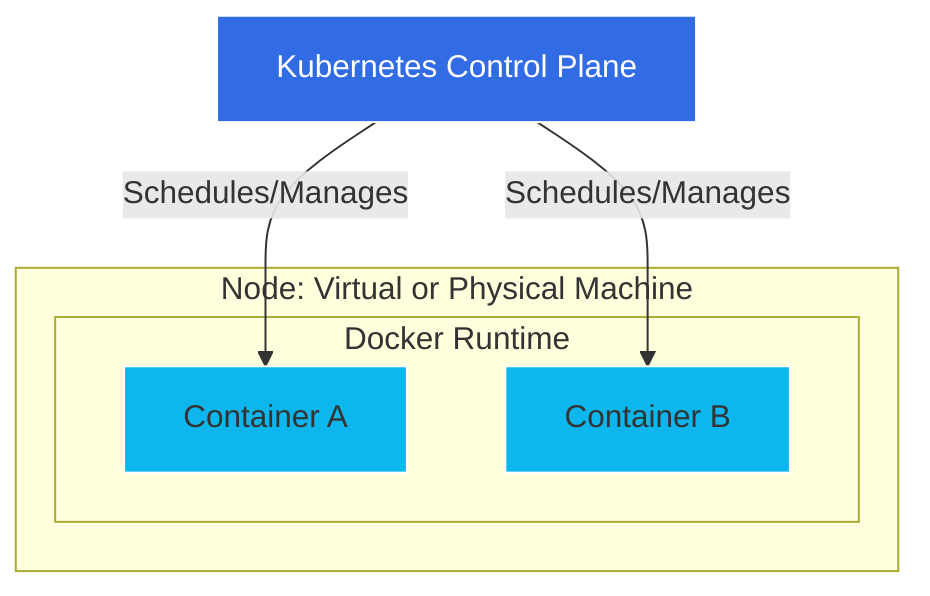

# Containerization Decoded: Understanding Docker and Kubernetes

In the modern era of cloud-native development, the terms "Docker" and "Kubernetes" are frequently mentioned together. While they are both pillars of the container ecosystem, they serve fundamentally different purposes. To understand their relationship, one must first understand the transition from traditional virtualization to containerization.

## Docker: The Engine of Containerization

Docker emerged in 2013, fundamentally changing how software is packaged and deployed. Before Docker, developers often struggled with the "it works on my machine" problem—a scenario where code runs perfectly on a developer's laptop but fails in production due to environmental discrepancies.

### The Mechanism of Docker
Docker uses OS-level virtualization to deliver software in packages called "containers." Unlike virtual machines (VMs) that require a full guest operating system, containers share the host system's kernel while isolating the application processes.

A Docker container is defined by a `Dockerfile`, a simple text file containing instructions to build an image.

```dockerfile
# Example Dockerfile for a Python application
FROM python:3.9-slim
WORKDIR /app
COPY . .
RUN pip install -r requirements.txt
CMD ["python", "app.py"]
```

By packaging the code, runtime, system tools, and libraries into a single image, Docker ensures that the application runs identically regardless of the environment.

## Kubernetes: The Orchestration Layer

If Docker is the tool for building and running a single container, Kubernetes (often abbreviated as K8s, derived from the Ancient Greek term for "helmsman" or "pilot") is the platform for managing clusters of them. Kubernetes is an open-source container orchestration platform originally developed by Google.

### Why Do We Need Orchestration?
As applications scale, managing containers manually becomes impossible. You need to handle:
*   **Service Discovery:** How do containers find each other?
*   **Load Balancing:** How do you distribute traffic across multiple instances?
*   **Self-healing:** What happens if a container crashes?
*   **Scaling:** How do you add more replicas during high traffic?

Kubernetes automates these operational tasks. It operates on a "declarative" model: you define the desired state of your cluster (e.g., "I want 3 replicas of my web server"), and Kubernetes continuously works to match the current state to that desired state.

### The Relationship: A Visual Overview

The following diagram illustrates how Docker provides the runtime environment, while Kubernetes acts as the management plane.



## Comparative Analysis: Docker vs. Kubernetes

It is a common misconception to view this as a "Docker vs. Kubernetes" competition. In reality, they are complementary technologies. Docker is a container runtime (the engine), while Kubernetes is the orchestration system (the fleet manager).

| Feature | Docker | Kubernetes |
| :--- | :--- | :--- |
| **Primary Goal** | Packaging and execution | Orchestration and management |
| **Scope** | Single node (typically) | Multi-node clusters |
| **Scaling** | Manual | Automated |
| **Self-healing** | Manual restart | Automatic restart/reschedule |
| **Complexity** | Low | High |

*Note: While Docker Swarm is a native orchestration tool included with Docker, it is generally considered less feature-rich than Kubernetes for enterprise-scale deployments.*

## Practical Example: Deployment Workflow

In a typical professional workflow, the process follows these steps:

1.  **Development:** A developer writes code and creates a `Dockerfile`.
2.  **Build:** The developer runs `docker build` to create an image and pushes it to a container registry.
3.  **Orchestration:** The developer or DevOps engineer writes a Kubernetes deployment manifest (`deployment.yaml`).

```yaml
apiVersion: apps/v1
kind: Deployment
metadata:
  name: my-app
spec:
  replicas: 3
  selector:
    matchLabels:
      app: web
  template:
    metadata:
      labels:
        app: web
    spec:
      containers:
      - name: my-app
        image: my-registry/my-app:v1
        ports:
        - containerPort: 80
```

4.  **Deployment:** Using `kubectl apply -f deployment.yaml`, the configuration is sent to the Kubernetes API server, which instructs the nodes to pull the container image and start the containers.

## Conclusion and Caveats

Docker and Kubernetes have revolutionized the software development lifecycle. Docker provides the consistency needed for development, and Kubernetes provides the resilience and scalability needed for production.

*Qualification:* It should be noted that the container runtime landscape is evolving. While Docker remains a standard, technologies like `containerd` and `CRI-O` are increasingly used as the underlying runtimes within Kubernetes clusters. Furthermore, managed Kubernetes services—provided by companies like Alibaba, Amazon, Google, and Microsoft—have significantly lowered the barrier to entry by handling the complex management of the Kubernetes control plane itself.

## References

- [Containerization (computing)](https://en.wikipedia.org/wiki/Containerization%20%28computing%29)
- [Container Linux](https://en.wikipedia.org/wiki/Container%20Linux)
- [Traefik Proxy](https://en.wikipedia.org/wiki/Traefik%20Proxy)
- [GitHub Codespaces](https://en.wikipedia.org/wiki/GitHub%20Codespaces)
- [KubeAdaptor: A Docking Framework for Workflow Containerization on Kubernetes](http://arxiv.org/abs/2207.01222v1)
- [XI Commandments of Kubernetes Security: A Systematization of Knowledge Related to Kubernetes Security Practices](http://arxiv.org/abs/2006.15275v1)
- [Comparison between Docker and Kubernetes based Edge Architectures for Enabling Remote Model Predictive Control for Aerial Robots](http://arxiv.org/abs/2212.05966v1)
- [Installing Kubernetes Using Docker](https://doi.org/10.1007/978-1-4842-1907-2_1)
- [Microservices Architecture Using Docker and Kubernetes](https://doi.org/10.36948/ijfmr.2023.v05i05.12095)
- [Containerization with Docker and Kubernetes](https://doi.org/10.1007/978-1-4842-3897-4_4)