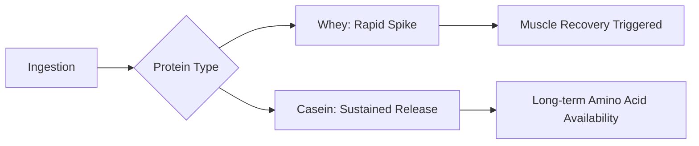

# The Science of Milk Proteins: Whey, Isolate, and Casein Explained

When you walk into a supplement store or browse the fitness aisle, the sheer volume of protein powders can be overwhelming. Terms like "Whey," "Isolate," and "Casein" are frequently used, yet the biochemical differences between them are often misunderstood. While they all originate from the same source—cow’s milk—they behave very differently once they enter your system.

Understanding these proteins is not just about muscle building; it is about understanding how your body processes amino acids, how digestion speeds vary, and how to optimize your nutrition based on your specific lifestyle goals.

## The Dairy Foundation: How Milk Becomes Powder

Milk is composed primarily of water, but its solid content consists of two main protein groups: **Casein** (roughly 80% of the proteins in cow's milk) and **Whey** (roughly 20%). 

Historically, whey was considered a waste product of the cheese-making process. For centuries, cheesemakers would discard the liquid byproduct left over after the milk had curdled and the curds (casein) were removed to make cheese. It was not until the late 20th century that food scientists recognized this liquid as a high-quality, complete protein source containing essential amino acids, including α-lactalbumin.

### The Mechanism of Digestion
The primary difference between these proteins lies in their digestion kinetics and their physical state during the digestive process.

*   **Whey Protein:** Known as a "fast-acting" protein. It is a mixture of proteins isolated from the liquid byproduct of cheese production. Upon ingestion, it is rapidly processed, leading to a quick increase in blood amino acid levels. This makes it a popular choice for post-workout recovery when the body requires efficient delivery of amino acids.
*   **Casein Protein:** Known as a "slow-acting" or "time-release" protein. When casein reaches the acidic environment of the stomach, it coagulates, forming a gel or "clot." This physical change slows the breakdown process, providing a sustained release of amino acids into the bloodstream over a longer duration compared to whey.

## Comparing Protein Profiles

To understand which protein fits your needs, we must look at the processing levels. Whey concentrate is the most basic form, while isolate undergoes further filtration to remove fats and lactose.

| Feature | Whey Concentrate | Whey Isolate | Casein |
| :--- | :--- | :--- | :--- |
| **Protein Content** | 70–80% | 90%+ | 80% |
| **Digestion Speed** | Fast | Very Fast | Slow |
| **Lactose Content** | Moderate | Low/None | Moderate |
| **Best Use Case** | General protein intake | Post-workout/Lactose sensitive | Before bed/Long fasts |
| **Price** | Affordable | Premium | Moderate/Premium |

### Whey Isolate: The Refined Choice
Whey isolate is produced through advanced filtration processes designed to separate the protein from the fat and milk sugar (lactose). For individuals who experience digestive distress from standard whey concentrate, the isolate is often the preferred solution because the lactose levels are significantly reduced.

### Casein: The "Night-Time" Protein
Because of its slow-digesting properties, casein is often utilized by athletes who wish to maintain a steady supply of amino acids during periods of fasting, such as overnight.

## Practical Implementation: When to Use What

If you are designing a nutrition strategy, consider the following "Protein Timeline":

1.  **Morning/Post-Workout:** Use **Whey Isolate or Concentrate**. Your body is likely in need of nutrients, and the rapid absorption profile of whey helps facilitate the availability of amino acids.
2.  **During the Day:** Either works, but whey is generally more convenient for quick shakes.
3.  **Before Bed:** Use **Casein**. By providing a slow, sustained release of amino acids, it supports your nutritional needs throughout the night.

### Infographic: The Protein Absorption Curve

*Note: The absorption rates mentioned above are based on standard physiological models. Individual metabolic rates, gut microbiome health, and the presence of other macronutrients can influence these timelines. These claims should be viewed as general guidelines.*

## Historical Context and Modern Trends
The rise of the protein supplement industry is a byproduct of the fitness boom of the late 20th century. As bodybuilding transitioned from a niche subculture to a mainstream lifestyle, the demand for convenient, high-quality protein led to the industrialization of whey extraction. Today, we see a shift toward diverse protein sources, but milk-derived proteins remain a "gold standard" due to their complete amino acid profile and high bioavailability.

When selecting a product, always check the label for added fillers. High-quality isolates should have a concise ingredient list. If a product contains excessive maltodextrin or artificial thickeners, you may be paying for carbohydrates rather than high-quality protein.

Ultimately, protein is a tool. Whether you choose whey or casein depends on your schedule and your body’s tolerance to dairy. By mastering the timing of these proteins, you can better support your physical goals, whether that involves building muscle, maintaining lean mass, or simply meeting your daily nutritional requirements.

## References

- [Whey protein](https://en.wikipedia.org/wiki/Whey%20protein)
- [Protein quality](https://en.wikipedia.org/wiki/Protein%20quality)
- [Index of protein-related articles](https://en.wikipedia.org/wiki/Index%20of%20protein-related%20articles)
- [Alligator](https://en.wikipedia.org/wiki/Alligator)
- [Gelation of single heated vs. double heated whey protein isolate](https://doi.org/10.1016/j.idairyj.2005.10.024)
- [Modification of Micellar Casein Isolate Alters Protein Degradation Pathways and Peptide Generation during In Vivo Gastrointestinal Digestion](https://doi.org/10.1021/acs.jafc.6c00266.s001)
- [Structure-Based Development of Isoform-Selective Inhibitors of Casein Kinase 1 vs Casein Kinase 1](https://doi.org/10.1021/acs.jmedchem.2c01180.s002)