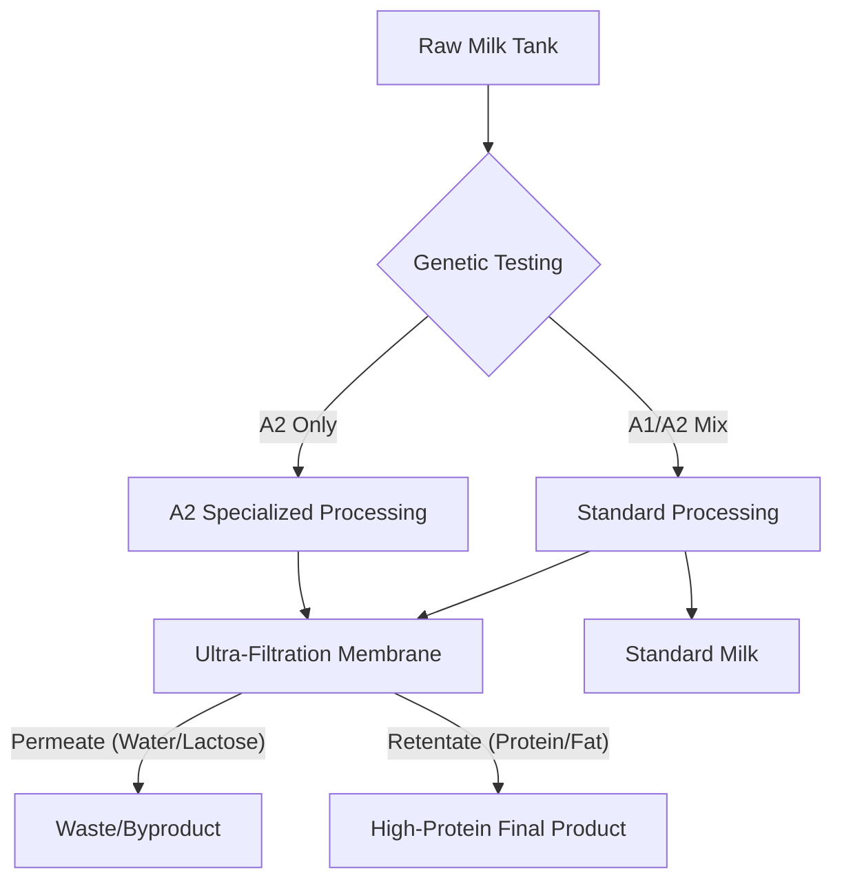

# Beyond the Carton: Understanding A2 Milk and High-Protein Filtration

The dairy aisle has undergone a quiet revolution over the last decade. Once a commodity section dominated by varying levels of fat content, it is now a landscape of specialized functional milks. Two of the most significant shifts in this market are the rise of "A2" milk and the proliferation of "ultra-filtered" high-protein milks, such as those popularized by brands like Fairlife. While both products derive from cow's milk, their differences lie in the fundamental biology of the proteins and the mechanical processes of modern dairy technology.

## The A2 Difference: Genetic Selection and Digestive Comfort

To understand A2 milk, one must first understand the primary protein in milk: casein. Casein makes up about 80% of the protein in cow’s milk, and it exists in several variations. The two most common forms of beta-casein are A1 and A2.

### Historical and Biological Context
Historically, all cattle produced only the A2 variant of the beta-casein protein. Thousands of years ago, a genetic mutation occurred in European herds, leading to the emergence of the A1 beta-casein variant. Over time, due to selective breeding, A1 became the dominant variant in many commercial dairy herds across the Western world.

The primary difference between A1 and A2 lies in a single amino acid sequence. When the A1 protein is digested, it produces a peptide called beta-casomorphin-7 (BCM-7). Some research suggests that BCM-7 may be linked to digestive discomfort in certain individuals, mimicking symptoms of lactose intolerance, such as bloating and abdominal pain. A2 milk, sourced from cows genetically tested to produce only A2 beta-casein, does not produce BCM-7 during digestion.

### The Scientific Debate
It is important to note that the scientific consensus on A2 milk is still evolving. While proponents argue that A2 milk is easier to digest for those who experience "dairy sensitivity" (distinct from a true lactose allergy or intolerance), many clinical studies remain inconclusive. Some researchers suggest that the perceived benefits may be partially due to the placebo effect or that the discomfort associated with milk is more often related to the lactose content or the A1 protein interaction combined with other factors.

## The Engineering of High-Protein Milk: Ultra-Filtration

While A2 milk is a product of genetic selection, brands like Fairlife represent a triumph of food engineering. The high-protein content in these milks is not achieved by adding protein powder, but rather by physically separating the components of milk through membrane filtration.

### The Ultra-Filtration Mechanism
The process used is known as ultra-filtration. This technology involves passing milk through a series of fine-mesh membranes. These membranes are selective, allowing water, vitamins, minerals, and lactose to pass through, while retaining the larger protein and fat molecules.

By removing a portion of the water and lactose, the concentration of the remaining components—specifically the protein—increases significantly. This is why ultra-filtered milk often has higher protein content than conventional milk. Because the lactose is physically filtered out, these milks are also naturally lactose-free, making them an excellent choice for those with lactose sensitivity, regardless of the A1/A2 protein status.

### Comparison Table: Conventional vs. A2 vs. Ultra-Filtered

| Feature | Conventional Milk | A2 Milk | Ultra-Filtered (e.g., Fairlife) |
| :--- | :--- | :--- | :--- |
| **Protein Source** | A1 & A2 Mix | A2 Only | A1 & A2 Mix (usually) |
| **Protein Level** | Standard (~8g/cup) | Standard (~8g/cup) | Elevated |
| **Lactose Content** | Standard | Standard | Low/None (Filtered out) |
| **Primary Benefit** | Nutritional Baseline | Potential Digestive Ease | High Protein, Low Sugar |
| **Production Method** | Standard Pasteurization | Genetic Selection | Membrane Filtration |

## Visualizing the Dairy Processing Flow

The following diagram illustrates how these two distinct categories are produced within the dairy supply chain:

## Practical Considerations for the Consumer

When choosing between these products, the decision should be based on your specific health goals and digestive needs:

1.  **If you experience digestive discomfort:** You should first determine if the issue is lactose-related. If you are lactose intolerant, ultra-filtered milks (like Fairlife) are likely your best option, as the lactose is physically removed. If you find that you are lactose-tolerant but still experience bloating after consuming dairy, A2 milk might be worth testing to see if the A1 protein is the culprit.
2.  **If you are looking for fitness benefits:** Ultra-filtered milk is often preferred for muscle recovery and satiety. The increased protein density per calorie makes it a popular option for athletes or those looking to increase their daily protein intake without excessive sugar.
3.  **Cost and Availability:** It is important to acknowledge that both A2 and ultra-filtered milks carry a price premium. This is due to the costs associated with the genetic testing of herds for A2 and the significant capital investment required for ultra-filtration membrane technology.

## Conclusion

The evolution of the dairy aisle reflects a broader trend in food science: the movement toward functional nutrition. A2 milk targets the specific biological interaction of proteins to address digestive sensitivities, while ultra-filtered milk utilizes advanced filtration to manipulate the nutritional profile of the product. Understanding these differences allows consumers to move beyond the label and select the milk that best aligns with their individual physiological needs and lifestyle goals.

## References

- [Milk](https://en.wikipedia.org/wiki/Milk)
- [January–March 2023 in science](https://en.wikipedia.org/wiki/January%E2%80%93March%202023%20in%20science)
- [American and British English spelling differences](https://en.wikipedia.org/wiki/American%20and%20British%20English%20spelling%20differences)
- [Alligator](https://en.wikipedia.org/wiki/Alligator)
- [Science or Snake Oil: is A2 milk better for you than regular cow’s milk?](https://doi.org/10.64628/aa.ehmteyhu9)
- [To sell the cow and drink the milk: How could China harmonize its growth and risk?](https://doi.org/10.37473/dac/10.1002/ijfe.2306)
- [To sell the cow and drink the milk: How could China harmonize its growth and risk?](https://doi.org/10.37473/fic/10.1002/ijfe.2306)