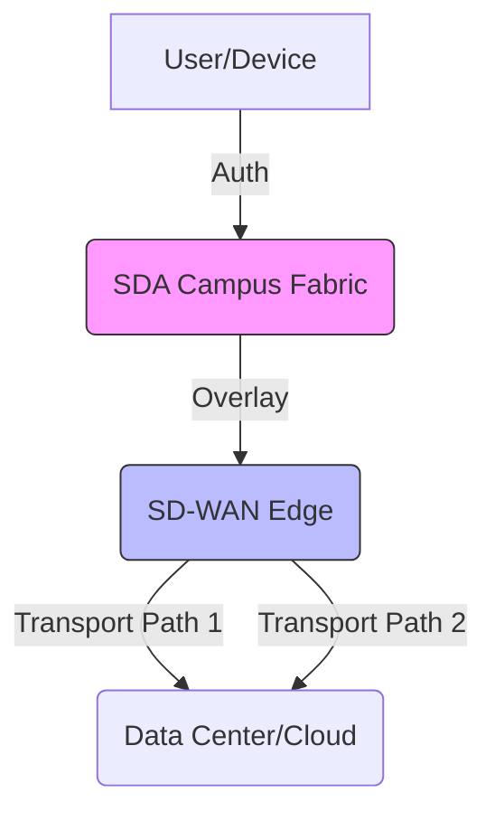

# Navigating the Modern Network: SDA vs. SD-WAN

In the evolving landscape of enterprise networking, two acronyms frequently dominate architectural discussions: **SDA (Software-Defined Access)** and **SD-WAN (Software-Defined Wide Area Network)**. While both leverage the principles of Software-Defined Networking (SDN)—decoupling the control plane from the data plane—they serve fundamentally different purposes within an organization's infrastructure.

Cisco utilizes **Catalyst Center** (formerly DNA Center) as the management engine for its SDA fabric. Understanding how this fits into the broader picture of enterprise connectivity requires a deep dive into the silos of the campus versus the expanse of the wide area network.

## Software-Defined Access (SDA): The Campus Fabric

Software-Defined Access is the implementation of a campus-wide fabric that provides automated, policy-based access for users, devices, and things. It is the evolution of traditional "VLAN-heavy" campus networks into a unified, programmable environment.

### The Mechanism of SDA
At its core, SDA relies on a **VXLAN (Virtual Extensible LAN)** overlay to provide network virtualization. Unlike traditional networks that rely on complex Layer 2 spanning-tree protocols or manual configuration of access switches, SDA uses the **Cisco Catalyst Center** as the "brain."

1.  **Underlay:** The physical connectivity (IP reachability) between switches.
2.  **Overlay:** The logical network (VXLAN tunnels) that carries user traffic.
3.  **Control Plane:** Based on LISP (Locator/ID Separation Protocol), which separates the identity of the endpoint from its location in the network.
4.  **Policy Plane:** Uses Cisco TrustSec to apply Scalable Group Tags (SGTs). Instead of managing thousands of IP-based ACLs, administrators manage security policies based on user roles (e.g., "Contractors," "Employees," "IoT Devices").

### Historical Context
Before SDA, campus networks were manually configured via Command Line Interface (CLI). Scaling meant managing hundreds of individual devices. The shift toward SDA began as organizations demanded "Macro-segmentation" (virtual networks) and "Micro-segmentation" (security within a virtual network) without the overhead of VRF-Lite or complex firewall hair-pinning.

## SD-WAN: Connecting the Distributed Enterprise

While SDA handles the "inside" of the building, SD-WAN handles the "between" of the buildings. SD-WAN is designed to replace or augment traditional MPLS circuits with a transport-agnostic overlay that utilizes broadband, LTE/5G, and dedicated internet circuits.

### How SD-WAN Functions
SD-WAN abstracts the transport layer. It monitors the health of all available paths (latency, jitter, packet loss) in real-time. If a primary MPLS circuit experiences degradation, the SD-WAN edge device automatically steers business-critical traffic to a secondary path—even if that path is a public broadband connection.

*   **Centralized Orchestration:** Similar to Catalyst Center for SDA, SD-WAN utilizes a centralized controller (e.g., Cisco vManage) to push security and routing policies to thousands of branches simultaneously.
*   **Application-Aware Routing:** The network identifies the application rather than just the IP address, allowing for intelligent path selection.

## Comparison Table: SDA vs. SD-WAN

| Feature | SDA (Software-Defined Access) | SD-WAN |
| :--- | :--- | :--- |
| **Primary Scope** | Campus and Branch (LAN) | WAN (Branch to Branch/Cloud) |
| **Key Protocol** | VXLAN / LISP | IPsec / GRE / BGP |
| **Primary Goal** | User mobility and segmentation | Performance and cost-effective connectivity |
| **Management** | Cisco Catalyst Center | Cisco vManage (SD-WAN Controller) |
| **Segmentation** | Scalable Group Tags (SGTs) | VPNs / VRFs |

## Practical Example: A Day in the Office

Imagine a global retail chain. 
*   **In the store (SDA):** When a manager plugs their laptop into a switch, the SDA fabric recognizes them via 802.1X authentication. It assigns them to the "Management" SGT. Even if they move to a different floor or building, their security policy follows them automatically.
*   **Between stores (SD-WAN):** The store needs to send inventory data to the data center. The SD-WAN edge device detects that the primary MPLS link is congested. It intelligently splits the traffic, sending high-priority inventory data over the MPLS link and less-critical guest Wi-Fi traffic over the cheaper broadband connection.

## Future Outlook
While the industry is trending toward "SASE" (Secure Access Service Edge), which aims to converge SD-WAN and cloud-native security, there remains a distinct separation between the campus fabric and the WAN edge. It is important to note that while Cisco is integrating these management platforms, they remain distinct architectural domains. Some industry analysts suggest that in the next decade, the distinction between LAN and WAN management may blur further as intent-based networking matures, but for now, they remain specialized tools for specific problems.

### json_meta
{
  "title": "Understanding the Divide: SDA vs. SD-WAN in Enterprise Networking",
  "description": "An in-depth guide comparing Software-Defined Access (SDA) and SD-WAN, their architectural roles, and how they function within modern Cisco-based infrastructures.",
  "tags": ["Networking", "SDA", "SD-WAN", "Cisco", "Enterprise IT", "Infrastructure"]
}

## References

- [Comparison](https://en.wikipedia.org/wiki/Comparison)
- [Comparison of ICBMs](https://en.wikipedia.org/wiki/Comparison%20of%20ICBMs)
- [Comparison theorem](https://en.wikipedia.org/wiki/Comparison%20theorem)
- [ADARA Networks](https://en.wikipedia.org/wiki/ADARA%20Networks)
- [An Introduction to SD-WAN](https://doi.org/10.1007/978-1-4842-7347-0_1)
- [Learning SD-WAN with Cisco](https://doi.org/10.1007/978-1-4842-7347-0)
- [Troubleshooting](https://doi.org/10.1007/978-1-4842-7347-0_14)