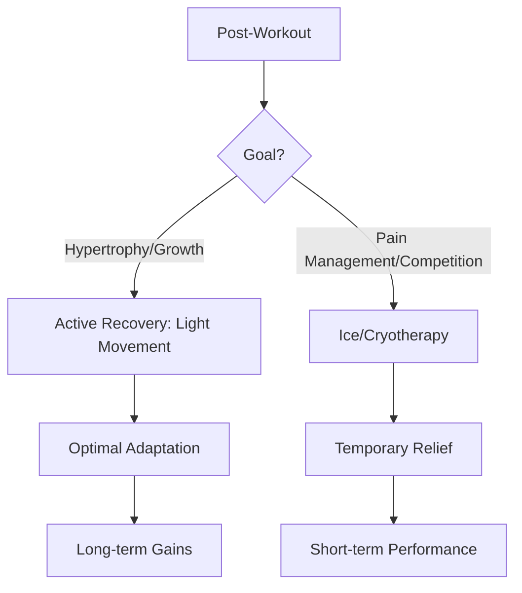

# The Cold Truth: Does Icing Actually Reduce Inflammation and Aid Recovery?

For decades, the "R.I.C.E." acronym (Rest, Ice, Compression, Elevation) has been the gold standard for treating sports injuries and managing post-workout soreness. If you have ever visited a physical therapist or sat on a bench after a high-intensity game, you have likely been handed an ice pack. However, recent sports science research has begun to challenge the long-held belief that icing is the ultimate panacea for inflammation and recovery.

Is icing a miracle cure, or is it potentially hindering your progress? To answer this, we must examine the physiological mechanisms of cryotherapy and distinguish between acute injury management and long-term recovery strategies.

## The Mechanism: How Cold Affects Tissue

When you apply ice to the skin, you induce a physiological response known as vasoconstriction—the narrowing of blood vessels. By cooling the area, you reduce local blood flow. Historically, this was thought to prevent "secondary cell death" and minimize swelling.

However, modern research suggests that inflammation is not merely a byproduct of injury; it is a critical component of the healing process. When muscles are damaged during exercise (micro-tears), the body triggers an inflammatory response to clear out debris and initiate tissue repair. While cryotherapy may be associated with pain reduction and reducing inflammation, the effectiveness of cryotherapy on total recovery remains limited. By aggressively icing, you may be blunting the signaling pathways required for muscle hypertrophy and adaptation.

### The RICE vs. PEACE & LOVE Paradigm
The sports medicine community is increasingly shifting away from R.I.C.E. toward newer protocols like **PEACE & LOVE** (Protection, Elevation, Avoid Anti-inflammatories, Compression, Education & Load, Optimism, Vascularization, Exercise). This shift emphasizes that while icing might provide temporary pain relief, it may not be optimal for long-term tissue regeneration.

| Feature | Icing (R.I.C.E.) | Active Recovery (PEACE & LOVE) |
| :--- | :--- | :--- |
| **Primary Goal** | Pain suppression & vasoconstriction | Tissue remodeling & blood flow |
| **Inflammation** | Actively suppressed | Managed as part of healing |
| **Muscle Growth** | May inhibit adaptation | Encourages cellular repair |
| **Best Used For** | Acute pain, immediate trauma | Post-workout soreness (DOMS) |

## Historical Context and Modern Science

The R.I.C.E. protocol was popularized in 1978. Since then, the scientific understanding of muscle recovery has evolved. Research into Delayed Onset Muscle Soreness (DOMS) has shown that the effectiveness of whole-body cryotherapy—compared with passive rest—at reducing DOMS or improving the timeline of recovery is still a subject of ongoing study. Furthermore, studies have indicated that eccentric exercise during DOMS does not necessarily exacerbate muscle damage, suggesting that the body is more resilient than the R.I.C.E. protocol originally assumed.

This historical pivot highlights a broader trend in sports science: moving from simple "symptom management" to "biological optimization."

## Practical Applications: When to Ice and When to Avoid

If you are an athlete, the decision to ice depends entirely on your goals:

1.  **The "Elite Performance" Scenario:** If you are a professional athlete competing in a tournament with multiple games in one day, pain management is your priority. In this case, icing is a valid tool to allow you to perform in the next match.
2.  **The "Hypertrophy/Strength" Scenario:** If your goal is to gain muscle mass or improve strength, you should be cautious about icing after resistance training. You want the natural inflammatory response to occur to stimulate adaptation.
3.  **The Acute Injury Scenario:** If you have suffered a significant sprain or strain, icing in the first 24–48 hours can help manage pain, but it should be used sparingly.

### A Suggested Recovery Workflow

## Conclusion: The Verdict on Icing

Icing is not "wrong," but it is often misused. It is a powerful analgesic that can provide immediate comfort, but it is not a recovery booster for those seeking physical adaptation. If your goal is to get stronger or bigger, you should allow your body to experience the natural inflammatory process. If your goal is to survive a grueling tournament schedule, ice remains a valuable tool in your kit. Prioritize active recovery—such as light walking, mobility work, and proper nutrition—over cold therapy.

## References

- [Cryotherapy](https://en.wikipedia.org/wiki/Cryotherapy)
- [Delayed onset muscle soreness](https://en.wikipedia.org/wiki/Delayed%20onset%20muscle%20soreness)
- [Ice bath](https://en.wikipedia.org/wiki/Ice%20bath)
- [Effectiveness](https://en.wikipedia.org/wiki/Effectiveness)
- [Does Endurance Training Inhibit Muscle Growth?](https://doi.org/10.1007/978-3-662-68048-3_15)
- [Increasing Muscle Hypertrophy with a Natural Product Designed to Inhibit SIRT1](https://doi.org/10.1101/2022.06.27.497838)
- [Increasing Muscle Hypertrophy with a Natural Product Designed to Inhibit SIRT1](https://doi.org/10.21203/rs.3.rs-1855726/v1)