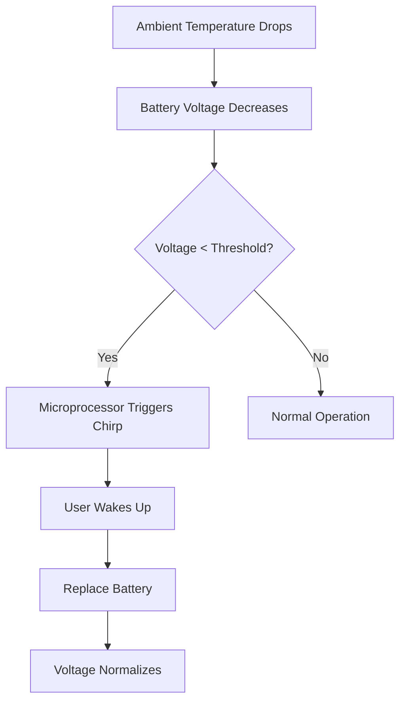

# The Midnight Chirp: Why Your Smoke Detector Wakes You Up at 3:00 AM

It is a universal experience that feels like a scene from a low-budget horror movie: the house is silent, the clock reads 3:14 AM, and suddenly, a sharp, piercing "chirp" emanates from the ceiling. You stumble out of bed, groggy and frustrated, only to realize your smoke detector is signaling a low battery. But why does this seem to happen exclusively in the dead of night? Is the device mocking your sleep schedule, or is there a scientific explanation for this nocturnal nuisance?

## The Physics of Temperature and Battery Chemistry

The primary reason your smoke detector chirps at night is not a sentient desire to disrupt your rest, but rather the fundamental laws of thermodynamics and battery chemistry. Most residential smoke detectors are powered by 9-volt alkaline or lithium batteries. These batteries rely on chemical reactions to produce electrical energy.

When the ambient temperature in your home drops—which typically happens in the late evening and early morning hours—the chemical reaction inside the battery slows down. This phenomenon is related to internal resistance. As the temperature decreases, the battery’s voltage output drops. 

If your battery is already nearing the end of its lifespan, it may be operating right on the edge of the "low battery" threshold. During the day, when your home is warmer, the battery provides enough voltage to satisfy the detector. However, as the house cools down at night, the voltage dips below the threshold, triggering the low-battery warning system. Once the sun rises and the house warms up, the voltage may recover slightly, causing the chirping to stop—only for the cycle to repeat the following night.

### Comparison of Battery Behaviors in Smoke Detectors

| Battery Type | Typical Lifespan | Temperature Sensitivity | Chirp Behavior |
| :--- | :--- | :--- | :--- |
| **Alkaline (9V)** | 6–12 Months | High | Frequent nocturnal chirping as voltage drops. |
| **Lithium (10-Year)** | 10 Years | Low | Rarely chirps unless the unit is nearing end-of-life. |
| **Hardwired (w/ Battery Backup)** | 5–10 Years | Moderate | Often chirps due to power surges or backup failure. |

## Historical Context and Engineering Design

Smoke detectors, also known as smoke alarms, have evolved significantly since their early iterations. These devices generally issue an audible or visual alarm from the detector itself or several interconnected detectors if smoke is sensed. To ensure reliability, engineers implemented supervisory circuits to monitor the health of the device, including the status of the power supply.

The "chirp" was intentionally designed to be noticeable. The engineering philosophy is simple: if the warning were quiet or pleasant, a homeowner might ignore it, leaving their home unprotected. By choosing a high-frequency, intermittent sound, manufacturers ensure that the occupant is compelled to address the issue immediately. While the chirp is distinct from the full-volume fire alarm, it is designed to be persistent enough to demand attention, even in the stillness of the night.

## Practical Troubleshooting: How to Stop the Chirping

If you are currently being plagued by a chirping detector, follow these steps to resolve the issue systematically:

1.  **Identify the Culprit:** If you have multiple detectors, press the "hush" or "test" button on each. The unit that chirps or flashes differently is the one needing attention.
2.  **The "Hard Reset" Procedure:** Sometimes, the detector’s internal capacitor holds a residual charge that causes it to "think" the battery is low even after a replacement. 
    *   Remove the detector from the ceiling.
    *   Remove the battery.
    *   Hold the "test" button down for 15 seconds to drain remaining energy.
    *   Insert a fresh battery and reattach.
3.  **Check for Dust:** Dust buildup in the sensing chamber can mimic a low-battery signal in some models. Use compressed air to clean the vents.
4.  **Expiration Dates:** Smoke detectors generally have a lifespan of 10 years. If your device is older than a decade, the internal sensor may have reached its end-of-life, and the unit should be replaced.

### The Logic of the Chirp (Mermaid Diagram)

## Are There Other Causes?

While temperature-induced voltage drops are the most common cause, they are not the only ones. If you have replaced the battery and the chirping persists, consider these possibilities:

*   **Power Surges (Hardwired Units):** If your smoke detector is hardwired into your home’s electrical system, a power surge or a loose wire connection can cause the unit to pulse.
*   **Dirty Sensors:** Insects or spiderwebs inside the sensing chamber can trigger a maintenance alert.
*   **End-of-Life Signal:** Many modern detectors are programmed to chirp when the internal sensor can no longer reliably detect smoke. This is a non-silenceable alert that indicates the entire unit must be replaced.

It is important to note that while these explanations are based on standard industry practices, individual manufacturer specifications may vary. Always consult your device’s manual if the chirping continues after standard troubleshooting.

Ultimately, while the 3:00 AM chirp is a nuisance, it is a vital safety feature. It is a reminder that even the most reliable life-saving technology requires periodic maintenance. By understanding the interaction between home temperatures and battery chemistry, you can keep your home safe—and your sleep uninterrupted.

## References

- [Causes](https://en.wikipedia.org/wiki/Causes)
- [Causes of poverty](https://en.wikipedia.org/wiki/Causes%20of%20poverty)
- [Causes of cancer](https://en.wikipedia.org/wiki/Causes%20of%20cancer)
- [Smoke detector](https://en.wikipedia.org/wiki/Smoke%20detector)
- [Why Schizophrenics Smoke](https://doi.org/10.1126/article.32173)
- [Nocturia: Why do People Void at Night?](https://doi.org/10.26226/morressier.59b63e41d462b802923896e3)
- [Why do smoke alarms keep going off even when there’s no smoke?](https://doi.org/10.64628/aai.4c7kt43rh)