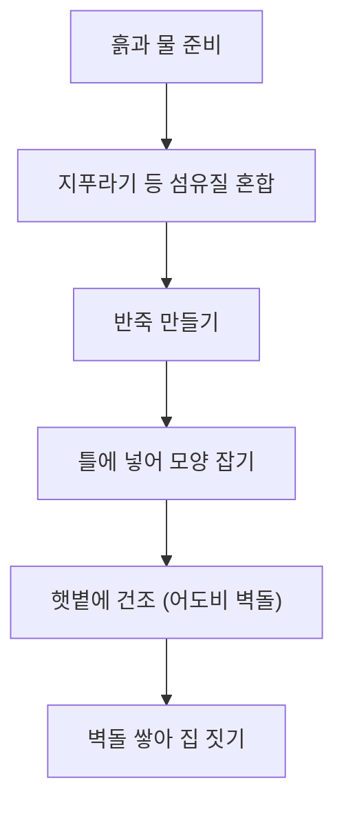

## 어도비 건축, 그게 무엇인가? 🤔

'어도비 건축'은 햇볕에 말린 흙벽돌(어도비 벽돌)을 사용하여 집을 짓는 방식입니다. 흙에 물과 지푸라기 같은 섬유질을 섞어 틀에 넣고, 자연 건조하여 벽돌을 만듭니다. 여기서 중요한 점은 이 벽돌을 불에 굽지 않는다는 것입니다. 만약 어도비 벽돌을 불에 굽게 되면, 흙 속의 점토 성분이 유리질화되어 숨을 쉬지 못하게 됩니다. 이는 흙벽 특유의 습도 조절 능력과 단열 성능을 떨어뜨릴 뿐만 아니라, 재료의 유연성을 잃게 하여 지진이나 외부 충격에 쉽게 균열이 생기는 결과를 초래합니다.

어도비 건축은 아주 오래전부터 자연과 어울려 살기 위해 사용해 온 지혜로운 건축 기법입니다. 자연에서 온 재료를 사용해 다시 자연으로 돌아갈 수 있는 지속 가능한 건축 방식입니다.

## 어도비 건축의 특별한 매력과 현대적 해석 ✨

어도비 건축은 단순히 흙으로 만든 집이 아니라, 과학적인 원리가 숨어 있는 똑똑한 건축물입니다.

### 1. 똑똑한 단열 효과와 열 방출의 원리 🌬️🔥

어도비 건축의 가장 큰 장점은 뛰어난 단열 효과입니다. 두꺼운 흙벽은 낮 동안 뜨거운 햇볕의 열기를 천천히 흡수합니다. 밤이 되면, 낮에 품었던 열기를 실내로 방출하여 온기를 유지합니다. 이때 열기가 밖으로 방출되지 않는 이유는 흙벽의 엄청난 두께와 낮은 열전도율 때문입니다. 벽체 내부의 열이 외부의 차가운 공기와 만나기 전에 벽체 자체가 열을 머금고 있는 '축열' 현상이 일어나며, 벽의 밀도가 높아 열이 외부로 쉽게 빠져나가지 못하고 실내 방향으로 서서히 전달되는 것입니다.

### 2. 전통 방식과 현대 건축의 차이 🏗️

전통적인 어도비 건축은 순수하게 흙, 물, 짚만을 사용하며 기초 공사 없이 지면 위에 직접 벽을 쌓는 경우가 많았습니다. 반면, 현대의 어도비 건축은 구조적 안전성을 위해 콘크리트 기초를 사용하고, 벽체 내부에 철근이나 보강재를 삽입하여 지진에 대비합니다. 예를 들어, 최근 뉴멕시코의 한 주택 건설 현장에서는 전통적인 어도비 벽돌을 사용하되, 벽체 사이에 현대적인 단열재를 삽입하고 외벽에 특수 방수 코팅을 처리하여 내구성을 획기적으로 높이는 방식을 채택했습니다. 이는 전통의 미학을 유지하면서도 현대의 건축 기준을 충족시키는 방식입니다.

### 3. 자연을 닮은 아름다움과 지속 가능성 🌱

어도비 건축은 곡선 형태와 부드러운 질감, 흙 본연의 색깔이 특징입니다. 또한, 주변에서 쉽게 구할 수 있는 재료를 사용하므로 탄소 발자국을 줄이는 친환경적인 건축 방식입니다. 이러한 특성 덕분에 오늘날 환경을 생각하는 많은 사람들에게 다시금 주목받고 있습니다.

## 마무리하며 😊

어도비 건축은 자연의 지혜와 아름다움을 담은 특별한 건축 양식입니다. 단순히 과거의 유산에 머무는 것이 아니라, 현대 기술과 결합하여 더 튼튼하고 편리하게 재해석되고 있습니다. 다음에 어도비 건축물을 마주한다면, 흙벽의 질감을 느껴보며 이 건축물이 들려주는 오래된 이야기와 현대적인 변화를 함께 상상해보길 바랍니다.
