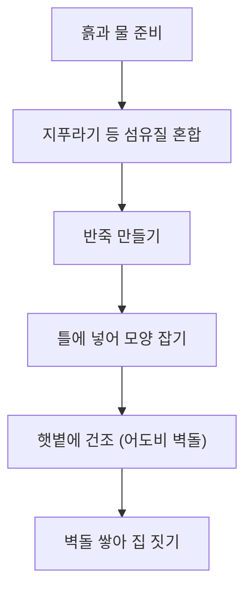

## 어도비 건축, 그게 무엇인가? 🤔

'어도비 건축'은 햇볕에 말린 흙벽돌(어도비 벽돌)을 사용하여 집을 짓는 방식입니다. 흙에 물과 지푸라기 같은 섬유질을 섞어 틀에 넣고, 자연 건조하여 벽돌을 만듭니다. 여기서 중요한 점은 이 벽돌을 불에 굽지 않는다는 것입니다. 만약 어도비 벽돌을 불에 굽게 되면, 흙 속의 점토 성분이 유리질화되어 숨을 쉬지 못하게 됩니다. 이는 흙벽 특유의 습도 조절 능력과 단열 성능을 떨어뜨릴 뿐만 아니라, 재료의 유연성을 잃게 하여 지진이나 외부 충격에 쉽게 균열이 생기는 결과를 초래합니다.

한국의 전통적인 황토집과 어도비 건축은 모두 흙을 주재료로 하지만, 시공 방식에서 차이가 있습니다. 한국의 황토집은 주로 나무 기둥을 세우고 그 사이에 흙을 채우거나 바르는 '심벽' 방식이 발달한 반면, 어도비 건축은 흙벽돌 자체를 쌓아 올려 벽체 구조를 만드는 '조적' 방식이 핵심입니다.

## 어도비 건축의 특별한 매력과 현대적 해석 ✨

어도비 건축은 단순히 흙으로 만든 집이 아니라, 과학적인 원리가 숨어 있는 똑똑한 건축물입니다.

### 1. 똑똑한 단열 효과와 '축열 현상'의 원리 🌬️🔥

어도비 건축의 핵심은 '축열(Thermal Mass)'입니다. 축열이란 쉽게 말해 '열을 저장하는 능력'입니다. 흙벽은 마치 거대한 배터리처럼 낮 동안 뜨거운 햇볕의 열기를 천천히 흡수하여 저장합니다. 밤이 되어 기온이 떨어지면, 벽 속에 저장해두었던 따뜻한 열기를 실내로 조금씩 내뿜어 온기를 유지합니다.

왜 열이 밖으로 나가지 않을까요? 흙은 열을 전달하는 속도가 매우 느린 재료입니다. 흙벽이 아주 두껍기 때문에, 낮에 흡수한 열이 벽의 바깥쪽에서 안쪽까지 이동하는 데 아주 오랜 시간이 걸립니다. 그래서 낮에는 외부의 뜨거운 열기가 실내로 들어오지 못하게 막고, 밤에는 낮에 저장한 열기가 실내로 전달되도록 하는 '시간차 단열' 효과를 내는 것입니다. 이는 마치 두꺼운 이불이 체온을 밖으로 빠져나가지 못하게 붙잡아두는 것과 비슷한 원리입니다.

### 2. 벽돌이 보이지 않는 이유와 현대 건축의 차이 🏗️

뉴멕시코를 여행하며 보셨던 어도비 집들에서 벽돌이 보이지 않았던 이유는 '어도비 플라스터(Adobe Plaster)' 마감 때문입니다. 어도비 건축은 벽돌을 쌓은 뒤, 그 위에 같은 성분의 흙 반죽을 얇게 덧발라 벽면 전체를 매끄럽게 덮습니다. 이렇게 하면 벽돌 사이의 틈새가 메워져 하나의 거대한 흙덩어리처럼 일체감을 주며, 비바람으로부터 벽돌을 보호하는 외피 역할을 하게 됩니다.

전통적인 방식은 기초 공사 없이 지면 위에 직접 벽을 쌓았지만, 현대의 어도비 건축은 콘크리트 기초를 사용하고 벽체 내부에 철근을 보강합니다. 겉모습은 전통적인 흙집의 미학을 유지하면서도, 속은 현대적인 구조 안전성을 갖추고 있는 것입니다.

### 3. 자연을 닮은 아름다움과 지속 가능성 🌱

어도비 건축은 곡선 형태와 부드러운 질감, 흙 본연의 색깔이 특징입니다. 주변에서 쉽게 구할 수 있는 재료를 사용하므로 탄소 발자국을 줄이는 친환경적인 건축 방식입니다. 이러한 특성 덕분에 오늘날 환경을 생각하는 많은 사람들에게 다시금 주목받고 있습니다.

## 마무리하며 😊

어도비 건축은 자연의 지혜와 아름다움을 담은 특별한 건축 양식입니다. 다음에 어도비 건축물을 마주한다면, 흙벽의 질감을 느껴보며 이 건축물이 들려주는 오래된 이야기와 현대적인 변화를 함께 상상해보길 바랍니다.
