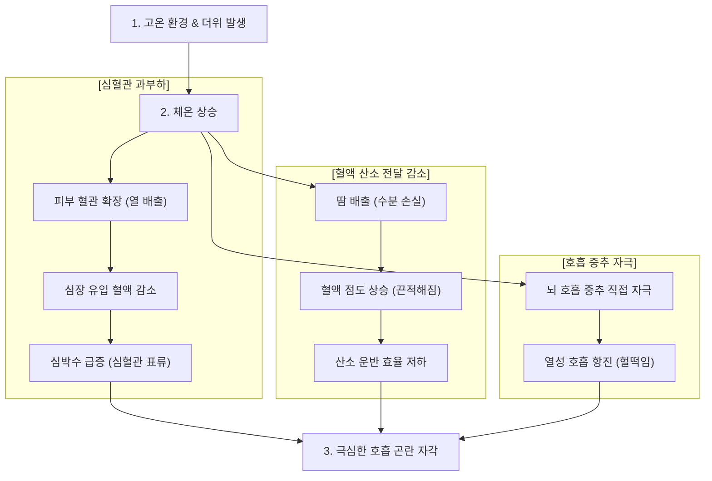

# # 고온 환경에서의 고강도 운동 시 호흡 곤란이 발생하는 생리학적 메커니즘

크로스핏이나 고강도 인터벌 트레이닝(HIIT) 등 신체적 부하가 큰 운동을 수행할 때, 고온 환경이나 난방이 가동되는 실내 공간에서는 유독 심한 숨가쁨과 호흡 곤란을 경험하게 된다. 이는 단순한 체력 저하 때문이 아니라, 체온 조절 시스템과 심장, 폐가 복합적으로 과부하를 받기 때문에 나타나는 신체 반응이다.

의학적·생리학적 전문 지식이 없어도 쉽게 이해할 수 있도록 고온 환경에서 일어나는 신체 변화와 호흡 가쁨의 원인을 단계별로 정리한다.

---

## 1. 체온 조절을 위한 심혈관계의 과부하

우리 몸은 운동 중 발생하는 열과 외부의 더위에 대응해 몸속 장기 온도인 **중추 체온(Core Body Temperature)**을 약 37°C로 일정하게 유지하려 한다.

### (1) 피부 혈류량 증가와 심박수 급증
* **피부 혈관 확장:** 몸의 열을 밖으로 식히기 위해 피부 쪽 혈관이 넓어지며 많은 혈액이 피부 표면으로 몰린다.
* **근육 산소 부족과 정맥 환류량 감소:** 피부로 혈액이 많이 가는 만큼, 운동 중인 근육으로 갈 혈액과 심장으로 다시 돌아오는 혈액의 양(**정맥 환류량**)이 줄어든다.
* **1회 박출량 감소:** 심장으로 들어오는 혈액이 줄어들므로, 심장이 한 번 뛸 때 짜내는 혈액의 양(**1회 박출량**)도 줄어든다.
* **심혈관 표류 현상:** 심장은 필요한 혈액 공급량을 맞추기 위해 어쩔 수 없이 뛰는 속도(심박수)를 급격히 올린다. 이를 **심혈관 표류(Cardiovascular Drift)** 라 하며, 심장이 체온 조절과 근육 산소 공급이라는 두 가지 일을 동시에 하느라 과부하 상태에 빠지게 된다.

### (2) 땀 배출로 인한 혈액의 끈적임 증가 (탈수)
* **혈장량 감소:** 체온을 식히려고 땀을 많이 흘리면 혈액 속 수분 성분인 **혈장량**이 급격히 줄어든다.
* **혈액 점도 및 후부하 증가:** 수분이 줄어든 혈액은 끈적거림(**점도**)이 심해진다. 끈적해진 혈액을 전신으로 보내려면 심장이 더 강한 힘으로 밀어내야 하므로, 심장이 느끼는 저항(**후부하**)이 커진다.
* **결과:** 끈적해진 혈액은 유속이 느려져 근육과 호흡 관련 근육(갈비뼈/횡격막 근육)으로 산소를 빠르게 전달하지 못하고, 결국 호흡 곤란을 유발한다.

---

## 2. 호흡 조절 메커니즘과 호흡 중추의 직접 자극

고온 환경은 가스 교환(산소 흡수, 이산화탄소 배출)을 담당하는 폐와 호흡 조절 계통에도 직접 영향을 미친다.

### (1) 산소-헤모글로빈 결합력 변화
* **말초 조직(근육):** 체온이 올라가고 운동 부산물(젖산, 수소 이온 등)이 쌓이면, 적혈구 속 헤모글로빈이 산소를 손쉽게 떨어뜨려 근육에 공급한다.
* **폐포(폐 속 공기주머니):** 하지만 체온이 지나치게 올라가면, 정작 폐에서는 헤모글로빈이 공기 중의 산소와 잘 결합하지 못하는 현상이 발생한다. 즉, 산소를 충분히 싣지 못한 채 혈액이 전신으로 보내질 수 있다.

### (2) 산성 물질 배출을 위한 호흡 폭증 및 열성 호흡 항진
* **대사성 산증에 대한 호흡 보상:** 고강도 운동 시 젖산 등 산성 물질이 쌓여 피가 산성으로 변한다(**대사성 산증**). 우리 몸의 화학 감지기(화학수용체)는 이를 감지하고 산성 물질을 이산화탄소 형태로 숨을 통해 밖으로 뿜어내고자 호흡량을 급격히 늘린다.
* **열성 호흡 항진(Thermal Hyperpnea):** 또한, 높은 체온 자체가 뇌의 호흡 중추(시상하부)를 직접 자극하여 필요 이상으로 숨을 헐떡이게 만든다. 이를 **열성 호흡 항진**이라 하며, 실제 산소 교환 효율과 상관없이 가쁜 숨만 들이쉬게 되어 심한 호흡 곤란을 느끼게 된다.

---

## 3. 고온 환경 운동 시 신체 생리 반응 및 호흡 곤란 유발 과정



---

## 4. 고온 환경 운동 시 안전 관리 및 대응 방안

고온에서 느끼는 호흡 곤란은 신체가 한계에 다다랐음을 알리는 경고 신호이다. 이를 예방하기 위한 실전 가이드는 다음과 같다.

### (1) 수분 및 전해질 공급
* **사전 수분 섭취:** 운동 시작 2\~4시간 전에 체중 1kg당 5\~7mL의 물을 미리 마셔 적정 수분 상태를 유지한다.
* **전해질 음료 활용:** 1시간 이상 운동 시 물 대신 나트륨이 포함된 전해질 음료를 섭취하여 혈액 속 수분량(혈장량) 감소를 막는다. 단 조심해야 할 부분은 단순히 물만 섭취해 수분량을 늘리면 문제가 된다. 그 이유는 나트륨을 포함한 전해질이 혈액 속에서 일정한 삼투압을 유지하는 건데 단순히 물만 섭취하게 되면 삼투압이 약해져 세포 주변이나 조직으로 수분이 빠져나간다. 
* **체중 측정:** 운동 전후 체중 차이가 2% 이상 나지 않도록 조절한다. (체중 1kg 감소 당 약 1.2\~1.5L 수분 보충 필요)

### (2) 단계적 열 순응(Heat Acclimatization)의 상세 생리학적 원리

약 10\~14일에 걸쳐 더운 환경에 조금씩 적응하는 열 순응 과정을 거치면 신체에는 다음과 같은 생리학적 원리가 작동한다.

#### 1. 낮은 체온에서 더 빠르게 땀을 흘리는 현상
* 땀샘의 **나트륨 재흡수 펌프(알도스테론 호르몬)** 가 훨씬 강력해져서 **'묽은 땀'** 을 배출하기 때문이다. 우리 몸은 체온이 올라간 이후에 땀 배출을 시작하면 늦는다는걸 학습하게 된다. 이로 인해서, 낮은 온도에서부터 땀샘으로 보내는 신경 신호 스위치를 켜서 체온 상승을 미리 방지한다. 더불어 수분과 염분을 지키기 위한 작용으로 알도스테론의 분비량도 늘어난다.

* **땀샘의 나트륨 재흡수 기전**  
  우리 몸의 땀샘은 깊은 곳에 위치한 **'분비부(Coil)'** 와 피부 표면으로 이어지는 **'관(Duct)'** 으로 나뉜다.
  1. **원액 생성:** 땀샘 분비부에서는 처음에 혈액과 비슷한 수준의 염분(나트륨, 염소)을 가진 땀 원액을 만든다.
  2. **염분 재흡수:** 이 땀 원액이 관을 타고 피부 표면으로 올라가는 동안, 땀샘관 벽에 있는 이온 펌프가 나트륨(Na⁺)과 염소(Cl⁻)를 다시 혈액 속으로 끌어당겨 회수한다. 즉, 알도스테론의 증가로 인해서 이 펌프가 더 활발하게 작동하는 셈이다.

  ```text
  [땀샘 깊은 곳: 염분 많은 땀 생성] 
         ↓ (관을 따라 이동)
  [땀샘 관: 나트륨·염소 재흡수 펌프 작동] 
         ↓
  [피부 표면: 묽어진 땀 배출]
  ```

* **열 순응 후 신체 변화**  
  열 순응이 진행되면 부신피질에서 **알도스테론(Aldosterone)** 이라는 호르몬 분비가 크게 증가한다. 알도스테론은 땀샘관의 염분 재흡수 펌프를 대폭 활성화한다.
  * **적응 전:** 땀샘관을 지나는 속도보다 재흡수 펌프 속도가 느려, 염분이 많이 포함된 짜고 끈적한 땀이 배출된다. (농도 약 60–80 mEq/L)
  * **적응 후:** 체온이 약간만 올라가도 체온 조절을 위해 땀 배출 스위치는 빨리 켜지지만, 재흡수 펌프의 효율이 기하급수적으로 높아져 염분을 대부분 혈액으로 회수한다. (농도 약 10–30 mEq/L로 감소)

  따라서 땀을 흘리는 시점이 빠르고 전체 땀의 양이 늘어나더라도, 땀 속 염분 농도가 절반 이하로 뚝 떨어지기 때문에 최종적으로 몸 밖으로 손실되는 총 염분량은 오히려 줄어들게 된다.

#### 2. 심박수는 왜 안정이 될까?
* 혈액 속 수분량이 크게 늘어나 **'한 번 뛸 때 짜내는 피의 양(1회 박출량)'** 이 많아지므로, 심장이 굳이 자주 뛸 필요가 없어지기 때문이다.

* **심박출량(Q)의 기본 공식**
  심장이 1분 동안 전신으로 보내는 혈액의 총량인 **심박출량(Q, Cardiac Output)** 은 다음과 같은 공식으로 결정된다.

  Q = HR × SV

  * Q (심박출량): 심장이 1분 동안 분출하는 총 혈액량
  * HR (Heart Rate, 심박수): 1분 동안 심장이 뛰는 횟수
  * SV (Stroke Volume, 1회 박출량): 심장이 한 번 뛸 때 짜내는 피의 양

* **열 순응에 따른 심혈관계 적응 순서**
  1. **혈장량(Plasma Volume)의 대폭 확대:** 열 순응 초기에 신체는 체내 단백질(알부민) 합성 및 수분 보존 호르몬을 늘려 혈액 속 수분 성분인 '혈장량'을 10\~15% 확장시킨다.
  2. **1회 박출량(SV)의 증가:** 혈액의 절대량이 늘어나면 심장으로 돌아오는 혈액량(정맥 환류량)이 풍부해진다. 심장에 피가 가득 차게 되므로, 심장이 한 번 팽창했다가 짜낼 때 내보내는 혈액의 양(SV)이 대폭 증가한다.
  3. **심박수(HR)의 보상적 감소:** 동일한 강도로 운동할 때 근육과 피부로 보내야 하는 전체 혈액량(Q)은 일정하다. 이때 공식에서 SV(1회 박출량)가 크게 늘어났기 때문에, 심장은 HR(심박수)을 많이 올리지 않고도 동일한 Q를 달성할 수 있게 된다.

  또한, 이전보다 체온이 덜 올라가기 때문에 뇌의 심혈관 조절 중추가 받는 열 스트레스 자체가 감소하여, 보상적으로 심박수를 무리하게 올리던 생리적 반응이 줄어들게 된다.

### (3) 체감 더위 지수(WBGT) 기준 운동 조절
* 단순 기온이 아닌 습도, 햇빛 열기, 바람을 종합한 **습구흑구온도지수(WBGT)** 를 고려해야 한다. 습도가 높은 날은 땀이 잘 증발하지 않아 체온이 더 급격히 올라간다.
* WBGT 지수가 높은 날에는 운동 강도를 평소보다 낮추고 세트 간 휴식 시간을 충분히 가져야 한다.

## 참고자료

- [Exercise physiology](https://en.wikipedia.org/wiki/Exercise_physiology)
- [Heat exhaustion](https://en.wikipedia.org/wiki/Heat_exhaustion)
- [Effect of spaceflight on the human body](https://en.wikipedia.org/wiki/Effect_of_spaceflight_on_the_human_body)
- [Physical fitness](https://en.wikipedia.org/wiki/Physical_fitness)
