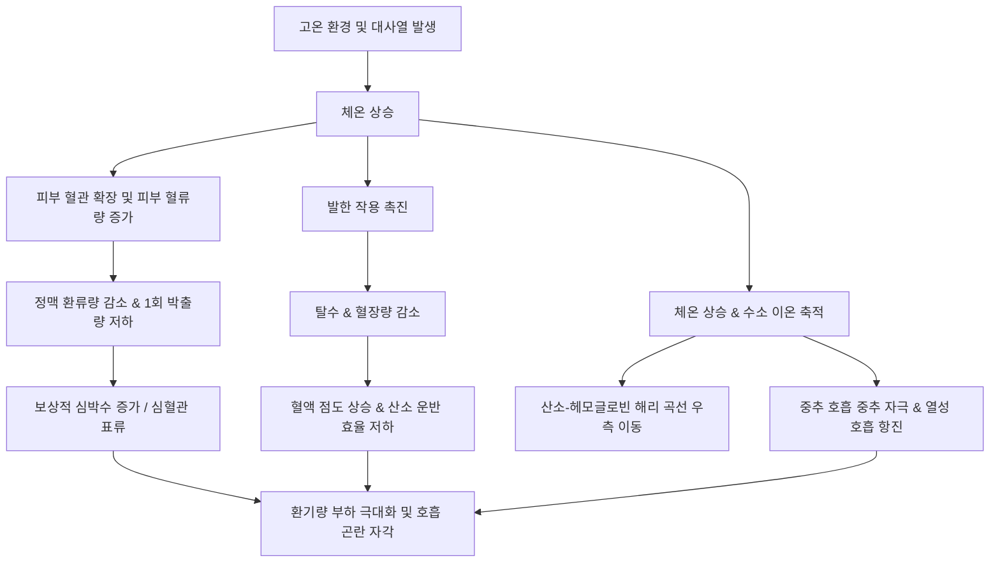

# 고온 환경에서의 고강도 운동 시 호흡 곤란이 발생하는 생리학적 메커니즘

크로스핏이나 고강도 인터벌 트레이닝(HIIT) 등 신체적 부하가 큰 운동을 수행할 때, 고온 환경이나 난방이 가동되는 실내 공간에서는 유독 심한 숨가쁨과 호흡 곤란(Dyspnea)을 경험하게 된다. 이는 단순한 체력 저하 때문이 아니라, 체온 조절 기전과 심혈관계, 호흡기계가 복합적으로 작용하여 발생하는 생리학적 스트레스의 결과이다.

고온 환경에서 운동할 때 신체 내부에서 일어나는 유기적인 변화와 호흡 가쁨을 유발하는 생리학적 원인은 다음과 같다.

---

## 1\. 고온 환경과 체온 조절 시스템의 심혈관계 과부하

인체는 운동 중 발생하는 대사열과 외부의 고온 환경에 대응하여 중추 체온(Core Body Temperature)을 일정 범위(약 37°C) 내로 유지하기 위한 열발산 기전을 작동시킨다.

### 피부 혈류량 증가와 심혈관 표류(Cardiovascular Drift) 현상

운동 중 근육으로 공급되어야 할 혈액의 상당 부분이 열 배출을 위해 피부 혈관 확장(Cutaneous Vasodilation)으로 분배된다. 이로 인해 심장으로 돌아오는 혈액량인 정맥 환류량(Venous Return)이 감소하고, 결과적으로 1회 박출량(Stroke Volume)이 줄어들게 된다.

심장 출력량(Cardiac Output, Q)을 유지하기 위해 심박수(Heart Rate)는 보상적으로 급격히 상승하게 되며, 이를 **심혈관 표류(Cardiovascular Drift)** 현상이라 한다. 심장은 근육 산소 공급과 체온 조절이라는 이중 과제를 수행하면서 심혈관계 부담이 극대화된다.

### 탈수로 인한 혈장량 감소 및 혈액 점도 상승

체온 상승을 억제하기 위해 발한(Sweating) 작용이 활성화되면서 체수분이 급격히 손실된다. 지속적인 땀 배출은 혈액의 수분 성분인 혈장량(Plasma Volume)을 감소시켜 혈액의 점도(Viscosity)를 높인다.

혈액 점도가 증가하면 혈류 저항이 커져 심장의 후부하(Afterload)가 증가하고, 조직으로의 산소 운반 효율이 저하된다. 이는 운동 근육 및 호흡근으로의 산소 공급 부족을 초래하는 주요 원인이 된다.

---

## 2\. 호흡 조절 메커니즘과 산소-헤모글로빈 해리 곡선 변화

고온 환경에서의 운동은 가스 교환을 담당하는 호흡기계에도 직접적인 생리학적 영향을 미친다.

### 산소-헤모글로빈 해리 곡선의 우측 이동 (보어 효과 및 체온 효과)

운동에 따른 체온 상승과 대사 부산물(수소 이온 H+, 이산화탄소 CO2)의 증가, 2,3-BPG 상승은 산소-헤모글로빈 해리 곡선(Oxyhemoglobin Dissociation Curve)을 우측으로 이동시킨다.

-   **말초 조직 측면:** 우측 이동은 작업 근육에서 산소를 보다 용이하게 해리(분리)시켜 전달하는 데 도움이 된다.
-   **폐포 측면:** 체온이 극도로 상승한 상태에서는 폐포 모세혈관 수준에서 헤모글로빈의 산소 친화도(Affinity)가 오히려 감소하여, 결합 효율이 떨어진 채 동맥혈로 유입될 수 있다.

### 대사성 산증에 대한 호흡성 보상과 열성 호흡 항진(Thermal Hyperpnea)

고강도 운동 시 젖산 산성화 및 수소 이온(H+) 축적으로 인해 대사성 산증(Metabolic Acidosis)이 발생한다. 중추 및 말초 화학수용체(Chemoreceptors)는 이를 감지하여 수소 이온을 이산화탄소 형태(HCO3- + H+ ↔ H2CO3 ↔ H2O + CO2)로 배출하기 위해 환기량(Ventilation Rate)을 보상적으로 급증시킨다.

또한, 고온 자극 그 자체가 시상하부(Hypothalamus)의 호흡 중추를 직접 자극하여 **열성 호흡 항진(Thermal Hyperpnea)**을 유발한다. 이로 인해 가스 교환의 효율성과 상관없이 호흡 빈도만 빠르게 늘어나는 과다호흡 상태가 되며, 운동 수행자는 심한 호흡 곤란을 자각하게 된다.

---

## 3\. 고온 환경 내 생리학적 반응 과정

---

## 4\. 고온 환경 운동 시 안전 관리 및 생리학적 적응 방안

고온 환경에서 발생하는 호흡 곤란은 신체 열 스트레스(Thermal Stress)와 생리학적 한계를 나타내는 경고 신호이다. 이를 완화하고 안전하게 운동하기 위한 과학적 접근 방법은 다음과 같다.

### 1) 수분 및 전해질 공급 전략

-   **사전 수분 섭취:** 운동 시작 2~4시간 전에 체중 kg당 5~7mL의 수분을 섭취하여 적정 수분 상태(Euhydration)를 확보한다.
-   **등장성/저장성 전해질 음료 활용:** 1시간 이상 지속되는 고강도 운동 시 나트륨이 포함된 전해질 음료를 섭취하여 혈장량 감소와 저나트륨혈증을 예방한다.
-   **체중 변화 모니터링:** 운동 전후 체중 측정 시 체중의 2% 이상의 수분 손실이 발생하지 않도록 제어한다. (손실된 체중 1kg당 약 1.2~1.5L 수분 보충)

### 2) 열 순응(Heat Acclimatization)의 단계적 적용

약 10~14일에 걸쳐 점진적으로 고온 환경에 노출되는 열 순응 과정을 거치면 다음과 같은 생리학적 적응이 일어난다.

-   **혈장량 확대:** 초기 3~5일 내에 혈장량이 10~15% 증가하여 정맥 환류량과 1회 박출량을 유지한다.
-   **발한 기전 개선:** 더 낮은 체온 임계값(Threshold)에서 땀이 배출되기 시작하며, 땀 속 나트륨 농도가 낮아져 전해질 손실이 줄어든다.
-   **안정시 체온 및 심박수 감소:** 동일한 운동 강도에서 심혈관계 부담과 호흡 부하가 유의미하게 감소한다.

### 3) 운동 환경 및 강도 조절 (WBGT 활용)

-   단순 기온이 아닌 습도, 복사열, 풍속을 종합적으로 반영한 **습구흑구온도지수(WBGT)**를 기준으로 운동 환경 위험도를 평가한다.
-   High WBGT 환경에서는 운동 강도(RPE, 자각도)를 평소보다 낮추고, 세트 간 휴식 시간을 충분히 확보하여 체온 상승을 억제해야 한다.

## 참고자료

- [Exercise physiology](https://en.wikipedia.org/wiki/Exercise_physiology)
- [Heat exhaustion](https://en.wikipedia.org/wiki/Heat_exhaustion)
- [Effect of spaceflight on the human body](https://en.wikipedia.org/wiki/Effect_of_spaceflight_on_the_human_body)
- [Physical fitness](https://en.wikipedia.org/wiki/Physical_fitness)
