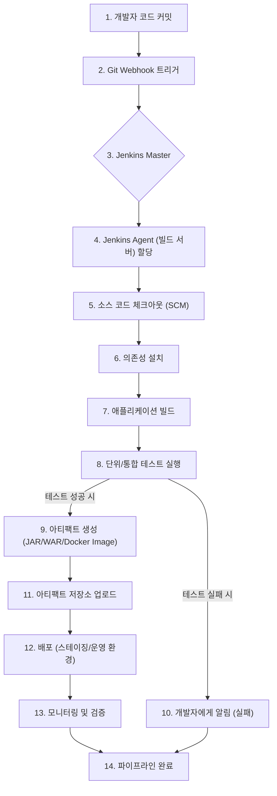

---
## Jenkins, 현대 소프트웨어 개발의 핵심 자동화 서버 깊이 탐구

소프트웨어 개발은 끊임없이 진화하며, 빠르게 변화하는 시장 요구사항에 대응하기 위해 효율성과 안정성은 그 어느 때보다 중요해졌습니다. 이러한 맥락에서 **자동화**는 개발 프로세스의 필수 요소로 자리 잡았고, 그 중심에는 오픈 소스 자동화 서버인 **Jenkins**가 있습니다. 본 글에서는 Jenkins가 무엇인지, 왜 현대 소프트웨어 개발에서 필수적인 도구로 평가받는지, 그리고 그 핵심 기능과 아키텍처를 심층적으로 분석합니다.

> **참고**: "Jenkins"라는 이름은 소프트웨어 자동화 서버 외에도, 밥 젠킨스(Bob Jenkins)가 설계한 비암호화 해시 함수 계열이나, 핵 붕괴율 연구를 보고한 학술 문헌의 저자 "Jenkins, et al." 등 다양한 맥락에서 사용됩니다. 본 글에서는 **소프트웨어 개발 자동화 서버인 Jenkins**에 초점을 맞춰 설명합니다.

### Jenkins란 무엇인가?

Jenkins는 소프트웨어 개발 프로세스의 다양한 단계를 자동화하는 데 사용되는 **오픈 소스 자동화 서버**입니다. 흔히 "CI/CD 서버"라고도 불리며, 소프트웨어의 빌드(Build), 테스트(Test), 배포(Deploy) 과정을 자동화하여 개발 생산성을 높이고, 소프트웨어 품질을 향상시키며, 릴리스 주기를 단축하는 데 핵심적인 역할을 수행합니다.

**지속적 통합(CI, Continuous Integration)**과 **지속적 배포(CD, Continuous Delivery/Deployment)**는 DevOps 문화의 핵심 축이며, Jenkins는 이러한 CI/CD 파이프라인을 구축하고 관리하는 데 가장 널리 사용되는 도구 중 하나입니다. 개발자가 코드 변경 사항을 중앙 저장소에 커밋하면, Jenkins는 이를 감지하여 자동으로 빌드를 시작하고, 테스트를 실행하며, 그 결과를 개발자에게 피드백합니다. 이 과정의 자동화는 문제를 조기에 발견하고 해결하여 통합 비용을 줄이는 데 크게 기여합니다.

#### Jenkins의 역사적 배경

Jenkins의 시작은 2000년대 초 Sun Microsystems에서 개발된 **Hudson** 프로젝트로 거슬러 올라갑니다. 당시 Hudson은 소프트웨어 개발 프로세스 자동화에 큰 성공을 거두었으나, 2010년 오라클이 Sun Microsystems를 인수하면서 상표권 문제와 커뮤니티와의 갈등이 불거졌습니다. 이로 인해 Hudson의 핵심 개발자들과 커뮤니티는 프로젝트를 포크(fork)하여 **Jenkins**라는 이름으로 독립적인 개발을 이어갔습니다. 현재 Jenkins는 클라우드 비(CloudBees)의 지원을 받으며 활발한 커뮤니티 주도 개발이 이루어지고 있습니다.

### Jenkins의 핵심 기능 및 아키텍처

Jenkins는 강력한 기능과 유연한 아키텍처를 통해 다양한 개발 환경과 요구사항에 맞춰 활용될 수 있습니다.

#### 1. CI/CD 파이프라인 구축

Jenkins의 가장 핵심적인 기능은 CI/CD 파이프라인을 구축하고 실행하는 것입니다. 개발자가 코드를 커밋하는 순간부터 최종 사용자에게 배포되기까지의 모든 과정을 자동화된 일련의 단계로 정의할 수 있습니다.

*   **빌드 자동화**: Maven, Gradle, npm, Ant 등 다양한 빌드 도구를 사용하여 소스 코드를 실행 가능한 아티팩트(JAR, WAR, Docker 이미지 등)로 컴파일하고 패키징합니다.
*   **테스트 자동화**: 단위 테스트, 통합 테스트, 성능 테스트 등 모든 종류의 테스트를 자동으로 실행하여 코드 변경이 기존 기능에 미치는 영향을 검증합니다.
*   **배포 자동화**: 빌드 및 테스트가 성공적으로 완료된 아티팩트를 스테이징 또는 운영 환경에 자동으로 배포합니다.
*   **모니터링 및 알림**: 빌드 및 배포 과정의 성공/실패 여부를 Slack, 이메일 등 다양한 채널로 알림하여 개발팀이 문제에 신속하게 대응할 수 있도록 돕습니다.

#### 2. 플러그인 생태계

Jenkins의 가장 큰 강점 중 하나는 방대하고 활발한 **플러그인 생태계**입니다. Jenkins Core는 기본적인 자동화 기능을 제공하지만, 수많은 플러그인을 통해 거의 모든 종류의 빌드 도구, 버전 관리 시스템(Git, SVN), 클라우드 플랫폼(AWS, Azure, GCP), 배포 도구(Ansible, Docker, Kubernetes) 등과 통합될 수 있습니다. 이를 통해 개발 환경에 구애받지 않고 유연하게 CI/CD 파이프라인을 구성할 수 있습니다.

#### 3. 분산 빌드 (Master-Agent 아키텍처)

Jenkins는 핵심 아키텍처 중 하나인 **Master-Agent 아키텍처**를 통해 빌드 작업을 분산하여 처리할 수 있습니다.
*   **Jenkins Master**: CI/CD 파이프라인의 전체적인 흐름을 관리하고, 작업(Job)을 스케줄링하며, Agent 노드에 작업을 할당하고, 결과를 취합합니다.
*   **Jenkins Agent (Slave)**: Master로부터 할당받은 실제 빌드, 테스트, 배포 작업을 수행합니다. Agent는 물리 서버, 가상 머신, Docker 컨테이너 등 다양한 형태로 구성될 수 있으며, 특정 운영체제나 환경이 필요한 작업을 처리하는 데 유용합니다.

이러한 분산 아키텍처는 병렬 빌드를 가능하게 하여 전체 빌드 시간을 단축하고, Master 서버의 부하를 줄여 안정성을 높이며, 특정 환경에 특화된 작업을 처리할 수 있도록 유연성을 제공합니다.

#### 4. Jenkinsfile (Pipeline as Code)

과거 Jenkins는 GUI를 통해 작업을 설정하는 방식이 일반적이었으나, 현대적인 DevOps 관행에서는 **Jenkinsfile**을 통한 **Pipeline as Code** 방식이 업계에서 널리 권장됩니다. Jenkinsfile은 CI/CD 파이프라인의 정의를 Groovy 기반의 스크립트 형태로 작성하여 소스 코드 저장소에 함께 관리하는 방식입니다.

*   **버전 관리**: 파이프라인 정의 자체가 Git과 같은 버전 관리 시스템에 저장되므로, 파이프라인 변경 이력을 추적하고 롤백할 수 있습니다.
*   **재현성**: 모든 개발자가 동일한 파이프라인 정의를 공유하므로, 환경에 관계없이 일관된 빌드 및 배포 프로세스를 보장합니다.
*   **협업**: 개발팀 전체가 파이프라인 정의를 검토하고 개선할 수 있어 협업 효율이 증가합니다.

Jenkinsfile은 크게 `Declarative Pipeline`과 `Scripted Pipeline` 두 가지 문법을 지원합니다. `Declarative Pipeline`은 더 간결하고 구조화된 방식으로 파이프라인을 정의하는 데 적합하며, `Scripted Pipeline`은 더 많은 유연성과 Groovy 스크립트의 모든 기능을 활용할 수 있도록 합니다.

```groovy
// Jenkinsfile 예시: 간단한 Declarative Pipeline
pipeline {
    agent any // 어떤 Jenkins Agent에서든 실행 가능

    stages {
        stage('Checkout Source') {
            steps {
                echo '소스 코드를 체크아웃합니다.'
                git 'https://github.com/your-org/your-repo.git' // GitHub 리포지토리 예시
            }
        }
        stage('Build') {
            steps {
                echo '애플리케이션을 빌드합니다.'
                sh 'mvn clean package' // Maven 빌드 명령어 예시
            }
        }
        stage('Test') {
            steps {
                echo '단위 테스트를 실행합니다.'
                sh 'mvn test' // Maven 테스트 명령어 예시
            }
        }
        stage('Deploy to Staging') {
            when {
                branch 'main' // main 브랜치에서만 배포
            }
            steps {
                echo '스테이징 환경에 배포합니다.'
                // 실제 배포 스크립트 (예: Docker 이미지 빌드 및 푸시, SSH를 통한 배포)
                sh 'docker build -t my-app:latest .'
                sh 'docker push my-registry/my-app:latest'
                // sh 'ssh deployuser@staging-server "sudo systemctl restart my-app"'
            }
        }
    }

    post { // 파이프라인 실행 후 항상 수행되는 작업
        always {
            echo '파이프라인 실행이 완료되었습니다.'
        }
        success {
            echo '🎉 파이프라인이 성공적으로 완료되었습니다!'
            // slackSend channel: '#devops', message: '빌드 및 배포 성공!' // Slack 알림 플러그인 사용 예시
        }
        failure {
            echo '❌ 파이프라인 실행에 실패했습니다!'
            // slackSend channel: '#devops', message: '빌드 및 배포 실패!'
        }
        unstable {
            echo '⚠️ 파이프라인이 불안정하게 완료되었습니다 (테스트 실패 등).'
        }
    }
}
```

### Jenkins 파이프라인의 이해와 구성

Jenkins 파이프라인은 소프트웨어 딜리버리 프로세스의 자동화된 표현입니다. 다음은 일반적인 CI/CD 파이프라인의 개념적 흐름을 보여주는 다이어그램입니다.



**단계별 설명:**

1.  **개발자 코드 커밋**: 개발자가 변경 사항을 Git, SVN 등의 버전 관리 시스템에 커밋합니다.
2.  **Git Webhook 트리거**: 버전 관리 시스템은 설정된 Webhook을 통해 Jenkins에 코드 변경 이벤트를 알립니다. (또는 Jenkins가 주기적으로 SCM을 폴링할 수 있습니다.)
3.  **Jenkins Master**: Master는 이 이벤트를 수신하고, 파이프라인을 시작할 준비를 합니다.
4.  **Jenkins Agent 할당**: Master는 파이프라인을 실행할 적절한 Agent 노드를 선택하고 작업을 할당합니다.
5.  **소스 코드 체크아웃**: Agent는 버전 관리 시스템에서 최신 소스 코드를 가져옵니다.
6.  **의존성 설치**: 프로젝트에 필요한 라이브러리 및 모듈(예: Maven dependencies, npm packages)을 설치합니다.
7.  **애플리케이션 빌드**: 소스 코드를 컴파일하고 실행 가능한 형태로 패키징합니다.
8.  **단위/통합 테스트 실행**: 빌드된 코드에 대해 자동화된 테스트를 실행하여 기능의 정확성을 검증합니다.
9.  **아티팩트 생성**: 테스트가 성공하면, 배포 가능한 아티팩트(예: JAR 파일, Docker 이미지)를 생성합니다.
10. **개발자에게 알림 (실패)**: 테스트 또는 빌드가 실패하면, 개발자에게 즉시 알림을 보내 문제를 조기에 파악하고 해결할 수 있도록 합니다.
11. **아티팩트 저장소 업로드**: 생성된 아티팩트를 Nexus, Artifactory와 같은 아티팩트 저장소에 업로드하여 관리합니다.
12. **배포**: 아티팩트 저장소에서 아티팩트를 가져와 스테이징 또는 운영 환경에 자동으로 배포합니다.
13. **모니터링 및 검증**: 배포된 애플리케이션의 상태를 모니터링하고, 필요에 따라 추가적인 검증 테스트를 수행합니다.
14. **파이프라인 완료**: 모든 단계가 성공적으로 완료되면 파이프라인이 종료됩니다.

### Jenkins의 장점과 단점

Jenkins는 강력한 도구이지만, 모든 상황에 완벽한 솔루션은 아닙니다. 일반적으로 다음의 장점과 단점이 언급됩니다.

| 장점 (Pros)                                                                     | 단점 (Cons)                                                                         |
| :------------------------------------------------------------------------------ | :---------------------------------------------------------------------------------- |
| **오픈 소스 및 무료**: 라이선스 비용 없이 자유롭게 사용 및 수정 가능.             | **초기 설정 및 유지보수 복잡성**: 직접 설치하고 관리해야 하므로 초기 설정 및 운영 부담이 큼. |
| **방대한 플러그인 생태계**: 거의 모든 개발 도구 및 플랫폼과 통합 가능.           | **리소스 소비**: Master 및 Agent 서버를 직접 운영해야 하므로 하드웨어 리소스가 필요.   |
| **높은 유연성 및 커스터마이징**: Pipeline as Code를 통해 매우 복잡하고 특정 환경에 최적화된 파이프라인 구축 가능. | **학습 곡선**: Jenkinsfile 작성 및 고급 기능 활용을 위한 학습 시간이 필요.              |
| **활발한 커뮤니티 지원**: 문제 발생 시 풍부한 자료와 커뮤니티의 도움을 받을 수 있음. | **보안 취약점 관리**: 오픈 소스이므로 보안 업데이트 및 취약점 관리에 주의가 필요.      |
| **분산 빌드 지원**: Master-Agent 아키텍처를 통해 대규모 프로젝트 및 병렬 빌드 처리 가능. | **클라우드 네이티브 기능 부족**: 클라우드 기반 CI/CD 도구에 비해 클라우드 환경과의 통합이 상대적으로 수동적일 수 있음. |

### Jenkins와 다른 CI/CD 도구 비교

Jenkins는 오랫동안 CI/CD 시장의 강자였지만, 최근에는 클라우드 네이티브 환경에 최적화된 다양한 CI/CD 도구들이 등장하고 있습니다. GitLab CI/CD, GitHub Actions, CircleCI, Travis CI 등이 대표적입니다. 일반적으로 이러한 클라우드 기반 도구들은 주로 SaaS(Software as a Service) 형태로 제공되어 초기 설정 및 유지보수 부담이 적고, 클라우드 환경과의 통합이 용이하다는 장점이 있습니다. 반면 Jenkins는 온프레미스 또는 자체 호스팅 환경에서 가장 큰 강점을 발휘하며, 극도로 높은 커스터마이징과 유연성이 필요한 프로젝트에 적합하다고 평가됩니다. 특히 보안 규정이나 특정 인프라 제약으로 인해 외부 클라우드 서비스 사용이 어려운 기업 환경에서 Jenkins는 여전히 강력한 대안으로 손꼽힙니다.

### Jenkins 시작하기

Jenkins를 시작하는 방법은 다양합니다. 일반적으로 다음과 같은 방법들이 권장됩니다.

1.  **Docker 사용**: `docker run -p 8080:8080 -p 50000:50000 jenkins/jenkins:lts` 명령으로 쉽게 Jenkins 컨테이너를 실행할 수 있습니다. 이는 개발 및 테스트 환경에서 가장 권장되는 방법 중 하나입니다.
2.  **운영체제 패키지 관리자**: Debian/Ubuntu의 `apt`, Red Hat/CentOS의 `yum`을 통해 설치할 수 있습니다.
3.  **WAR 파일 직접 실행**: Java Runtime Environment(JRE)가 설치된 환경에서 Jenkins WAR 파일을 다운로드하여 `java -jar jenkins.war` 명령으로 실행할 수 있습니다.

설치 후에는 웹 브라우저를 통해 Jenkins 대시보드에 접속하여 초기 관리자 비밀번호를 설정하고, 필요한 플러그인을 설치하며, 첫 번째 파이프라인을 구성할 수 있습니다.

### 결론

Jenkins는 지난 수십 년간 소프트웨어 개발 자동화의 표준으로 자리매김했으며, 현대 DevOps 문화의 확산에 지대한 공헌을 했습니다. 복잡한 개발 프로세스를 자동화하고, 소프트웨어 품질을 향상시키며, 시장에 더 빠르게 가치를 전달하는 데 있어 Jenkins는 여전히 강력하고 유연한 도구입니다. 비록 클라우드 기반의 새로운 CI/CD 도구들이 등장하고 있지만, Jenkins의 오픈 소스 정신, 방대한 플러그인 생태계, 그리고 높은 커스터마이징 능력은 여전히 많은 개발자와 기업들에게 매력적인 선택지로 남아있습니다. Jenkins를 효과적으로 활용하는 것은 현대 소프트웨어 개발 팀의 생산성과 효율성을 극대화하는 핵심 역량이 될 것입니다.