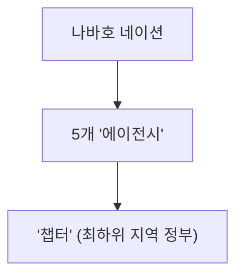

안녕하세요, 트잡이입니다! 💡 오늘은 미국 땅 안에 숨겨진 또 다른 세계, 바로 '나바호 네이션(Navajo Nation)'에 대해 알아보는 시간을 가져볼 거예요. 미국 서부 여행을 해보신 분들이라면 아마 들어보셨을 수도 있고, 영화나 다큐멘터리에서 스쳐 지나갔을 수도 있답니다. 과연 나바호 네이션은 어떤 곳일까요? 함께 탐험해 봐요! 🗺️

## 나바호 네이션은 어떤 곳인가요?
나바호 네이션은 쉽게 말해, 미국 내 중요한 **원주민 보호 구역** 중 하나예요. 🎯 애리조나, 뉴멕시코, 유타주에 걸쳐 있는 광활한 땅에 자리 잡고 있으며, 나바호족(Navajo people)의 고향이랍니다. 이들은 자신들의 언어로 이곳을 '나베호 비나하스조(Naabeehó Bináhásdzo)'라고 불러요. 마치 한 나라 안에 또 다른 작은 나라가 있는 것과 같다고 생각하시면 이해하기 쉬울 거예요. 😮 자체적인 문화와 전통, 그리고 정부 시스템을 가지고 있죠.

## 독특한 자치 구조와 역사 이야기
나바호 네이션은 그저 '보호 구역'을 넘어선 **자율적인 통치 체제**를 갖추고 있어요. 🏛️ 가장 기본적인 지방 정부 단위는 마치 우리나라의 동사무소나 읍사무소 같은 역할을 하는 '챕터(Chapter)'라고 불린답니다. 이 챕터들이 모여 총 5개의 '에이전시(Agency)'를 구성하고, 이들이 전체 나바호 네이션을 운영하는 형태예요. 복잡해 보인다고요? 아래 다이어그램으로 한눈에 파악해 보세요!

> 💡 **핵심 인사이트:** 나바호 네이션의 '챕터'는 가장 지역적인 형태의 정부이며, 5개 '에이전시'를 통해 자치 시스템을 운영하고 있답니다.

슬픈 역사도 가지고 있어요. 😔 1944년부터 나바호 네이션 지역에서는 **우라늄 채굴**이 시작되었답니다. 과거의 아픔을 딛고 현재는 문화와 주권을 지키기 위해 노력하고 있답니다.

나바호 네이션은 단순히 관광지가 아니라, 독특한 역사와 문화를 간직한 살아있는 공동체예요. 🌟 미국 속 또 다른 세상을 탐험하고 싶다면, 나바호 네이션에 대해 더 알아보는 건 어떨까요? 다음에 또 흥미로운 이야기로 찾아올게요! 안녕~ 👋

## 참고자료

- [Navajo Nation](https://en.wikipedia.org/wiki/Navajo%20Nation)
- [Chapter (Navajo Nation)](https://en.wikipedia.org/wiki/Chapter%20%28Navajo%20Nation%29)
- [Uranium mining and the Navajo people](https://en.wikipedia.org/wiki/Uranium%20mining%20and%20the%20Navajo%20people)