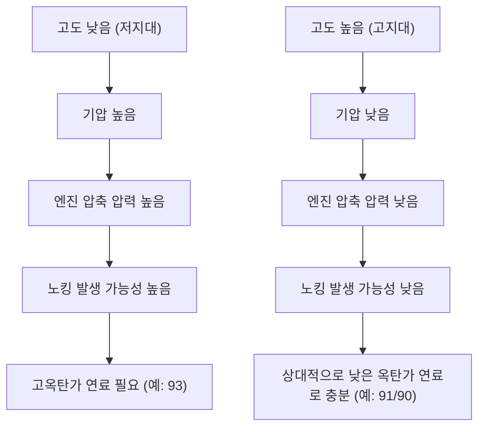

---
안녕하세요, 여러분! 🚗 주유소에 들러 기름을 넣을 때마다 혹시 이런 생각 해보신 적 있으신가요? '레귤러, 미드그레이드, 프리미엄… 그런데 이 **옥탄(Octane)**이라는 게 도대체 뭘까?' 또 '어떤 주는 프리미엄이 93인데, 어떤 주는 91이 최고라고 하네? 왜 이렇게 다를까?' 궁금증 해결사, 테크 블로거가 친절하게 알려드릴게요! 💡

## 옥탄가, 대체 뭘까요?

🎯 옥탄가는 한마디로 **휘발유가 압축에 얼마나 잘 견디는지**를 나타내는 표준 척도랍니다. 우리 자동차 엔진은 연료를 실린더 안에서 꽉 압축한 다음, 점화플러그 불꽃으로 터뜨려 동력을 만들어요. 그런데 연료가 너무 일찍, 또는 불꽃 없이 제멋대로 터져버리면 '노킹(Knocking)'이라는 이상 현상이 발생해요. 마치 컴퓨터 CPU가 과열돼서 버벅거리는 것과 비슷하다고 생각하시면 돼요! 💥

> 💡 옥탄가는 엔진 내부에서 연료가 비정상적인 연소(노킹) 없이 얼마나 높은 압축률을 견딜 수 있는지를 측정하는 과학적 지표랍니다!

옥탄가가 높을수록 이 노킹 현상 없이 더 높은 압축을 견딜 수 있다는 뜻이죠. 그래서 고성능 엔진이나 압축률이 높은 차량에는 높은 옥탄가의 휘발유가 권장되는 거랍니다. 옛날에는 옥탄가를 높이려고 `사에틸납(Tetraethyllead)` 같은 첨가제를 썼지만, 지금은 환경 문제 때문에 현대 휘발유에는 사용하지 않아요. 🚫

## 주마다 프리미엄 옥탄가가 다른 이유

자, 이제 가장 궁금했던 질문! 왜 주마다 프리미엄 옥탄가가 93, 91, 90 등으로 다를까요? 🧐 이러한 차이에는 여러 요인이 있지만, **고도(Altitude)**가 중요한 영향을 미치는 것으로 알려져 있습니다. 🏞️

높은 산에 올라가면 기압이 낮아지는 걸 느끼시죠? 자동차 엔진도 마찬가지예요. 고도가 높은 지역에서는 공기 밀도가 낮아져서 엔진 실린더 내의 압축 압력이 자연스럽게 낮아지게 돼요. 압축 압력이 낮아지면 연료가 노킹을 일으킬 가능성이 줄어들기 때문에, 상대적으로 낮은 옥탄가의 휘발유로도 충분한 성능을 낼 수 있게 되는 거죠.

따라서 해수면 근처의 저지대 지역에서는 93 옥탄가 프리미엄이 흔히 보이지만, 록키 산맥과 같은 고지대에서는 91이나 90 옥탄가 휘발유가 최고 등급으로 판매되는 경우가 많습니다. 이는 지역별 환경 조건에 따라 옥탄가 요구 사항이 달라질 수 있음을 보여주는 흥미로운 예시입니다. 🗺️

## 높은 옥탄가가 무조건 좋을까요?

그럼 무조건 옥탄가가 높은 기름을 넣으면 좋을까요? 🤔 그렇지 않답니다! 내 차에 권장되는 옥탄가보다 높은 기름을 넣는다고 해서 드라마틱한 성능 향상이나 연비 개선이 있는 건 아니에요. 오히려 불필요한 비용만 더 들 수 있죠. 💸 중요한 건 **내 차량 제조사가 권장하는 옥탄가**를 지키는 거랍니다. 🔧

이제 주유소에서 옥탄가 숫자를 보면 '아, 저 숫자가 내 차 엔진의 건강과 관련이 있구나!' 하고 이해가 쏙쏙 되실 거예요. 주마다 옥탄가 등급이 다른 이유도 고도와 기압의 차이 때문이라는 사실, 정말 신기하죠? 🤩 오늘의 옥탄가 이야기가 여러분의 '자동차 상식' 금고를 더욱 풍성하게 채워줬기를 바라요! 다음에도 더 재미있는 테크 이야기로 찾아올게요. 안녕! 👋

## 참고자료

- [Octane rating](https://en.wikipedia.org/wiki/Octane%20rating)
- [Gasoline](https://en.wikipedia.org/wiki/Gasoline)
- [Tetraethyllead](https://en.wikipedia.org/wiki/Tetraethyllead)