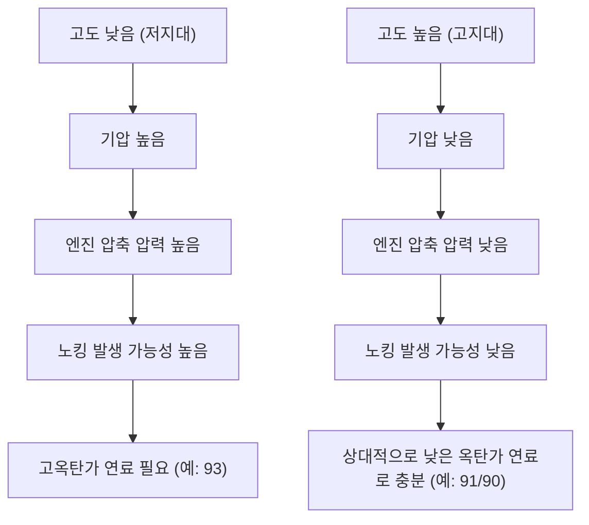

## 옥탄가, 대체 뭘까요?

## 옥탄가, 대체 뭘까요?

옥탄가는 휘발유가 압축에 얼마나 잘 견디는지를 나타내는 표준 척도이다. 자동차 엔진은 연료를 실린더 안에서 압축한 뒤 점화플러그의 불꽃으로 연소시켜 동력을 얻는다. 이때 연료가 불꽃 없이 제멋대로 터지면 '노킹(Knocking)'이라는 이상 현상이 발생한다.

> 💡 옥탄가는 엔진 내부에서 연료가 비정상적인 연소(노킹) 없이 얼마나 높은 압축률을 견딜 수 있는지를 측정하는 과학적 지표랍니다!

옥탄가가 높을수록 노킹 현상 없이 더 높은 압축을 견딜 수 있다. 따라서 고성능 엔진이나 압축비가 높은 차량에는 높은 옥탄가의 휘발유가 권장된다. 과거에는 옥탄가를 높이기 위해 사에틸납(Tetraethyllead) 같은 첨가제를 사용했으나, 현재는 환경 문제로 인해 사용하지 않는다.

## 주마다 프리미엄 옥탄가가 다른 이유

## 주마다 프리미엄 옥탄가가 다른 이유

주마다 프리미엄 휘발유의 옥탄가가 93, 91, 90 등으로 다른 이유는 고도(Altitude)와 밀접한 관련이 있다.

고도가 높은 지역은 기압이 낮아 공기 밀도가 낮다. 이로 인해 엔진 실린더 내의 압축 압력이 자연스럽게 낮아지며, 연료가 노킹을 일으킬 가능성 또한 줄어든다. 따라서 고지대에서는 상대적으로 낮은 옥탄가의 휘발유로도 충분한 성능을 낼 수 있다.

해수면 근처의 저지대에서는 93 옥탄가 프리미유가 흔하지만, 록키 산맥과 같은 고지대에서는 91이나 90 옥탄가 휘발유가 최고 등급으로 판매된다. 이는 지역별 환경 조건에 따라 옥탄가 요구 사항이 달라짐을 보여준다.

```mermaid
graph TD
    A["고도 낮음 (저지대)"] --> B["기압 높음"]
    B --> C["엔진 압축 압력 높음"]
    C --> D["노킹 발생 가능성 높음"]
    D --> E["고옥탄가 연료 필요 (예: 93)"]

    F["고도 높음 (고지대)"] --> G["기압 낮음"]
    G --> H["엔진 압축 압력 낮음"]
    H --> I["노킹 발생 가능성 낮음"]
    I --> J["상대적으로 낮은 옥탄가 연료로 충분 (예: 91/90)"]
```

## 높은 옥탄가가 무조건 좋을까요?

## 높은 옥탄가가 무조건 좋을까요?

권장 옥탄가보다 높은 기름을 넣는다고 해서 성능 향상이나 연비 개선이 이루어지는 것은 아니다. 오히려 불필요한 비용이 발생할 수 있으므로, 차량 제조사가 권장하는 옥탄가를 준수하는 것이 중요하다.

주유소의 옥탄가 숫자는 엔진의 건강과 직결된다. 지역별 옥탄가 등급의 차이는 고도와 기압의 차이에서 기인한다.

## 참고자료

- [Octane rating](https://en.wikipedia.org/wiki/Octane%20rating)
- [Gasoline](https://en.wikipedia.org/wiki/Gasoline)
- [Tetraethyllead](https://en.wikipedia.org/wiki/Tetraethyllead)
