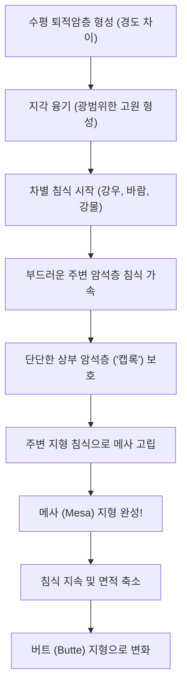

---
안녕하세요, IT와 과학의 경계에서 흥미로운 지식을 탐험하는 트렌드세터 여러분! 🚀 오늘은 우리가 흔히 접하는 기술 이야기가 아닌, 지구의 장대한 역사가 빚어낸 경이로운 자연 현상, 바로 ‘메사(Mesa)’ 지형에 대해 자세히 알아보는 시간을 가져볼까 해요. "메사"라는 이름이 조금 생소하게 들릴 수도 있지만, 사실 우리 주변의 미디어 속에서 알게 모르게 자주 만나는 멋진 풍경이랍니다. 과연 이 거대한 평평한 탁자 모양의 지형들은 어떻게 생겨난 걸까요? 함께 그 비밀을 파헤쳐 봐요! 💡

## 메사, 그 신비로운 지형의 정체를 밝히다! 🎯

메사(Mesa)는 그 생김새가 마치 탁자와 같다고 하여 붙여진 이름입니다. 일반적으로 메사는 주변 지형보다 높이 솟아 있으며, 꼭대기는 평평하고 넓은 대지를 이루고 측면은 가파른 절벽으로 이루어진 지형을 의미합니다. 🏞️ 마치 자연이 빚어낸 거대한 케이크 같다고 할까요?

미국 서부 영화에서 자주 등장하는 웅장한 배경이나, 애니메이션 '라이온 킹'의 프라이드 랜드처럼 평평한 정상부가 있는 거대한 산을 보신 적이 있다면, 바로 그것이 메사일 가능성이 매우 높아요!

### 메사 지형의 핵심 특징

*   **평탄한 상부 (Flat Top):** 메사의 가장 두드러진 특징 중 하나입니다. 거대한 평면이 펼쳐져 있어, 마치 하늘 위에 떠 있는 대지처럼 보입니다.
*   **가파른 측면 (Steep Sides):** 상부는 평평하지만, 측면은 가파른 절벽으로 이루어져 있는 경우가 많습니다. 이 절벽이 메사를 주변 지형과 확연히 구분 짓는 요소예요.
*   **고립된 형태 (Isolated):** 메사는 침식 작용으로 주변 암석들이 깎여나가면서 홀로 남겨진 고립된 형태로 나타나는 경우가 있습니다. 그래서 광활한 평야나 사막 한가운데 우뚝 솟아 있는 모습을 자주 볼 수 있답니다.

> **핵심 인사이트:** 메사는 '탁자'라는 이름처럼 평평한 상부와 가파른 측면을 가진 고립된 지형으로, 수백만 년에 걸친 지구의 침식 작용이 빚어낸 자연 현상입니다. ✨

## 거대한 탁자는 어떻게 만들어졌을까? 메사 형성의 대서사시 📜

자, 이제 오늘의 하이라이트! 이토록 거대하고 평평한 메사 지형이 도대체 어떻게 생겨났는지, 그 형성 과정에 대한 **일반적인 과학적 설명**을 단계별로 자세히 알아볼까요? 이는 수백만 년에 걸쳐 진행되는 지구의 지질학적 드라마입니다.

### 1단계: 퇴적암층의 형성
메사 형성을 위해서는 먼저 수평으로 겹겹이 쌓인 퇴적암층이 필요하다고 알려져 있습니다.
*   **다양한 재료:** 모래, 진흙, 자갈 등이 쌓여 사암, 셰일, 석회암 같은 퇴적암을 형성합니다.
*   **경도 차이:** 이때 중요한 것은 이 암석층들이 서로 다른 경도(단단함)를 가진다는 점입니다. 어떤 층은 매우 단단하고, 어떤 층은 비교적 부드럽죠. 특히 상부에는 침식에 강한 단단한 암석층(캡록, Caprock)이 자리 잡는 경우가 많습니다.

### 2단계: 지각 융기
수백만 년의 시간이 흐르면서, 지구 내부의 지각 변동(판 운동)으로 인해 이 퇴적암층 전체가 서서히 융기하기 시작합니다. 바다 밑이나 저지대에 있던 지층이 점점 높은 고원으로 솟아오르는 것이죠. 이렇게 광범위하게 융기하여 형성된 평탄한 고지대가 바로 '고원(Plateau)'의 초기 형태입니다. 메사는 이 고원이 침식되는 과정에서 생겨나는 지형이에요.

### 3단계: 차별 침식의 시작
이제부터 자연의 위대한 조각가, '침식(Erosion)'의 역할이 시작됩니다! 융기한 고원 지대는 바람, 비, 강물, 빙하, 온도 변화 등 다양한 외부 요인에 끊임없이 노출돼요. 여기서 핵심은 바로 '차별 침식(Differential Erosion)'입니다.
*   **부드러운 암석층의 약점:** 강우(비)와 강물은 고원 표면을 흐르면서 상대적으로 약하고 부드러운 암석층을 더 빠르고 쉽게 깎아냅니다.
*   **단단한 캡록의 방어:** 하지만 가장 상부에 있는 단단한 암석층, 즉 캡록은 침식에 매우 강해서 쉽게 깎여나가지 않는 경향이 있습니다. 이 캡록이 마치 튼튼한 지붕처럼 그 아래의 부드러운 암석층을 보호해주는 역할을 합니다.
*   **측면 침식 가속:** 강물은 고원 가장자리를 따라 흐르면서 측면의 부드러운 암석층을 집중적으로 침식하여 깊은 계곡과 협곡을 만들 수 있습니다.

### 4단계: 고립과 메사의 탄생
수백만 년 동안 차별 침식 작용이 계속되면서, 고원 주변의 부드러운 암석들은 계속해서 깎여나가고 강물에 의해 운반됩니다. 결국, 단단한 캡록으로 보호받던 부분만이 주변 지형과 분리되어 홀로 우뚝 솟아오른 거대한 탁자 모양의 지형으로 남게 되는데, 이것이 바로 '메사'입니다!

### 5단계: 침식의 지속과 지형의 변화
메사 또한 영원히 그 모습을 유지하지는 않습니다. 침식은 계속됩니다. 메사의 가파른 측면 절벽은 계속해서 후퇴하고, 캡록도 조금씩 무너지면서 메사의 평탄한 상부 면적은 점차 줄어들게 돼요. 결국 메사가 더 작아지고 폭이 좁아져서 높이와 너비가 비슷해지거나 높이가 더 길쭉한 원뿔형에 가까운 형태로 변하면, 우리는 그것을 '버트(Butte)'라고 부른답니다.

> **자연의 알고리즘:** 이 모든 과정은 수백만 년에 걸쳐 지구의 물리적, 화학적 힘이 정교하게 상호작용한 결과입니다. 마치 자연이 설계한 거대한 '지형 생성 알고리즘'과 같습니다! 💻

### 메사 형성 과정 시각화 (Mermaid Diagram)

메사 형성의 단계를 한눈에 볼 수 있도록 다이어그램으로 정리해 보았어요.



### 자연의 메사 생성 알고리즘 (Conceptual Algorithm)

메사가 만들어지는 과정을 컴퓨터 프로그램의 알고리즘처럼 표현해 볼까요? 자연은 수백만 년에 걸쳐 이 코드를 실행한답니다!

```text
// 자연의 메사 생성 알고리즘 v1.0
FUNCTION CREATE_MESA_LANDFORM(지형_데이터, 시간_단위_백만년)
    INPUT:
        - 지형_데이터: 초기 퇴적암층의 경도, 두께, 위치 정보 (필수: 단단한 캡록 존재)
        - 시간_단위_백만년: 침식 작용이 지속될 기간 (밀리언년 단위)
    OUTPUT:
        - 최종_지형: 메사 지형 또는 그 변형 (버트, 고원 등)

    STEP 1: 초기_지형_조건_확인()
        IF 지형_데이터.수평_퇴적층_존재 AND 지형_데이터.상부_캡록_존재 THEN
            PRINT "메사 생성 조건 만족! 지구의 무대가 준비되었어요. ✨"
        ELSE
            RETURN "메사 생성 실패: 적절한 지층 없음 😭 (다른 지형을 기대하세요!)"
        END IF

    STEP 2: 지각_융기_시뮬레이션()
        지형_데이터.전체_고도 += 무작위_융기량(100m ~ 1000m) // 대규모 융기
        지형_데이터.고원_형성_완료 = TRUE
        PRINT "지각 융기로 광대한 고원 형성 중... 🏞️"

    STEP 3: 침식_작용_반복(시간_단위_백만년)
        FOR i = 1 TO 시간_단위_백만년 DO
            // 핵심: 부드러운 층은 빠르게, 단단한 층은 느리게 침식
            적용_차별_침식(지형_데이터, 강우량, 풍속, 온도변화) 
            
            IF 지형_데이터.캡록_보호_성공 THEN
                PRINT "강력한 캡록이 아래층을 지켜주고 있어요! 💪"
            ELSE
                PRINT "캡록이 무너지고 있어요... 메사 형태 유지 어려움. 💔"
                BREAK // 캡록이 사라지면 메사 형태가 급격히 변함
            END IF
            지형_데이터.주변_부드러운_지형_제거() // 주변의 덜 단단한 지형 침식

            IF 지형_데이터.현재_형태 == "메사" THEN
                PRINT "메사 형태로 진화 중... ⏳"
            ELSE IF 지형_데이터.현재_형태 == "버트" THEN
                PRINT "버트 형태로 진화 중... 🤏"
            END IF
        END FOR

    STEP 4: 최종_형태_확인()
        IF 지형_데이터.상부_평탄 AND 지형_데이터.측면_급경사 AND 지형_데이터.주변과_고립 AND 지형_데이터.너비 > 지형_데이터.높이 * 2 THEN
            RETURN "짜잔! 거대한 메사가 완성되었어요! 🤩"
        ELSE IF 지형_데이터.상부_평탄 AND 지형_데이터.측면_급경사 AND 지형_데이터.너비 <= 지형_데이터.높이 * 2 THEN
            RETURN "메사가 침식되어 버트(Butte)로 변했어요! 🤏"
        ELSE
            RETURN "다른 형태의 지형으로 진화 중이거나, 초기 고원 상태입니다. 🧐"
        END IF
END FUNCTION
```

## 메사, 버트, 고원: 어떤 차이가 있을까? 🧐

메사 지형을 이야기할 때, '버트(Butte)'나 '고원(Plateau)'과 같은 용어들도 자주 등장해요. 이 세 가지는 모두 침식과 융기 과정에서 나타나는 지형이지만, 크기와 형태, 그리고 형성 단계에서 미묘한 차이가 있답니다. 마치 진화하는 포켓몬 같다고 할까요? 📈

| 특징              | 고원 (Plateau)                                | 메사 (Mesa)                                 | 버트 (Butte)                                  |
| :---------------- | :-------------------------------------------- | :------------------------------------------ | :-------------------------------------------- |
| **정의**          | 넓은 면적에 걸쳐 고도가 높은 평탄한 지형      | 평탄한 상부와 급경사면을 가진 탁자형 잔존 지형 | 메사보다 더 좁고 원뿔형에 가까운 잔존 지형    |
| **수평 면적**     | 매우 넓다 (수백~수천 km²), 주변 지역보다 넓음 | 너비가 높이보다 큰 경우가 많습니다.         | 너비가 높이와 비슷하거나 작다 (더 길쭉한 형태) |
| **형성 원리**     | 지각 융기 후 광범위한 지역이 평탄하게 유지    | 고원의 차별 침식 결과로 고립된 잔존물        | 메사가 추가 침식되어 면적이 축소된 최종 잔존물 |
| **생성 단계**     | 초기 지각 융기 단계 또는 광범위한 침식 저항 지역 | 고원 → 메사 (중간 단계)                   | 고원 → 메사 → 버트 (최종 잔존 단계)         |
| **예시**          | 세계 곳곳에서 발견되는 고원                   | 미국 서부 등지에서 흔히 볼 수 있는 탁자형 지형 | 메사가 침식된 형태                            |

이 표를 보면, 고원이 가장 크고 광범위한 평탄 지형이고, 침식 작용이 진행되면서 고원에서 메사로, 그리고 더 나아가 버트로 점차 작아지고 고립되는 과정을 거친다는 것을 알 수 있죠. 마치 거대한 땅덩어리가 시간의 흐름에 따라 점점 더 작은 조각으로 깎여나가는 모습이랍니다. 🤏

## 마무리하며: 지구의 드라마를 감상하는 눈 💖

오늘은 '메사'라는 평평한 탁자 모양의 지형이 어떻게 수백만 년에 걸쳐 지구의 끊임없는 지각 활동과 침식 작용으로 탄생하는지에 대한 **일반적인 과학적 설명**을 알아보았어요. 복잡해 보이는 지질학적 과정도, 차근차근 단계별로 살펴보니 마치 한 편의 드라마 같지 않나요? 🎬

우리가 사는 이 지구는 정말 놀라운 곳이에요. 우리 눈에 보이지 않는 느린 움직임 속에서도 끊임없이 변화하고, 예측 불가능한 아름다운 풍경을 만들어내죠. 다음번에 멋진 풍경 사진을 보게 된다면, 그 안에 숨겨진 지구의 위대한 이야기도 함께 상상해 보는 건 어떨까요? 작은 지식 하나가 세상을 보는 시야를 넓혀줄 수 있답니다! 다음에 또 다른 흥미로운 이야기로 찾아올게요! 👋

## 참고자료

- [Mesa](https://en.wikipedia.org/wiki/Mesa)
- [Black Mesa (Oklahoma, Colorado, New Mexico)](https://en.wikipedia.org/wiki/Black%20Mesa%20%28Oklahoma%2C%20Colorado%2C%20New%20Mexico%29)
- [Grand Mesa](https://en.wikipedia.org/wiki/Grand%20Mesa)