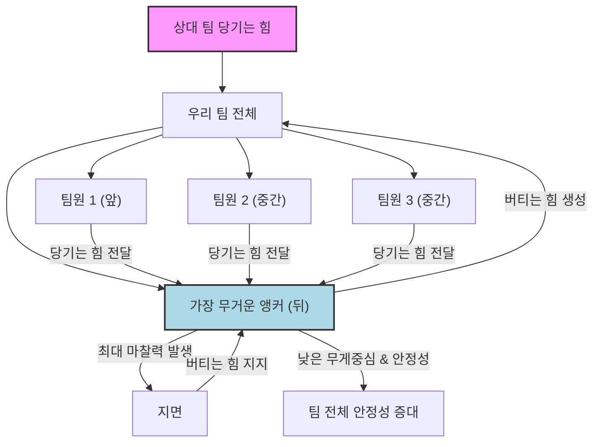

---
줄다리기를 할 때 무거운 사람은 대체 어디에 서야 가장 유리할까요? 🤔 많은 분들이 궁금해하는 질문이랍니다! 단순히 힘이 세면 이긴다고 생각하기 쉽지만, 줄다리기에는 생각보다 깊은 과학적 원리와 전략이 숨어있어요. 오늘은 이 흥미로운 줄다리기 전략, 특히 **무게 배치**에 대한 궁금증을 물리학적 관점에서 널리 알려진 원리들을 통해 시원하게 풀어드릴게요! 🚀

## 줄다리기, 단순한 힘겨루기가 아니랍니다! 💪

줄다리기는 두 팀이 줄을 잡고 서로 반대 방향으로 당겨, 상대 팀을 일정 지점까지 끌고 오면 승리하는 경기예요. 겉보기에는 누가 더 힘이 센지 겨루는 것처럼 보이지만, 사실은 **힘의 효율적인 사용, 팀워크, 그리고 전략적인 배치**가 승패를 좌우하는 아주 중요한 요소랍니다. 마치 복잡한 컴퓨터 시스템이 단순히 좋은 CPU 하나만으로 작동하는 것이 아니라, 메모리, 저장 장치, 소프트웨어 등이 조화롭게 작동해야 하듯이 말이죠! 💡

## 물리학으로 파헤치는 줄다리기 전략 💡

줄다리기에서 무게 배치의 중요성을 이해하려면 몇 가지 핵심 물리학 원리를 알아야 해요. 복잡하게 들리나요? 걱정 마세요! 일상생활 속 예시를 들어 쉽게 설명해 드릴게요.

### 핵심 원리 1: 마찰력의 중요성 (The Importance of Friction)

우리가 땅 위를 걸을 수 있는 것도 바로 **마찰력** 덕분이랍니다. 마찰력은 두 물체가 접촉하여 움직이거나 움직이려고 할 때, 그 움직임을 방해하는 힘을 말해요. 줄다리기에서는 팀원들의 발과 땅 사이의 마찰력이 매우 중요해요.

> "마찰력은 줄다리기 팀이 땅을 밀어내는 힘을 효과적으로 전달하고, 상대방에게 끌려가지 않도록 버티는 데 핵심적인 역할을 합니다."

**무게와 마찰력:** 일반적으로 물체의 무게가 무거울수록 바닥과 접촉면에서 발생하는 수직항력(바닥이 물체를 떠받치는 힘)이 커지고, 이 수직항력이 커지면 최대 정지 마찰력(움직이기 직전까지 버틸 수 있는 마찰력)도 커진답니다. 즉, 무거운 사람이 바닥을 딛고 서 있으면 더 큰 마찰력을 발생시켜 미끄러지지 않고 더 강하게 버틸 수 있다는 뜻이죠! 🏋️‍♀️

### 핵심 원리 2: 무게중심과 안정성 (Center of Gravity and Stability)

**무게중심**은 물체의 모든 질량이 한 점에 모여 있다고 가정한 지점을 말해요. 우리 몸의 무게중심은 대략 배꼽 근처에 위치한답니다. 줄다리기에서는 이 무게중심을 낮고 안정적으로 유지하는 것이 매우 중요해요.

> "무게중심이 낮을수록 외부 힘에 의해 넘어지거나 끌려갈 가능성이 줄어들어 팀의 전체적인 안정성이 높아집니다."

예를 들어, 키 큰 사람이 키 작은 사람보다 넘어지기 쉬운 것처럼, 무게중심이 높으면 불안정해요. 줄다리기 선수들이 몸을 뒤로 젖히고 자세를 낮추는 것도 바로 무게중심을 낮춰 안정성을 확보하려는 전략이랍니다. 🧘‍♀️

### 핵심 원리 3: 지렛대의 원리 (The Principle of Leverage)

**지렛대의 원리**는 작은 힘으로 큰 힘을 내거나, 힘의 방향을 바꾸는 데 사용되는 기본적인 기계 원리예요. 줄다리기에서는 팀원들의 배치와 자세가 마치 하나의 거대한 지렛대처럼 작용할 수 있답니다.

줄의 맨 끝에 있는 사람(앵커)은 줄다리기 팀의 '고정점'과 같은 역할을 해요. 이 앵커가 얼마나 효과적으로 버텨주고 힘을 전달하는지에 따라 팀 전체의 힘이 달라질 수 있죠. ⚓

## 그래서 무거운 사람은 어디로 가야 할까요? 🎯

이제 핵심 질문에 답할 시간입니다! 위에서 설명한 물리학 원리들을 종합해 볼 때, **무거운 사람은 줄의 맨 뒤, 즉 앵커(Anchor) 위치에 서는 것이 일반적으로 가장 유리하다고 알려져 있답니다!**

### "뒤로" 가는 전략의 과학 (The Science Behind the "Back" Strategy)

무거운 사람을 줄의 맨 뒤에 배치하는 것은 단순히 '힘이 세니까 뒤에서 버텨라'는 의미를 넘어선답니다. 여기에는 다음과 같은 과학적인 이유가 있어요.

1.  **최대 마찰력 확보 (Maximizing Friction):**
    *   가장 무거운 사람이 맨 뒤에 서서 자세를 낮추고 몸을 뒤로 젖히면, 바닥과의 접촉면에서 발생시킬 수 있는 **최대 정지 마찰력**을 극대화할 수 있어요. 이 마찰력은 팀 전체가 상대방에게 끌려가지 않고 버티는 데 가장 중요한 기반이 됩니다. 마치 자동차가 언덕을 오를 때 타이어의 마찰력이 중요한 것처럼 말이죠. 🚗
    *   무거운 사람이 만들어내는 이 강력한 마찰력은 팀 전체가 당기는 힘을 지지하는 든든한 **"기반"**이 되어준답니다.

2.  **무게중심 낮추기 및 안정성 증대 (Lowering Center of Gravity and Increasing Stability):**
    *   줄의 맨 뒤에 서는 사람은 줄을 잡은 채 몸을 뒤로 젖히고 거의 눕듯이 자세를 잡아요. 이렇게 하면 팀 전체의 **무게중심**이 낮아지고, 상대방이 아무리 강하게 당겨도 쉽게 넘어지지 않는 **안정적인 자세**를 유지할 수 있답니다.
    *   무거운 사람이 뒤에서 이 자세를 유지하면, 팀 전체의 무게중심을 더 효과적으로 낮출 수 있어 팀의 안정성이 더욱 향상돼요.

3.  **힘의 전달 효율 (Efficiency of Force Transmission):**
    *   줄다리기에서 힘은 줄을 통해 전달돼요. 맨 뒤의 앵커는 줄을 잡고 버티는 역할을 하며, 팀원들이 당기는 힘이 줄을 통해 앵커에게 집중됩니다. 앵커가 강력한 마찰력과 낮은 무게중심으로 버텨주지 못하면, 앞선 팀원들이 아무리 강하게 당겨도 결국 끌려가게 된답니다.
    *   따라서 무거운 앵커는 팀원들의 힘을 받아내고, 이를 다시 지면과의 마찰력으로 전환하여 팀 전체가 안정적으로 힘을 발휘할 수 있도록 돕는 **핵심적인 연결 고리** 역할을 하는 셈이죠.

### "앞으로" 가는 전략의 오해와 한계 (Misconceptions and Limitations of the "Front" Strategy)

그렇다면 무거운 사람이 맨 앞에 서는 것은 왜 비효율적일까요?

*   **단순 힘 싸움의 오류:** 맨 앞에서 아무리 힘이 센 사람이 당겨도, 뒤에서 버텨주는 힘이 약하면 결국 줄이 밀리게 됩니다. 맨 앞의 사람은 줄을 당기는 데는 유리할 수 있지만, 팀 전체의 **마찰력과 안정성**을 확보하는 데는 한계가 있어요.
*   **불안정성 증가:** 맨 앞의 사람은 줄을 당기는 데 집중해야 하므로, 몸을 뒤로 젖히기 어렵고 자세도 비교적 높아질 수밖에 없어요. 무거운 사람이 맨 앞에서 이렇게 되면 팀 전체의 무게중심이 높아져 **불안정성**이 증가하고, 오히려 상대방에게 쉽게 끌려갈 위험이 커진답니다.

> "줄다리기는 개개인의 힘의 합이 아니라, 그 힘을 얼마나 효율적으로 지면에 전달하고 버텨내느냐의 싸움입니다. 무거운 사람은 이 '버티는 힘'을 극대화하는 데 가장 적합한 위치에 서야 해요."

## 줄다리기 팀 배치, 단계별 메커니즘 🔧

무거운 사람을 뒤에 배치하는 전략이 어떻게 팀 승리로 이어지는지, 그 과정을 단계별로 살펴볼까요?

1.  **"앵커" 역할의 중요성 설정:** 줄의 맨 뒤에 가장 무겁고 힘이 센 사람이 '앵커' 역할을 맡습니다. 이 사람은 팀의 **최종 방어선이자 힘의 축**이 됩니다.
2.  **마찰력 극대화:** 앵커는 몸을 낮추고 뒤로 젖히며, 발바닥 전체로 지면을 강하게 밀착시켜 최대 마찰력을 발생시킵니다. 이는 팀이 미끄러지지 않고 버티는 핵심 동력이 됩니다.
3.  **무게중심과 균형 유지:** 앵커의 낮은 자세는 팀 전체의 무게중심을 낮춰 안정성을 높이고, 상대방의 갑작스러운 당김에도 쉽게 넘어지지 않도록 합니다.
4.  **힘의 일관된 전달:** 앞선 팀원들은 각자의 힘을 줄을 통해 앵커 방향으로 전달합니다. 앵커는 이 모든 힘을 받아내어 지면과의 마찰력으로 상쇄하며 버티는 역할을 합니다.
5.  **팀원 간의 협력:** 앵커의 강력한 버팀을 바탕으로, 앞선 팀원들은 리더의 구령에 맞춰 일사불란하게 당기는 힘을 가합니다. 이때 당기는 힘과 버티는 힘의 조화가 중요하죠.

*이 다이어그램은 줄다리기에서 힘이 어떻게 전달되고 앵커의 역할이 왜 중요한지 시각적으로 보여줍니다.*

## 수학으로 보는 줄다리기 힘의 균형 🧮

줄다리기에서 팀이 버틸 수 있는 최대 힘은 주로 **마찰력**에 의해 결정됩니다. 이를 간단한 공식으로 표현해 볼 수 있어요.

팀이 당기는 힘 `F_pull`이 상대방에게 끌려가지 않고 버티기 위해서는, 팀이 지면과 발생시키는 최대 정지 마찰력 `F_friction_max`보다 작거나 같아야 합니다.

`F_pull <= F_friction_max`

여기서 `F_friction_max`는 일반적으로 `μ * N`으로 계산됩니다.
*   `μ` (뮤): 마찰 계수 (발과 지면의 종류에 따라 달라져요. 신발 밑창이 좋으면 더 커지겠죠?)
*   `N`: 수직항력 (지면이 팀을 떠받치는 힘). 이 `N`은 팀 전체의 무게 `m * g`와 같다고 볼 수 있어요.
    *   `m`: 팀 전체의 질량 (무거운 사람이 많을수록 커지겠죠?)
    *   `g`: 중력 가속도 (지구에서는 대략 9.8 m/s²)

즉, 팀이 버틸 수 있는 최대 힘은 다음과 같다고 할 수 있어요.

`F_friction_max = μ * (팀 전체 질량 * g)`

이 공식을 보면, 마찰 계수(`μ`)와 **팀 전체의 질량(`m`)**이 클수록 더 큰 마찰력을 발생시켜 더 강하게 버틸 수 있음을 알 수 있답니다. 무거운 사람을 뒤에 배치하여 이 질량을 효과적으로 지면에 전달하고, 자세를 낮춰 `μ`를 높이는 것이 승리의 핵심인 셈이죠!

## 이상적인 줄다리기 팀 구성 비교 📊

그렇다면 무거운 사람을 뒤에 두는 것과 앞에 두는 것을 비교해 볼까요?

| 특징           | 무거운 사람을 뒤에 배치 (앵커)                                 | 무거운 사람을 앞에 배치                                      |
| :------------- | :------------------------------------------------------------- | :----------------------------------------------------------- |
| **마찰력 확보**  | ✅ 팀 전체의 최대 마찰력 극대화, 안정적인 버팀 가능              | ❌ 맨 앞은 당기는 역할에 집중, 마찰력 확보에 한계              |
| **무게중심**     | ✅ 낮은 무게중심 유지, 팀 전체의 안정성 증대                   | ❌ 높은 무게중심으로 불안정성 증가, 넘어질 위험 높음         |
| **힘의 전달**    | ✅ 팀원들의 힘을 효과적으로 지지, 일관된 힘 전달 가능          | ❌ 뒤에서 버티는 힘이 약하면 앞의 힘이 소용없음             |
| **전술적 이점**  | ✅ 상대방의 힘을 흡수하고 역공 기회 창출                       | ❌ 상대방에게 쉽게 끌려가 전술적 우위 상실                   |
| **승리 확률**    | ⬆️ 높음                                                        | ⬇️ 낮음                                                      |

## 줄다리기의 역사와 전략의 진화 📜

줄다리기는 고대부터 전 세계 여러 문화권에서 행해지던 전통 놀이이자 의식이었답니다. 고대 이집트, 그리스, 중국 등지에서 신화나 기록을 통해 그 흔적을 찾아볼 수 있어요. 초기에는 단순한 힘겨루기였겠지만, 시간이 흐르면서 사람들은 어떻게 하면 더 효율적으로 힘을 모으고 상대를 이길 수 있을지 고민하게 되었을 거예요.

오늘날 우리가 아는 줄다리기 전략, 즉 무거운 사람을 뒤에 배치하고, 자세를 낮추고, 구령에 맞춰 일사불란하게 당기는 등의 전술은 수많은 경험과 시행착오를 통해 발전해 온 결과랍니다. 이는 단순히 힘만으로는 설명할 수 없는, 인간의 지혜와 협동 정신이 담긴 스포츠라고 할 수 있죠! ✨

## 결론: 현명한 전략이 승리를 부른답니다! 🏆

이제 "줄다리기를 할 때 무거운 사람이 왜 뒤로 가야 하는가?"에 대한 답을 명확히 아셨겠죠? 무거운 사람을 맨 뒤에 배치하는 것은 단순히 '힘이 세니까'가 아니라, **마찰력, 무게중심, 안정성, 그리고 힘의 효율적인 전달**이라는 물리학적 원리들을 최대한 활용하는 **가장 합리적이고 효과적인 전략으로 알려져 있답니다.**

다음번에 줄다리기에 참여할 기회가 있다면, 이 과학적인 사실을 꼭 기억하고 팀원들과 함께 지혜로운 전략을 세워 승리의 기쁨을 맛보시길 바라요! 줄다리기는 힘뿐만 아니라 머리도 써야 하는 아주 매력적인 스포츠니까요! 😉