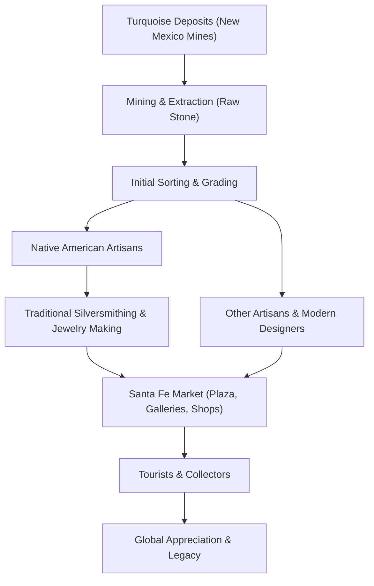

안녕하세요, 여러분! 🎯 '트리비아 금고' 블로그에 오신 것을 환영합니다. 오늘은 미국 뉴멕시코주의 아름다운 주도, 산타페(Santa Fe)에 얽힌 흥미로운 미스터리 하나를 파헤쳐 볼까 해요. 바로 "산타페에는 왜 터키석 보석을 그렇게 많이 팔까요?"라는 질문이랍니다! 역사와 문화, 지리가 얽힌 이야기를 함께 풀어가 보시죠! 💡

## 산타페, 그 이름만큼 신성한 역사

먼저, 산타페라는 도시 자체에 대해 알아볼까요? 산타페는 스페인어로 '성스러운 신앙(Holy Faith)'을 뜻하는 아름다운 이름이에요. 뉴멕시코주의 주도이자 무려 400년이 넘는 역사를 자랑하는 유서 깊은 도시죠. 1610년에 누에보 멕시코(Nuevo México)의 수도로 설립된 산타페는 미국에서 가장 오래된 주도이기도 합니다. 마치 오래된 도서관처럼, 도시 곳곳에 스페인 식민 시대의 건축물과 원주민 문화의 흔적이 고스란히 남아있답니다.

> 산타페는 단순한 도시가 아니라, 스페인 문화와 아메리카 원주민 문화가 수세기 동안 아름답게 융합된 살아있는 박물관 같은 곳이에요. 이곳의 독특한 분위기는 방문객들을 과거로 시간 여행을 떠나게 하는 마법 같은 매력을 가지고 있죠.

이러한 역사적 깊이와 문화적 다양성이 바로 터키석 이야기의 첫 번째 실마리랍니다.

## 하늘색 보석, 터키석의 매력에 빠져보세요!

이제 우리의 주인공, 터키석(Turquoise)에 대해 알아볼 차례예요. 터키석은 이름처럼 터키에서만 나는 보석이라고 생각할 수 있지만, 사실은 하늘색 또는 청록색을 띠는 아름다운 광물로, 12월의 탄생석이기도 하답니다. 고대 이집트부터 페르시아, 그리고 북아메리카에 이르기까지 전 세계 여러 문화권에서 신성하게 여겨지거나 장신구로 사랑받아왔어요. 특히 불투명하거나 반투명한 특성 때문에 다이아몬드처럼 패싯(facet) 처리하기보다는, 표면을 둥글게 연마하는 캐보션(cabochon) 형태로 가공되는 경우가 많답니다. 마치 조약돌처럼 부드러운 곡선이 터키석의 신비로운 색감을 더욱 돋보이게 하죠.

터키석은 단순히 예쁜 돌멩이가 아니에요. 많은 문화권에서 행운과 보호, 치유의 힘을 가진다고 믿었답니다. 특히 건조한 사막 기후에서는 푸른색이 귀하고 생명을 상징했기 때문에, 터키석의 가치는 더욱 높았죠.

## 산타페와 터키석의 운명적인 만남: 역사적 뿌리

그렇다면 왜 하필 산타페에서 터키석이 그렇게 많을까요? 이 질문에 대한 답은 뉴멕시코의 지리적 특성과 아메리카 원주민의 오랜 역사에서 찾아볼 수 있습니다.

### 1. 풍부한 천연 자원: 뉴멕시코의 선물 🎁

뉴멕시코주는 미국 내에서도 터키석 광산이 풍부한 지역 중 하나랍니다. 마치 특정 지역에서만 나는 특별한 와인처럼, 이 지역의 지질학적 특성이 터키석 형성에 적합했던 거죠. 따라서 원주민들은 수천 년 전부터 이곳에서 터키석을 채굴하고 사용해왔습니다. 말 그대로 '발밑에 보물이 묻혀있던' 셈이죠!

### 2. 아메리카 원주민 문화의 핵심 💖

미국 남서부 지역의 푸에블로, 나바호, 주니(Zuni) 같은 아메리카 원주민 부족들에게 터키석은 단순한 장신구가 아니었어요. 그것은 생명, 하늘, 물을 상징하는 신성한 돌이었고, 영적인 보호와 치유의 힘을 지닌다고 믿었습니다. 터키석은 종교 의식에 사용되거나, 부족 간의 중요한 교역 품목이었으며, 신분과 부를 나타내는 상징이기도 했어요.

> 아메리카 원주민들은 터키석을 목걸이, 귀걸이, 팔찌 등 다양한 형태로 가공하며 독자적인 예술 세계를 발전시켰답니다. 특히 나바호족의 은세공 기술과 주니족의 인레이(상감) 기법은 터키석의 아름다움을 극대화하는 데 일조했어요.

### 3. 스페인 식민 시대와 교역의 확장 📈

16세기 스페인 정복자들이 이 지역에 들어오면서 터키석의 가치는 더욱 커졌습니다. 스페인 사람들은 원주민들이 가진 터키석을 보고 그 아름다움에 매료되었고, 새로운 교역의 흐름이 생겨났죠. 산타페는 스페인 식민 행정의 중심지이자, 멕시코시티와 북부 지역을 잇는 중요한 무역로 '카미노 레알(El Camino Real)'과 동부 지역으로 이어지는 '산타페 트레일(Santa Fe Trail)'의 종착점이었습니다. 마치 고속도로의 주요 나들목처럼, 다양한 물품과 문화가 오가는 허브 역할을 했던 거예요.

이러한 교역의 중심지라는 지위는 산타페가 터키석을 포함한 귀한 물품들이 모이고, 가공되고, 다시 팔려나가는 중요한 시장이 되는 데 결정적인 역할을 했답니다.

## 터키석 문화의 발전 과정: 한눈에 보는 여정 🗺️

산타페의 터키석 산업이 어떻게 발전해왔는지, 그 과정을 마치 프로그램의 `config` 파일처럼 정리해볼까요?

```javascript
// Santa Fe Turquoise Industry Evolution Configuration
const historical_periods = {
  "pre_columbian_era": {
    "key_actors": ["Native American Tribes (Pueblo, Navajo, Zuni)"],
    "turquoise_source": "Local New Mexico mines",
    "usage": ["Spiritual ceremonies", "Personal adornment", "Inter-tribal trade"],
    "craftsmanship": "Stone tools, basic polishing, shell/bone integration"
  },
  "spanish_colonial_era": {
    "key_actors": ["Spanish Colonizers", "Native Americans"],
    "turquoise_source": "Continued local mining",
    "usage": ["Trade with Spanish", "Continued traditional uses"],
    "craftsmanship": "Introduction of new tools (e.g., metal), expanded trade routes (Camino Real)"
  },
  "american_expansion_era": {
    "key_actors": ["American Settlers", "Native Americans", "Anglo Traders"],
    "turquoise_source": "Increased mining efforts",
    "usage": ["Commercial jewelry market", "Tourism appeal", "Continued cultural significance"],
    "craftsmanship": "Development of Native American silversmithing (post-1860s), mass production techniques, Santa Fe Trail influence"
  },
  "modern_era": {
    "key_actors": ["Local Artisans", "Galleries", "Tourists", "Global Market"],
    "turquoise_source": "Local and international sources (e.g., Arizona, Nevada, Iran)",
    "usage": ["Artistic expression", "Fashion statement", "Investment", "Cultural souvenir"],
    "craftsmanship": "Diverse styles (traditional, contemporary), emphasis on authenticity and unique designs"
  }
};

// Function to simulate the market growth
function stimulateTurquoiseMarket(period_config) {
  console.log(`--- ${period_config.name} ---`);
  console.log(`Actors: ${period_config.key_actors.join(", ")}`);
  console.log(`Primary Source: ${period_config.turquoise_source}`);
  console.log(`Key Uses: ${period_config.usage.join(", ")}`);
  console.log(`Crafting Evolution: ${period_config.craftsmanship}`);
  console.log("--------------------------\n");
}

// Execute market simulation for each historical period
for (const period in historical_periods) {
  stimulateTurquoiseMarket({ name: period.replace(/_/g, " ").toUpperCase(), ...historical_periods[period] });
}
```
위 `config`에서 볼 수 있듯이, 각 시대마다 터키석의 사용 방식과 가공 기술, 그리고 관련된 주체들이 점진적으로 변화하고 발전해왔음을 알 수 있어요. 특히 미국 확장기 이후 나바호족과 주니족의 뛰어난 은세공 기술이 터키석과 결합하면서, 산타페 터키석 주얼리의 독특한 정체성이 확립되었답니다.

## 산타페 터키석의 매력 포인트 비교 🔍

산타페에서 볼 수 있는 터키석 주얼리는 다양한 스타일과 특징을 가지고 있어요. 대표적인 몇 가지를 비교해볼까요?

| 특징/스타일    | 아메리카 원주민 전통 스타일 (예: 나바호, 주니)        | 컨템포러리/모던 스타일 (예: 산타페 아트 갤러리)         |
| :------------- | :---------------------------------------------------- | :------------------------------------------------------ |
| **주요 재료**   | 터키석, 스털링 실버 (은), 산호, 조개껍질, 흑요석      | 터키석, 다양한 귀금속 (금, 은), 보조석 (다이아몬드 등) |
| **디자인 특징** | 굵고 웅장한 실버 세팅, 스탬핑(Stamping), 인레이(Inlay), 캐보션 가공 | 세련되고 미니멀한 디자인, 독특한 커팅, 예술적이고 추상적인 형태 |
| **문화적 의미** | 부족의 상징, 영적인 보호, 대지의 선물, 신분           | 패션 아이템, 예술 작품, 개인의 취향 표현                |
| **가공 방식**   | 전통적인 수공예 기술, 장인의 숙련된 기술              | 현대적인 세공 기술, 3D 디자인, 혁신적인 소재 결합       |
| **주요 판매처** | 원주민 시장 (예: 팔라스 오브 더 거버너스 앞), 전문 갤러리 | 고급 주얼리 부티크, 현대 미술 갤러리                     |

이처럼 산타페에서는 전통적인 아름다움부터 현대적인 감각까지, 터키석이 가진 무한한 변신을 모두 만나볼 수 있답니다. 마치 스마트폰 앱 스토어처럼, 다양한 취향을 만족시키는 선택지가 가득하죠! 📱

## 터키석의 여정: 광산에서 산타페 시장까지 🌊

터키석이 어떻게 광산에서 채굴되어 산타페의 아름다운 보석으로 재탄생하는지, 그 과정을 다이어그램으로 살펴볼게요. 마치 데이터가 시스템을 통해 흐르는 것처럼 말이죠!


위 다이어그램에서 보듯이, 뉴멕시코 광산에서 채굴된 터키석은 단순히 가공되는 것을 넘어, 아메리카 원주민의 장인 정신과 산타페의 활기찬 시장을 거쳐 전 세계로 퍼져나가는 여정을 거친답니다. 이 모든 과정이 산타페를 터키석의 메카로 만드는 데 기여하는 것이죠.

## 산타페가 터키석의 성지가 된 이유를 정리하며 ✨

결론적으로, 뉴멕시코 산타페에 터키석 보석이 많은 이유는 여러 가지 요소가 복합적으로 작용한 결과라고 할 수 있어요. 마치 맛있는 요리에 여러 재료가 완벽하게 어우러져야 하는 것처럼요!

1.  **지리적 이점**: 뉴멕시코 지역에 터키석 광산이 풍부하게 분포해 있어 원재료 수급이 용이합니다.
2.  **문화적 뿌리**: 아메리카 원주민들에게 터키석은 수천 년간 신성하고 중요한 의미를 지닌 보석이었으며, 이를 이용한 독자적인 예술과 공예 기술이 발전했습니다.
3.  **역사적 중심지**: 산타페는 스페인 식민 시대부터 중요한 교역의 중심지였고, 다양한 문화와 물품이 오가는 허브 역할을 수행하며 터키석 시장이 번성할 수 있는 기반을 다졌습니다.
4.  **예술과 관광의 도시**: 현재 산타페는 예술가와 장인들이 모여드는 곳이자, 독특한 문화를 경험하려는 관광객들이 끊이지 않는 도시입니다. 이러한 환경은 터키석 공예품의 생산과 소비를 활발하게 만들죠.

이 모든 요소들이 어우러져 산타페는 단순한 터키석 판매처를 넘어, 터키석 문화의 심장이자 살아있는 박물관이 되었답니다. 다음번에 산타페를 방문하게 된다면, 그곳의 터키석 하나하나에 담긴 오랜 역사와 이야기를 상상해보세요. 분명 더욱 특별한 경험이 될 거예요! 🌟

오늘 '트리비아 금고'의 이야기가 여러분의 지적 호기심을 충족시켜 드렸기를 바라며, 다음에도 더 흥미로운 주제로 찾아오겠습니다. 안녕! 👋

## 참고자료

- [산타페 (뉴멕시코주)](https://ko.wikipedia.org/wiki/%EC%82%B0%ED%83%80%ED%8E%98%20%28%EB%89%B4%EB%A9%95%EC%8B%9C%EC%BD%94%EC%A3%BC%29)
- [산타페](https://ko.wikipedia.org/wiki/%EC%82%B0%ED%83%80%ED%8E%98)
- [세인트존스 칼리지 (아나폴리스/산타페)](https://ko.wikipedia.org/wiki/%EC%84%B8%EC%9D%B8%ED%8A%B8%EC%A1%B4%EC%8A%A4%20%EC%B9%BC%EB%A6%AC%EC%A7%80%20%28%EC%95%84%EB%82%98%ED%8F%B4%EB%A6%AC%EC%8A%A4/%EC%82%B0%ED%83%80%ED%8E%98%29)
- [터키석](https://ko.wikipedia.org/wiki/%ED%84%B0%ED%82%A4%EC%84%9D)
- [보석](https://ko.wikipedia.org/wiki/%EB%B3%B4%EC%84%9D)
- [주얼리](https://ko.wikipedia.org/wiki/%EC%A3%BC%EC%96%BC%EB%A6%AC)
- [List of Pawn Stars episodes](https://en.wikipedia.org/wiki/List%20of%20Pawn%20Stars%20episodes)
- [Santa Fe, New Mexico](https://en.wikipedia.org/wiki/Santa%20Fe%2C%20New%20Mexico)
- [Santa Fe, Mexico City](https://en.wikipedia.org/wiki/Santa%20Fe%2C%20Mexico%20City)
- [The Santa Fe New Mexican](https://en.wikipedia.org/wiki/The%20Santa%20Fe%20New%20Mexican)
- [Hyundai Santa Fe](https://en.wikipedia.org/wiki/Hyundai%20Santa%20Fe)
- [Santa Fe](https://en.wikipedia.org/wiki/Santa%20Fe)