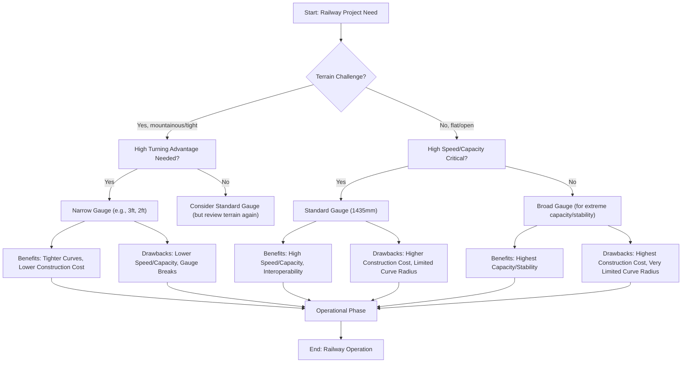

안녕하세요, 기술 애호가 여러분, 그리고 호기심 많은 분들! 👋 거대한 기차가 굉음을 내며 지나가는 철로 옆에 서서, 두 개의 단순해 보이는 강철 선 위에서 어떻게 기차가 유지되는지 그 마법에 대해 궁금해해 본 적이 있으신가요? 아니면 믿을 수 없을 정도로 가파른 산을 굽이굽이 오르는 작고 아담한 기차의 옛 사진을 본 적이 있으신가요? 오늘은 철도 공학의 매혹적인 한 분야, 바로 **협궤 철도(narrow gauge railways)**와 그 놀라운 초능력, 즉 탁월한 회전 능력에 대해 깊이 파고들어 보겠습니다! 🎯

여러분은 "기차는 다 똑같지"라고 생각할 수도 있지만, 레일 사이의 거리, 즉 `궤간(track gauge)`은 엄청난 차이를 만듭니다. 전 세계 대부분의 주요 노선은 1,435mm(또는 4피트 8.5인치)인 `표준궤(standard gauge)`를 사용합니다. 하지만 이 거리를 *더 좁게* 만들면 어떻게 될까요? 친구 여러분, 바로 여기서 협궤가 등장하며, 믿으셔도 좋습니다. 이는 영리한 공학과 역사적 투지로 가득 찬 이야기입니다.

## "협궤"란 대체 무엇인가요?

기본부터 시작해 봅시다. `협궤 철도`는 단순히 두 레일 사이의 거리가 표준 1,435mm(4피트 8.5인치)보다 **좁은** 철도를 말합니다. 풀사이즈 세단에 비해 소형차를 생각해보세요. 목적은 같지만 치수가 다릅니다.

> "협궤 철도(미국에서는 narrow-gauge railroad)는 궤간(레일 사이의 거리)이 1,435mm(4피트 8.5인치)보다 좁은 철도이다." — 위키피디아

이러한 철도들은 다양한 "좁은" 크기로 존재합니다. 예를 들어, 유타와 콜로라도에 있는 역사적인 **유인타 철도(Uintah Railway)**는 길소나이트(천연 아스팔트와 유사한 물질)를 운반하기 위해 3피트(914mm) 궤간을 사용했습니다. **신시내티, 레바논 및 북부 철도(Cincinnati, Lebanon and Northern Railway)**도 3피트 협궤 노선(원래는 마이애미 밸리 협궤 철도)으로 시작했습니다. 더욱 극단적인 예로, **시카고 터널 회사(Chicago Tunnel Company)**는 시카고 도심 바로 아래에서 2피트(610mm) 협궤 화물 터널 네트워크를 운영했습니다! 번화한 도시 아래의 작은 터널을 쌩쌩 달리는 기차를 상상해 보세요. 말 그대로 숨겨진 세상이죠! 💡

그렇다면 왜 사람들은 더 좁은 궤간을 선택했을까요? 이는 협궤의 주요 장점, 특히 상황이 어려울 때 빛을 발하는 장점으로 이어집니다.

## 회전의 승리: 협궤가 규칙을 바꾸는 방법

여기서 고무(아니, 강철 바퀴)가 도로(아니, 레일)를 만납니다! 협궤 철도의 가장 중요하고 종종 판도를 바꾸는 장점은 표준궤나 광궤(broad gauge) 철도보다 **훨씬 더 급한 곡선을 통과할 수 있다**는 것입니다. 왜 이것이 그렇게 중요하며, 어떻게 작동할까요? 자세히 살펴보겠습니다.

### 비유의 시간: 스케이트보드 대 리무진

긴 리무진으로 급한 유턴을 시도한다고 상상해 보세요. 어렵겠죠? 엄청난 공간이 필요합니다. 이제 스케이트보드로 같은 유턴을 시도해 보세요. 훨씬 쉽고, 훨씬 급하게 돌 수 있습니다!

기차의 원리도 비슷합니다. 더 넓은 폭과 종종 더 긴 철도 차량(기관차 및 화차)을 가진 표준궤 또는 광궤 기차는 리무진과 같습니다. 안전하고 효율적으로 회전하려면 훨씬 더 큰 반경이 필요합니다. "더 날씬하고" 종종 더 짧은 화차를 가진 협궤 기차는 스케이트보드와 같습니다.

### 공학적 심층 분석: 더 급한 곡선이 가능한 이유

조금 더 기술적으로 들어가 보겠지만, 걱정 마세요. 쉽게 설명해 드릴게요! 🔧

1.  **좁은 궤간과 축거(Wheelbase) 강성 감소:**
    *   **궤간(Gauge):** 차축의 바퀴 사이의 고정된 거리.
    *   **축거(Wheelbase):** 단일 철도 차량(예: 화차 또는 기관차)의 앞뒤 차축 사이의 거리.
    곡선에서는 바깥쪽 바퀴가 안쪽 바퀴보다 약간 더 긴 경로를 이동합니다. 표준궤에서는 이 차이가 상당히 큽니다. 기차 바퀴는 독립적으로 회전할 수 있는 자동차 바퀴와 같지 않습니다. 일반적으로 차축에 고정되어 있습니다. 곡선을 처리하기 위해 기차 바퀴에는 `플랜지(flanges)`(바퀴를 레일 위에 유지하는 안쪽 림)와 `원추형 답면(conical tread)`(바퀴 표면의 약간의 경사)이 있습니다.
    궤간이 좁으면 곡선에서 안쪽 바퀴와 바깥쪽 바퀴의 경로 길이 차이가 *더 작아집니다*. 이는 스트레스, 마찰, 바퀴와 레일 사이의 미끄러짐이 적다는 것을 의미합니다. 이러한 본질적인 유연성 덕분에 바퀴가 묶이거나 탈선 위험 없이 기차가 더 급한 코너를 "구부러져" 통과할 수 있습니다.

2.  **더 작은 최소 곡선 반경:**
    모든 철도 선로에는 `최소 곡선 반경`(안전하게 통과할 수 있는 가장 작은 곡선)이 있습니다. 이 반경은 궤간과 철도 차량의 설계에 의해 근본적으로 제한됩니다.
    이렇게 생각해 보세요. 궤간이 넓으면 기차가 더 많은 측면 공간을 차지합니다. 회전하려면 이 넓은 "발자국"이 더 많은 공간을 필요로 합니다. 궤간이 좁으면 자연스럽게 발자국이 작아져 훨씬 더 급한 중심점을 중심으로 회전할 수 있습니다.
    수학적으로 복잡한 공식이 존재하지만, 이를 이해하는 간단한 방법은 최소 곡선 반경(R)이 궤간(G)과 철도 차량의 축거(L)에 직접 비례한다는 것입니다. G가 작으면 R도 상당히 작아질 수 있습니다.

    > **곡선 역학의 개념적 분석:**
    > 기차가 곡선에 진입할 때 여러 힘이 작용합니다.
    > 1.  **원심력:** 기차를 곡선 중심에서 바깥쪽으로 밀어내려는 힘.
    > 2.  **측면력:** 바퀴의 플랜지가 바깥쪽 레일을 눌러 기차를 안내합니다.
    > 3.  **마찰:** 위에서 언급한 경로 길이 차이로 인해 바퀴와 레일 사이에서 발생합니다.
    >
    > 협궤에서는 `궤간`(G)이 작고, 종종 개별 차량의 `축거`(L)도 더 짧게 설계되기 때문에 철도 차량의 전체 **관성 모멘트**(회전에 대한 저항)가 감소합니다. 이를 통해 기차는 측면력과 마찰을 더 쉽게 극복하여 훨씬 더 급한 곡선에서도 안정성을 유지할 수 있습니다.

3.  **더 쉬운 `캔트(Super-elevation)` (횡경사):**
    곡선에서는 철도 선로가 종종 `캔트` 또는 `횡경사`가 적용됩니다. 즉, 바깥쪽 레일이 안쪽 레일보다 약간 더 높습니다. 이는 경주 트랙의 뱅크 커브처럼 원심력을 상쇄하는 데 도움이 됩니다.
    협궤 기차는 더 가볍고 종종 무게 중심이 낮기 때문에 더 가파른 캔트를 더 쉽게 처리할 수 있습니다. 이러한 추가적인 횡경사는 적절한 속도로 급한 회전을 부드럽고 안전하게 할 수 있는 능력을 더욱 향상시킵니다.

## 협궤가 빛을 발하는 곳: 역사적 맥락과 사용 사례

이러한 회전 이점은 이론적인 것만이 아닙니다. 이는 역사를 형성하고 오늘날에도 특정 틈새시장을 계속해서 충족시키는 심오한 실제적 함의를 가지고 있습니다.

### 험난한 지형 정복

이것이 협궤 노선이 처음 건설된 가장 큰 이유라고 할 수 있습니다. 험준한 산, 울창한 숲, 깊은 계곡을 가로질러 직선 또는 완만한 곡선 선로를 놓으려고 한다고 상상해 보세요. 표준궤로는 엄청나게 비싸고 종종 불가능합니다.

*   **산악 지역:** 미국의 **로키 산맥**에서는 바로 이 때문에 상당한 협궤 시스템이 발전했습니다. 표준궤 노선을 건설하려면 거대한 터널, 거대한 교량, 광범위한 토목 공사가 필요하여 프로젝트 비용이 엄청나게 비싸거나 기술적으로 불가능했을 것입니다. 협궤는 엔지니어들이 지형의 윤곽을 따라 언덕을 돌고 좁은 통로를 통과할 수 있게 하여 훨씬 적은 인프라로 건설할 수 있었습니다. 앞서 언급된 **유인타 철도**는 귀중한 길소나이트 매장지에 도달하기 위해 어려운 지형을 횡단한 완벽한 예입니다.

*   **산업 및 농장 철도:** `광산 철도`나 `사탕수수` 및 `바나나 농장`을 연결하는 노선과 같은 많은 산업 운영에서 협궤를 채택했습니다. 이러한 지역에서는 종종 어렵거나 좁은 공간을 통해 빠르고 저렴하게 선로를 놓아야 합니다.
    > "사탕수수 및 바나나 농장은 대부분 협궤로 연결된다." — 위키피디아
    급한 곡선으로 선로를 놓을 수 있는 능력, 종종 임시 선로까지도 가능하게 한 협궤는 이상적인 선택이었습니다. 이는 종종 "협궤 철도와 표준궤 철도 사이의 선택이 아니라, 협궤 철도와 아예 철도가 없는 것 사이의 선택"이었습니다.

*   **도시 물류:** **시카고 터널 회사**는 도시 환경에서 협궤 혁신의 훌륭한 예입니다. 2피트(610mm) 궤간 철도 네트워크를 통해 도시 건물과 유틸리티의 복잡한 기초를 피해 지하 깊숙이 터널을 건설하여 거리 교통을 방해하지 않고 석탄, 소포를 운반하고 재를 제거할 수 있었습니다. 이는 표준궤로는 단순히 불가능했을 것입니다.

### 비용 효율성 및 건설 이점

회전 능력 외에도 협궤는 상당한 경제적 이점을 제공합니다.

*   **건설 비용 절감:**
    *   **적은 토목 공사:** 지형을 더 밀접하게 따를 수 있으므로 언덕을 깎거나 제방을 쌓는 작업이 덜 필요합니다.
    *   **가벼운 재료:** 레일은 더 가볍고, 침목(ties)은 더 짧으며, 교량은 덜 견고해도 되므로 재료 비용이 절감됩니다.
    *   **더 작은 터널 및 교량:** 급한 곡선은 장애물을 통과해야 할 경우 더 짧은 터널과 더 작은 교량 경간을 의미합니다.
*   **쉬운 유지보수:** 가벼운 철도 차량과 선로 구성 요소는 때때로 더 간단한 유지보수 절차와 장비를 의미할 수 있습니다.

### 역사적 발자취

**영국 협궤 철도**는 대규모 일반 운송업체부터 작고 단명한 산업 노선에 이르기까지 그 다재다능함을 보여주는 또 다른 증거입니다. 이들은 표준궤가 비실용적이었던 지역에서 산업을 발전시키고 지역 사회를 연결하는 데 중요한 역할을 했습니다.

## 장단점: 항상 순조로운 운행은 아니다

협궤는 특정 시나리오에서 환상적인 회전 이점과 비용 이점을 제공하지만, 그 한계를 이해하는 것이 중요합니다. 모든 공학적 솔루션이 모든 상황에 완벽한 것은 아닙니다!

다음은 장단점을 간략하게 살펴본 것입니다.

*   **낮은 속도:** 일반적으로 협궤 열차는 표준궤보다 느립니다. 가벼운 선로, 작은 철도 차량, 그리고 종종 더 급한 곡선은 최대 안전 운행 속도를 제한합니다.
*   **감소된 용량:** 좁은 화차는 화물이나 승객을 위한 공간이 적다는 것을 의미합니다. 이는 열차당 더 적은 톤수 또는 객차당 더 적은 인원으로 이어집니다. 대량, 장거리 운송에는 상당한 단점이 될 수 있습니다.
*   **안정성 문제:** 저속에서는 괜찮지만, 협궤 열차는 고속에서, 특히 높거나 무게 중심이 높은 화물을 운반할 때 안정성이 떨어질 수 있습니다. 좁은 바닥은 무게 중심이 너무 높으면 전복되기 더 쉽습니다.
*   **상호 운용성 문제(`궤간 단절`):** 이것은 큰 문제입니다. 협궤 노선이 표준궤 노선과 만나면 화물을 한 열차에서 다른 열차로 물리적으로 옮겨야 하는 경우가 많습니다(`환적`). 이러한 `궤간 단절`은 시간이 많이 걸리고 노동 집약적이며 운송 비용을 증가시킵니다. 이것이 표준궤가 상호 연결된 국가 네트워크에서 지배적이 된 이유입니다.

## 결정을 시각화하기: 언제 협궤를 선택할 것인가

요약하자면, 협궤의 회전 이점을 고려하여 선로 궤간을 결정하는 개념적인 흐름은 다음과 같습니다.

*   *참고: 광궤(표준궤보다 넓음)는 더 높은 용량과 안정성과 같은 이점을 제공하지만, 표준궤보다 회전 능력을 훨씬 더 희생하므로 험난한 지형에는 적합하지 않습니다.*

## 협궤 대 표준궤: 빠른 비교

쉽게 참고할 수 있도록 깔끔한 표로 정리해 봅시다!

| 특징                  | 협궤 (예: 2피트, 3피트)                                 | 표준궤 (1435 mm)                                              |
| :----------------------- | :------------------------------------------------------------ | :-------------------------------------------------------------------- |
| **궤간**          | < 1435 mm (예: 610 mm, 914 mm)                             | 1435 mm (4 피트 8.5 인치)                                               |
| **회전 반경**       | **훨씬 더 급한 곡선 가능**                     | 더 큰 곡선 반경 필요                                           |
| **지형 적합성**  | 산악, 험준하거나 좁은 지역에 탁월          | 평탄하거나 중간 정도의 험난한 지형에 가장 적합                       |
| **건설 비용**    | 일반적으로 낮음 (적은 토목 공사, 가벼운 재료)           | 일반적으로 높음 (많은 토목 공사, 무거운 재료)                  |
| **속도**                | 낮은 최대 속도                                              | 높은 최대 속도 (고속철도에 적합)                      |
| **용량**             | 낮음 (작은 철도 차량, 적은 톤수)                   | 높음 (큰 철도 차량, 많은 톤수)                           |
| **안정성**            | 고속 또는 높은 화물 운반 시 잠재적으로 덜 안정     | 고속에서 더 안정적                                          |
| **상호 운용성**     | 불량 (궤간 단절 시 환적 필요)                 | 탁월 (전 세계적으로 지배적인 표준)                                  |
| **일반적인 적용** | 광업, 벌목, 농장, 산업, 산악 노선, 도시 터널 | 주요 여객 및 화물, 국가 네트워크, 고속철도 |

## 지속되는 유산

그러므로 다음에 그림 같은 풍경을 굽이굽이 지나는 매력적인 작은 철도에 대해 듣거나, 오래된 산업 노선의 역사에 우연히 접하게 된다면, 그 존재의 비밀을 알게 될 것입니다. 협궤 철도는 놀라운 회전 이점을 통해 단지 기발한 선택이 아니었습니다. 그것들은 종종 험난한 환경에서 사람과 자원을 연결하는 유일한 실용적이고 저렴하며 심지어 가능한 해결책이었습니다.

이는 때때로 "더 작다"는 것이 강력한 이점을 제공하여, 더 크고 넓은 시스템이 단순히 따라올 수 없는 유연성으로 세상을 탐색할 수 있게 해준다는 것을 상기시켜 줍니다. 이는 인간의 독창성과 특수 공학 솔루션의 지속적인 힘에 대한 증거입니다! 🚂💨

---

## 참고자료

- [Track gauge](https://en.wikipedia.org/wiki/Track%20gauge)
- [Uintah Railway](https://en.wikipedia.org/wiki/Uintah%20Railway)
- [Cincinnati, Lebanon and Northern Railway](https://en.wikipedia.org/wiki/Cincinnati%2C%20Lebanon%20and%20Northern%20Railway)
- [Railway coupling](https://en.wikipedia.org/wiki/Railway%20coupling)
- [Narrow-gauge railway](https://en.wikipedia.org/wiki/Narrow-gauge%20railway)
- [British narrow-gauge railways](https://en.wikipedia.org/wiki/British%20narrow-gauge%20railways)
- [Narrow-gauge railroads in the United States](https://en.wikipedia.org/wiki/Narrow-gauge%20railroads%20in%20the%20United%20States)
- [First-mover advantage](https://en.wikipedia.org/wiki/First-mover%20advantage)
- [Charlie Kirk](https://en.wikipedia.org/wiki/Charlie%20Kirk)
- [Cognitive effects of bilingualism](https://en.wikipedia.org/wiki/Cognitive%20effects%20of%20bilingualism)
- [List of track gauges](https://en.wikipedia.org/wiki/List%20of%20track%20gauges)
- [5 ft and 1520 mm gauge railways](https://en.wikipedia.org/wiki/5%20ft%20and%201520%20mm%20gauge%20railways)