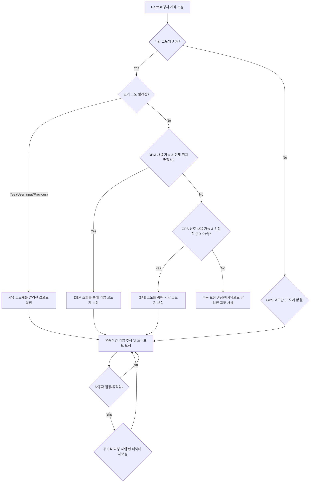

---
# 고도 해독: Garmin 장치의 DEM 대 GPS 보정

정확한 고도 데이터는 손목이나 자전거 컴퓨터에 표시되는 단순한 숫자를 넘어섭니다. 이는 내비게이션, 성능 추적, 안전, 심지어 환경 모니터링에 필수적인 요소입니다. Garmin 장치를 사용하는 아웃도어 애호가, 운동선수 및 전문가에게 장치가 고도를 결정하고 보정하는 방식을 이해하는 것은 데이터의 신뢰성에 상당한 영향을 미칠 수 있습니다. 많은 Garmin 장치에는 정밀한 상대적 고도 변화를 측정하는 기압 고도계가 탑재되어 있지만, 이 센서는 정확한 절대 고도 판독값을 제공하기 위해 주기적인 보정이 필요합니다. 여기서 수치 표고 모델(DEM)과 GPS 기반 보정 방법이 등장하며, 각각 고유한 장점과 한계를 제공합니다.

사용자의 질문은 Garmin이 고도 보정을 위해 사용하는 이 두 가지 주요 접근 방식의 근본적인 차이점을 파고듭니다. 두 방법 모두 기압 고도계의 올바른 시작점을 제공하거나, 경우에 따라 직접 고도를 제공하는 것을 목표로 하지만, 그 기본 메커니즘, 데이터 소스 및 성능 특성은 상당히 다릅니다. 이 글에서는 이러한 방법을 분석하고, 역사적 맥락을 탐구하며, 실용적인 통찰력을 제공하고, Garmin 장치가 언제, 왜 한 가지 방법을 다른 방법보다 선택할 수 있는지 이해하는 데 도움을 줄 것입니다.

## 수직 정확도를 위한 탐구: 고도 보정 이해하기

험난한 산행을 떠난다고 상상해 보세요. 현재 고도를 아는 것은 단순한 호기심이 아니라, 진행 상황을 평가하고, 남은 등반 거리를 이해하며, 고산병과 같은 잠재적 위험을 식별하는 데 필수적입니다. 마찬가지로, 사이클리스트는 노력 측정에 고도 상승을 추적하고, 조종사는 안전한 비행을 위해 정밀한 고도에 의존합니다.

대부분의 고급 Garmin 장치에는 **기압 고도계**가 내장되어 있습니다. 이 센서는 고도가 증가함에 따라 예측 가능하게 감소하는 대기압을 측정합니다. 지역 날씨 변화가 압력 판독값에 균일하게 영향을 미치기 때문에 *상대적* 고도 변화(예: 마지막 판독 이후 얼마나 올랐는지)를 측정하는 데 매우 정확합니다. 그러나 주어진 고도에서의 절대 압력은 날씨 조건에 따라 달라집니다(예: 고기압 시스템은 고도를 낮게 보이게 하고, 저기압 시스템은 고도를 높게 보이게 합니다). 따라서 기압 고도계는 이러한 대기 변동을 보정하고 정확한 *절대* 고도 판독값을 제공하기 위해 주기적으로 알려진 실제 고도로 "보정"되어야 합니다. 이 보정 과정은 본질적으로 장치에 "이 압력에서 실제 고도는 X 미터입니다"라고 알려줍니다.

적절한 보정 없이는 날씨 전선이 이동했기 때문에 장치가 실제 700미터에 있을 때 500미터에 있다고 보고할 수 있습니다. 여기서 DEM 및 GPS 기반 보정이 개입하여 이 중요한 기준선을 설정하는 자동화된 방법을 제공합니다.

### DEM 기반 고도 보정: 지도의 지혜

**수치 표고 모델(DEM)** 기반 보정은 장치의 지도에 저장된 기존 지형 데이터에 의존합니다. DEM은 본질적으로 일련의 규칙적인 간격으로 배치된 지점의 고도 값을 포함하는 지형 표면의 3D 표현입니다. Garmin 장치가 DEM 보정을 사용할 때, 현재 GPS로 파생된 수평 위치(위도 및 경도)를 활용하여 내부 DEM 데이터베이스에서 해당 고도를 조회합니다.

**메커니즘:**
1.  **GPS 수신:** 장치는 먼저 표준 2D(위도, 경도) GPS 수신을 얻어 수평 위치를 결정합니다.
2.  **DEM 조회:** 이 좌표를 사용하여 장치는 내부 DEM 지도 데이터를 쿼리합니다. 정확한 좌표가 데이터 세트에 없으면 해당 특정 위치와 관련된 고도 값을 식별하거나 주변 데이터 포인트에서 고도를 보간합니다.
3.  **기압 고도계 보정:** 조회된 이 고도 값은 기압 고도계를 보정하는 데 사용됩니다. 장치는 현재 대기압을 기록하고 이를 DEM에서 파생된 고도와 연결합니다. 그 시점부터 기압 고도계는 다음 보정 또는 상당한 압력 변화가 있을 때까지 압력 변화를 추적하여 이를 상대적 고도 변화로 변환합니다.

**개념적 구성/의사 코드:**
Garmin의 내부 알고리즘은 독점적이지만, DEM 조회의 단순화된 개념적 표현은 다음과 같을 수 있습니다.

```
FUNCTION CalibrateElevation_DEM(current_latitude, current_longitude):
    // Requires pre-loaded topographic maps with DEM data
    IF device_has_DEM_data_for_current_location THEN
        // Interpolate elevation from the DEM grid based on current GPS coordinates
        dem_elevation = INTERPOLATE_ELEVATION_FROM_DEM(current_latitude, current_longitude)
        
        IF dem_elevation IS NOT NULL THEN
            // Get current barometric pressure reading
            current_barometric_pressure = READ_BAROMETRIC_SENSOR()
            
            // Store this pressure-elevation relationship for future calculations
            SET_ALTIMETER_BASELINE(current_barometric_pressure, dem_elevation)
            
            LOG_MESSAGE("Altimeter calibrated using DEM to: " + dem_elevation + " meters.")
            RETURN TRUE
        ELSE
            LOG_WARNING("DEM data available but interpolation failed for current location.")
            RETURN FALSE
        END IF
    ELSE
        LOG_WARNING("No DEM data available for current location. Cannot use DEM calibration.")
        RETURN FALSE
    END IF
END FUNCTION
```

**DEM 보정의 장점:**
*   **매핑된 지역에서의 높은 정확도:** DEM 데이터가 정밀하고 최신이라면, 이 방법은 종종 원시 GPS 고도보다 우수한 매우 정확한 초기 고도를 제공할 수 있습니다.
*   **더 빠른 초기 보정:** 수평 GPS 수신이 얻어지면 조회는 거의 즉각적입니다.
*   **전력 소모가 적음 (조회 시):** 주요 전력 소모는 초기 GPS 수신에 있으며, DEM 조회 자체는 계산량이 적습니다.
*   **위성 수직 정확도와 무관:** GPS 신호의 수직 정확도에 의존하지 않고, 오직 수평 위치에만 의존합니다.

**DEM 보정의 단점:**
*   **최신 지도가 필요:** 정확도는 사전 로드된 DEM 지도의 품질, 해상도 및 최신성에 전적으로 달려 있습니다. 오래되거나 해상도가 낮은 지도는 상당한 오류를 초래할 수 있습니다.
*   **제한된 범위:** 특히 매우 외딴 지역이나 빠르게 변화하는 지형의 경우 모든 지역에 DEM 데이터를 사용할 수 없을 수 있습니다.
*   **지역 압력 미반영:** 초기 보정 지점만 제공합니다. 기압 고도계는 여전히 변화를 추적해야 하며, 재보정 없이 날씨가 크게 변하면 절대 고도가 표류할 것입니다.
*   **가파른 지형에서의 오류 가능성:** DEM 해상도가 거칠면, 특히 수평 GPS 정확도가 약간 벗어난 경우, 장치가 사용자가 실제로 능선에 있을 때 계곡 바닥의 지점에 대한 고도를 조회하거나 그 반대의 경우도 발생할 수 있습니다.

**실용적인 예시:**
*   **잘 매핑된 등산로 하이킹:** 상세한 지형 지도가 사전 로드된 Garmin Fenix 또는 Edge 장치는 등산로 입구에서 고도계를 매우 정확한 고도로 빠르게 보정할 수 있습니다.
*   **알려진 위치에서의 초기 설정:** 고향에서 장치를 처음 켰을 때, 지역 DEM 데이터가 있다면 이를 사용하여 기준선을 설정할 수 있습니다.

### GPS 기반 고도 보정: 위성의 관점

**GPS 기반 고도 보정**은 전지구 위성 항법 시스템(GPS) 위성에서 파생된 고도 데이터를 직접 사용합니다. GPS는 수평 정확도로 유명하지만, 수직 정확도는 본질적으로 덜 정밀합니다.

**메커니즘:**
1.  **3D GPS 수신:** 장치는 위도, 경도 및 고도를 포함하는 3D 위치를 계산하기 위해 충분한 수의 위성(일반적으로 4개 이상)으로부터 신호를 수신해야 합니다.
2.  **삼변측량 (또는 다변측량):** 장치는 여러 위성에서 신호가 도달하는 데 걸리는 시간을 측정합니다. 각 위성의 정확한 위치와 신호 속도를 알면 각 위성으로부터의 거리를 계산할 수 있습니다. 이 거리를 결합하여 3차원 공간에서 위치를 정확히 파악할 수 있습니다.
3.  **수직 정밀도 저하 (VDOP):** 수신기에 대한 위성의 기하학적 배치는 정확도에 상당한 영향을 미칩니다. 하늘에 넓게 퍼져 있는 위성은 함께 모여 있는 위성보다 더 나은 정확도를 제공합니다. VDOP는 위성 기하학이 수직 정확도에 미치는 영향을 특별히 측정합니다. VDOP가 낮을수록 수직 정확도가 더 좋습니다.
4.  **기압 고도계 보정:** GPS에서 파생된 고도는 DEM 방법과 유사하게 기압 고도계를 보정하는 데 사용됩니다.

**GPS 보정의 장점:**
*   **전 세계 적용 범위:** 하늘이 잘 보이고 충분한 위성 신호를 사용할 수 있는 지구상의 모든 곳에서 작동합니다.
*   **지도와 무관:** 사전 로드된 지도 데이터가 필요하지 않으므로 외딴 지역이나 매핑되지 않은 지역에 이상적입니다.
*   **실시간 데이터:** 현재 위성군과 신호에 영향을 미치는 대기 조건에 기반한 고도를 제공합니다.
*   **지오이드-타원체 분리 고려:** 최신 GPS 수신기는 일반적으로 WGS84 타원체 높이(GPS가 직접 계산하는 값)를 내부 지오이드 모델을 사용하여 정표고(평균 해수면, 지도 및 기압 고도계가 일반적으로 사용하는 값)로 변환합니다.

**GPS 보정의 단점:**
*   **낮은 수직 정확도:** GPS 수직 정확도는 일반적으로 수평 정확도보다 2-3배 나쁩니다. 수평 정확도가 3-5미터일 수 있는 반면, 수직 정확도는 좋은 신호에서도 5-15미터 이상일 수 있습니다. 이는 위성 기하학 및 신호 전파 문제 때문입니다.
*   **신호 품질에 취약:** 위성 가용성, 신호 강도, 다중 경로(물체에 반사되는 신호) 및 대기 조건(전리층/대류권 지연)과 같은 요인이 정확도를 저하시킬 수 있습니다.
*   **안정적인 수신 획득 속도 느림:** 좋은 수직 정확도를 가진 안정적인 3D 수신을 얻는 데 2D 수신보다 더 오래 걸릴 수 있습니다.
*   **높은 전력 소모:** 안정적인 3D 수신을 위해 여러 위성을 지속적으로 추적하는 것은 DEM 조회를 위한 간단한 2D 수신보다 더 많은 배터리 전력을 소모할 수 있습니다.
*   **지역 압력 미반영 (직접적으로):** DEM과 마찬가지로 기압 고도계의 보정 지점을 제공하지만, 고도계는 날씨 변화에 따라 여전히 표류합니다.

**실용적인 예시:**
*   **상세한 지도가 없는 야생 지역 배낭여행:** Garmin inReach 또는 GPSMAP 장치는 GPS 고도를 사용하여 보정할 수 있습니다.
*   **새로운, 매핑되지 않은 지역에서의 초기 설정:** 알려진 DEM 데이터가 없는 먼 곳에서 장치를 처음 켰을 때, GPS는 유일한 자동 보정 옵션입니다.
*   **조종사:** 항공 GPS 장치는 GPS 고도를 광범위하게 사용하지만, 비행 고도를 위해 기압 고도계에도 의존합니다.

## 소비자 GPS의 고도 측정 역사적 맥락

소비자 GPS 장치에서 정확한 고도를 얻기 위한 여정은 지속적인 개선의 과정이었습니다.
*   **초기 GPS (2000년대 이전):** 초기 민간 GPS 수신기는 미국 군대의 의도적인 신호 정확도 저하인 선택적 가용성(SA)으로 인해 심각한 제약을 받았습니다. 이로 인해 수평 및 수직 정확도 모두 좋지 않았습니다(종종 100미터 이상). SA가 없더라도 안정적인 3D 수신을 얻는 것은 어려웠고, 수직 정확도는 악명이 높을 정도로 신뢰할 수 없었습니다. 많은 초기 장치는 2D 위치 또는 매우 대략적인 고도만 표시했습니다.
*   **기압 고도계 도입 (1990년대 후반/2000년대 초반):** GPS 고도의 한계를 인식한 Garmin과 같은 제조업체는 고급 아웃도어 장치에 기압 고도계를 통합하기 시작했습니다. 이는 등반 및 하강 추적에 중요한 탁월한 *상대적* 고도 변화를 제공했지만, 절대 고도를 위해서는 여전히 수동 보정이 필요했습니다.
*   **SA 해제 시대 (2000년 이후):** 2000년 5월 SA가 비활성화되면서 민간인의 GPS 정확도가 극적으로 향상되었습니다. 이로 인해 GPS 고도가 보정에 더 실용적이게 되었지만, 상대적 변화에 대한 기압 고도계보다는 여전히 정확도가 떨어졌습니다.
*   **DEM 통합 (2000년대 중반 이후):** 장치 메모리가 증가하고 디지털 매핑이 보편화되면서 Garmin은 DEM 데이터를 지형 지도에 내장하기 시작했습니다. 이는 특히 지도 범위가 좋은 지역에서 원시 GPS 고도보다 더 신뢰할 수 있고 종종 더 정확한 자동 보정 방법을 제공했습니다.
*   **SBAS (WAAS/EGNOS) 및 다중 GNSS (2000년대-현재):** WAAS(북미) 및 EGNOS(유럽)와 같은 위성 기반 보강 시스템(SBAS)은 차등 보정을 제공하여 수직 정확도를 포함한 GPS 정확도를 더욱 향상시켰습니다. 최근에는 GLONASS, Galileo, BeiDou와 같은 여러 전지구 위성 항법 시스템(GNSS)과 다중 대역(L1+L5) 수신기를 지원하는 장치들이 까다로운 환경에서도 수평 및 수직 정밀도와 신뢰성을 크게 향상시켰습니다.
*   **자동 보정 및 융합 데이터:** 최신 Garmin 장치는 GPS, DEM 및 기압 고계의 데이터를 결합하는 정교한 알고리즘을 자주 사용합니다. 초기 보정에는 DEM을 사용하고, DEM을 사용할 수 없거나 오래된 경우 주기적인 재보정에는 GPS를 사용하며, 동시에 정밀한 상대적 변화를 위해 기압 고도계를 지속적으로 모니터링하고 내부 온도 센서를 사용하여 열 드리프트를 보정할 수 있습니다. 일부 장치는 심지어 사용자의 집 고도를 학습하기도 합니다.

## DEM 및 GPS 기반 고도 보정 비교

| 기능 | DEM 기반 보정 | GPS 기반 보정 |
| :------------------ | :----------------------------------------------------- | :--------------------------------------------------- |
| **메커니즘** | GPS 수평 위치를 사용하여 사전 로드된 지도 데이터에서 고도를 조회합니다. | 위성 신호에서 3D 위치(고도 포함)를 직접 계산합니다. |
| **데이터 소스** | 내부 수치 표고 모델(DEM) 지도. | GPS (또는 기타 GNSS) 위성 신호. |
| **주요 입력** | 수평 GPS 좌표 (위도, 경도). | 위성 의사 거리 및 궤도 데이터. |
| **정확도 (수직)** | DEM 데이터가 고해상도이고 최신인 경우 높음. 매우 정밀할 수 있습니다. | 보통에서 낮음. 일반적으로 수평 GPS 정확도보다 2-3배 나쁨 (5-15m+). SBAS/다중 GNSS로 개선됩니다. |
| **의존성** | 현재 위치에 대한 상세하고 최신 DEM 지도가 필요합니다. | 3D 수신을 위한 하늘의 명확한 시야와 충분한 위성 신호가 필요합니다. |
| **적용 범위** | 사전 로드된 DEM 데이터가 있는 지역으로 제한됩니다. | 위성 신호를 사용할 수 있는 전 세계 모든 곳. |
| **수신 속도** | 수평 GPS 수신이 획득되면 빠릅니다. | 느림, 좋은 위성 기하학을 가진 안정적인 3D 수신이 필요합니다. |
| **전력 소모** | 낮음 (초기 2D GPS 수신 후 조회 시). | 높음 (연속적인 3D 위성 추적 시). |
| **환경 요인** | 대기 조건에 직접적인 영향을 받지 않습니다 (초기 GPS 수신 이상). | 위성 기하학 (VDOP), 대기 조건, 다중 경로, 신호 방해에 크게 영향을 받습니다. |
| **사용 사례** | 잘 매핑된 지역, 알려진 등산로, 지도 데이터가 신뢰할 수 있는 초기 설정. | 외딴 지역, 매핑되지 않은 지역, 지도 데이터가 없거나 오래된 상황. |
| **Garmin 구현** | 상세한 지형 지도가 있는 장치 (예: Fenix, Edge, GPSMAP 시리즈)에서 주요 자동 보정 방법으로 자주 사용됩니다. | 상세한 DEM 지도가 없는 장치에서 대체 또는 주요 방법으로 사용되거나 융합 자동 보정 시스템의 일부로 사용됩니다. |

## 실용적인 시나리오 및 올바른 방법 선택

최신 Garmin 장치는 DEM과 GPS 중 *보정*을 위해 명시적으로 선택하도록 강요하지 않는 경우가 많습니다. 대신, 기압 고도계와 이러한 방법을 지능적으로 결합하는 정교한 "자동 보정" 알고리즘을 사용합니다. 그러나 그 강점을 이해하는 것은 데이터를 해석하고 문제를 해결하는 데 도움이 됩니다.

Garmin 장치가 고도 보정을 관리하는 개념적 흐름도는 다음과 같습니다.



**흐름 이해:**
*   기압 고도계는 정밀도 때문에 *상대적* 변화에 항상 선호됩니다.
*   DEM은 사용 가능하고 신뢰할 수 있는 경우 *절대적* 보정에 첫 번째 선택인 경우가 많습니다. 원시 GPS 고도보다 더 정확할 수 있기 때문입니다.
*   GPS 고도는 DEM 데이터를 사용할 수 없거나 장치가 독립적인 확인이 필요할 때 중요한 대체 또는 주요 방법으로 사용됩니다.
*   "융합 데이터"(M)는 사용 가능한 모든 소스를 결합할 수 있는 고급 알고리즘을 나타내며, GPS 고도를 사용하여 장기적인 기압 드리프트를 보정하거나 알려진 지점에서 DEM을 사용할 수 있습니다.

**수동 보정이 필요한 경우:**
자동 보정 기능이 있더라도 수동 보정이 유익한 경우가 있습니다.
*   **중요한 활동 전:** 시작 지점의 정확한 고도(예: 등산로 표지판, 알려진 기준점)를 알고 있다면 수동으로 설정하여 가장 정확한 시작을 보장할 수 있습니다.
*   **심각한 날씨 변화 후:** 주요 기압 시스템이 이동하면 기압 고도계가 표류할 수 있습니다.
*   **부정확성이 의심될 때:** 고도 판독값이 알려진 랜드마크와 비교하여 벗어난다고 생각될 때.

**모범 사례:**
*   **지도를 최신 상태로 유지:** Garmin 장치에 해당 지역의 최신 지형 지도와 DEM 데이터가 있는지 확인하세요.
*   **GPS 수신을 위한 시간 허용:** 활동을 시작하기 전에 장치가 마지막 사용 이후 장거리를 이동했다면, 안정적인 GPS 수신을 얻기 위해 야외에서 몇 분 동안 시간을 주세요.
*   **장치 설정 이해:** 특정 Garmin 모델의 고도계 설정을 숙지하세요. 많은 장치에서 보정 방법의 우선순위를 지정하거나 자동 보정 모드를 선택할 수 있습니다.

결론적으로, DEM 및 GPS 기반 고도 보정은 Garmin 장치가 정확한 고도 데이터를 제공하는 데 필수적인 역할을 합니다. DEM은 기존 지형 모델을 활용하여 잘 매핑된 지역에서 정밀도를 제공하는 반면, GPS는 일반적으로 수직 정확도가 낮지만 보편적인 적용 범위를 제공합니다. 최신 Garmin 장치는 이러한 방법을 매우 정밀한 기압 고도계와 지능적으로 결합하여 정확성, 신뢰성 및 적용 범위의 최상의 균형을 추구함으로써 사용자가 고도에 대한 걱정 없이 모험에 집중할 수 있도록 합니다.

## 참고자료

- [Garmin Fenix](https://en.wikipedia.org/wiki/Garmin%20Fenix)
- [Garmin Forerunner](https://en.wikipedia.org/wiki/Garmin%20Forerunner)
- [GPS Exchange Format](https://en.wikipedia.org/wiki/GPS%20Exchange%20Format)
- [Liberal Democrats (UK)](https://en.wikipedia.org/wiki/Liberal%20Democrats%20%28UK%29)
- [Kenji Mboma Dem](https://en.wikipedia.org/wiki/Kenji%20Mboma%20Dem)
- [Catholic Church and politics in the United States](https://en.wikipedia.org/wiki/Catholic%20Church%20and%20politics%20in%20the%20United%20States)
- [Geocaching](https://en.wikipedia.org/wiki/Geocaching)
- [Adobe Inc.](https://en.wikipedia.org/wiki/Adobe%20Inc)
- [Palantir](https://en.wikipedia.org/wiki/Palantir)
- [Salar de Uyuni](https://en.wikipedia.org/wiki/Salar%20de%20Uyuni)
- [Prism sight](https://en.wikipedia.org/wiki/Prism%20sight)
- [Pipette](https://en.wikipedia.org/wiki/Pipette)