최적의 운동 능력과 지속적인 건강을 추구하면서 훈련 방법론은 점점 더 정교해지고 있습니다. 그중에서도 특히 개인의 젖산 역치 심박수(LTHR)를 기준으로 조절되는 존 2 트레이닝은 지구력 운동선수와 피트니스 애호가 모두에게 중요한 초석으로 자리 잡았습니다. 이 글에서는 이러한 정밀한 훈련 접근 방식의 심오한 생리학적 이점과 실제 적용에 대해 자세히 설명하고, 왜 이것이 강력한 유산소 기반을 구축하는 데 탁월한 방법으로 간주되는지 밝힙니다.

본질적으로 존 2 트레이닝은 신체가 주로 지방을 연료로 사용하고 젖산 생성이 낮고 안정적으로 유지되는 중간 강도로 수행되는 운동을 의미합니다. 그러나 중요한 뉘앙스는 이러한 "중간 강도"가 *어떻게* 정의되는지에 있습니다. 전통적인 방법은 종종 최대 심박수(HRmax)의 백분율에 의존하지만, LTHR을 기반으로 존 2를 조절하는 것은 보다 개인화되고 생리학적으로 정확한 접근 방식을 제공하여, 덜 정밀한 방법으로는 얻기 어려운 일련의 이점을 제공합니다.

## 생리학적 이해: 존 2가 중요한 이유

인체는 놀라운 적응 능력을 가지고 있으며, 존 2 트레이닝은 특히 유산소 에너지 시스템을 목표로 하여 지구력을 강화하고, 신진대사 건강을 개선하며, 전반적인 회복력을 향상시키는 다양한 심오한 생리학적 변화를 유도합니다.

**1. 미토콘드리아 생합성 및 효율성:** 미토콘드리아는 종종 "세포의 발전소"라고 불리며, 특히 유산소 호흡을 통해 신체의 주요 에너지원인 아데노신 삼인산(ATP)을 생성하는 역할을 합니다. 존 2 운동과 같은 꾸준한 유산소 훈련은 미토콘드리아 생합성(새로운 미토콘드리아 생성)을 위한 강력한 자극제 역할을 하며, 기존 미토콘드리아의 효율성을 향상시킵니다.
*   **밀도 증가:** 규칙적인 존 2 운동은 근육 세포 내 미토콘드리아 수를 증가시켜 유산소적으로 에너지를 생산하는 능력을 향상시킵니다.
*   **기능 개선:** 단순히 수의 증가를 넘어, 이러한 미토콘드리아는 산소를 활용하고 연료(특히 지방)를 ATP로 전환하는 데 더욱 능숙해져 전반적인 신진대사 개선에 기여합니다.
*   **지방 산화 증진:** 미토콘드리아 적응의 핵심 이점은 연료로 지방을 태우는 능력이 크게 향상된다는 것입니다. 낮은 강도에서는 신체가 지방을 선호하는데, 이는 지방이 풍부한 에너지원이며 분자당 많은 양의 ATP를 생성하여 제한된 글리코겐 저장량을 아낄 수 있기 때문입니다. 존 2 훈련은 신체가 지방을 산화시키는 데 매우 효율적이 되도록 가르치며, "지방 연소 역치"를 더 높은 강도로 밀어 올립니다. 이는 글리코겐 고갈("벽에 부딪히는" 현상)이 주요 제한 요인인 지구력 종목에서 매우 중요합니다.

**2. 모세혈관 밀도 및 산소 전달:** 심혈관 시스템은 산소와 영양분을 작동하는 근육으로 전달하고 노폐물을 제거하는 데 중요한 역할을 합니다. 존 2 트레이닝은 이 시스템의 여러 측면을 향상시킵니다.
*   **모세혈관 형성 증가:** 근섬유를 둘러싸는 미세 혈관인 새로운 모세혈관의 성장을 촉진합니다. 더 조밀한 모세혈관 네트워크는 혈액과 근육 사이의 산소 및 영양분 교환을 위한 더 넓은 표면적을 의미하며, 이산화탄소와 같은 신진대사 부산물의 제거를 더 효율적으로 만듭니다.
*   **혈류 개선:** 규칙적인 유산소 훈련은 심장 근육을 강화하여 박출량(매 박동마다 펌프되는 혈액량)을 증가시킵니다. 이는 안정 시 심박수를 낮추고 운동 중 근육으로의 혈액 전달을 더 효율적으로 만듭니다.

**3. 젖산 제거 및 셔틀 메커니즘:** 존 2는 낮은 젖산 축적이 특징이지만, 역설적으로 신체의 젖산 *처리* 능력을 향상시킵니다.
*   **젖산 제거:** 젖산 역치 이하 또는 그 수준에서 운동할 때, 근육에서 생성된 젖산은 축적되지 않고 신체에 의해 제거됩니다. 존 2 트레이닝은 젖산을 제거하는 신체의 능력을 향상시킵니다.
*   **젖산 셔틀:** 종종 순전히 해로운 노폐물로 오해되는 젖산은 실제로는 귀중한 연료원입니다. "젖산 셔틀" 메커니즘은 일부 근섬유 또는 조직에서 생성된 젖산이 다른 더 유산소적인 섬유 또는 심지어 심장과 뇌에 의해 연료로 운반되고 활용되는 것을 포함하며, 그 기계적 예측은 측정 가능한 성능 및 건강상의 이점으로 이어집니다.
*   **완충 능력:** 젖산 제거 및 활용을 개선함으로써 신체는 산증에 더 강해지며, 젖산이 빠르게 축적되어 성능을 저해하기 전에 더 높은 강도를 더 오래 유지할 수 있도록 합니다.

**4. 유산소 기반 및 지구력 강화:** 이러한 모든 생리학적 적응은 더 강력한 유산소 기반으로 귀결됩니다. 견고한 유산소 기반은 다른 모든 훈련 강도가 구축되는 토대입니다. 이는 다음을 의미합니다.
*   **자각 강도 감소:** 동일한 속도가 더 쉽게 느껴지거나, 동일한 자각 노력으로 더 빠른 속도를 유지할 수 있습니다.
*   **더 빠른 회복:** 잘 훈련된 유산소 시스템은 고강도 인터벌 또는 힘든 훈련 세션 사이의 더 빠른 회복을 가능하게 합니다.
*   **지구력 증가:** 피로 없이 장시간 신체 활동을 수행하는 능력이 크게 향상됩니다.
*   **전반적인 건강 지표 개선:** 성능을 넘어, 존 2 트레이닝은 더 나은 심혈관 건강, 개선된 인슐린 민감성, 만성 질환 위험 감소에 기여합니다.

## 젖산 역치 심박수(LTHR)의 정밀성

존 2의 이점은 분명하지만, 그 효과는 정확한 강도 처방에 달려 있습니다. 바로 이 지점에서 젖산 역치 심박수(LTHR)가 다른 방법에 비해 상당한 이점을 제공합니다.

**젖산 역치(LT)란 무엇인가?**
젖산 역치는 젖산이 제거되는 속도보다 혈액에 더 빠르게 축적되기 시작하는 운동 강도를 의미합니다. 이 역치 아래에서는 근육에서 생성된 젖산이 축적되지 않고 신체에 의해 제거되며, 젖산 수치는 비교적 안정적으로 유지됩니다. 이 역치 위에서는 젖산 생성이 제거를 능가하여 혈중 젖산의 급격한 증가, 자각 강도 증가, 그리고 궁극적으로 피로로 이어집니다. LTHR은 단순히 이 역치가 발생하는 심박수입니다. 이는 운동선수의 유산소 체력을 반영하는 고도로 개인화된 생리학적 지표입니다. 젖산 역치는 최대 심박수의 약 85% 또는 최대 산소 섭취량의 75%로 표현될 수 있습니다.

**역사적 맥락: 훈련 존의 진화**
초기 운동 생리학은 훈련 존을 정의하기 위해 최대 심박수(HRmax)의 간단한 백분율 계산에 의존하는 경우가 많았습니다. HRmax 개념은 측정하거나 추정하기 쉽지만(예: 220-나이), 상당한 한계가 있습니다.
*   **가변성:** HRmax는 같은 나이와 체력 수준의 개인 간에도 크게 다릅니다. 이는 주로 유전적으로 결정되며 지구력 성능과 반드시 상관관계가 있는 것은 아닙니다.
*   **생리학적 관련성 부족:** HRmax의 백분율은 개인의 신진대사 역치와 직접적으로 일치하지 않습니다. 예를 들어, HRmax의 70%는 한 사람에게는 존 2일 수 있지만, 그들의 체력과 젖산 역치에 따라 다른 사람에게는 존 3일 수 있습니다.

20세기 중후반에는 젖산 역치 개념의 등장과 함께 패러다임의 전환이 일어났습니다. 혈중 젖산 측정과 함께 점진적 운동을 포함하는 실험실 기반 테스트를 통해 젖산 역치를 정밀하게 식별할 수 있었습니다. 기술이 발전함에 따라 값비싼 실험실 장비 없이 LTHR을 추정하는 현장 테스트가 개발되어 이 귀중한 지표를 더 많은 사람들이 이용할 수 있게 되었습니다. 이러한 진화는 일반적인, 인구 기반의 훈련 처방에서 개인화된, 생리학 기반의 접근 방식으로의 전환을 의미했습니다.

**LTHR이 존 설정에 더 우수한 이유:**
LTHR은 HRmax에 비해 개인의 현재 유산소 능력과 신진대사 상태를 더 정확하고 역동적으로 나타내는 지표입니다.
*   **신진대사 상태 직접 반영:** LTHR은 신체가 주로 유산소 대사에서 혐기성 경로에 대한 의존도가 증가하는 지점으로 전환되는 지점과 직접적으로 일치합니다. 이는 특정 생리학적 적응을 목표로 하는 존을 정의하는 데 훨씬 더 정확한 기준점이 됩니다.
*   **개인화:** LTHR은 각 개인에게 고유하며 체력에 따라 변합니다. 체력이 좋아지면 LTHR은 일반적으로 증가하며, 이는 젖산이 축적되기 전에 더 높은 강도를 유지할 수 있음을 의미합니다. LTHR을 기반으로 한 훈련 존은 개선되는 체력에 자동으로 조정됩니다.
*   **성능 예측:** LTHR은 지구력 성능의 강력한 예측 변수입니다. LTHR이 높은 운동선수는 더 빠른 속도를 더 오래 유지할 수 있습니다.
*   **일관성:** HRmax는 약간 변동할 수 있지만, LTHR은 일반적으로 매일 더 안정적이므로 훈련의 신뢰할 수 있는 기준점이 됩니다.

**비교표: 존 설정 시 LTHR 대 최대 심박수**

| 특징            | 최대 심박수(HRmax) 방법                                | LTHR 방법                                             |
| :----------------- | :--------------------------------------------------- | :------------------------------------------------------ |
| **기반**          | 최대 노력, 종종 추정(예: 220-나이) 또는 한 번 테스트. | 젖산의 급격한 축적 없이 지속 가능한 최고 유산소 노력. |
| **정의**     | HRmax의 % (예: 존 2 = HRmax의 60-70%).            | LTHR의 % (예: 존 2 = LTHR의 81-89%).                 |
| **정확성**       | 개별 신진대사 역치에 덜 정확함; 나이, 유전, 피로의 영향. | 유산소/혐기성 전환 정의에 더 정확함; 현재 체력을 반영. |
| **개인화** | 일반적인, 인구 기반 추정치.                 | 고도로 개인화되며 체력 변화에 따라 조정됨.  |
| **생리학적 관련성** | 신진대사 역치와 간접적으로 관련됨.          | 신진대사 역치 및 에너지 시스템 활용과 직접적으로 일치함. |
| **지구력 페이싱** | 정밀한 페이싱 및 특정 훈련 적응에 덜 효과적. | 정밀한 페이싱, 지구력 개발 및 목표 생리학적 이득에 탁월. |
| **가변성**    | 외부 요인으로 인해 매일 변동될 수 있음.  | 현재 체력 수준 및 유산소 능력을 더 안정적으로 반영함. |
| **테스트 용이성** | 추정하기 더 쉽고, 진정으로 최대로 테스트하기는 더 어려움.  | 특정 현장 테스트가 필요하지만, 반복 가능하고 실용적임. |

## 실제 적용: LTHR 기반 존 2 트레이닝 구현

LTHR 기반 존 2 트레이닝의 힘을 활용하려면 먼저 LTHR을 결정한 다음 그에 따라 존을 설정해야 합니다.

**1. LTHR 결정 (현장 테스트):**
LTHR을 추정하는 일반적이고 신뢰할 수 있는 현장 테스트는 30분 타임 트라이얼입니다.
*   **준비 운동:** 10-15분 동안 가볍게 사이클링, 달리기 또는 로잉.
*   **본 운동:** 30분 동안 최대 노력을 수행합니다. 이는 30분 내내 유지할 수 있는 한 최대한 열심히 하는 것을 의미하며, 끝에 너무 지치지 않아야 합니다. 도전적이지만 전력 질주는 아닌 느낌이어야 합니다.
*   **측정:** 30분 노력의 *마지막 20분* 동안의 평균 심박수를 기록합니다. 이 평균 심박수가 추정된 LTHR입니다. (처음 10분은 심박수가 지속 가능한 역치 노력에서 안정되도록 합니다).
*   **정리 운동:** 10분 동안 가볍게.
*   **반복:** LTHR과 존을 최신 상태로 유지하기 위해 4-8주마다 또는 체력이 크게 변했다고 느낄 때마다 이 테스트를 반복하는 것이 좋습니다.

**2. LTHR 기반 훈련 존 계산:**
LTHR을 알게 되면 심박수 존을 정의할 수 있습니다. 다양한 모델이 존재하지만, LTHR을 기반으로 한 일반적인 5존 또는 6존 모델은 종종 코치들(예: 조 프리엘 모델)에 의해 사용되며 매우 효과적입니다. 다음은 일반적인 해석입니다.

*   **존 1 (활동적 회복):** LTHR의 <81%
*   **존 2 (지구력):** LTHR의 81-89%
*   **존 3 (템포):** LTHR의 90-94%
*   **존 4 (젖산 역치):** LTHR의 95-104%
*   **존 5a (VO2 Max):** LTHR의 105-110%
*   **존 5b (무산소 능력):** LTHR의 >110%

**존 계산을 위한 예시 코드 (Python):**

```python
def calculate_hr_zones_lthr(lthr, zone_definitions):
    """
    주어진 젖산 역치 심박수(LTHR)와 존 백분율 정의 딕셔너리를 기반으로
    심박수 존을 계산합니다.

    Args:
        lthr (int): 운동선수의 젖산 역치 심박수(bpm).
        zone_definitions (dict): 키는 존 이름(str)이고 값은 해당 존에 대한 LTHR의
                                 백분율 범위(하한, 상한)를 나타내는 튜플인 딕셔너리.

    Returns:
        dict: 계산된 심박수 존 딕셔너리. 키는 존 이름이고
              값은 튜플(하한 심박수, 상한 심박수)입니다.
    """
    zones = {}
    for zone_name, (lower_percent, upper_percent) in zone_definitions.items():
        lower_hr = int(lthr * lower_percent / 100)
        upper_hr = int(lthr * upper_percent / 100)
        zones[zone_name] = (lower_hr, upper_hr)
    return zones

# 현장 테스트에서 결정된 예시 LTHR (젖산 역치 심박수)
my_lthr = 165 # bpm

# 일반적인 LTHR 기반 심박수 존 정의 (예: Friel 또는 유사 모델)
# 참고: 존 정의는 코치/시스템에 따라 약간 다를 수 있습니다.
zone_defs_lthr_based = {
    "Zone 1 (Active Recovery)": (65, 80), # LTHR의 %
    "Zone 2 (Endurance)": (81, 89),
    "Zone 3 (Tempo)": (90, 94),
    "Zone 4 (Lactate Threshold)": (95, 104),
    "Zone 5a (VO2 Max)": (105, 110),
    "Zone 5b (Anaerobic Capacity)": (111, 120)
}

# 심박수 존 계산
my_zones = calculate_hr_zones_lthr(my_lthr, zone_defs_lthr_based)

print(f"나의 LTHR: {my_lthr} bpm\n")
print("계산된 심박수 존 (LTHR 기반):")
for zone_name, (lower, upper) in my_zones.items():
    print(f"  {zone_name}: {lower}-{upper} bpm")

# 특정 존 2 세션 예시:
zone2_lower, zone2_upper = my_zones["Zone 2 (Endurance)"]
print(f"\n존 2 트레이닝을 위해서는 {zone2_lower}-{zone2_upper} bpm 사이의 심박수를 목표로 하세요.")
```

**`my_lthr = 165`에 대한 출력:**
```
나의 LTHR: 165 bpm

계산된 심박수 존 (LTHR 기반):
  Zone 1 (Active Recovery): 107-132 bpm
  Zone 2 (Endurance): 133-146 bpm
  Zone 3 (Tempo): 148-155 bpm
  Zone 4 (Lactate Threshold): 156-171 bpm
  Zone 5a (VO2 Max): 173-181 bpm
  Zone 5b (Anaerobic Capacity): 183-198 bpm

존 2 트레이닝을 위해서는 133-146 bpm 사이의 심박수를 목표로 하세요.
```

**3. LTHR 기반 훈련 과정 시각화:**

```mermaid
graph TD
    A["운동선수가 LTHR 현장 테스트 수행 (예: 30분 TT)"] --> B["마지막 20분 평균 심박수 = LTHR"]
    B --> C{"LTHR 값 확인?"}
    C -- "아니요, 재테스트 또는 추정" --> A
    C -- "예" --> D["LTHR의 %를 기반으로 훈련 존 정의"]
    D --> Z1["존 1: <81% LTHR '활동적 회복'"]
    D --> Z2["존 2: 81-89% LTHR '지구력'"]
    D --> Z3["존 3: 90-94% LTHR '템포'"]
    D --> Z4["존 4: 95-104% LTHR '젖산 역치'"]
    D --> Z5["존 5: >105% LTHR '고강도'"]
    Z2 --> E["존 2에서 장시간, 꾸준한 상태 훈련에 집중"]
    E --> F["유도되는 생리학적 적응:"]
    F --> G["미토콘드리아 생합성 증가"]
    F --> H["지방 산화 증진"]
    F --> I["모세혈관 밀도 개선"]
    F --> J["더 나은 젖산 제거"]
    G & H & I & J --> K["결과: 더 강력한 유산소 기반 및 향상된 지구력 성능"]
    K --> L["피로 감소, 더 빠른 회복, 지구력 증가"]
```



**4. 존 2 트레이닝의 실제 예시:**
*   **지속 시간:** 존 2 세션은 일반적으로 스포츠와 개인 목표에 따라 45분에서 몇 시간까지 더 길게 진행됩니다.
*   **자각 강도:** 편안하게 대화할 수 있어야 하지만, 노래를 부를 정도는 아닙니다. 쉽거나 중간 정도의 강도로 느껴져야 하며, 장시간 지속 가능해야 합니다. 이는 종종 "대화가 가능한 속도"라고 불립니다.
*   **호흡:** 호흡은 규칙적이고 통제되어야 하며, 힘들어서는 안 됩니다. 주로 코로 숨을 쉴 수 있어야 합니다.
*   **일반적인 세션:**
    *   **달리기:** 비교적 평탄한 지형에서 60-90분 동안 꾸준히 달리며, 심박수를 계산된 존 2 내로 유지합니다.
    *   **사이클링:** 2-3시간 동안 라이딩하며, 급격한 변화나 고강도 구간을 피하고 일관된 노력 수준에 집중합니다.
    *   **로잉/수영:** 더 길고 꾸준한 상태의 운동으로, 기술에 집중하고 일관된 심박수를 유지합니다.

**주의사항 및 고려사항:**
*   **개인별 가변성:** LTHR이 더 정확하더라도 훈련에 대한 개인의 반응은 여전히 다를 수 있습니다. 일부 운동선수는 약간 다른 존 백분율에 더 잘 반응할 수 있습니다.
*   **외부 요인:** 심박수는 수분 섭취, 카페인, 스트레스, 수면, 온도, 고도와 같은 요인에 의해 영향을 받을 수 있습니다. 심박수 데이터를 해석할 때 항상 이러한 요인을 고려해야 합니다.
*   **다양한 훈련:** LTHR은 지구력에 탁월하지만, 균형 잡힌 훈련 프로그램은 다른 에너지 시스템을 개발하고 속도와 파워를 향상시키기 위해 고강도 운동(존 3, 4, 5)도 포함해야 합니다. 존 2는 기반을 제공하지만, 퍼즐의 유일한 조각은 아닙니다.
*   **몸의 소리에 귀 기울이기:** 심박수 모니터는 도구이지 지배자가 아닙니다. 자각 강도에 주의를 기울이고 몸이 비정상적으로 피곤하거나 강하다고 느껴지면 조정하세요.

결론적으로, 젖산 역치 심박수에 의해 정확하게 정의된 존 2 내에서 훈련하는 것은 지구력, 신진대사 건강 및 전반적인 운동 능력을 향상시키는 과학적으로 건전하고 매우 효과적인 방법입니다. 미토콘드리아 성장을 촉진하고, 지방 산화를 개선하며, 모세혈관 밀도를 높이고, 젖산 역학을 정교하게 다듬음으로써, 이 접근 방식은 지속 가능한 체력의 기반을 형성하는 강력한 유산소 엔진을 구축합니다. LTHR 기반 존 2 트레이닝을 수용하는 것은 단순히 마일리지나 시간을 기록하는 것을 넘어, 장기적인 건강과 최고의 성능을 위해 신체의 생리학적 메커니즘을 지능적으로 최적화하는 것입니다.

## 참고자료

- [Strength training](https://en.wikipedia.org/wiki/Strength%20training)
- [Long-distance running](https://en.wikipedia.org/wiki/Long-distance%20running)
- [Exercise physiology](https://en.wikipedia.org/wiki/Exercise%20physiology)
- [Lactate threshold](https://en.wikipedia.org/wiki/Lactate%20threshold)
- [Cycling power meter](https://en.wikipedia.org/wiki/Cycling%20power%20meter)
- [Exogenous lactate](https://en.wikipedia.org/wiki/Exogenous%20lactate)
- [Ventilatory threshold](https://en.wikipedia.org/wiki/Ventilatory%20threshold)
- [Region-based memory management](https://en.wikipedia.org/wiki/Region-based%20memory%20management)
- [Sonic the Hedgehog 3](https://en.wikipedia.org/wiki/Sonic%20the%20Hedgehog%203)
- [Time zone](https://en.wikipedia.org/wiki/Time%20zone)
- [Sepsis](https://en.wikipedia.org/wiki/Sepsis)
- [Anaerobic exercise](https://en.wikipedia.org/wiki/Anaerobic%20exercise)