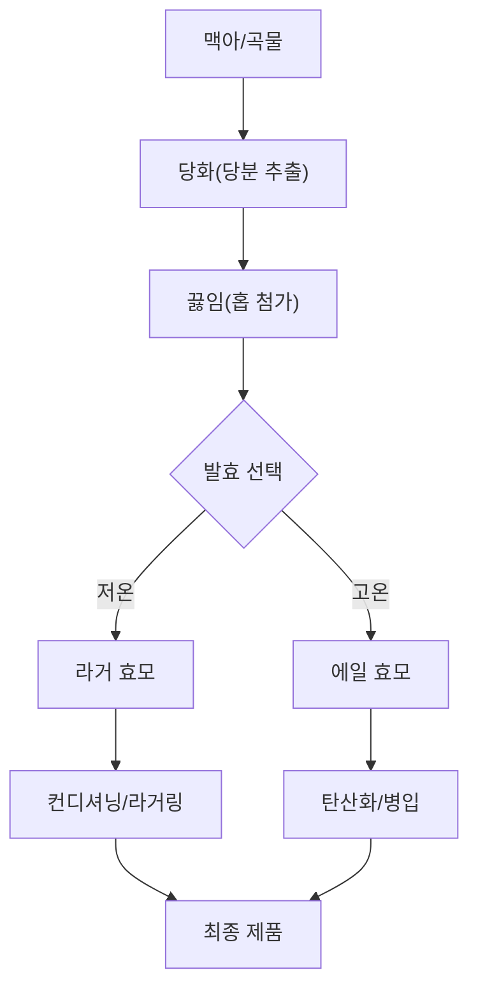

# 맥주의 세계: 맥주 스타일의 모든 것

맥주는 인류 역사상 가장 널리 소비되는 알코올 음료 중 하나입니다. 하지만 수제 맥주 양조장의 수많은 탭 앞에 서면 마치 암호문을 마주한 듯 막막해질 때가 있습니다. 왜 어떤 맥주는 황금빛에 깔끔한 맛이 나고, 어떤 맥주는 칠흑처럼 어둡고 크리미할까요? 왜 IPA는 입안에서 감귤류가 터지는 듯한 강렬함을 선사하고, 스타우트는 마치 액체로 된 디저트처럼 느껴질까요? 맥주를 이해하는 핵심은 발효 과정, 원재료, 그리고 양조사가 사용하는 구체적인 생산 방식이라는 세 가지 기둥에 있습니다.

## 거대한 분류: 라거(Lager) vs 에일(Ale)

맥주는 크게 사용된 효모의 종류와 발효 온도에 따라 두 가지 주요 범주로 나뉩니다.

### 1. 라거(Lager): "저온" 발효의 미학
라거는 낮은 온도에서 발효한 뒤, '라거링(Lagering)'이라 불리는 저온 숙성 과정을 거쳐 완성됩니다. 독일어 'Lager'는 저장고나 창고를 의미합니다. 라거는 낮은 온도에서 활발하게 활동하는 효모를 사용합니다. 이 온도에서는 효모의 활동이 상대적으로 느려 발효가 천천히 진행되며, 그 결과 깔끔하고 정제된 맛이 특징입니다.
*   **특징:** 일반적으로 청량감이 강하고 깔끔하며 상쾌합니다. 낮은 발효 온도 덕분에 에스테르(향 성분) 생성이 적어, 몰트와 홉 본연의 맛이 방해받지 않고 잘 드러납니다.
*   **예시:** 필스너(Pilsner), 헬레스(Helles), 복(Bock).

### 2. 에일(Ale): "고온" 발효의 풍미
에일은 따뜻한 온도에서 활동하는 효모를 사용하여 만듭니다. 이 환경은 효모가 더 많은 에스테르와 페놀을 생성하도록 유도하여, 과일 향부터 스파이시한 향, 흙 내음, 꽃 향기까지 매우 복합적인 풍미를 만들어냅니다.
*   **특징:** 따뜻한 발효 환경 덕분에 훨씬 더 넓은 범위의 향기 화합물이 생성됩니다.
*   **예시:** IPA, 스타우트(Stout), 포터(Porter), 밀맥주(Wheat Beer).

## 인기 맥주 스타일 해설

### IPA (India Pale Ale)
IPA는 현대 수제 맥주 열풍의 핵심입니다. 흔히 영국 식민지 시대의 무역과 연관 지어 설명되곤 하는데, 이 스타일의 가장 큰 특징은 높은 홉 함량입니다. 정확한 명칭은 **인디아 페일 에일(India Pale Ale)**이라는 점을 기억하세요. 최근에는 전통적인 라거 효모를 사용하여 낮은 온도에서 발효하는 변형 IPA도 등장하고 있어, 스타일이 진화하고 서로 겹치기도 한다는 것을 보여줍니다.
*   **풍미 프로필:** 사용하는 홉의 종류에 따라 강렬한 쓴맛, 감귤류, 솔 향, 혹은 열대 과일 향이 지배적입니다.

### 스타우트(Stout)
스타우트는 볶은 몰트의 풍미가 특징인 어둡고 불투명한 에일입니다. 역사적으로는 '포터(Porter)' 스타일과 밀접한 관련이 있습니다.
*   **풍미 프로필:** 커피, 초콜릿, 볶은 곡물의 향이 느껴집니다.

### 비교표: 한눈에 보는 맥주 스타일

| 스타일 | 발효 방식 | 주요 풍미 | 색상 |
| :--- | :--- | :--- | :--- |
| **라거** | 저온 (하면 발효) | 깔끔함, 청량감, 빵 향 | 연한 짚색 ~ 황금색 |
| **IPA** | 고온 (상면 발효) | 홉 향, 쓴맛, 감귤류 | 황금색 ~ 구리색 |
| **스타우트** | 고온 (상면 발효) | 커피, 초콜릿, 로스팅 | 짙은 갈색 ~ 검은색 |
| **밀맥주** | 고온 (상면 발효) | 바나나, 정향, 빵 향 | 연한 색 ~ 탁한 색 |

## 맥주 양조의 기술적 생애 주기

맥주가 어떻게 다른지 이해하려면 양조 구성을 살펴봐야 합니다. 방법은 다양하지만, 업계 전반에 걸친 논리는 일관됩니다.



양조의 기술적인 측면에 관심이 있는 분들을 위해, 발효 논리를 단순화한 의사 코드(pseudocode)를 소개합니다.

```python
class BeerBatch:
    def __init__(self, style, yeast_type, temp):
        self.style = style
        self.yeast = yeast_type
        self.temp = temp

    def ferment(self):
        # 라거 효모는 일반적으로 낮은 온도가 필요합니다
        if self.yeast == "S. pastorianus" and 7 <= self.temp <= 13:
            return "라거: 깔끔하고, 청량하며, 정제된 맛"
        # 에일 효모는 일반적으로 따뜻한 온도를 선호합니다
        elif self.yeast == "S. cerevisiae" and 18 <= self.temp <= 24:
            return "에일: 복합적이고, 향긋하며, 대담한 맛"
        else:
            return "오류: 효모 스트레스 감지됨."
```

## 기본을 넘어: 더 넓은 맥주의 세계

미각의 지평을 넓히고 싶다면 다음 범주들을 고려해 보세요.

1.  **밀맥주(Wheat Beers):** 맥아화된 밀을 높은 비율로 사용합니다. 종종 여과하지 않아 탁하게 보이며, 바나나와 정향, 혹은 감귤류의 독특한 향을 풍깁니다.
2.  **특수 스타일(Specialty Styles):** 많은 양조장에서 옥수수, 쌀, 귀리 같은 재료를 실험하여 맥주의 바디감과 풍미를 변화시킵니다.
3.  **지역적 변형(Regional Variations):** 맥주 스타일은 종종 기원에 따라 분류됩니다. 예를 들어, 캐나다 프레이리 지역은 라거, 블론드, 페일 에일, 몰트 중심의 맥주 등 다양한 스타일로 유명합니다.

맥주를 탐험할 때 신선도가 중요한 변수라는 점을 기억하세요. 아무리 완벽하게 양조된 IPA라도 매대에서 너무 오래 방치되면 특유의 생생한 홉 향을 잃게 됩니다. 가능하다면 항상 포장 일자를 확인하세요.

## 참고자료

- [Beer style](https://en.wikipedia.org/wiki/Beer%20style)
- [Beer](https://en.wikipedia.org/wiki/Beer)
- [Beer in Canada](https://en.wikipedia.org/wiki/Beer%20in%20Canada)
- [Taxonomy](https://en.wikipedia.org/wiki/Taxonomy)
- [Classification](https://en.wikipedia.org/wiki/Classification)
- [Euler characteristic](https://en.wikipedia.org/wiki/Euler%20characteristic)
- [List of beer styles](https://en.wikipedia.org/wiki/List%20of%20beer%20styles)
- [Beer in the United States](https://en.wikipedia.org/wiki/Beer%20in%20the%20United%20States)
- [Brewing](https://en.wikipedia.org/wiki/Brewing)
- [Genesee Brewing Company](https://en.wikipedia.org/wiki/Genesee%20Brewing%20Company)
- [Difference in differences](https://en.wikipedia.org/wiki/Difference%20in%20differences)
- [Symmetric difference](https://en.wikipedia.org/wiki/Symmetric%20difference)